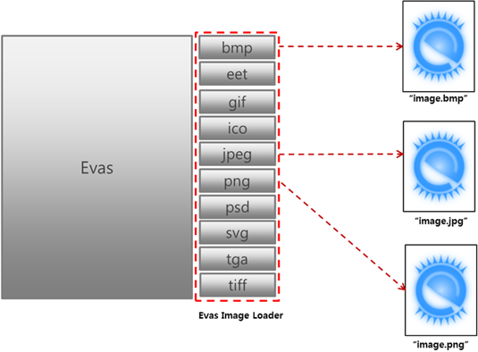
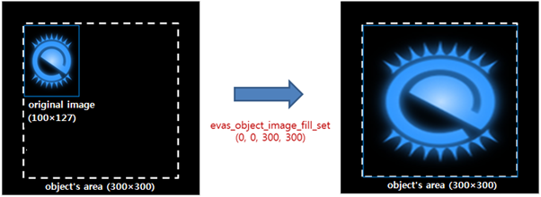
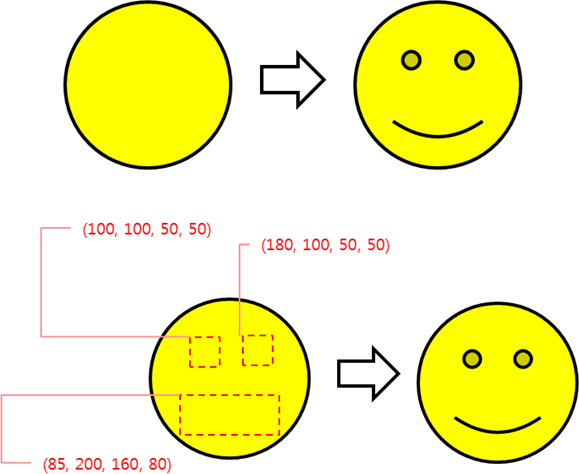
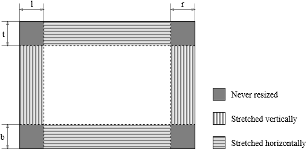

# Evas Objects

## Dependencies

- Tizen 2.4 and Higher for Mobile
- Tizen 2.3.1 and Higher for Wearable

An Evas object is the most basic visual entity used in Evas. Everything, be it a single line or a complex list of UI components, is an Evas object.

## Primitive Renderable Objects

Primitive objects are the base upon which to build a complex interface: rectangles, lines, polygons, [images](#image), [textblocks](#block), and texts.

### Rectangle

There is only one function to deal with rectangle objects. However, the rectangle is manipulated using the generic Evas object functions.

The Evas rectangle serves a number of key functions when working on Evas programs.

- Background
- Debugging
- Clipper

#### Background

A common requirement of Evas programs is to have a solid color background, which can be accomplished with the following code.

```
Evas_Object *bg = evas_object_rectangle_add(evas_canvas);

/*
   Set the rectangle's
   red, green, blue and opacity levels
*/
/* Opaque white background */
evas_object_color_set(bg, 255, 255, 255, 255);
/* Covers full canvas */
evas_object_resize(bg, WIDTH, HEIGHT);
evas_object_show(bg);
```

#### Debugging

When debugging visual issues with Evas programs, the rectangle is a useful tool. The rectangle's simplicity means that it is easier to pinpoint issues with it than with more complex objects. A common technique to use when writing an Evas program and not getting the desired visual result is to replace an object with a solid color rectangle and seeing how it interacts with the other elements. This often allows us to notice clipping, parenting, or positioning issues. Once the issues are identified and corrected, the rectangle can be replaced with the original object, and in all likelihood any remaining issues are specific to that object's type.

#### Clipping

[Clipping](#clip) serves 2 main functions:

- Limiting visibility
- Applying a layer of color to an object

### Text

An Evas text object shows a basic single-line single-style text.

```
Evas_Object *text = evas_object_text_add(evas_canvas);
evas_object_text_text_set(text, "some text");
evas_object_color_set(text, 127, 0, 0, 127);
evas_object_show(text);
```

To set the text, use the `evas_object_text_text_set()` function. You can get the current text with the `evas_object_text_text_get()` function.

To manage the text style:

- To set the font, use the `evas_object_text_font_set()` function with the following parameters:

  - `text`: The text object
  - `font`: The font name you want to use
  - `size`: The font size you want to use.

  To query the current font, use the `evas_object_text_font_get()` function.

- To set the text style, use the `evas_object_text_style_set()` function with the style as the second parameter. The available values are defined in the `Evas_Text_Style_Type` enumerator (in [mobile](../../../../../org.tizen.native.mobile.apireference/group__Evas.html#ga6b48c195b58fbe30ca8180e7451ad817) and [wearable](../../../../../org.tizen.native.wearable.apireference/group__Evas.html#ga6b48c195b58fbe30ca8180e7451ad817) applications).

  To query the current style, use the `evas_object_text_style_get()` function.

- If the text does not fit, make an ellipsis on it by using the `evas_object_text_ellipsis_set()` function. The (float) value specifies, which part of the text is shown.

  - `0.0`: The beginning is shown and the end trimmed.
  - `1.0`: The beginning is trimmed and the end shown.
  - Any value in between means that both ends of the text have ellipsis and the set part is shown.
  - `-1.0`: Ellipsis is disabled.

  To query the current ellipsis value, use the `evas_object_text_ellipsis_get()` function.

- When the text style is set to glow, set the glow color using the `evas_object_text_glow_color_set()`, function, where the second, third, fourth, and fifth parameters are respectively the red, green, blue, and alpha values. The effect is placed at a short distance from the text but not touching it. For glows set right at the text, use the `evas_object_text_glow2_color_set()` function.

  To query the current color, use the `evas_object_text_glow_color_get()` and `evas_object_text_glow2_color_get()` functions.

- If the text style is set to display a shadow, use the `evas_object_text_shadow_color_set()` function, where the second, third, fourth, and fifth parameters are respectively the red, green, blue, and alpha values.

  To query the current color, use the `evas_object_text_shadow_color_get()` function.

- If the text style is set to display an outline, use the `evas_object_text_outline_color_set()` function, where the second, third, fourth, and fifth parameters are respectively the red, green, blue, and alpha values.

  To query the current color, use the `evas_object_text_outline_color_get()` function.

## Primitive Smart Objects

A smart object is a special Evas object that provides custom functions to handle automatically clipping, hiding, moving, resizing color setting and more on child elements, for the smart object's user. They can be, for example, a group of objects that move together, or implementations of whole complex UI components, providing some intelligence and extension to simple Evas objects.

## Primitive Container Objects

A container is a smart object that holds children Evas objects in a specific fashion.

### Table

A table is a smart object that packs children using a tabular layout.

In the following example, a non-homogeneous table is added to the canvas with its padding set to 0.

4 different colored rectangles are added with different properties.

- The first one, at the first column and first line, spans 2 columns and 1 line
- The second one, at the first column and second line, spans 1 columns and 2 lines
- The third one, at the second column and second line, fits in 1 cell
- The fourth one, at the second column and third line, also fits in 1 cell

To create a table, use the `evas_object_table_add()` function.

```
table = evas_object_table_add(evas);
evas_object_table_homogeneous_set(table, EVAS_OBJECT_TABLE_HOMOGENEOUS_NONE);
evas_object_table_padding_set(table, 0, 0);
evas_object_resize(table, WIDTH, HEIGHT);
evas_object_show(table);

rect = evas_object_rectangle_add(evas);
evas_object_color_set(rect, 255, 0, 0, 255);
evas_object_size_hint_min_set(rect, 100, 50);
evas_object_show(rect);
evas_object_table_pack(table, rect, 1, 1, 2, 1);

rect = evas_object_rectangle_add(d.evas);
evas_object_color_set(rect, 0, 255, 0, 255);
evas_object_size_hint_min_set(rect, 50, 100);
evas_object_show(rect);
evas_object_table_pack(table, rect, 1, 2, 1, 2);

rect = evas_object_rectangle_add(d.evas);
evas_object_color_set(rect, 0, 0, 255, 255);
evas_object_size_hint_min_set(rect, 50, 50);
evas_object_show(rect);
evas_object_table_pack(table, rect, 2, 2, 1, 1);

rect = evas_object_rectangle_add(d.evas);
evas_object_color_set(rect, 255, 255, 0, 255);
evas_object_size_hint_min_set(rect, 50, 50);
evas_object_show(rect);
evas_object_table_pack(table, rect, 2, 3, 1, 1);
```

To set the table layout, use the `evas_object_table_homogeneous_set()` function. The following values can be homogeneous:

- `EVAS_OBJECT_TABLE_HOMOGENEOUS_NONE`: This default value has columns and rows calculated based on hints of individual cells. This is flexible, but much heavier on computations.
- `EVAS_OBJECT_TABLE_HOMOGENEOUS_TABLE`: The table size is divided equally among children, filling the whole table area. If the children have a minimum size that is larger than this (including padding), the table overflows and is aligned respecting the alignment hint, possibly overlapping sibling cells.
- `EVAS_OBJECT_TABLE_HOMOGENEOUS_ITEM`: The greatest minimum cell size is used: if no element is set to expand, the contents of the table are the minimum size and the bounding box of all the children is aligned relatively to the table object using the `evas_object_table_align_get()` function. If the table area is too small to hold this minimum bounding box, the objects keep their size and the bounding box overflows the box area, still respecting the alignment. To get the current mode, use the `evas_object_table_homogeneous_get()` function.

The table's content alignment is set using the `evas_object_table_align_set()` function, where the second and third parameters (`horizontal` and `vertical`) are floating values. To see the current values, use the `evas_object_table_align_get()` function.

To set the padding, use the `evas_object_table_padding_set()` function. To see the current value, use the `evas_object_table_padding_get()` function.

To see the current column and row count, use the `evas_object_table_col_row_size_get()` function.

### Grid

A grid is a smart object that packs its children as with a regular grid layout.

Grids are added to the canvas with the `evas_object_grid_add()` function.

To change a grid's virtual resolution, use the `evas_object_grid_size_set()` function, and to get the current value, use the `evas_object_grid_size_get()` function.

To add an object, use the `evas_object_grid_pack()` function, where the third, fourth, fifth, and sixth parameters are the following:

- `x`: Virtual x coordinate of the child
- `y`: Virtual y coordinate of the child
- `w`: Virtual width of the child
- `h`: Virtual height of the child

### Box

A box is a simple container that sets its children objects linearly.

To add a box to your canvas, use the `evas_object_box_add()` function.

To add a child to the box, use the following functions:

- `evas_object_box_append()`: The child is appended.
- `evas_object_box_insert_after()`: The child is added after the reference item.
- `evas_object_box_insert_before()`: The child is added before the reference item.
- `evas_object_box_insert_at()`: The child is added at the specified position.

To set the alignment, use the `evas_object_box_align_set()` function with the following values.

- `horizontal`: 0.0 means aligned to the left, 1.0 means to the right
- `vertical`: 0.0 means aligned to the top, 1.0 means to the bottom

Evas has the following predefined box layouts available:

- `evas_object_box_layout_horizontal()`
- `evas_object_box_layout_vertical()`
- `evas_object_box_layout_homogeneous_horizontal()`
- `evas_object_box_layout_homogeneous_vertical()`
- `evas_object_box_layout_homogeneous_max_size_horizontal()`
- `evas_object_box_layout_homogeneous_max_size_vertical()`
- `evas_object_box_layout_flow_horizontal()`
- `evas_object_box_layout_flow_vertical()`
- `evas_object_box_layout_stack()`

## Image Objects

Using Evas, you can create and manipulate image objects. Evas supports image loaders of various formats as plug-in modules.

The image formats that Evas supports include `bmp`, `edj`, `gif`, `ico`, `jpeg`, `pmaps`, `png`, `psd`, `svg`, `tga`, `tiff`, `wbmp`, `webp`, and `xpm`.

**Figure: Evas image loader**



### Evas Object Image Functions

Evas has over 70 image object functions. The following functions are discussed in this document:

```
Evas_Object *evas_object_image_add(Evas *e);
void evas_object_image_file_set(Evas_Object *obj, const char *file, const char *key);
void evas_object_image_fill_set(Evas_Object *obj, int x, int y, int w, int h);
void evas_object_image_filled_set(Evas *e, Eina_Bool setting);
Evas_Object *evas_object_image_filled_add(Evas *e);
void evas_object_image_smooth_scale_set(Evas_Object *obj, Eina_Bool smoothscale);
void evas_object_image_load_size_set(Evas_Object *obj, int w, int h);
void evas_object_image_data_set(Evas_Object *obj, void *data);
void *evas_object_image_data_get(const Evas_Object *obj, Eina_Bool for_writing);
void evas_object_image_size_set(Evas_Object *obj, int w, int h);
void evas_object_image_data_update_add(Evas_Object *obj, int x, int y, int w, int h);
Eina_Bool evas_object_image_save(const Evas_Object *obj, const char *file, const char *key, const char *flags);
```

### Creating an Image Object and Setting the Image Data Source

A common use case of an image object is to set a file as the image data source.

In the following example, the `main()` function creates an image object and displays it on a window. The image object size is 300x300 and the source image resolution is 100x127. The image is scaled into 300 by 300 to fill the image object area using the `evas_object_image_fill_set()` function.

```
#include <Elementary.h>

int
main(int argc, char **argv)
{
    elm_init(argc, argv);

    /* Create a window object */
    Evas_Object *win = elm_win_add(NULL, "main", ELM_WIN_BASIC);
    evas_object_resize(win, 400, 400);
    evas_object_show(win);

    /* Return Evas handle from window */
    Evas *e = evas_object_evas_get(win);

    /* Create an image object */
    Evas_Object *img = evas_object_image_add(e);

    /* Set a source file to fetch pixel data */
    evas_object_image_file_set(img, "./logo.png", NULL);

    /* Set the size and position of the image on the image object area */
    evas_object_image_fill_set(img, 0, 0, 300, 300);

    evas_object_move(img, 50, 50);
    evas_object_resize(img, 300, 300);
    evas_object_show(img);

    elm_run();

    elm_shutdown();

    return 0;
}
```

**Figure: Image object display**


### Managing Images

To manage image objects in Evas:

- Limiting visibility

  Evas always supports the image file type it was compiled with. Check your software packager for the information and use the `evas_object_image_extension_can_load_get()` function.

  Create the image object. Set a source file on it, so that the object knows where to fetch the image data.

  Define how to fill the image object area with the given pixel data. You can use a sub-region of the original image, or have it tiled repeatedly on the image object.

  ```
  img = evas_object_image_add(canvas);
  evas_object_image_file_set(img, "path/to/img", NULL);
  evas_object_image_fill_set(img, 0, 0, w, h);
  ```

  If the entire source image is to be displayed on the image object, stretched to the destination size, use the `evas_object_image_filled_set()` function helper that you can use instead of the `evas_object_image_fill_set()` function:

  ```
  evas_object_image_filled_set(img, EINA_TRUE);
  ```

- Scaling images

  Resizing image objects scales the source images to the image object size, if the source images are set to fill the object area using the `evas_object_image_filled_set()` function.

  Control the aspect ratio of an image for different sizes with functions to load images scaled up or down in memory.

  Evas has a scale cache, which caches scaled versions of images used often. You can also have Evas rescale the images smoothly, however, that is computationally expensive.

  You can decide how to fill the image object area with the given image pixel data by setting the position, width, and height of the image using the `evas_object_image_fill_set()` function. Without setting this information, the image is not displayed. If the size of the image is bigger than the image object area, only a sub-region of the original image is displayed. If the image is smaller than the area, images are tiled repeatedly to fill the object area.

  **Figure: Image scaling**

  

  |  |  |  |
  | ---------------------------------------- | ---------------------------------------- | ---------------------------------------- |
  | `evas_object_image_fill_set(obj, 50, 0, 300, 300)` | `evas_object_image_fill_set(obj, 0, 0, 200, 200)` | `evas_object_image_fill_set(obj, 0, 0, 100, 127)` |

  The `evas_object_image_filled_set()` function scales the image to fit the object area. Resizing the image object automatically triggers an internal call to the `evas_object_image_fill_set()` function.

  The `evas_object_image_filled_add()` function creates a new image object that automatically scales its bound image to the object area. This is a helper function around the `evas_object_image_add()` and `evas_object_image_filled_set()` functions.

  A scaled image's quality can vary depending on the scaling algorithm. Smooth scaling improves the image quality in the process of size reducing or enlarging. Evas runs its own smooth scaling algorithm by default and provides an API for you to disable the function.

  The algorithm is implemented using the SIMD (Single Instruction Multiple Data) vectorization for software rendering. It is optimized for Intel and ARM CPU through the MMX and NEON instruction sets respectively.

  There is a trade-off between image smoothness and rendering performance. The load gets bigger as the image gets bigger. Users can avoid such scaling overload by using the same size of the image object and the source image.

  In the following example, 2 image objects are created to show the effects of smooth scaling. The one with smooth scaling applied appears softer on the screen.

  ```
  #include <Elementary.h>

  int
  main(int argc, char **argv)
  {
      elm_init(argc, argv);

      /* Create a window object */
      Evas_Object *win = elm_win_add(NULL, "main", ELM_WIN_BASIC);
      evas_object_resize(win, 400, 200);
      evas_object_show(win);

      /* Return Evas handle from window */
      Evas *e = evas_object_evas_get(win);

      /* Create an image object */
      Evas_Object *img = evas_object_image_filled_add(e);
      evas_object_image_file_set(img, "./logo.png", NULL);
      evas_object_move(img, 0, 0);
      evas_object_resize(img, 200, 200);
      evas_object_show(img);

      /* Create another image object */
      Evas_Object *img2 = evas_object_image_filled_add(e);
      evas_object_image_file_set(img2, "./logo.png", NULL);

      /* Disable smooth scaling */
      evas_object_image_smooth_scale_set(img2, EINA_FALSE);
      evas_object_move(img2, 200, 0);
      evas_object_resize(img2, 200, 200);
      evas_object_show(img2);

      elm_run();

      elm_shutdown();

      return 0;
  }
  ```

  **Figure: Smooth scaling effects**

  |  |  |
  | ---------------------------------------- | ---------------------------------------- |
  | Smooth scaling enabled                   | Smooth scaling disabled                  |

  Evas caches scaled image data and reuses them. You can save the memory by loading the image in the scaled size to the memory at the beginning. This option is available only for `jpeg` format at the moment.

  The following example shows how to load the image in the scaled size.

  ```
  #include <Elementary.h>

  int
  main(int argc, char **argv)
  {
      elm_init(argc, argv);

      /* Create a window object */
      Evas_Object *win = elm_win_add(NULL, "main", ELM_WIN_BASIC);
      evas_object_resize(win, 400, 200);
      evas_object_show(win);

      /* Return Evas handle from window */
      Evas *e = evas_object_evas_get(win);

      /* Create an image object */
      Evas_Object *img = evas_object_image_filled_add(e);

      /*
         Load the image scaled into the object size
         before evas_object_image_file_set() is called
      */
      evas_object_image_load_size_set(img, 300, 300);

      evas_object_image_file_set(img, "./logo.png", NULL);

      evas_object_move(img, 50, 50);
      evas_object_resize(img, 300, 300);
      evas_object_show(img);

      elm_run();

      elm_shutdown();

      return 0;
  }
  ```

### Setting Raw Data to Image Object

You can set raw data to the image object manually using the `evas_object_image_data_set()` function instead of setting an image file as the data source. The image data must be in raw data form. For a 200x200 sized image with alpha channel enabled (32 bits per pixel), the size of the image data is 14000 (=200*200*4) bytes.

Image objects fetch metadata such as width or height from the header of the image files. Since the raw data does not have the metadata, you must set the size of the image using the `evas_object_image_size_set()` function.

The `evas_object_image_data_get()` function returns the data pointer of an image object and requires a parameter to determine whether the data is modified or not. If you pass `EINA_TRUE` for `for_writing`, Evas updates the image pixels in the next rendering cycle.

The `evas_object_image_data_update_add()` helps to mark the updated area for rendering efficiency.

The following example code and figure show how to specify the area to update:

```
evas_object_image_data_update_add(image, 100, 100, 50, 50);
evas_object_image_data_update_add(image, 180, 100, 50, 50);
evas_object_image_data_update_add(image, 85, 200, 160, 80);
```

**Figure: Partial image update**



The following code creates an image object and sets a source file on it. Then it implements the blur effect to the pixel data and saves them using the `evas_object_image_save()` function.

```
#include <Elementary.h>

void
image_blur(Evas_Object *img)
{
    unsigned char *img_src = evas_object_image_data_get(img, EINA_TRUE);

    int w;
    int h;
    evas_object_image_size_get(img, &w, &h);
    int blur_size = 4;
    int x;
    int y;
    int xx;
    int yy;

    for (y = 0; y < h; y++) {
        for (x = 0; x < w; x++) {
            int avg_color[3] = {0, 0, 0};
            int blur_pixel_cnt = 0;

            for (xx = x; (xx < x + blur_size) && (xx < w); xx++) {
                for (yy = y; (yy < y + blur_size) && (yy < h); yy++) {
                    int idx = (yy * w * 4) + (xx * 4);
                    avg_color[0] += img_src[idx + 0];
                    avg_color[1] += img_src[idx + 1];
                    avg_color[2] += img_src[idx + 2];
                    ++blur_pixel_cnt;
                }
            }
            avg_color[0] /= blur_pixel_cnt;
            avg_color[1] /= blur_pixel_cnt;
            avg_color[2] /= blur_pixel_cnt;

            for (xx = x; (xx < x + blur_size) && (xx < w); xx++) {
                for (yy = y; (yy < y + blur_size) && (yy < h); yy++) {
                    int idx = (yy * w * 4) + (xx * 4);
                    img_src[idx + 0] = avg_color[0];
                    img_src[idx + 1] = avg_color[1];
                    img_src[idx + 2] = avg_color[2];
                }
            }
        }
    }
    evas_object_image_data_update_add(img, 0, 0, w, h);
}

int
main(int argc, char **argv)
{
    elm_init(argc, argv);

    Evas_Object *win = elm_win_add(NULL, "main", ELM_WIN_BASIC);
    evas_object_resize(win, 200, 200);
    evas_object_show(win);

    Evas *e = evas_object_evas_get(win);

    Evas_Object *img = evas_object_image_filled_add(e);
    evas_object_image_file_set(img, "./logo.png", NULL);
    evas_object_resize(img, 200, 200);
    evas_object_show(img);

    image_blur(img);

    evas_object_image_save(img, "logo2.png", NULL, "quality=100 compress=8");

    elm_run();

    elm_shutdown();

    return 0;
}
```

**Figure: Blur effect**

|  |  |
| ---------------------------------------- | ---------------------------------------- |
| Before                                   | After                                    |

#### Giving Performance Hints

In image viewer applications, you can display an image in full size. The navigation to the adjacent images on your album must be fluid and fast. Thus, while displaying a given image, the program can load the next and previous image in the background to be able to immediately repaint the screen with a new image.

Evas addresses this issue with image preloading:

```
prev = evas_object_image_filled_add(canvas);
evas_object_image_file_set(prev, "/path/to/prev", NULL);
evas_object_image_preload(prev, EINA_FALSE);
next = evas_object_image_filled_add(canvas);
evas_object_image_file_set(next, "/path/to/next", NULL);
evas_object_image_preload(next, EINA_FALSE);
```

If you are loading an image which is too big, set its loading size smaller.

Load a scaled down version of the image in the memory if that is the size you are displaying (this can speed up the loading considerably):

```
img = evas_object_image_filled_add(canvas);
evas_object_image_file_set(img, "/path/to/next", NULL);
evas_object_image_load_scale_down_set(img, 2); /* Loading image size is img/2 */
```

If you know you are showing a sub-set of the image pixels, you can avoid loading the complementary data:

```
evas_object_image_load_region_set(img, x, y, w, h);
```

#### Specifying Borders

With Evas, you can specify image margins to be treated as borders. The margins then maintain their aspects when the image is resized. This makes setting frames around other UI objects easier. The following figure illustrates the border behavior when the image is resized.

**Figure: Borders in Evas**



## Textblock Objects

Unlike basic text objects, a textblock handles complex text, managing multiple styles and multiline text based on HTML-like tags. However, these extra features are heavier on memory and processing cost.

The textblock objects is an object that shows big chunks of text. Textblock supports many features, including text formatting, automatic and manual text alignment, embedding items (icons, for example). Textblock has 3 important parts: the text paragraphs, the format nodes and the cursors.

To set markup to format text, use for example `<font_size=50>Big!</font_size>`. Set more than one style directive in one tag with `<font_size=50 color=#F00>Big and Red!</font_size>`. Note that `</font_size>` is used although the format also included color. This is because the first format determines the matching closing tag's name. You can use anonymous tags, such as `<font_size=30>Big</>`, which pop any type of format, but it is advisable to use the named alternatives instead.

Textblock supports the following formats:

- `font`: Font description in fontconfig such as format, for example `"Sans:style=Italic:lang=hi" or "Serif:style=Bold"`.
- `font_weight`: Overrides the weight defined in `font`. For example, `font_weight=Bold` is the same as `font=:style=Bold`. The supported weights are `normal`, `thin`, `ultralight`, `light`, `book`, `medium`, `semibold`, `bold`, `ultrabold`, `black`, and `extrablack`.
- `font_style`: Overrides the style defined in `font`. For example, `font_style=Italic` is the same as `font=:style=Italic`. The supported styles are `normal`, `oblique`, and `italic`.
- `font_width`: Overrides the width defined in `font`. For example, `font_width=Condensed` is the same as `font=:style=Condensed`. The supported widths are `normal`, `ultracondensed`, `extracondensed`, `condensed`, `semicondensed`, `semiexpanded`, `expanded`, `extraexpanded`, and `ultraexpanded`.
- `lang`: Overrides the language defined in `font`. For example, `lang=he` is the same as `font=:lang=he`.
- `font_fallbacks`: A comma delimited list of fonts to try if finding the main font fails.
- `font_size`: The font size in points.
- `font_source`: The source of the font, for example an eet file.
- `color`: The text color in one of the following formats: `#RRGGBB`, `#RRGGBBAA`, `#RGB`, or `#RGBA`.
- `underline_color`: The color in one of the following formats: `#RRGGBB`, `#RRGGBBAA`, `#RGB`, or `#RGBA`.
- `underline2_color`: The color in one of the following formats: `#RRGGBB`, `#RRGGBBAA`, `#RGB`, or `#RGBA`.
- `outline_color`: The color in one of the following formats: `#RRGGBB`, `#RRGGBBAA`, `#RGB`, or `#RGBA`.
- `shadow_color`: The color in one of the following formats: `#RRGGBB`, `#RRGGBBAA`, `#RGB`, or `#RGBA`.
- `glow_color`: The color in one of the following formats: `#RRGGBB`, `#RRGGBBAA`, `#RGB`, or `#RGBA`.
- `glow2_color`: The color in one of the following formats: `#RRGGBB`, `#RRGGBBAA`, `#RGB`, or `#RGBA`.
- `strikethrough_color`: The color in one of the following formats: `#RRGGBB`, `#RRGGBBAA`, `#RGB`, or `#RGBA`.
- `align`: The text alignment in one of the following formats: `auto` (according to text direction), `left`, `right`, `center`, or `middle`, which take a value between 0.0 and 1.0 or a value between 0% to 100%.
- `valign`: The vertical text alignment in one of the following formats: `top`, `bottom`, `middle`, `center`, `baseline`, or `base`, which take a value between 0.0 and 1.0 or a value between 0% to 100%.
- `wrap`: The text wrap in one of the following formats: `word`, `char`, `mixed`, or `none`.
- `left_margin`: Either `reset` or a pixel value indicating the margin.
- `right_margin`: Either `reset` or a pixel value indicating the margin.
- `underline`: The style of underlining in one of the following formats: `on`, `off`, `single`, or `double`.
- `strikethrough`: The style of text that is either `on` or `off`.
- `backing_color`: The background color in one of the following formats: `#RRGGBB`, `#RRGGBBAA`, `#RGB`, or `#RGBA`.
- `backing`: The background color enabled or disabled: `on` or `off`.
- `style`: The style of the text in one of the following formats: `off`, `none`, `plain`, `shadow`, `outline`, `soft_outline`, `outline_shadow`, `outline_soft_shadow`, `glow`, `far_shadow`, `soft_shadow`, or `far_soft_shadow`. The direction is selected by adding `bottom_right`, `bottom`, `bottom_left`, `left`, `top_left`, `top`, `top_right`, or `right`. For example, `style=shadow,bottom_right`.
- `tabstops`: The pixel value for tab width.
- `linesize`: To force a line size in pixels.
- `linerelsize`: Either a floating point value or a percentage indicating the wanted size of the line relative to the calculated size.
- `linegap`: To force a line gap in pixels.
- `linerelgap`: Either a floating point value or a percentage indicating the wanted size of the line relative to the calculated size.
- `item`: Creates an empty space that is filled by an upper layer. Use `size`, `abssize`, or `relsize` to define the item's size, and an optional vsize = full/ascent to define the item's position in the line.
- `linefill`: Either a float value or percentage indicating how much to fill the line.
- `ellipsis`: A value between 0.0 and 1.0 to indicate the type of ellipsis, or -1.0 to indicate that an ellipsis is not wanted.
- `password`: Either `on` or `off`, this is used to specifically turn replacing chars with the password mode (that is, replacement char) on and off.

## Clipping Objects

### Limiting Visibility

An Evas object can be clipped – in other words, its visible area is restricted with the clipper object.

It is often necessary to show only parts of an object, and while it may be possible to create an object that corresponds only to the part that must be shown (which is not always possible), it is usually easier to use a clipper. A clipper is a rectangle that defines what is visible and what is not. To do this, create a solid white rectangle (by default, so you need not use the `evas_object_color_set()` function) and give it a position and size of what is wanted visible. The following code example shows how to show the center half of `my_evas_object`:

```
Evas_Object *clipper = evas_object_rectangle_add(evas_canvas);
evas_object_move(clipper, my_evas_object_x / 4, my_evas_object_y / 4);
evas_object_resize(clipper, my_evas_object_width / 2, my_evas_object_height / 2);
evas_object_clip_set(my_evas_object, clipper);
evas_object_show(clipper);
```

### Layer of Color

A solid white clipper does not produce a change in the color of the clipped object, only hides what is outside the clipper's area. Changing the color of an object is accomplished by using a colored clipper. Clippers with color function by multiplying the colors of the clipped object. The following code shows how to remove all the red from an object.

```
Evas_Object *clipper = evas_object_rectangle_add(evas);
evas_object_move(clipper, my_evas_object_x, my_evas_object_y);
evas_object_resize(clipper, my_evas_object_width, my_evas_object_height);
evas_object_color_set(clipper, 0, 255, 255, 255);
evas_object_clip_set(obj, clipper);
evas_object_show(clipper);
```

## Mapping Objects

Evas allows different transformations to be applied to all kinds of objects. These are applied by means of UV mapping. With UV mapping, 1 map points in the source object to a 3D space positioning at target. This allows rotation, perspective, scale, and many other effects depending on the map that is used.

### Creating a Map

A map consists of a set of points, but currently only 4 are supported. Each of these points contains a set of canvas coordinates x and y that are used to alter the geometry of the mapped object, and a z coordinate that indicates the depth of that point. This last coordinate does not normally affect the map, but is used by several of the utility functions to calculate the right position of the point given other parameters.

The coordinates for each point are set with the `evas_map_point_coord_set()` function. In the following example, there is a rectangle whose coordinates are (100, 100) and (300, 300).

```
Evas_Object *object = evas_object_rectangle_add(evas);
evas_object_move(object, 100, 100);
evas_object_resize(object, 200, 200);
Evas_Map map = evas_map_new(4);
evas_map_point_coord_set(map, 0, 100, 100, 0);
evas_map_point_coord_set(map, 1, 300, 100, 0);
evas_map_point_coord_set(map, 2, 300, 300, 0);
evas_map_point_coord_set(map, 3, 100, 300, 0);
```

To ease the process:

- Use the `evas_map_util_points_populate_from_geometry()` function, where the map coordinates are set to the given rectangle, and the last parameter is the coordinate in the Z axis, which is the same for all points.

  ```
  Evas_Object *object = evas_object_rectangle_add(evas);
  evas_object_move(object, 100, 100);
  evas_object_resize(object, 200, 200);
  Evas_Map map = evas_map_new(4);
  evas_map_util_points_populate_from_geometry(map, 100, 100, 200, 200, 0);
  ```

- You can also use the `evas_map_util_points_populate_from_object()` function.

  ```
  Evas_Object *object = evas_object_rectangle_add(evas);
  evas_object_move(object, 100, 100);
  evas_object_resize(object, 200, 200);
  Evas_Map map = evas_map_new(4);
  evas_map_util_points_populate_from_object(map, object);
  ```

- You can also use `evas_map_util_points_populate_from_object_full()`, where the last parameter is the coordinate in the Z axis, which is the same for all points.

  ```
  Evas_Object *object = evas_object_rectangle_add(evas);
  evas_object_move(object, 100, 100);
  evas_object_resize(object, 200, 200);
  Evas_Map map = evas_map_new(4);
  evas_map_util_points_populate_from_object_full(map, object, 0);
  ```

### Manual Point Setting

Several effects are applied to an object by setting each point of the map to the right coordinates. The following example creates a simulated perspective.

```
evas_map_point_coord_set(map, 0, 300, 100, 0);
evas_map_point_coord_set(map, 1, 450, 120, 0);
evas_map_point_coord_set(map, 2, 450, 260, 0);
evas_map_point_coord_set(map, 3, 300, 300, 0);
```

The Z coordinate is not used when setting points by hand, and thus its value is not important.

### Applying a Map

Regardless of the specific way you create a map, to apply it to a specific object, use the following functions:

```
evas_object_map_set(object, map);
evas_object_map_enable_set(object, EINA_TRUE);
```

### Basic Utility Functions

Evas provides utility functions for common transformations:

- `evas_map_util_rotate()`: This function performs a rotation of the `angle` degrees around the center point with the coordinates (cx, cy).
- `evas_map_util_zoom()`: This function performs a `zoomx` and `zoomy` zoom in the X and Y directions respectively, with the center point with the coordinates (cx, cy).

For example, the following code rotates an object around its center.

```
int x;
int y;
int w;
int h;
evas_object_geometry_get(object, &x, &y, &w, &h);
Evas_Map *map = evas_map_new(4);
evas_map_util_points_populate_from_object(map, object);
evas_map_util_rotate(map, 45, x + (w / 2), y + (h / 2));
evas_object_map_set(object, map);
evas_object_map_enable_set(object, EINA_TRUE);
evas_map_free(m);
```

The following code rotates an object around the center of the window.

```
int w;
int h;
evas_output_size_get(evas, &w, &h);
Evas_Map *map = evas_map_new(4);
evas_map_util_points_populate_from_object(map, object);
evas_map_util_rotate(map, 45, w / 2, h / 2);
evas_object_map_set(object, map);
evas_object_map_enable_set(object, EINA_TRUE);
evas_map_free(m);
```

### 3D Utility Functions

Evas provides utility functions for 3D transformations.

To make a 3D rotation, use the `evas_map_util_3d_rotate()` function. With this code, you can set the Z coordinate of the rotation center, and the angles to rotate through around all axes.

Rotating in the 3D space does not look natural. A more natural look becomes by adding perspective to the transformation, which is done with the `evas_map_util_3d_perspective()` function on the map after its position has been set. Use the following parameters:

- `px` and `py` specify the "infinite distance" point in the 3D conversion, where all lines converge to.
- `z0` specifies the Z value at which there is a 1:1 mapping between spatial coordinates and screen coordinates: any points on this Z value do not have their X and Y coordinates modified in the transform, while those further away (Z value higher) shrink into the distance, and those less than this value expand.
- `focal` determines the "focal length" of the camera: this is the distance in reality between the camera lens plane (the rendering results are undefined at or closer than this) and the `z0` value; this function allows for some "depth" control.

### Color and Lighting

Each point in a map can be set to a color, which is multiplied with the object's own color and linearly interpolated in between adjacent points. To do this, use `evas_map_point_color_set(map, index, r, g, b, a)` for each point of the map, or `evas_map_util_points_color_set()` to set every point into the same color.

To add lighting for the objects, which is useful with 3D transforms, use the `evas_map_util_3d_lighting()` function with the following parameters:

- `lightx`, `lighty` and `lightz` are the local light source coordinates;
- `lightr`, `lightg` and `lightb` are the local light source colors;
- `ambientr`, `ambientg` and `ambientb` are the ambient light colors. Evas sets the color of each point based on the distance to the light source, the angle with which the object is facing the light and the ambient light. The orientation of each point is important. If the map is defined counter-clockwise, the object faces away from you and becomes obscured, since no light does not reflect from it.

**Note**

Except as noted, this content is licensed under [LGPLv2.1+](http://opensource.org/licenses/LGPL-2.1).