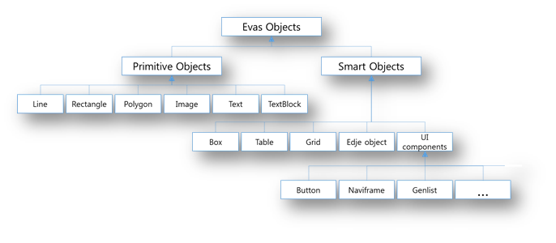

# Graphical Objects

## Dependencies

- Tizen 2.4 and Higher for Mobile
- Tizen 2.3.1 and Higher for Wearable

Evas is a clean display canvas API for several target display systems that can draw, for example, anti-aliased text, smooth super- and sub-sampled scaled images, and alpha-blend objects. Evas optimizes the rendering pipeline to minimize the effort of redrawing changes made to the canvas, and so takes this work out of your hand, saving a lot of time and energy.

Evas abstracts any need to know much about what the characteristics of your display system are, what graphics calls are used to draw them, and how. It operates at an object level, where all you do is create and manipulate objects on a canvas and set their properties.

The main features of Evas graphical rendering are:

- [Evas objects](./evas-objects-n.md)The Evas object is the most basic visual entity.**Figure: Evas objects**Evas objects consists of primitive and smart objects:Primitive objects implement basic objects, such as lines, rectangles, polygons, images, texts, and textblocks. They are used to build a complex user interface.Smart objects implement container objects (such as box, table, and grid) that can hold Evas and Edje objects and whole complex UI components as children. They are used to provide intelligence and extension to simple Evas objects.Evas allows you to draw on the canvas various non-container objects with a visual appearance.Evas is not a UI component set or a UI component toolkit, but it is their base. For a toolkit based on Evas, Edje, Ecore, and other Enlightenment technologies, see the Elementary API (in [mobile](http://org.tizen.native.mobile.apireference/group__Elementary.html) and [wearable](http://org.tizen.native.wearable.apireference/group__Elementary.html) applications).
- [Evas rendering concept and method](./evas-rendering-n.md)Evas rendering is performed with backend engines using the retained mode rendering, as opposed to the immediate mode rendering common in most display and windowing systems.
- **Evas object manipulation**You can manipulate Evas objects in many ways. The [basic manipulation](./evas-basic-objects-n.md) tasks include, for example, clipping and color and visibility changes, while the more advanced manipulation allows you to attach data to the Evas objects and modify object scaling.

Evas is designed to work on embedded systems all the way to large and powerful multi-CPU workstations. If necessary, it can be compiled to only have the features you need for your target platform. It has several display back-ends, allowing it to display on several display systems, making it portable for cross-device and cross-platform development.

Evas is not dependent or aware of main loops, or input and output systems. Input must be polled from various sources and fed to Evas. It does not create windows or report window updates to your system, but draws the pixels and reports to the user the areas that are changed. These operations are ready to be used in Ecore, particularly in the Ecore_Evas wrapper/helper set of functions.

​	**Note**	Except as noted, this content is licensed under [LGPLv2.1+](http://opensource.org/licenses/LGPL-2.1).