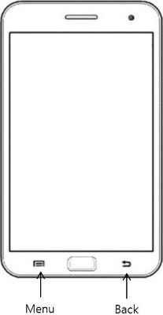
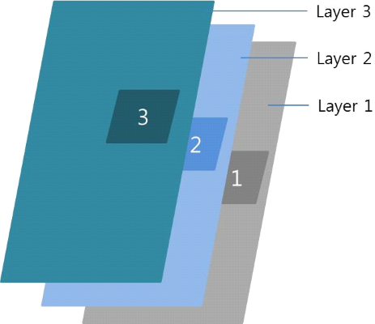

# Managing Menu and Back Key Events

## Dependencies

- Tizen 2.4 and Higher for Mobile

The menu and back functions are common UX behaviors in applications. Generally, the user taps the **Back** hardware key to return to the previous screen. The applications also provide option menus to manipulate their functions through the **Menu** hardware key.

This feature is supported in mobile applications only.

Normally, the key events are only delivered to the object in focus. However, with the EFL Extension functions, you can let visible objects without focus get events from the **Menu** and **Back** keys.

**Figure: Menu and Back keys**



The EFL Extension library maintains its own object stack to determine which object receives the event. Only visible objects are added to the stack.

The stack is based on Evas layers, which means that if 2 objects are registered for the same EFL Extension event, the object on the higher Evas layer gets the event. The following figure shows an example of objects on different layers. Objects 1, 2, and 3 are registered with EFL Extension callbacks for the same event, such as a **Back** key event. When the event occurs, object 3, which is on the highest layer (layer 3), gets the event callback.

**Figure: Objects on different layers**



If the objects with callbacks for the same event are on the same layer, the object which is registered the callback first gets the event.

To register a callback for the **Menu** or **Back** key, use the `eext_object_event_callback_add()` function with the application callback type:

- `EEXT_CALLBACK_BACK`: Hardware **Back** key event
- `EEXT_CALLBACK_MORE`: Hardware **Menu** key event

To delete a registered event in the EFL Extension, use the `eext_object_event_callback_del()` function.

The EFL Extension also provides other convenient functions to work with the **Menu** and **Back** keys for [popup](./component-popup-mn.md), [ctxpopup](./component-ctxpopup-mn.md), [naviframe](./container-naviframe-n.md), and [entry](./component-entry-mn.md) components.

## Managing Hardware Key Events

The following example application has a window with a naviframe, and registers the EFL Extension **Menu** and **Back** key events for the naviframe. When the **Menu** key is pressed, the `_create_popup()` callback creates a popup and registers an EFL Extension **Back** key event for the popup. When the **Back** key is pressed:

- If the popup is shown, the `eext_popup_back_cb()` callback registered for the popup is triggered, because the popup is located on a higher level than the naviframe. The callback removes the popup.
- If the popup is not shown, the `_nf_back_cb()` callback registered for the naviframe is triggered. The callback hides the application.

To manage hardware key events:

1. To use the functions and data types of the [Efl Extension](http://org.tizen.native.mobile.apireference/group__CAPI__EFL__EXTENSION__MODULE.html) API, include the `<efl_extension.h>` header file in your application:

   ```
   #include <efl_extension.h>
   ```

2. Create a window, naviframe, and label, and show the window:

   ```
   static void
   create_base_gui(appdata_s *ad)
   {
       Evas_Object *win = NULL;

       /* Create the window */
       win = elm_win_util_standard_add(NULL, "extension sample");
       evas_object_smart_callback_add(win, "delete,request", _win_del, NULL);

       /* Create the naviframe */
       Evas_Object *nf = NULL;
       nf = elm_naviframe_add(win);
       evas_object_size_hint_weight_set(win, EVAS_HINT_EXPAND, EVAS_HINT_EXPAND);
       elm_win_resize_object_add(win, nf);
       evas_object_show(nf);

       /* Create a label */
       Evas_Object *label = NULL;
       label = elm_label_add(nf);
       elm_object_text_set(label, "Press menu key to show popup,<br/>back key to exit.");
       elm_naviframe_item_push(nf, "Efl Extension usage", NULL, NULL, label, NULL);

       /* Show the window */
       evas_object_show(win);
   ```

3. Register EFL Extension callbacks for the naviframe:

   ```
       /* Register the Menu key event callback */
       eext_object_event_callback_add(nf, EEXT_CALLBACK_MORE, _create_popup, NULL);
       /* Register the Back key event callback */
       eext_object_event_callback_add(nf, EEXT_CALLBACK_BACK, _nf_back_cb, win);
   }
   ```

4. In the **Menu** key callback, create a popup and register an EFL Extension **Back** key event callback for it:

   ```
   static void
   _create_popup(void *data, Evas_Object *obj, void *event_info)
   {
       Evas_Object *parent = obj;

       /* Create the popup */
       Evas_Object *popup = NULL, *content = NULL;
       popup = elm_popup_add(parent);
       elm_object_part_text_set(popup, "title,text", "Title");
       elm_popup_orient_set(popup, ELM_POPUP_ORIENT_CENTER);

       /* Add a label to the popup */
       content = elm_label_add(parent);
       elm_object_text_set(content, "Press back key to remove popup.");
       elm_object_content_set(popup, content);

       /* Register the Back key event callback */
       eext_object_event_callback_add(popup, EEXT_CALLBACK_BACK, eext_popup_back_cb, NULL);
       /* Show the popup */
       evas_object_show(popup);
   }
   ```

5. In the **Back** key callbacks:

   - The `eext_popup_back_cb()` callback is a macro function that removes the popup.To use a hide effect in dismissing the popup, use the `elm_popup_dismiss()` function in the callback:

     ```
     static void
     eext_ctxpopup_back_cb(void *data EINA_UNUSED, Evas_Object *obj, void *event_info EINA_UNUSED)
     {
         elm_ctxpopup_dismiss(obj);
     }
     ```

   - To hide the application window, use the `elm_win_lower()` function in the `_nf_back_cb()` callback:

     ```
     static void
     _nf_back_cb(void *data, Evas_Object *obj, void *event_info)
     {
         Evas_Object *win = data;

         /* Hide the window */
         elm_win_lower(win);
     }
     ```