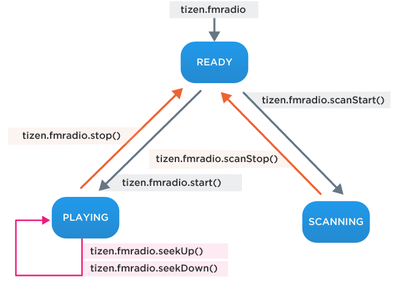

# Radio

## Dependencies

- Tizen 2.4 and Higher for Mobile

Tizen enables you to access and control the FM radio on the device.

This feature is supported in mobile applications only.

The main features of the FM Radio API include:

- Managing the radio

  You can [control the radio playback and change frequency](./media/radio-w.md#manage).

- Scanning available radio channels

  You can [scan the available frequencies to find a channel](./media/radio-w.md#scan).

- Getting information about interruptions

  The Tizen system has a feature to prevent interference between the radio and other sound sources. The radio sound is interrupted in reaction to various events, such as an incoming call or notification. You can use the `oninterrupted` event handler to [detect the reason for the interruption](./media/radio-w.md#get_info).

The available operations depend on the current radio state. To get information about the current radio state, read the `state` attribute of the [FMRadioManager](../../../../org.tizen.web.apireference/html/device_api/mobile/tizen/fmradio.html#FMRadioManager) interface (the [RadioState](../../../../org.tizen.web.apireference/html/device_api/mobile/tizen/fmradio.html#RadioState) enum specifies the possible state values). The following figure illustrates  the radio states and transitions between them.

**Figure: FM radio states and transitions**



## Managing the FM Radio

Starting and stopping an FM radio and changing the frequency is a basic FM radio management skill:

1. To start the FM radio, use the `start()` method of the [FMRadioManager](../../../../org.tizen.web.apireference/html/device_api/mobile/tizen/fmradio.html#FMRadioManager) interface:	**Note**	Always check the current state before using any state-dependent functions.

   ```
   var radioState = tizen.fmradio.state;
   var frequencyToPlay = 99.0;

   if (radioState == 'READY' || radioState == 'PLAYING') {
       tizen.fmradio.start(frequencyToPlay);
   }
   ```

   Pass the `frequencyToPlay` double value. This value represents the radio frequency. If this value is not passed, the radio module tunes to the lowest frequency available.

2. The FM radio can play any frequency between the `frequencyLowerBound` and `requencyUpperBound` values. To change the current frequency, use the `start()` method:

   ```
   var frequencyLowerBound = tizen.fmradio.frequencyLowerBound;
   var frequencyUpperBound = tizen.fmradio.frequencyUpperBound;
   var newFrequency = frequencyLowerBound + 5.0;

   tizen.fmradio.start(newFrequency);
   ```

3. To stop FM Radio, use the `stop()` method:

   ```
   var radioState = tizen.fmradio.state;

   if (radioState == 'PLAYING') {
       tizen.fmradio.stop();
   }
   ```

## Scanning the FM Radio Frequency

To create an application with FM radio features, you must provide a scanning capability:

1. To find a radio channel at a higher frequency than the current one, use the `seekUp()`method of the [FMRadioManager](../../../../org.tizen.web.apireference/html/device_api/mobile/tizen/fmradio.html#FMRadioManager) interface. This method is available only in `PLAYING` radio state.

   ```
   if (tizen.fmradio.state === 'PLAYING') {
       tizen.fmradio.seekUp(successCallback, errorCallback);
   }
   ```

2. To find a radio channel at a lower frequency than the current one, use the `seekDown()`method of the `FMRadioManager` interface. This method is available only in `PLAYING` radio state.

   ```
   if (tizen.fmradio.state === 'PLAYING') {
       tizen.fmradio.seekDown(successCallback, errorCallback);
   }
   ```

3. To scan all available radio channels, use the `scanStart()` method of the `FMRadioManager` interface. This method is available only in the `READY` state. During scanning, the state is changed to `SCANNING`.

   ```
   var radioScanCallback = {
       onfrequencyfound: function(frequency) {
           console.log('A new frequency found: ' + frequency);
       },
       onfinished: function(frequencies) {
           console.log(frequencies.length + 'frequencies found!');
           for (var i = 0; i < frequencies.length; i++) {
               console.log(i + ': ' + frequencies[i]);
           }
       }
   };

   if (tizen.fmradio.state === 'READY') {
       tizen.fmradio.scanStart(radioScanCallback, errorCallback);
   }
   ```

   The first parameter of the `scanStart()` method must be an object implementing the `FMRadioScanCallback` interface.

4. To stop scanning before all stations are found, use the `scanStop()` method:

   ```
   function successCallback() {
       console.log('The scanning stops');
   }

   if (tizen.fmradio.state === 'SCANNING') {
       tizen.fmradio.scanStop(successCallback, errorCallback);
   }
   ```

## Getting Information about Interruptions

Retrieving information about FM radio interruptions is a useful FM radio management skill:

1. Set the `oninterrupted` listener to receive notifications when the radio is interrupted. The event handler receives the reason of the interruption (such as an incoming call or notification tone). You can also use the event handler to restart the playback.

   ```
   var interruptCallback = {
       oninterrupted: function(reason) {
           console.log('Radio interrupted: ' + reason);
       },
       oninterruptfinished: function() {
           console.log('The radio interruption finished.');
           if (tizen.radio.state === 'READY') {
               tizen.radio.start();
           }
       }
   };

   tizen.fmradio.setFMRadioInterruptedListener(interruptCallback);
   ```

2. To stop receiving information about interruptions, use the `unsetFMRadioInterruptedListener()` method of the [FMRadioManager](../../../../org.tizen.web.apireference/html/device_api/mobile/tizen/fmradio.html#FMRadioManager) interface.