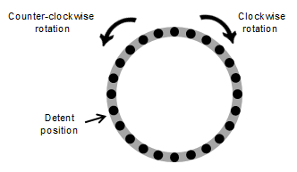

# Handling Rotary Events

## Dependencies

- Tizen 2.3.1 and Higher for Wearable

The Tizen platform supports rotary events for user interaction on a wearable rotary device or sensor.

This feature is supported in wearable applications only.

Rotary events are used to deliver the rotary device or sensor data to the application. The following figure and table describe the rotary events.

**Figure: Rotary device and interaction direction**

 

** Table: Rotary events**

| Type           | Description                              | Attribute                                |
| -------------- | ---------------------------------------- | ---------------------------------------- |
| `rotarydetent` | Triggered when a device detects the detent point. | `detail.direction`: Rotation direction, which can be:			`CW`: Clockwise rotation				`CCW`: Counter-clockwise rotation |

Some UI components provide interactive features with this event. For example, you can implement some rotary-dependent behaviors and control the application page, circle-shaped progress bar, and section changer with a rotary event.

## Scrolling a Page or Popup

You can scroll the content area in a page or popup with the rotary event.

To attach a rotary event, query a scrollable DOM:

```
<!--HTML-->
<div class="ui-page ui-page-active" id="main">
   <header class="ui-header">
      <h2 class="ui-title">TAU Basic</h2>
   </header>
   <div class="ui-content">
      <a href="#popup" data-rel="popup">Open Popup</a>
      <!--Fill content-->
   </div>
   <!--Popup-->
   <div id="popup" class="ui-popup">
      <div class="ui-popup-content">
         <!--Fill content-->
      </div>
      <div class="ui-popup-footer ui-bottom-button">
         <a id="1btnPopup-cancel" href="#" class="ui-btn" data-rel="back">Check</a>
      </div>
   </div>
</div>

<!--Script-->
<script>
    (function() {
        var SCROLL_STEP = 50, /* Distance of moving scroll for each rotary event */
            page = document.getElementById('main'); /* Query with page ID */

        page.addEventListener('popupshow', function popupOpenHandler(e) {
            var popup = e.target, /* Popup element */
                /* Element that has scroll */
                scroller = popup.querySelector('.ui-popup-wrapper'),

                /* Rotary event handler */
                rotaryEventHandler = function(e) {
                    if (e.detail.direction === 'CW') {
                        /* Right direction */
                        scroller.scrollTop += SCROLL_STEP;
                    } else if (e.detail.direction === 'CCW') {
                        /* Left direction */
                        scroller.scrollTop -= SCROLL_STEP;
                    }
                };

            /* Register the rotary event */
            document.addEventListener('rotarydetent', rotaryEventHandler, false);

            /* Deregister the rotary event */
            popup.addEventListener('popuphide', function popupHideHandler() {
                popup.removeEventListener('popuphide', popupHideHandler, false);
                document.removeEventListener('rotarydetent', rotaryEventHandler, false);
            }, false);
        }, false);

        page.addEventListener('pagebeforeshow', function pageScrollHandler(e) {
            var page = e.target;
            elScroller = page.querySelector('.ui-scroller');

            /* Rotary event handler */
            rotaryEventHandler = function(e) {
                if (e.detail.direction === 'CW') {
                    /* Right direction */
                    elScroller.scrollTop += SCROLL_STEP;
                } else if (e.detail.direction === 'CCW') {
                    /* Left direction */
                    elScroller.scrollTop -= SCROLL_STEP;
                }
            };

            /* Register the rotary event */
            document.addEventListener('rotarydetent', rotaryEventHandler, false);

            /* Deregister the rotary event */
            page.addEventListener('pagebeforehide', function pageHideHandler() {
                page.removeEventListener('pagebeforehide', pageHideHandler, false);
                document.removeEventListener('rotarydetent', rotaryEventHandler, false);
            }, false);

        }, false);
    }());
</script>
```

## Controlling a Snap List

You can scroll to a position in a snap list with the rotary event:

```
<!--HTML-->
<div class="ui-page ui-page-active" id="main">
   <div class="ui-content">
      <ul class="ui-listview">
         <li>SnapListview</li>
         <li>SnapListview</li>
         <li>SnapListview</li>
         <li>SnapListview</li>
         <li>SnapListview</li>
         <li>SnapListview</li>
         <li>SnapListview</li>
         <li>SnapListview</li>
         <li>SnapListview</li>
         <li>SnapListview</li>
      </ul>
   </div>
</div>

<!--Script-->
<script>
    (function(tau) {
        var list,
            snapListviewWidget,
            rotarydetentHandler = function(e) {
                var selectedIndex = snapListviewWidget.getSelectedIndex(),
                    direction = e.detail.direction;

                if (direction === 'CW' && selectedIndex !== null) {
                    snapListviewWidget.scrollToPosition(++selectedIndex);
                } else if (direction === 'CCW' && selectedIndex !== null) {
                    snapListviewWidget.scrollToPosition(--selectedIndex);
                }
            };

        if (tau.support.shape.circle) {
            document.addEventListener('pagebeforeshow', function() {
                list = document.getElementById('snapList');
                snapListviewWidget = tau.widget.SnapListview(list);
                window.addEventListener('rotarydetent', rotarydetentHandler);
            });

            document.addEventListener('pagebeforehide', function(e) {
                if (list) {
                    snapListviewWidget.destroy();
                    window.removeEventListener('rotarydetent', rotarydetentHandler);
                }
            });
        }
    }(tau));
</script>
```

## Changing the Section Changer Index

You can between the section changer component sections with the rotary event:

```
<!--HTML-->
<div id="main" class="ui-page">
   <header class="ui-header">
      <h2 class="ui-title">SectionChanger</h2>
   </header>
   <div id="hsectionchanger" class="ui-content">
      <!--Section changer has only one child-->
      <div>
         <section class="section" style="text-align:center">
            <h3>LEFT2 PAGE</h3>
         </section>
         <section class="section" style="text-align:center">
            <h3>LEFT1 PAGE</h3>
         </section>
         <section class="section" class="ui-section-active" style="text-align:center">
            <h3>MAIN PAGE</h3>
         </section>
         <section class="section" style="text-align:center">
            <h3>RIGHT1 PAGE</h3>
         </section>
         <section class="section" style="text-align:center">
            <h3>RIGHT2 PAGE</h3>
         </section>
      </div>
   </div>
</div>

<!--Script-->
<script>
    (function(tau) {
        var changer,
            sectionChangerWidget,
            sections,
            sectionsLength,

            rotarydetentHandler = function(event) {
                var direction = event.detail.direction,
                    activeSection;

                activeSection = sectionChangerWidget.getActiveSectionIndex();

                if (direction === 'CW') {
                    /* Right direction */
                    if (activeSection < sectionsLength - 1) {
                        sectionChangerWidget.setActiveSection(activeSection + 1, 30);
                    }
                } else if (direction === 'CCW') {
                    /* Left direction */
                    if (activeSection > 0) {
                        sectionChangerWidget.setActiveSection(activeSection - 1, 30);
                    }
                }
            };

        if (tau.support.shape.circle) {
            document.addEventListener('pagebeforeshow', function() {
                changer = document.getElementById('hsectionchanger');
                sectionChangerWidget = tau.widget.SectionChanger(changer, {
                    circular: false,
                    orientation: 'horizontal',
                    useBouncingEffect: false
                });
                sections = changer.querySelectorAll('.section');
                sectionsLength = sections.length;

                document.addEventListener('rotarydetent', rotarydetentHandler);
            });

            document.addEventListener('pagebeforehide', function(e) {
                sectionChangerWidget.destroy();
                document.removeEventListener('rotarydetent', rotarydetentHandler);
            });
        }
    }(tau));
</script>
```

## Changing the Circle-shaped Progress Bar Value

You can change the value of the circle-shaped progress bar component with the rotary event:

```
<!--HTML-->
<div class="ui-page" id="pageRotaryEvent" data-enable-page-scroll="false">
   <header class="ui-header">
      <h2 class="ui-title">Rotary Event</h2>
   </header>
   <div class="ui-content">
      <div id="result"></div>
   </div>
   <progress class="ui-circle-progress" id="circleprogress" max="100" value="20"></progress>
</div>

<!--Script-->
<script>
    (function() {
        var progressBar,
            progressBarWidget,
            resultDiv,
            value,
            direction,
            rotaryDetentHandler = function(e) {
                /* Get rotary direction */
                direction = e.detail.direction;

                if (direction === 'CW') {
                    /* Right direction */
                    if (parseInt(progressBarWidget.value(), 10) < 100) {
                        value = parseInt(progressBarWidget.value(), 10) + 1;
                    } else {
                        value = 100;
                    }
                } else if (direction === 'CCW') {
                    /* Left direction */
                    if (parseInt(progressBarWidget.value(), 10) > 0) {
                        value = parseInt(progressBarWidget.value(), 10) - 1;
                    } else {
                        value = 0;
                    }
                }

                resultDiv.innerText = value + '%';
                progressBarWidget.value(value);
            };

        document.addEventListener('pagebeforeshow', function() {
            resultDiv = document.getElementById('result');

            progressBar = document.getElementById('circleprogress');
            progressBarWidget = new tau.widget.CircleProgressBar(progressBar, {size: 'large'});
            resultDiv.innerText = progressBarWidget.value() + '%';
            /* Add rotarydetent handler to document */
            document.addEventListener('rotarydetent', rotaryDetentHandler);
        });

        document.addEventListener('pagehide', function() {
            progressBarWidget.destroy();
            document.removeEventListener('rotarydetent', rotaryDetentHandler);
        });
    }());
</script>
```