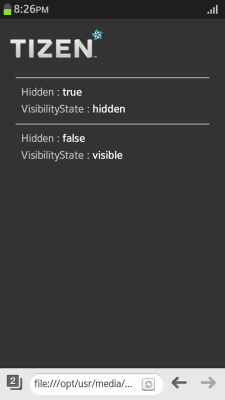

# Page Visibility

## Dependencies

- Tizen 2.4 and Higher for Mobile
- Tizen 2.3.1 and Higher for Wearable

Page visibility can detect whether the Web document is being shown on the screen. With it, you can design your application to only operate when its page is visible, both enhancing the user experience and reducing the resource usage on the device.

This feature is supported in mobile and wearable applications only.

The main features of the Page Visibility API include:

- Retrieving the page visibility status   

  You can use 2 properties to [detect the visibility status of the page](./w3c/perf_opt/page-w.md#Retrieving_Page_Visibility):

  - The `hidden` property returns a boolean value indicating whether the page is visible.
  - The `visibilityState` property returns a DOMString type indicating whether the page is visible.

- Tracking changes in page visibility   

  You can use the `visibilitychange` event to be able to [respond to changes in the page visibility status](./w3c/perf_opt/page-w.md#Retrieving_Notifications_Visibility).

  For example, in a video player application, you can change the play status of the application based on the event: pause the playback when the page becomes hidden, and continue playing when the page becomes visible again.

​	**Note**	Tizen supports the WebKit-based Page Visibility API. When using the Page Visibility API, you must include the webkit prefix.

## Retrieving the Page Visibility Status

To optimize the performance of your application, you must learn to retrieve the page visibility status:

1. Retrieve the page visibility status with the `hidden` property:

   ```
   <script>
       var logText = document.querySelector('.log');

       function pageVisibilityHandler() {
           logText.innerHTML += '<p>Hidden: <span>' + document.webkitHidden; +
                                '</span></p>';
   ```

   The `hidden` property returns `true` if the document in the top-level browsing context (root window in the browser's viewport) [HTML5] is not visible at all. If the document is at least partially visible, the property returns `false`.

2. Retrieve the page visibility status with the `visibilityState` property:

   ```
           logText.innerHTML += '<p>VisibilityState: <span>' +
                                document.webkitVisibilityState; + '</span></p>';
       }
   </script>
   ```

   The `visibilityState` property returns one of the following DOMString types:

   - `hidden`: Document cannot be seen at all
   - `visible`: Document can be at least partly seen
   - `prerender`: Document is loaded, but cannot be seen on the screen
   - `unloaded`: Document is not loaded

   Tizen does not currently support the `prerender` and `unloaded` types.

​	**Note**	Since Tizen supports the WebKit-based page visibility, you must include the webkit prefix in the attributes.

**Figure: Page visibility (in mobile applications only)**



### Source Code

For the complete source code related to this use case, see the following file:

- [page_1.html](http://download.tizen.org/misc/examples/w3c_html5/performance_and_optimization/page_visibility)

## Receiving Notifications on Visibility Status Changes

To optimize the performance of your application, you must learn to track changes in the page visibility status, and respond to them appropriately:

1. Define the elements used to play video on the screen:

   ```
   <!--video control-->
   <div class="media">
      <video id="video" src="video_sample.mp4" width="360" height="220"></video>
      <div>
         <!--video control buttons-->
         <button id="v-play" type="button">play</button>
         <button id="v-pause" type="button" disabled >pause</button>
      </div>
   </div>
   ```

2. Add event listeners to play and pause the video based on the button clicks:

   ```
   <script>
       var play_button = document.getElementById('v-play');
       var pause_button = document.getElementById('v-pause');
       var video = document.getElementById('video');

       play_button.addEventListener('click', function() {
           video.play(); /* Play video */
       }, false);

       pause_button.addEventListener('click', function() {
           video.pause(); /* Pause video */
       }, false);

       /* Enable and disable buttons based on the playback status */
       video.addEventListener('play', function() {
           play_button.disabled = true; /* Disable play button */
           pause_button.disabled = false; /* Enable pause button */
       }, false);

       video.addEventListener('pause', function() {
           play_button.disabled = false; /* Enable play button */
           pause_button.disabled = true; /* Disable pause button */
       }, false);
   </script>
   ```

3. Add an event listener to track the page visibility status changes. When the status changes and the `visibilityChange` event is triggered, use the `hidden` property to check whether the page is hidden or visible, and to play or pause the video accordingly.

   ```
   <script>
       /* Add visibility status event listener */
       document.addEventListener('webkitvisibilitychange', pageVisibilityHandler, false);

       /* When the visibility status changes */
       function pageVisibilityHandler() {
           /* Check whether the page is hidden */
           if (!(document.webkitHidden)) {
               video.play(); /* Play video */
           } else {
               video.pause(); /* Pause video */
           }
       }
   </script>
   ```

If the video page becomes hidden with a tab screen transition, the playback is paused. When the video page is visible again, the playback resumes.

**Figure: Video player (in mobile applications only)**


### Source Code

For the complete source code related to this use case, see the following files:

- [visibility_sample.html](http://download.tizen.org/misc/examples/w3c_html5/performance_and_optimization/page_visibility)
- [video_sample.mp4](http://download.tizen.org/misc/examples/w3c_html5/performance_and_optimization/page_visibility)