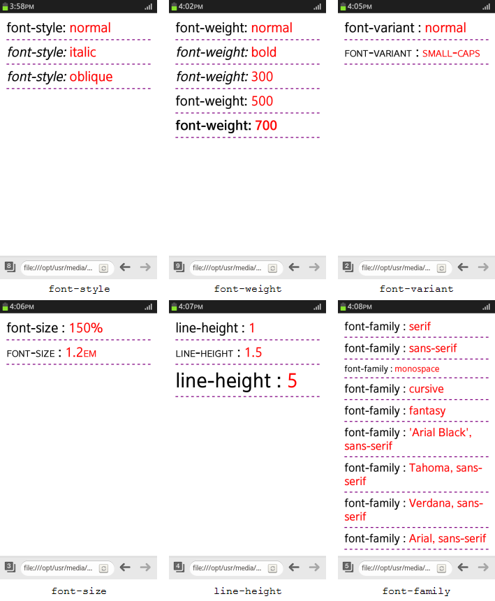

# CSS Fonts Module (Level 3)

## Dependencies

- Tizen 2.4 and Higher for Mobile
- Tizen 2.3.1 and Higher for Wearable

You can change the text fonts easily.

This feature is supported in mobile and wearable applications only.

The new text features in CSS Fonts Module Level 3 API include:

- Font properties

  You can [use CSS font properties](./w3c/ui/font-w.md#font), such as `font-style`, `font-weight`, `font-variant`, `font-size`, and `font-family`, to modify the appearance of text.

## Manipulating Fonts

To enhance the user experience of your application, you must learn to handle fonts using CSS font properties:

1. Define the `font-style` property within a `<style>` element in the `<head>` section of the Web page to apply different font styles:

   ```
   <head>
      <style>
         p:nth-child(1) em{font-style: normal}
         p:nth-child(2) em{font-style: italic}
         p:nth-child(3) em{font-style: oblique}
      </style>
   </head>
   <body>
      <p>font-style: <em>normal</em></p>
      <p>font-style: <em>italic</em></p>
      <p>font-style: <em>oblique</em></p>
   </body>
   ```

2. Define the `font-weight` property,which controls the weight of the text:

   ```
   <head>
      <style>
         p:nth-child(1) {font-weight: normal}
         p:nth-child(2) {font-weight: bold}
         p:nth-child(3) {font-weight: 300}
         p:nth-child(4) {font-weight: 500}
         p:nth-child(5) {font-weight: 700}
      </style>
   </head>
   <body>
      <p>font-weight: <em>normal</em></p>
      <p>font-weight: <em>bold</em></p>
      <p>font-weight: <em>300</em></p>
      <p>font-weight: <em>500</em></p>
      <p>font-weight: <em>700</em></p>
   </body>
   ```

3. Define the `font-variant` property tochange the font to, for example, use small capital letters:

   ```
   <head>
      <style>
         p:nth-child(1) {font-variant: normal}
         p:nth-child(2) {font-variant: small-caps}
      </style>
   </head>
   <body>
      <p>font-variant: <em>normal</em></p>
      <p>font-variant: <em>small-caps</em></p>
   </body>
   ```

4. Define the `font-size` property, which controls the size of the font:

   ```
   <head>
      <style>
         p:nth-child(1) {font-size: 150%}
         p:nth-child(2) {font-size: 1.2em}
      </style>
   </head>
   <body>
      <p>font-size: <em>150%</em></p>
      <p>font-size: <em>1.2em</em></p>
   </body>
   </html>
   ```

5. Define the `line-height` property, which controls the height of a text line:

   ```
   <head>
      <style>
         p:nth-child(1) {line-height: 1}
         p:nth-child(2) {line-height: 1.5}
         p:nth-child(3) {line-height: 5}
      </style>
   </head>
   <body>
      <p>line-height: <em>1</em></p>
      <p>line-height: <em>1.5</em></p>
      <p>line-height: <em>5</em></p>
   </body>
   ```

6. Define the `font-family` property, which assigns a specific font or its representative to an element. The list order within the `<style>` element determines the property priority.If the assigned font is not installed on the target, a different font is obtained based on the user system.

   ```
   <head>
      <style>
         p:nth-child(1) {font-family: serif}
         p:nth-child(2) {font-family: sans-serif}
         p:nth-child(3) {font-family: monospace}
         p:nth-child(4) {font-family: cursive}
         p:nth-child(5) {font-family: fantasy}
         p:nth-child(6) {font-family: 'Arial Black', sans-serif}
         p:nth-child(7) {font-family: Tahoma, sans-serif}
         p:nth-child(8) {font-family: Verdana, sans-serif}
         p:nth-child(9) {font-family: Arial, sans-serif}
      </style>
   </head>
   <body>
      <p>font-family: <em>serif</em></p>
      <p>font-family: <em>sans-serif</em></p>
      <p>font-family: <em>monospace</em></p>
      <p>font-family: <em>cursive</em></p>
      <p>font-family: <em>fantasy</em></p>
      <p>font-family: <em>'Arial Black', sans-serif</em></p>
      <p>font-family: <em>Tahoma, sans-serif</em></p>
      <p>font-family: <em>Verdana, sans-serif</em></p>
      <p>font-family: <em>Arial, sans-serif</em></p>
   </body>
   </html>
   ```

The following figure shows examples of manipulating the text font properties.

**Figure: Font properties (in mobile applications only)**



​	**Note**	For a complete list of CSS Fonts Module Level 3 font properties (in [mobile](../../../../org.tizen.web.apireference/html/w3c_api/w3c_api_m.html#font) or [wearable](../../../../org.tizen.web.apireference/html/w3c_api/w3c_api_w.html#font) applications) and their possible values, see the [Property index](http://www.w3.org/TR/2013/CR-css-fonts-3-20131003/#property-index).