# Customized Platform Guide

## Introduction

Customized platform feature is introduced in Tizen IoT Preview 2, which helps you to create a customized platform image. It also helps you to selectively aggregate features and set of Tizen platform APIs. The customized platform image is created in Craftroom. For more information, see [Craftroom](https://craftroom.tizen.org).

Using the customized platform image, you can:

-   remove the unwanted modules.
-   reduce the size of the image.

## Create Customized Platform Image

This section explains how to create a customized platform image with an example. However, for more information on using Craftroom, see [Craftroom Forum](https://craftroom.tizen.org/forum/).

To create a customized platform image:

1.  Go to [Craftroom](https://craftroom.tizen.org).
2.  Log on using your Tizen account credentials.
3.  Click **Workspace**.
4.  Click **New**. The **New Craft** window appears.
5.  Enter the required information and click **Create**.

    The name of the newly created craft appears in the left navigation bar.

6.  In the left navigation bar, go to **newly_created_craft_name** > **Craft Designer**.
7.  Click **Create**.

    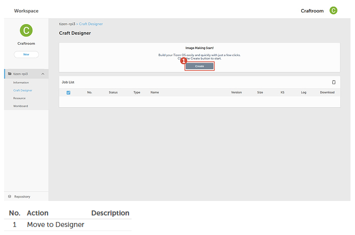

8.   Enter the required information in each of the following field:
    1.  **Presets**: Predefined image settings. If you are using the ARTIK 530 or ARTIK 530S IoT module, then you can either select **IOT Headed ARTIK530 Image** or **IOT Headless ARTIK530 Image**. If you are using Raspberry Pi 3, then select **IOT Headless RPI3 Image**. The **IOT Headed Common Presets** specifies the preset of the Tizen Common profile. The **IOT Core Presets** specifies the preset of the minimum set of features.

        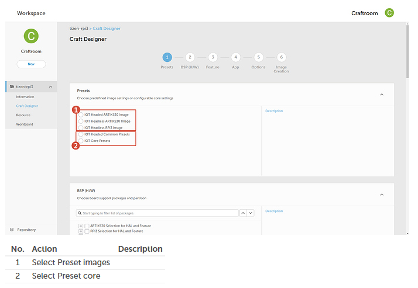

    2.  **BSP (H/W)**: The supported hardware abstraction layer (HAL) for the boards. If you are using the ARTIK 530 or ARTIK 530S IoT module, then you must select **ARTIK530 selection for HAL and Feature**. If you are using Raspberry Pi 3, then select **RPI3 selection for HAL and Feature**. Additionally, you have options to select other HAL and Features by clicking the plus icon adjacent to ARTIK 530 or RPI3. If you select ARTIK or RPI3 in **Presets**, then you do not have to select **Partition Presets**. The **Partition Presets** is used for IOT Headed Common Presets and IOT Core Presets only.

        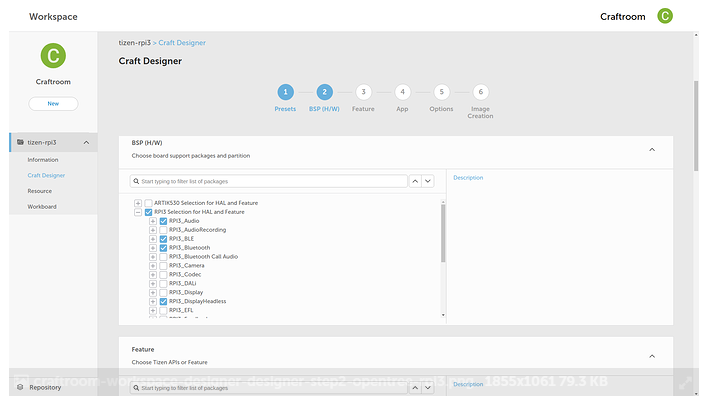

    3.  **Feature**: Tizen API groups. To implement the feature in detail, you can add or remove the features depending on what you want to create. For more information on APIs and features, see [Basics of Tizen Native API Reference](../../application/native/api/overview.md).

        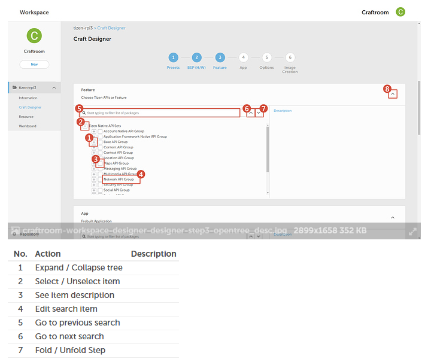

    4.  **App**: Pre-built application. For the IoT Headed Reference Apps, you have options to set and connect to Bluetooth and Wi-Fi by clicking the plus icon adjacent to **IoT Headed Reference Apps** option. You can select multiple options. However, for the IoT Headless Reference Apps, pre-built applications are not available.

        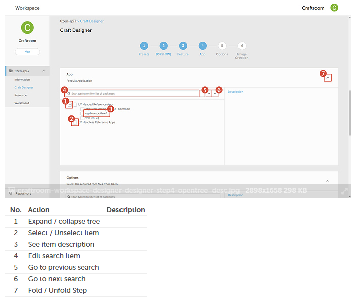

    5.  **Options**: Tizen packages details. A list of available Tizen packages selected for presets and features appears. You can also add more packages.

        

    6.  **Add Packages**: To add any custom RPM or TPK. You can also add the applications created in Tizen Studio.

        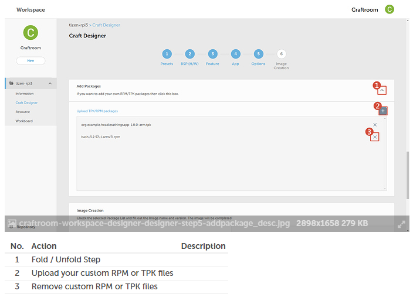

    7.  Click **Create** to start creating the image. You can see the logs as the image is created. The **Download** button is enabled after the image is successfully created.

        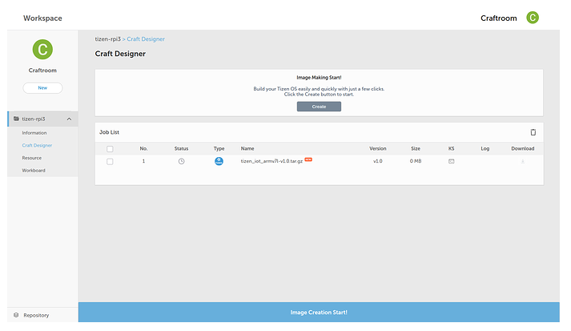

    8.  Click **Download** to download the image to your computer.
    9.  Flash the newly created platform image to your board. For more details, see [Flashing Tizen Images](../getting-started/tizen-image-download-flash.md).

## Create Applications on the Customized Platform

You can develop an application on the customized platform created by you. To do that, you must add the APIs to the application that you selected to create the image. For more information on developing applications, see [Craftroom Forum](https://craftroom.tizen.org/forum/).

To create applications on the customized platform:

1.  Go to [Craftroom](https://craftroom.tizen.org).
2.  Log on using your Tizen account credentials.
3.  Click **Workspace**.
4.  Select your craft from the left navigation bar.
5.  Click **Resource**. The following icons appear:

    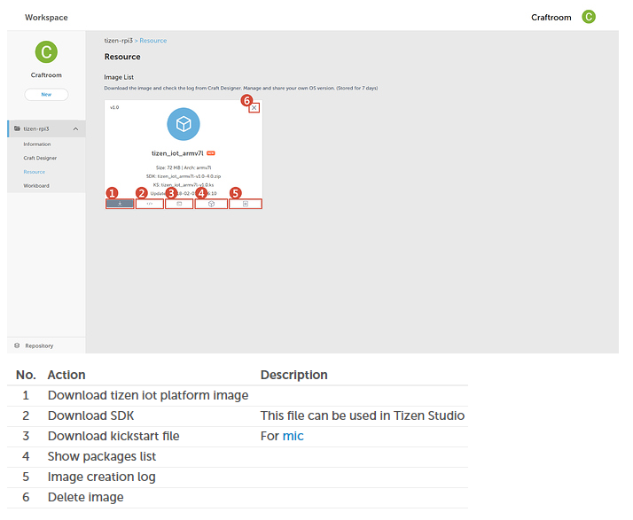

    1.  Download: To download the customized Tizen image created by you.
    2.  SDK: To download the extension SDK for the customized Tizen image created by you.
    3.  KS (kickstart): To download the kickstart script file, which is used to create the Tizen image. For more information on kickstart script, see [Creating Tizen Images with MIC](../../open-source-project/reference/mic/mic-reference.md).
    4.  Packages: A list of available packages for the customized platform.
    5.  Log : The log file generated, when the image was getting created.

6.  Click **SDK** and download the SDK extension for the customized platform image.
7.  Install the downloaded SDK in Tizen Studio to develop the application on the customized platform:
    1.  Open **Tizen Studio** .
    2.  Go to **Tools** > **Package Manager**. The **Package Manager** window appears.
    3.  Click on the configuration icon available on the top to open the **Configuration** window.
    4.  Click **Extension SDK**.
    5.  Click **+** to add a new SDK extension. The **Add Repository** window appears.

        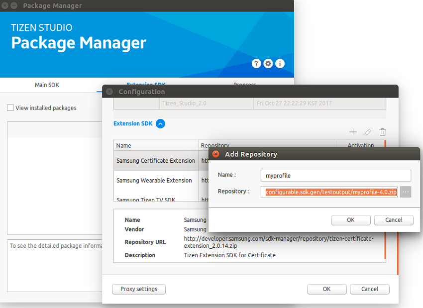

    6.  Enter the name of the repository in the **Name** field.
    7.  Enter the location of the extended SDK you downloaded in step six in the **Repository** field.
    8.  Click **OK**. The newly added extended SDK package appears in the list of available packages.
    9.  Click **install** to install the extended SDK on **Tizen Studio**.

        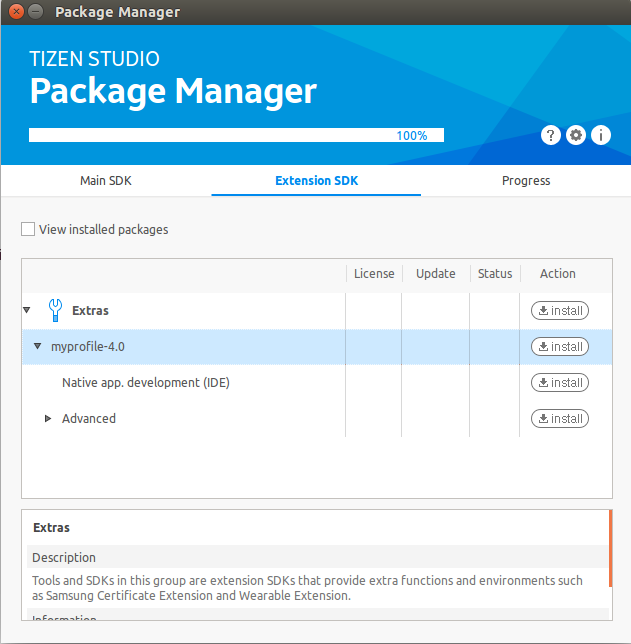

8.  Create a new application template for the customized platform:
    1.  Open **Tizen Studio** and go to **File** > **New** > **Tizen Project**.
    2.  Select the project type and click **Next**. The **Profile and Version** tab appears.
    3.  Select a profile from the drop-down list available in the **Custom** box and click **Next**. The **Application Type** tab appears. 

        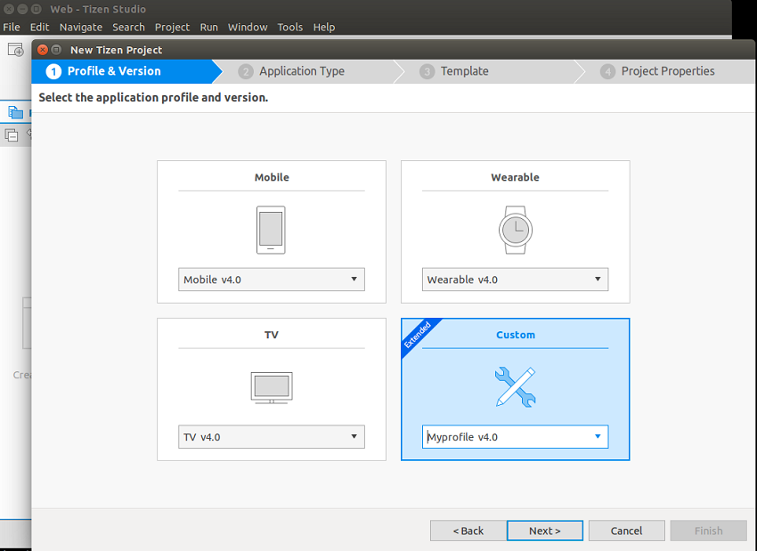

    4.  Select **Native Application** and click **Next**. The **Template** tab appears.

        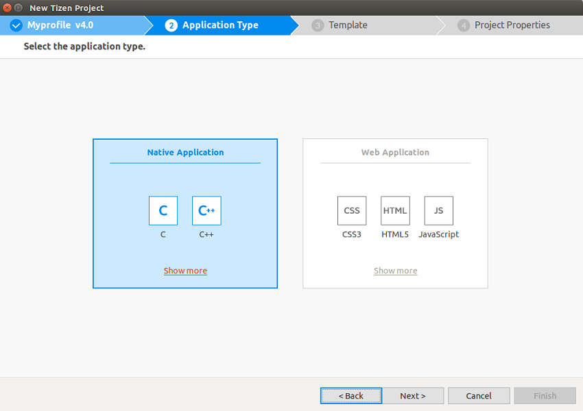

    5.  Select **Service** and click **Next**. The **Project Properties** tab appears.

        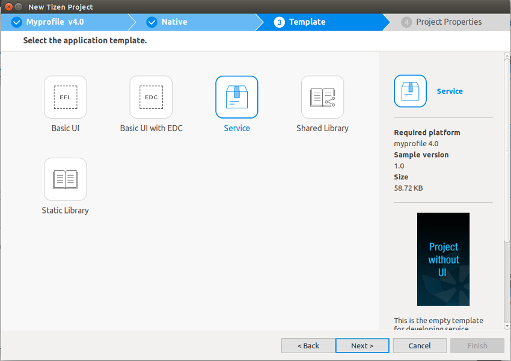

    6.  Specify the required project properties and click **Finish**.

9.  Develop your application based on the APIs selected by you as a feature in the "Creating Customized Platform Image" section.
10. Select **Project** > **Build Project** to build your application.

    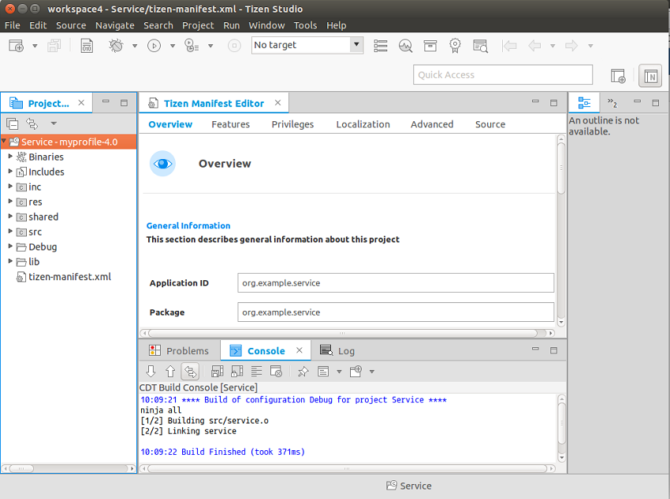

11. For the API reference, see [Tizen 4.0 API reference](../../application/native/index.md) and [IoT APIs](../guides/iot-api.md). In addition, to get an idea on developing the Tizen IoT application, see [Developing Applications with the Things SDK API](../getting-started/things-app-development.md).
