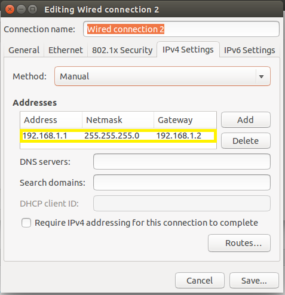
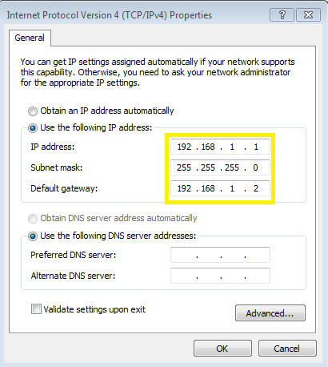

# Supported Hardware

Tizen IoT binaries work on the following two hardware platforms:

-   Raspberry Pi 3

## Raspberry Pi 3

To configure the Raspberry Pi 3 board:

1.  Insert the SD card, in which Tizen IoT binaries and the drivers are flashed into the Raspberry Pi board.
2.  For the serial communication connection:
    1.  Connect the host computer to the Pi with a **UART-to-USB** dongle such as PL2303 or FT232 USB UART board.

        To use the PL2303, connect the Raspberry Pi TXD0 pin (pin 8) to RXD on the UART board, RXD0 (pin 10) to TXD on the UART board, and the ground (pin 6) to GND on the UART board, and set the jumper switch to 3.3V (pin 1).

        > **Note**
        >
        > Before using a UART-to-USB dongle, familiarize yourself with any hardware limitations it has by visiting the manufacturer's website.


    2.  Execute a terminal program such as Minicom of PuTTY. For more information, see [To run Minicom and PuTTY](#putty_config).

3.  For the SDB connection:
    1.  Connect the host computer to the Pi through an Ethernet cable.

        > **Note**
        >
        > If Ethernet ports are not available in the host computer or the Pi, you can also use an `Ethernet-to-USB` dongle.


    2.  Set a new network interface in the host computer as shown in the following figures. This is a one time activity:
        -   Linux computer:

            

        -   Windows computer:

            

            If you are using the **Ethernet-to-USB** dongle, you must install the proper driver for the dongle. If the network cable is conneted correctly, you can find a new connection in Network and Sharing Center. In the new connection, enter Properties of IPv4, and configure as shown in the Windows computer figure.

4.  Verify the IP address for eth0.

    ```
    ifconfig
    ```

    If the IP address for eth0 is 192.168.1.11, got to step 5. If not, set an IP address for the SDB connection in the serial shell of the Pi using the `ifconfig` command:

    ```
    ifconfig eth0 192.168.1.11
    ```

    If you flash the image through IoT Setup Manager with setting the IP address in Ethernet option as 192.168.1.11, start Raspberry Pi 3, which is connected to the Ethernet cable to the host computer, then the IP address must be set to 192.168.1.11. For more information, see [Flashing Tizen Images](tizen-image-download-flash.md).

5.  Connect Smart Development Bridge (SDB) in the Linux shell (Linux) or Command window (Windows) of the host computer:

    ```
    sdb connect 192.168.1.11
    sdb root on
    ```

    For example, for Linux computer:

    ```
    ~$ sdb connect 192.168.1.11
    * server not running. starting it now on port 26099 *
    * server started successfully *
    connecting to 192.168.1.11:26101 ...
    connected to 192.168.1.11:26101
    ~$ sdb root on
    Switched to 'root' account mode
    ~$
    ```

6.  Enter the `sdb help` command in the Linux shell (Linux) or Command window (Windows) of the host computer, for more information.
    > **Note**
    >
    > `sdb` execution file is available in the `tools` sub-directory of the directory where Tizen Studio is installed.

