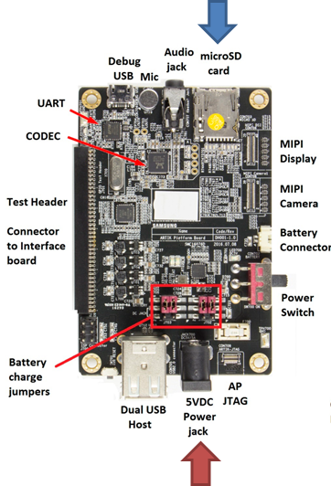
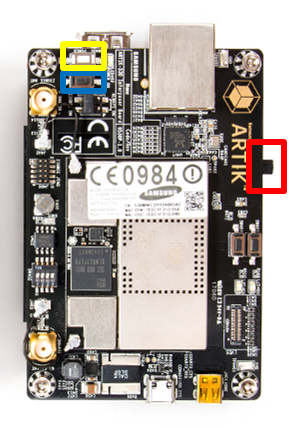
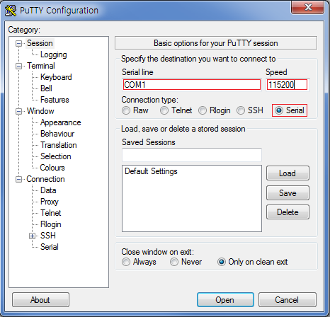

# Supported Hardware

Tizen IoT Preview binaries work on the following two hardware platforms:

-   ARTIK 530 or ARTIK 530s
-   Raspberry Pi 3

## ARTIK 530 or ARTIK 530s

To configure the ARTIK 530 or the ARTIK 530s hardware board:

1.  Insert the micro SD card into the card slot (marked with a blue arrow) and connect the 5V DC power supply to the board (the red arrow). If you want to start the board by eMMC (not using SD card), connect only the 5V DC power supply to the board (marked with a red arrow). The following figure shows the bottom view of the board:

    

2.  Set the DIP switch on the board:
    1.  To boot from the SD card, set the DIP switch on the board as shown in the following figure (top view of the board). This step is applicable only for the ARTIK 530 board when the IoT Setup Manager is used:

        

    2.  To boot from the eMMC card, set the DIP switch on the board as shown in the following figure (top view of the board). Follow this step when you flash an image using command-line to ARTIK 530 or ARTIK 530s board:

        

3.  Connect a USB serial cable (marked with a yellow box) and a separate USB OTG cable (the red box) to your Linux computer. The following figure shows the bottom view of the board on the left and top view on the right:

    

4.  Boot the board by sliding the power switch (marked with a red box) to ON position and press the power push-button (the yellow box). The following figure shows the top view of the board:

    

5.  Launch two shell prompts on your Linux computer. One for serial communication (serial shell) and the other for installing the drivers (Linux shell or Command window). For serial communication to the board, run a serial communication application, such as Minicom or PuTTY.

    <a name="putty_config"></a>
    To run Minicom and PuTTY:
    -   Minicom example:

        Minicom can be used in Linux computer. Run the following command to run Minicom:

        ```
        $ sudo minicom -c on
        ```

        To configure Minicom:

        1.  Go to the Minicom configuration settings menu by consecutively pressing `Ctrl + A`, `Z`, and `O` (the letter O).
        2.  In the `Serial Device` field, set the correct USB port for serial communication. The format is `/dev/ttyUSBX` where `X` equals the number of the port.
        3.  Modify the `Hardware Flow Control` field to `No`.

        ```
        +-----------------------------------------------------------------------+
        | A -    Serial Device      : /dev/ttyUSBX                              |
        | B - Lockfile Location     : /var/lock                                 |
        | C -   Callin Program      :                                           |
        | D -  Callout Program      :                                           |
        | E -    Bps/Par/Bits       : 115200 8N1                                |
        | F - Hardware Flow Control : No                                        |
        | G - Software Flow Control : No                                        |
        ```

        In the serial shell, log in with `root/tizen`:

        ```
        localhost login: root
        Password: tizen
        Welcome to Tizen
        ```

    -   PuTTY example:

        PuTTY is used for Windows and Linux computer. Download PuTTY from the Internet and launch PuTTY.

        

        To configure PuTTY:

        1.  Select `Serial` connection type.
        2.  Enter the serial line number for the board connected to your computer (it can be COM`N` where `N` is a natural number such as COM1, COM4, and so on) in the `Serial line` field.
        3.  Type 115200 in the `Speed` field.
        4.  Click `Open`.

        In the serial shell, log in with `root/tizen`:

        ```
        localhost login: root
        Password: tizen
        Welcome to Tizen
        ```

6.  Open the Smart Development Bridge (SDB) connection:
    1.  Enter the following command in the serial shell:

        ```
        root@localhost:~# sdb-mode.sh --on
        ```

    2.  Verify whether SDB is connected, in the Linux shell (Linux) or Command window (Windows) of the host computer:

        ```
        sdb root on
        ```

        For example, for Linux computer:

        ```
        ~$ sdb root on
        Switched to 'root' account mode
        ~$
        ```

    3.  Enter the `sdb help` command in the Linux shell (Linux) or Command window (Windows) of the host computer, for more information.
        > **Note**
        >
        > `sdb` execution file is available in the `tools` sub-directory of the directory where Tizen Studio is installed.

## Raspberry Pi 3

To configure the Raspberry Pi 3 board:

1.  Insert the SD card, in which Tizen IoT binaries and the drivers are flashed into the Raspberry Pi board.
2.  For the serial communication connection:
    1.  Connect the host computer to the Pi with a **UART-to-USB** dongle such as PL2303 or FT232 USB UART board.

        To use the PL2303, connect the Raspberry Pi TXD0 pin (pin 8) to RXD on the UART board, RXD0 (pin 10) to TXD on the UART board, and the ground (pin 6) to GND on the UART board, and set the jumper switch to 3.3V (pin 1).

        > **Note**
        >
        > Before using a UART-to-USB dongle, familiarize yourself with any hardware limitations it has by visiting the manufacturer's website.


    2.  Execute a terminal program such as Minicom of PuTTY. For more information, see [To run Minicom and PuTTY](#putty_config).

3.  For the SDB connection:
    1.  Connect the host computer to the Pi through an Ethernet cable.

        > **Note**
        >
        > If Ethernet ports are not available in the host computer or the Pi, you can also use an `Ethernet-to-USB` dongle.


    2.  Set a new network interface in the host computer as shown in the following figures. This is a one time activity:
        -   Linux computer:

            

        -   Windows computer:

            

            If you are using the **Ethernet-to-USB** dongle, you must install the proper driver for the dongle. If the network cable is conneted correctly, you can find a new connection in Network and Sharing Center. In the new connection, enter Properties of IPv4, and configure as shown in the Windows computer figure.

4.  Verify the IP address for eth0.

    ```
    ifconfig
    ```

    If the IP address for eth0 is 192.168.1.11, got to step 5. If not, set an IP address for the SDB connection in the serial shell of the Pi using the `ifconfig` command:

    ```
    ifconfig eth0 192.168.1.11
    ```

    If you flash the image through IoT Setup Manager with setting the IP address in Ethernet option as 192.168.1.11, start Raspberry Pi 3, which is connected to the Ethernet cable to the host computer, then the IP address must be set to 192.168.1.11. For more information, see [Flashing Tizen Images](tizen-image-download-flash.md).

5.  Connect Smart Development Bridge (SDB) in the Linux shell (Linux) or Command window (Windows) of the host computer:

    ```
    sdb connect 192.168.1.11
    sdb root on
    ```

    For example, for Linux computer:

    ```
    ~$ sdb connect 192.168.1.11
    * server not running. starting it now on port 26099 *
    * server started successfully *
    connecting to 192.168.1.11:26101 ...
    connected to 192.168.1.11:26101
    ~$ sdb root on
    Switched to 'root' account mode
    ~$
    ```

6.  Enter the `sdb help` command in the Linux shell (Linux) or Command window (Windows) of the host computer, for more information.
    > **Note**
    >
    > `sdb` execution file is available in the `tools` sub-directory of the directory where Tizen Studio is installed.

