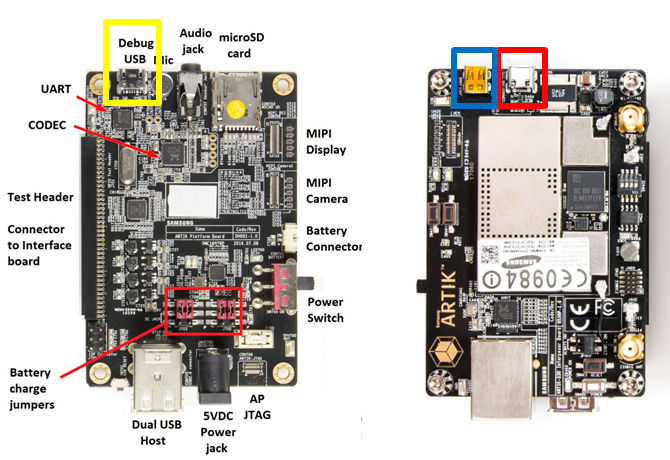

# Contents

[Installing Tizen Studio](#Installing-Tizen-Studio)

[Setting up ARTIK 530 or ARTIK 530s](#Setting-up-ARTIK-530-or-ARTIK-530s)

[Flashing Tizen Images](#Flashing-Tizen-Images)

[Tips](#Tips)

# Installing Tizen Studio

If you have already installed Tizen Studio 3.0 and installed the **5.0 Mobile** profile for the **Main SDK** and the **IOT-Headed-5.0** and **IOT-Headless-5.0** profiles for the **Extension SDK**, you can skip this section.

Otherwise, to install Tizen Studio and the required profiles for IoT development:

1.  Download and install the correct version of Tizen Studio 3.0 (or later) for your operating system from [Tizen developer site](https://developer.tizen.org/development/tizen-studio/download).
2.  Open the **Tizen Studio Package Manager**, select the **Main SDK** tab, and install the **5.0 Mobile** profile:

    

3.  Select the **Extension SDK** tab and install **Extras**. **Extras** includes **IOT-Headed-5.0** and **IOT-Headless-5.0** profiles:

    

    > **Note**
    >
    > **Extension SDK** should be updated to the latest version.


# Setting up ARTIK 530 or ARTIK 530s

To configure the ARTIK 530 or the ARTIK 530s hardware board:

1.  Connect the 5V DC power supply to the board (marked with a red arrow). The following figure shows the bottom view of the board:

    

2.  Set the DIP switch on the board as shown in the following figure (top view of the board):

     

3.  Connect a USB serial cable (marked with a yellow box) and a separate USB OTG cable (the red box) to your Linux computer. The following figure shows the bottom view of the board on the left and top view on the right:

    

4.  Boot the board by sliding the power switch (marked with a red box) to ON position and press the power push-button (the yellow box). The following figure shows the top view of the board:

    

5.  Launch two shell prompts on your Linux computer. One for serial communication (serial shell) and the other for installing the drivers. For serial communication to the board, run a serial communication application, such as Minicom or PuTTY.

    <a name="putty_config"></a>
    To run Minicom and PuTTY:
    -   Minicom example:

        Minicom can be used in Linux computer. Run the following command to run Minicom:

        ```
        $ sudo minicom -c on
        ```

        To configure Minicom:

        1.  Go to the Minicom configuration settings menu by consecutively pressing `Ctrl + A`, `Z`, and `O` (the letter O).
        2.  In the `Serial Device` field, set the correct USB port for serial communication. The format is `/dev/ttyUSBX` where `X` equals the number of the port.
        3.  Modify the `Hardware Flow Control` field to `No`.

        ```
        +-----------------------------------------------------------------------+
        | A -    Serial Device      : /dev/ttyUSBX                              |
        | B - Lockfile Location     : /var/lock                                 |
        | C -   Callin Program      :                                           |
        | D -  Callout Program      :                                           |
        | E -    Bps/Par/Bits       : 115200 8N1                                |
        | F - Hardware Flow Control : No                                        |
        | G - Software Flow Control : No                                        |
        ```

        In the serial shell, log in with `root/tizen`:

        ```
        localhost login: root
        Password: tizen
        Welcome to Tizen
        ```

    -   PuTTY example:

        Download PuTTY from the Internet and launch PuTTY.

        

        To configure PuTTY:

        1.  Select `Serial` connection type.
        2.  Enter the serial line number for the board connected to your computer (it can be COM`N` where `N` is a natural number such as COM1, COM4, and so on) in the `Serial line` field.
        3.  Type 115200 in the `Speed` field.
        4.  Click `Open`.

        In the serial shell, log in with `root/tizen`:

        ```
        localhost login: root
        Password: tizen
        Welcome to Tizen
        ```

# Flashing Tizen Images

## Prerequisites

You must have the binary images in your computer. You can download the binary images from:

-   Boot image:
       -    ARTIK 530: [tizen-unified_20181024.1_iot-boot-armv7l-artik530.tar.gz](http://download.tizen.org/releases/milestone/tizen/unified/tizen-unified_20181024.1/images/standard/iot-boot-armv7l-artik530/tizen-unified_20181024.1_iot-boot-armv7l-artik530.tar.gz)

       -   ARTIK 530s: [tizen-unified_20181024.1_iot-boot-armv7l-artik530.tar.gz](http://download.tizen.org/releases/milestone/tizen/unified/tizen-unified_20181024.1/images/standard/iot-boot-armv7l-artik530/tizen-unified_20181024.1_iot-boot-armv7l-artik530.tar.gz)

-   Platform image:
       -   Headless (without display): [tizen-unified_20181024.1_iot-headless-2parts-armv7l-artik530_710.tar.gz](http://download.tizen.org/releases/milestone/tizen/unified/tizen-unified_20181024.1/images/standard/iot-headless-2parts-armv7l-artik530_710/tizen-unified_20181024.1_iot-headless-2parts-armv7l-artik530_710.tar.gz)
       -   Headed (with display): [tizen-unified_20181024.1_iot-headed-3parts-armv7l-artik530_710.tar.gz](http://download.tizen.org/releases/milestone/tizen/unified/tizen-unified_20181024.1/images/standard/iot-headed-3parts-armv7l-artik530_710/tizen-unified_20181024.1_iot-headed-3parts-armv7l-artik530_710.tar.gz)

To make a device with a display, select **Headed** image, which consists of the UI framework. To make a device without a display, select **Headless** image. 

Most of the flashing steps mentioned in this section for ARTIK 530 and ARTIK 530s are the same. Only step 4 is different.

## Flashing eMMC (internal flash memory)

1.  Complete the following prerequisites:
    -   Ensure that you have Ubuntu 14.04 or above installed on your host computer.
    -   Install `fastboot` and `lthor`. For more information, see <https://wiki.tizen.org/Booting_Tizen_From_eMMC_On_ARTIK530>.
    -   Verify whether the binary image files are in your computer. For more information, see [Prerequisites](#prerequisites).

2.  Set up the board connections. For more information, see [ARTIK 530 or ARTIK 530s Set-up](#ARTIK-530-or-ARTIK-530s-Set-up).
3.  Turn off and turn on the board. After the board is reset, the serial shell shows a number counting down next to the **Hit any key to stop autoboot** line. Before the count reaches 0, press **Enter** in the serial shell to stop the boot process and enter the bootloader mode.

    ```
    Board: ARTIK530 Raptor
    DRAM:  512 MiB
    HW Revision:    4
    MMC:   NEXELL DWMMC: 0, NEXELL DWMMC: 1
    In:    serial
    Out:   serial
    Err:   serial
    LCD#1:0x4, LCD#2:0x4, CAM#1:0x4, CAM#2:0x4
    ADD-ON-BOARD : 0xFFFF
    Net:
    Warning: ethernet@c0060000 (eth0) using random MAC address - xx:xx:xx:xx:xx
    eth0: ethernet@c0060000
    Hit any key to stop autoboot:  0 <Enter key>
    artik530#
    ```

4.  Flash the boot image:
    -   **ARTIK 530**
        1.  Make a temporary directory (e.g. Migration_ARTIK530_tizen) and download the `tar.gz` file from [scripts_tizen_artik530_os_3.0.0_Migration_ARTIK530_20181026.tar.gz](https://review.tizen.org/git/?p=profile/common/platform/kernel/u-boot-artik7.git;a=blob;f=scripts/tizen/artik530/os_3.0.0/Migration_ARTIK530_20181026.tar.gz;h=027cb55434677b05210306d71e31adeb95496cd6;hb=refs/heads/tizen)
        2.  Unzip the `scripts_tizen_artik530_os_3.0.0_Migration_ARTIK530_20181026.tar.gz` file to get the `flash_boot_for_tizen.sh` file in the `temporary directory (e.g. Migration_ARTIK530_tizen).


        3.  In the serial shell, enter `fastboot 0`:

            ```
            artik530# fastboot 0
            ```

        4.  In the Linux shell, run `flash_boot.sh`:

            ```
            $ ./flash_boot_for_tizen.sh
            ```

        5.  Reboot the board and enter the bootloader mode again.
        6.  In the serial shell, enter `thordown 0 mmc 0`:

            ```
            artik530# thordown 0 mmc 0
            ```

        7.  In the Linux shell, run `lthor` to flash the boot image (which you downloaded in step 1):

            ```
            $ lthor tizen-unified_YYYYMMDD.V_iot-boot-armv7l-artik530.tar.gz
            ```

    -   **ARTIK 530s**
        1.  Make a temporary directory (e.g. Migration_ARTIK530S_tizen) and download the `tar.gz` file from [scripts_tizen_artik530s_os_3.0.0_Migration_ARTIK530S_20181026.tar.gz](https://review.tizen.org/git/?p=profile/common/platform/kernel/u-boot-artik7.git;a=blob;f=scripts/tizen/artik530s/os_3.0.0/Migration_ARTIK530S_20181026.tar.gz;h=e42e4ce8aac603fe2a65928a566038f23a75290f;hb=refs/heads/tizen)
        2.  Unzip the `flash_boot_artik530_tizen5.0.zip` file to get the `flash_boot_for_tizen.sh` file in the `Migration_ARTIK530S_tizen` directory.
        3.  In the serial shell, enter `fastboot 0`:
            ```
            artik530# fastboot 0
            ```
        4.  In the Linux shell, run `flash_boot.sh`:
            ```
            $ ./flash_boot_for_tizen.sh
            ```
        5.  Reboot the board and enter the bootloader mode again.
        6.  In the serial shell, enter `thordown 0 mmc 0`:

            ```
            artik530# thordown 0 mmc 0
            ```
        7.  In the Linux shell, run `lthor` to flash the boot image (which you downloaded in step 1):

            ```
            $ lthor tizen-unified_YYYYMMDD.V_iot-boot-armv7l-artik530.tar.gz
            ```

For detailed information, see <https://wiki.tizen.org/Booting_Tizen_From_eMMC_On_ARTIK530#Migration_to_Tizen_Platform_from_other_platform>.

5. Flash the platform image:

    1. Reboot the board and enter the bootloader mode again.
    2. In the serial shell, enter `thordown 0 mmc 0`:

        ```
        artik530# thordown 0 mmc 0
        ```

    3. In the Linux shell, run lthor to flash the platform image:

        ```
        $ lthor tizen-unified_YYYYMMDD.V_iot-headless-2parts-armv7l-artik530_710.tar.gz
       ```

        or

        ```
        $ lthor tizen-unified_YYYYMMDD.V_iot-headed-3parts-armv7l-artik530_710.tar.gz
        ```

6.  Open the Smart Development Bridge (SDB) connection:
    1.  Verify whether SDB is connected, in the Linux shell of the host computer:

        ```
        ~$ sdb root on
        Switched to 'root' account mode
        ~$
        ```

        > **Note**
        >
        > `sdb` execution file is available in the `tools` sub-directory of the directory where Tizen Studio is installed.

    3.  Enter the `sdb help` command in the Linux shell of the host computer, for more information.


7.  Install connectivity drivers, see the next section.


## Installing Drivers

1.  Connect Smart Development Bridge (SDB) as described in the previous section.

2.  Install the connectivity drivers:
    1.  Download the plugin zip file from the **ARTIK530(5.0) Plugin** section at <http://developer.samsung.com/tizendevice/firmware> and follow the instructions.

        

    2.  For the case of the Linux shell (Linux), run the `sh` script given in the instructions. For example:

        ```
        $ ./ARTIK_530_plugin_tizen5.0.sh
        ```

    3.  For the case of the Command window (Windows), run the `bat` script given in the instructions. For example:

        ```
        > ARTIK_530_plugin_tizen5.0.bat
        ```

# Tips

## Setting up Wi-Fi

This section is not applicable if you want to connect your device to the SmartThings Cloud. In case of SmartThings devices, the device enables SoftAP mode during setup, therefore, you need not switch to Wi-Fi separately.

You can set up a Wi-Fi connection by running `wifi_manager_test` and entering the options `1 > 3 > 9 > b > c`. If you set up the connection once, it reconnects automatically the next time you power cycle the device.

```
# wifi_manager_test
Test Thread created...<Enter>
Event received from stdin
Network Connection API Test App
Options..
1   - Wi-Fi init and set callbacks
2   - Wi-Fi deinit(unset callbacks automatically)
3   - Activate Wi-Fi device
4   - Deactivate Wi-Fi device
5   - Is Wi-Fi activated?
6   - Get connection state
7   - Get MAC address
8   - Get Wi-Fi interface name
9   - Scan request
a   - Get Connected AP
b   - Get AP list
c   - Connect
d   - Disconnect
e   - Connect by wps pbc
f   - Forget an AP
g   - Set & connect EAP
h   - Set IP method type
i   - Set Proxy method type
j   - Get Ap info
k   - Connect Specific AP
l   - Load configuration
m   - Save configuration
n   - Remove configuration
o   - TDLS Discover
p   - TDLS Connect
q   - TDLS Connected peer
r   - TDLS Disconnect
s   - Connect Hidden AP
t   - Connect WPS PBC without SSID
u   - Connect WPS PIN without SSID
v   - Cancel WPS Request
w   - Set Auto Scan Enable-Disable
x   - Set Auto Scan Mode
y   - Get wifi scanning state
z   - Get Auto Scan Enable-Disable
A   - Get Auto Scan Mode
B   - Enable TDLS Channel Switch Request
C   - Disable TDLS Channel Switch Request
D   - Get Wi-Fi Module State
E   - BSSID Scan
F   - Add VSIE
G   - Get VSIE
H   - Remove VSIE
I   - Start Multi Scan
J   - Flush BSS
K   - Set auto connect mode
L   - Get auto connect mode
0   - Exit
ENTER  - Show options menu.......
Operation succeeded!
1
Event received from stdin
Wifi init succeeded
Operation succeeded!
3
Event received from stdin
Wi-Fi Activation Succeeded
Operation succeeded!
9
Event received from stdin
Interface name : wlan0
Operation succeeded!
b
Event received from stdin
AP name : crash_messaging, state : Disconnected
AP name : dnet1, state : Disconnected
... < list of APs > ...
Get AP list finished
Operation succeeded!
Background Scan Completed, error code : NONE
c
Event received from stdin
Input a part of AP name to connect : <AP name>
Passphrase required : TRUE
Input passphrase for dnet1 : <Password>
```

