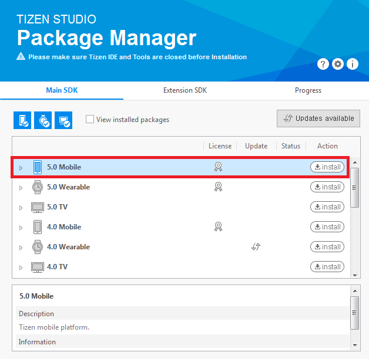
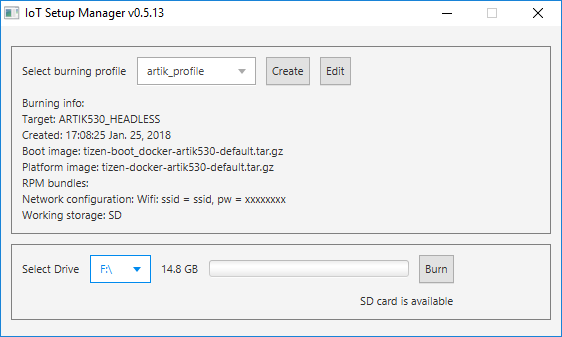
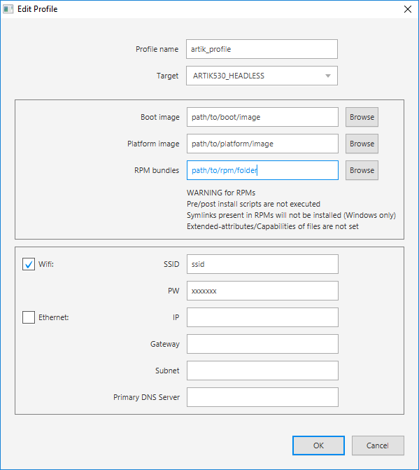
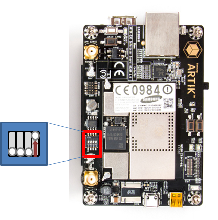
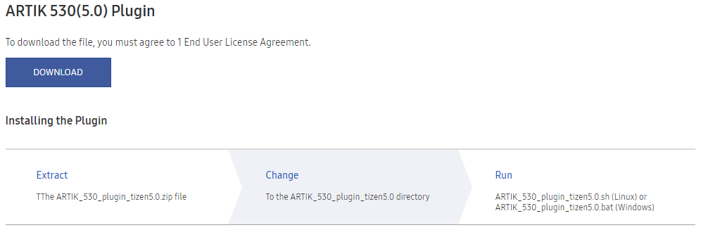

# Contents

[Installing Tizen Studio](#Installing-Tizen-Studio)

[Flashing Tizen Images with IoT Setup Manager](#Flashing-Tizen-Images-with-IoT-Setup-Manager)

[Setting up ARTIK 530](#Setting-up-ARTIK-530)

[Tips](#Tips)

# Installing Tizen Studio

If you have already installed Tizen Studio 3.0 and installed the **5.0 Mobile** profile for the **Main SDK** and the **IoT Setup Manager**, **IOT-Headed-5.0** and **IOT-Headless-5.0** profiles for the **Extension SDK**, you can skip this section.

Otherwise, to install Tizen Studio and the required profiles for IoT development:

1.  Download and install the correct version of Tizen Studio 3.0 (or later) for your operating system from [Tizen developer site](https://developer.tizen.org/development/tizen-studio/download).
2.  Open the **Tizen Studio Package Manager**, select the **Main SDK** tab, and install the **5.0 Mobile** profile:

    

3.  Select the **Extension SDK** tab and install **Extras**. **Extras** includes **IoT Setup Manager**, **IOT-Headed-5.0** and **IOT-Headless-5.0** profiles:

    

    > **Note**
    >
    > **Extension SDK** should be updated to the latest version.

# Flashing Tizen Images with IoT Setup Manager

IoT Setup Manager helps you to easily install Tizen on your IoT device using your computer. It helps to get your device running and connected to the local network. After your device is connected to the local network, you can start developing and testing the Tizen IoT applications.

## Prerequisites

You must have the binary images in your computer. You can download the binary images from:

-   Boot image:
       -    ARTIK 530: [tizen-unified_20181024.1_iot-boot-armv7l-artik530.tar.gz](http://download.tizen.org/releases/milestone/tizen/unified/tizen-unified_20181024.1/images/standard/iot-boot-armv7l-artik530/tizen-unified_20181024.1_iot-boot-armv7l-artik530.tar.gz)

       -   ARTIK 530s: None
-   Platform image:
       -   Headless (without display): [tizen-unified_20181024.1_iot-headless-2parts-armv7l-artik530_710.tar.gz](http://download.tizen.org/releases/milestone/tizen/unified/tizen-unified_20181024.1/images/standard/iot-headless-2parts-armv7l-artik530_710/tizen-unified_20181024.1_iot-headless-2parts-armv7l-artik530_710.tar.gz)
       -   Headed (with display): [tizen-unified_20181024.1_iot-headed-3parts-armv7l-artik530_710.tar.gz](http://download.tizen.org/releases/milestone/tizen/unified/tizen-unified_20181024.1/images/standard/iot-headed-3parts-armv7l-artik530_710/tizen-unified_20181024.1_iot-headed-3parts-armv7l-artik530_710.tar.gz)

To make a device with a display, select **Headed** image, which consists of the UI framework. To make a device without a display, select **Headless** image. 

The flashing steps mentioned in this section are only for ARTIK 530.


## Launch IoT Setup Manager

You can launch the IOT Setup Manager with or without using Tizen Studio:

### Launch using Tizen Studio

From Tizen Studio, you can launch the IoT Setup Manager in the following two ways:

-   On the menu bar, go to **IoT > IoT Setup Manager**.
-   On the toolbar, click the IoT Setup Manager icon as shown in the following image:

    

### Launch without using Tizen Studio

During installation, the Package Manager creates shortcuts for IoT Setup Manager, which are used to launch the IoT Setup Manager as a standalone application. To launch the IoT Setup Manager for:

-   Windows, go to **Start Menu > Programs > Tizen Studio > Tools > IoT Setup Manager**.
-   Ubuntu, go to **Dash (equivalent to Start Menu) > Applications > IoT Setup Manager**.





## Flashing an SD Card using IoT Setup Manager

To flash Tizen on your SD card using the IoT Setup Manager:

1.  Create a profile:
    1.  Click **Create** to create a profile. The **Edit Profile** window appears.

        

    2.  Provide the required information such as target, local paths to boot and platform image, and so on.

        -   Profile name: Enter a profile name, for example, ARTIK530_Headless or ARTIK530_Headed
        -   Target: ARTIK530_HEADLESS for headless image or ARTIK530_HEADED for headed image
        -   Boot image or platform image: The local paths to boot and platform images, which you download from [Prerequisites](#prerequisites).
        -   ROM bundles: 
            - Download [tizen-5.0-bundles.zip](embedded-files/tizen_5.0_bundles.zip) and unzip the file.
            - Add the bundle directory just unzipped, i.e. tizen-5.0-bundles/, to the Bundles panel.
        -   WiFi: Clear
        -   Ethernet: Clear

    3.  Click **OK** to save.

2.  Select the SD card on which you want to burn Tizen:
    1.  Insert your SD Card into your computer.
    2.  Select the appropriate SD Card from the drop-down list (for example, `/dev/sdx` on Ubuntu and `F:` on Windows).

        > **Note**
        >
        > Currently, the USB SD card reader is only supported. The internal PC SD slot is not supported.
        > Also, if the **Select Drive** does not show anything, detach and insert the SD card again into the computer.


3.  Burn Tizen on your SD Card:
    -   Click **Burn** to burn Tizen to your SD Card. This takes about two minutes to complete.


# Setting up ARTIK 530

To configure the ARTIK 530 hardware board:

1.  Insert the micro SD card into the card slot (marked with a blue arrow) and connect the 5V DC power supply to the board (the red arrow). The following figure shows the bottom view of the board:

    

2.  Set the DIP switch on the board as shown in the following figure (top view of the board):

     

3.  Connect a USB serial cable (marked with a yellow box) and a separate USB OTG cable (the red box) to your Linux computer. The following figure shows the bottom view of the board on the left and top view on the right:

    

4.  Boot the board by sliding the power switch (marked with a red box) to ON position and press the power push-button (the yellow box). The following figure shows the top view of the board:

    

5.  Launch two shell prompts on your Linux computer. One for serial communication (serial shell) and the other for installing the drivers. For serial communication to the board, run a serial communication application, such as Minicom or PuTTY.

    <a name="putty_config"></a>
    To run Minicom and PuTTY:
    -   Minicom example:

        Minicom can be used in Linux computer. Run the following command to run Minicom:

        ```
        $ sudo minicom -c on
        ```

        To configure Minicom:

        1.  Go to the Minicom configuration settings menu by consecutively pressing `Ctrl + A`, `Z`, and `O` (the letter O).
        2.  In the `Serial Device` field, set the correct USB port for serial communication. The format is `/dev/ttyUSBX` where `X` equals the number of the port.
        3.  Modify the `Hardware Flow Control` field to `No`.

        ```
        +-----------------------------------------------------------------------+
        | A -    Serial Device      : /dev/ttyUSBX                              |
        | B - Lockfile Location     : /var/lock                                 |
        | C -   Callin Program      :                                           |
        | D -  Callout Program      :                                           |
        | E -    Bps/Par/Bits       : 115200 8N1                                |
        | F - Hardware Flow Control : No                                        |
        | G - Software Flow Control : No                                        |
        ```

        In the serial shell, log in with `root/tizen`:

        ```
        localhost login: root
        Password: tizen
        Welcome to Tizen
        ```

    -   PuTTY example:

        Download PuTTY from the Internet and launch PuTTY.

        

        To configure PuTTY:

        1.  Select `Serial` connection type.
        2.  Enter the serial line number for the board connected to your computer (it can be COM`N` where `N` is a natural number such as COM1, COM4, and so on) in the `Serial line` field.
        3.  Type 115200 in the `Speed` field.
        4.  Click `Open`.

        In the serial shell, log in with `root/tizen`:

        ```
        localhost login: root
        Password: tizen
        Welcome to Tizen
        ```

6.  Open the Smart Development Bridge (SDB) connection:
    1.  Verify whether SDB is connected, in the Linux shell of the host computer:

        ```
        ~$ sdb root on
        Switched to 'root' account mode
        ~$
        ```

    2.  Enter the `sdb help` command in the Linux shell of the host computer, for more information.
        > **Note**
        >
        > `sdb` execution file is available in the `tools` sub-directory of the directory where Tizen Studio is installed.


## Installing Drivers

1.  Connect Smart Development Bridge (SDB) as described in the previous section.
2.  Install the connectivity drivers:
    1.  Download the plugin zip file from the **ARTIK530(5.0) Plugin** section at <http://developer.samsung.com/tizendevice/firmware> and follow the instructions.

        

    2.  For the case of the Linux shell (Linux), run the `sh` script given in the instructions. For example:

        ```
        $ ./ARTIK_530_plugin_tizen5.0.sh
        ```

    3.  For the case of the Command window (Windows), run the `bat` script given in the instructions. For example:

        ```
        > ARTIK_530_plugin_tizen5.0.bat
        ```

# Tips

## IoT Setup Manager Details

### IoT Setup Manager Features

-   **Saved Profiles:** You can save and retrieve the configuration profiles for easy flashing.
-   **Three Steps Flashing:**
    1.  Select the profile.
    2.  Select your SD Card.
    3.  Click **Burn**.
-   **Automatic Network Connection:** You can enter the Wi-Fi (SSID and password) or the Ethernet (static information) details to allow the device to automatically connect to the local network upon startup.

### Prerequisites

#### Operating System

IoT Setup Manager supports the following operating systems:

-   Windows 7 and later (64 and 32 bit)
-   Ubuntu 14.04 LTS and later (64 and 32 bit)

#### Environment

IoT Setup Manager requires Java Runtime Environment (JRE) version 1.8 or later to be installed on your computer.

> **Note**
>
> You must only have the Oracle JRE installed on your computer.


Verify whether JRE is installed on your computer. To do so, open the shell terminal in Ubuntu or the command-line prompt in Windows and run the following commands:

```
$ java -version
java version "1.8.0_112"
Java(TM) SE Runtime Environment (build 1.8.0_112-b15)
Java HotSpot(TM) 64-Bit Server VM (build 25.112-b15, mixed mode)
```

If JRE is installed, the output is similar for both Ubuntu and Windows. If `Java(TM) SE Runtime Environment` does not appear in the output or if an error occurs, then this implies, JRE is not installed on your computer.

#### Ubuntu Tools

If you are using Ubuntu, the following packages must be installed in addition to the IoT Setup Manager:

-   rpm2cpio
-   cpio

If the packages are not installed, run the following command to install a package:

```
sudo apt-get install package-name
```

### Installing IoT Setup Manager

Ensure that you have installed [Tizen Studio](#Installing-Tizen-Studio).

To install the IoT Setup Manager using the Package Manager available in Tizen Studio:

1.  Open Tizen Studio and go to **Tools > Package Manager**.
2.  Click **Extension SDK** and verify whether the IoT Setup Manager appears in the list of available packages.
3.  Click **install** for **IoT Setup Manager** to install the IoT Setup Manager Extension.
4.  Start Tizen Studio. If Tizen Studio is already running, close and restart it.


### IoT Setup Manager fields


The IoT Setup Manager view contains the following fields:

-   **Select burning profile**

    You can select one of the available profiles from the **Select burning profile** drop-down list, to avoid creating or modifying profiles every time. Additionally, you can copy the flashing profile to the Manager directory. This enables the application to recognize the profile on the next start.

-   **Create**

    To create a new flashing profile.

-   **Edit**

    To modify the existing profile.

-   **Select Drive**

    Insert an SD card and wait until it appears in the drop-down list.

-   **Burn**

    Click **Burn** and wait until the flashing routine is finished. This may take few minutes and you may have to enter your supervisor password, which is required to access the SD card.

If you want to modify the exist profile, select **Edit**.


The IoT Setup Manager edit view contains the following fields:

-   **Profile name**

    Specify a profile name, for example, ARTIK530-headless.

-   **Target**

    Select the board and image type from the drop-down list.

    -   RPI3_HEADLESS: SD-card-bootable headless image for Raspberry Pi 3 board
    -   ARTIK530_HEADLESS: SD-card-bootable headless image for ARTIK 530 board
    -   ARTIK530_HEADED: SD-card-bootable headed image for ARTIK 530 board
    -   ARTIK530_HEADLESS_INSTALLABLE: eMMC-bootable headless binary for ARTIK 530 board. When you start the board with SD card, the image is installed into eMMC.
    -   ARTIK530_HEADED_INSTALLABLE: eMMC-bootable headled binary for ARTIK 530 board. When you start the board with SD card, the image is installed into eMMC.
-   **Boot image**

    Browse for the Tizen Boot image available on your hard drive. You must select proper images depending on the board. 

-   **Platform image**

    Browse for the Tizen Platform image available on your hard drive. You must select proper images depending on the board. 

-   **RPM bundles** (optional)

    Browse for the folder that contains the Tizen RPMs on your hard drive. You do not have to enter the details in this field.

-   **Network configuration** (optional)

    Enter the Wi-Fi (SSID and password) or the Ethernet (static) details to allow the device to automatically connect to the local network after startup. If you do not want to set up the network, you can clear the **Wifi** and the **Ethernet** check box.

### Tips and Guidelines

-   Profiles are an easy way to store image paths and network configuration information. After you save a profile, you can use it to flash your SD Card instead of specifying all information again.
-   While creating or editing a profile, ensure that the boot images, platform images, and the rpms (if selected) match the target device.
-   Ensure that there are no white spaces in the boot image, platform image, and the rpm folder paths.
-   Place RPMs in a separate directory, which does not contain any other files or directories and select the directory path for creating the profile.
-   ARTIK530_HEADLESS_INSTALLABLE and ARTIK530_HEADED_INSTALLABLE profiles are used for writing images from SD Card to eMMC.


## Setting up Wi-Fi

This section is not applicable if you want to connect your device to the SmartThings Cloud. In case of SmartThings devices, the device enables SoftAP mode during setup, therefore, you need not switch to Wi-Fi separately.

You can set up a Wi-Fi connection by running `wifi_manager_test` and entering the options `1 > 3 > 9 > b > c`. If you set up the connection once, it reconnects automatically the next time you power cycle the device.

```
# wifi_manager_test
Test Thread created...<Enter>
Event received from stdin
Network Connection API Test App
Options..
1   - Wi-Fi init and set callbacks
2   - Wi-Fi deinit(unset callbacks automatically)
3   - Activate Wi-Fi device
4   - Deactivate Wi-Fi device
5   - Is Wi-Fi activated?
6   - Get connection state
7   - Get MAC address
8   - Get Wi-Fi interface name
9   - Scan request
a   - Get Connected AP
b   - Get AP list
c   - Connect
d   - Disconnect
e   - Connect by wps pbc
f   - Forget an AP
g   - Set & connect EAP
h   - Set IP method type
i   - Set Proxy method type
j   - Get Ap info
k   - Connect Specific AP
l   - Load configuration
m   - Save configuration
n   - Remove configuration
o   - TDLS Discover
p   - TDLS Connect
q   - TDLS Connected peer
r   - TDLS Disconnect
s   - Connect Hidden AP
t   - Connect WPS PBC without SSID
u   - Connect WPS PIN without SSID
v   - Cancel WPS Request
w   - Set Auto Scan Enable-Disable
x   - Set Auto Scan Mode
y   - Get wifi scanning state
z   - Get Auto Scan Enable-Disable
A   - Get Auto Scan Mode
B   - Enable TDLS Channel Switch Request
C   - Disable TDLS Channel Switch Request
D   - Get Wi-Fi Module State
E   - BSSID Scan
F   - Add VSIE
G   - Get VSIE
H   - Remove VSIE
I   - Start Multi Scan
J   - Flush BSS
K   - Set auto connect mode
L   - Get auto connect mode
0   - Exit
ENTER  - Show options menu.......
Operation succeeded!
1
Event received from stdin
Wifi init succeeded
Operation succeeded!
3
Event received from stdin
Wi-Fi Activation Succeeded
Operation succeeded!
9
Event received from stdin
Interface name : wlan0
Operation succeeded!
b
Event received from stdin
AP name : crash_messaging, state : Disconnected
AP name : dnet1, state : Disconnected
... < list of APs > ...
Get AP list finished
Operation succeeded!
Background Scan Completed, error code : NONE
c
Event received from stdin
Input a part of AP name to connect : <AP name>
Passphrase required : TRUE
Input passphrase for dnet1 : <Password>
```

