# Developing Applications with Things SDK API

To create a new application project using Things SDK API:

1.  In the Tizen Studio, select **File > New > Tizen Project**.
2.  Select **Template**, and click **Next**.

    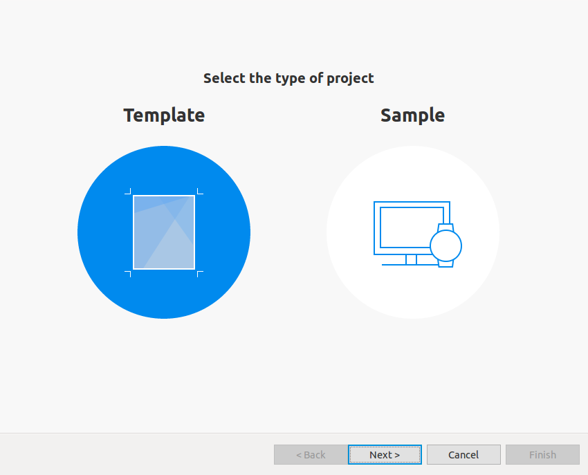

3.  Select **Custom > Iot-headless v4.0**, and click **Next**.

    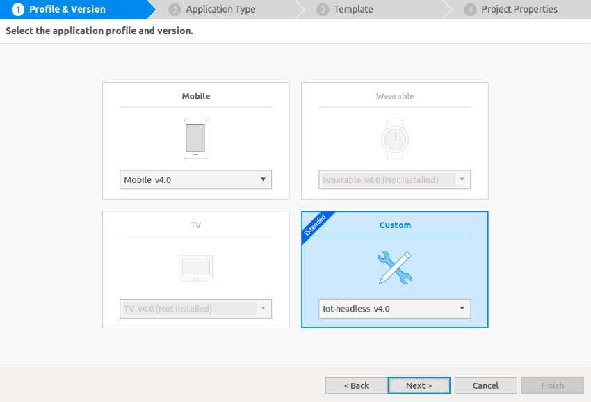

4.  Select **Native Application**, and click **Next**.

    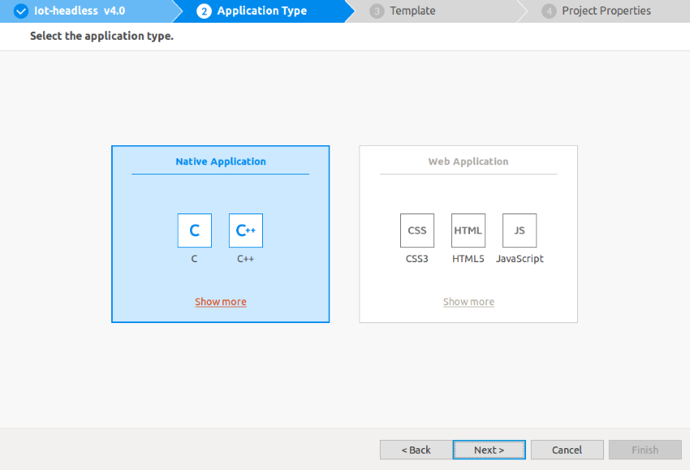

5.  Select **Headless things app**, and click **Next**.

    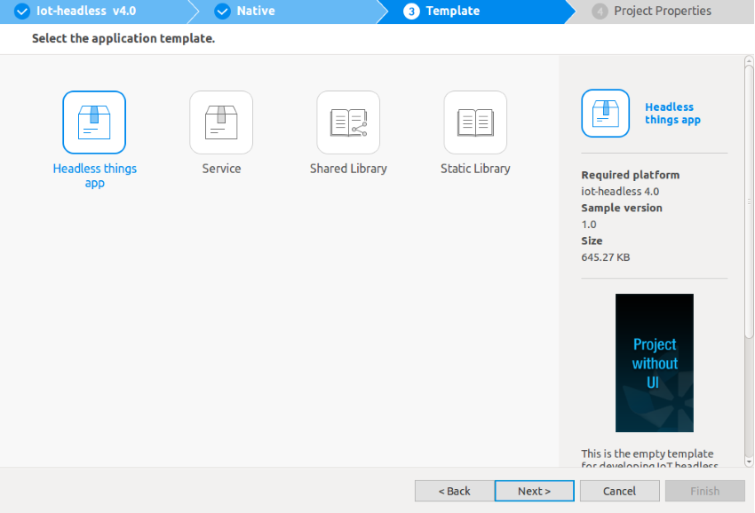

6.  Define the project properties, and click **Next**.

    You can enter the project name (3-50 characters) and the unique package ID. You can also select the location and working sets by clicking **More properties**.

    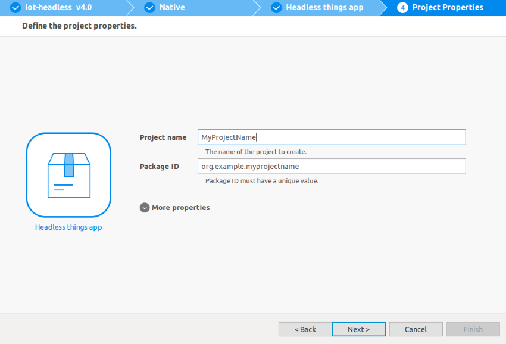

7.  In the **Device/Platform** list:
    1.  Select **\[network audio\]**.
    2.  Uncheck the resources except **x.com.st.powerswitch** and **x.com.st.audiovolume**.
    3.  Enter **Vendor ID** and **Manufacturer Name**. For **VID** and **MNID** values, see [Developer Workspace](https://devworkspace.developer.samsung.com) site and also [Setting up the SmartThings Cloud](things-cloud-setup.md).
    4.  Click **Finish**.

        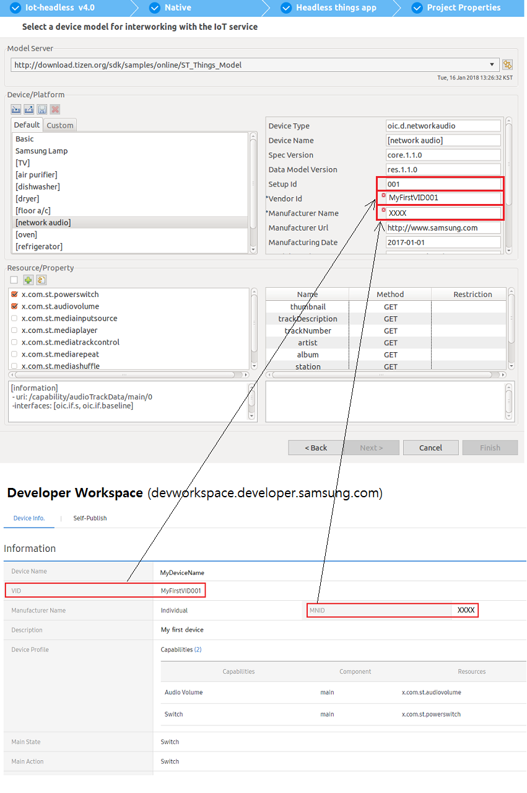

8.  Edit the source code. The code is composed of a device definition JSON file (in the `res/` directory) and code implementation C files.

    For more information, see [Things SDK API](../guides/things-api.md). For more information on the JSON file, see [Device Definition](../guides/things-api-device.md), and for C APIs and callbacks, see [API Usage](../guides/things-api-guide.md).

    > **Note**
    >
    > The Network Audio sample application can be built without any modification. To run it, connect the audio jack of the board to a speaker.

    Instead of using an existing sample as a basis for your application, you can use the **IoT** template that makes use of the Things SDK API:

    1.  In the Tizen Studio, select **File > New > Tizen Project**.
    2.  Select **Template**, click **Next**, select **Custom > Iot-headless v4.0**, and click **Next**.
    3.  Select **Native Application**, click **Next**, select the **IoT** template, and click **Finish**.

9.  You need a certificate to make the device work correctly. You only have to create the certificate once, when you first install the Tizen Studio.
    1.  In the Tizen Studio menu, open the Certificate Manager by going to **Tools > Certificate Manager**.

        

    2.  In **Migration for Certificate Profile** window, click **Cancel**.

        

    3.  Select the **App Signing** tab.

        

    4.  To create a new certificate, click **+**.

        

        > **Note**
        >
        > If Samsung Extension SDK is installed, you are prompted "Select the type of profile" with two choices: "Tizen" and "Samsung".To develop Tizen IoT, select "Tizen".

        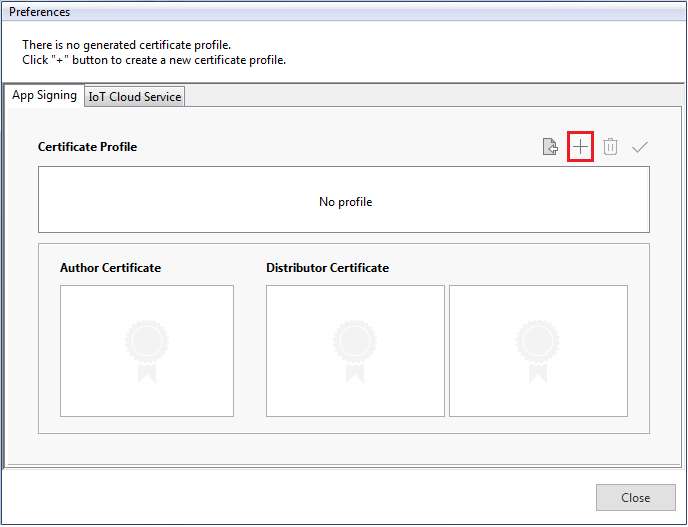

    5.  Enter the Certificate profile name and click **Next**.

        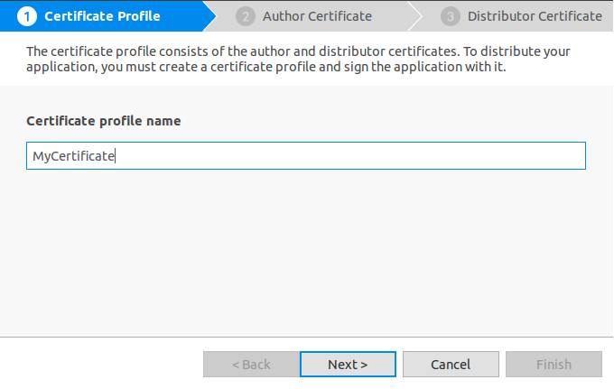

    6.  In the **Author Certificate** tab, select **Create a new author certificate**, and click **Next**.

        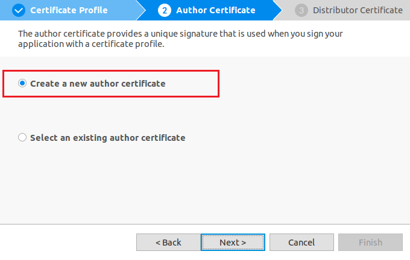

    7.  Enter the details in the **Key filename**, **Author Name**, and **Password** fields, and click **Next**.

        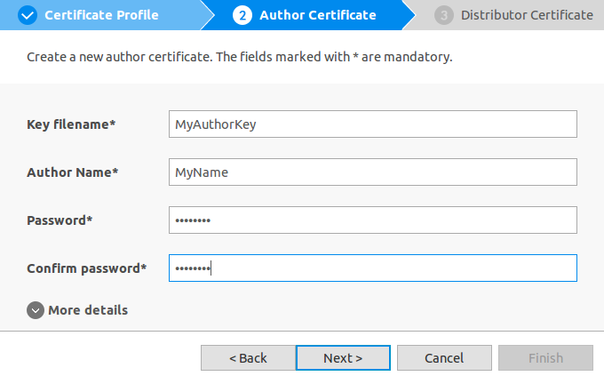

    8.  In the **Distributor Certificate** tab, select **Use the default Tizen distributor certificate** and select **Platform** in the **Privilege level** drop-down menu.

        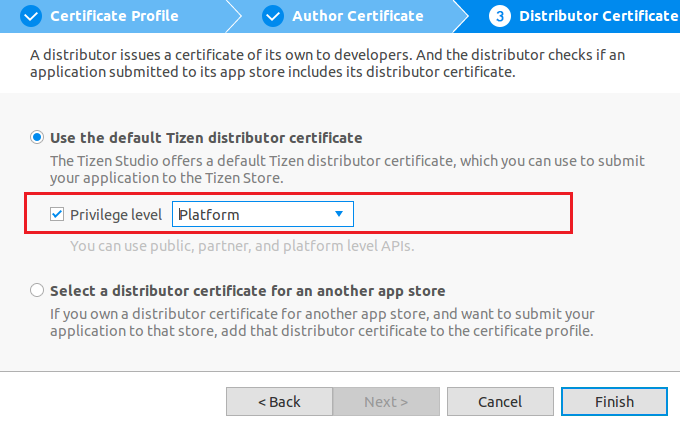

        > **Note**
        >
        > The default privilege level is **Public**, but you can change it to **Platform** for development purposes.

    9.  Review certificates information created in the **Certificate Manager** window.

        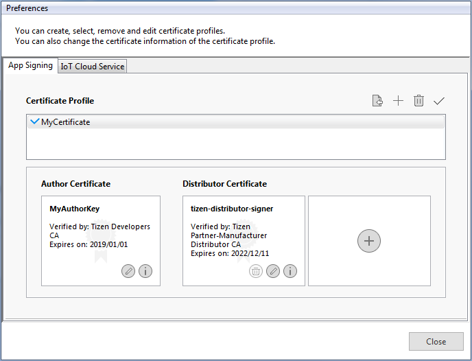

10. To connect to the SmartThings Cloud, you need an MNID (manufacturer ID), a VID (vendor ID), a private key, and a cloud certificate, and you must update the content of the `res/` directory of the application with the new information.

    (For more information, see [Setting up the SmartThings Cloud](things-cloud-setup.md)).

    > **Note**
    >
    > -   **MNID:** A unique ID assigned to each developer. When you log in the SmartThings Server, a unique MNID is generated for you.
    > -   **VID:** A device ID assigned to a developer. You need to assign a unique, alphanumerical ID for each device you develop.
    > -   **Private key and cloud certificate:** The key and certificate to certify that you are allowed to access the SmartThings Cloud.

    1.  In the `platform` section of the `res/device_def.json` file, check if the MNID is the same as the `manufacturerName` field and the VID is the same as the `vendorId` field.

        

    2.  Generate the IoT certificate following the [Generating cloud certificates](things-cloud-setup.md#generating-cloud-certificates).

11. Connect the ARTIK 530 or Raspberry Pi 3 board to a Linux computer with a USB cable and make SDB connection.

    For more information, see [Hardware Configuration](hardware-configuration.md).

12. Confirm that "artik" or "rpi3" is shown in the Tizen Studio toolbar.(This will be shown when SDB is connected.)

    

    

13. In the Tizen Studio **Project Explorer** view, right-click the project and select **Run As > Tizen Native Project**.

    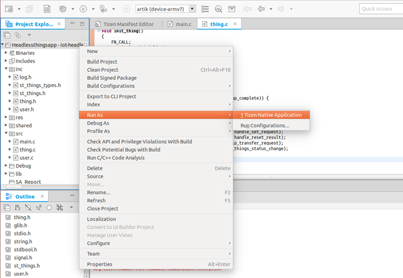
