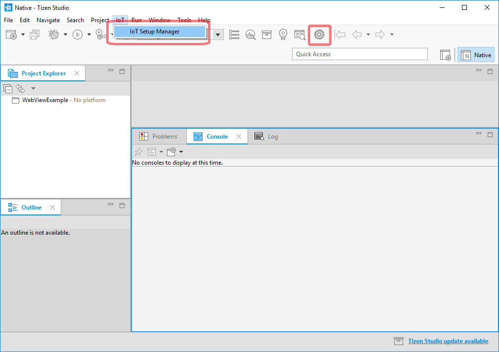
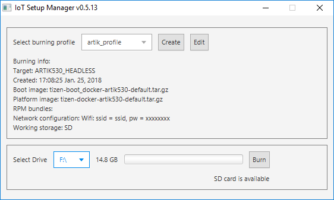
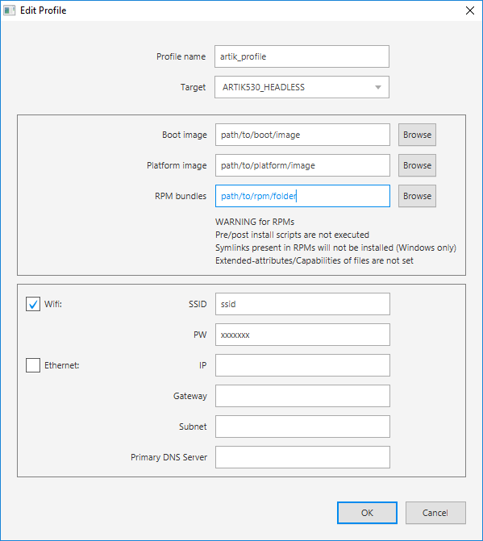
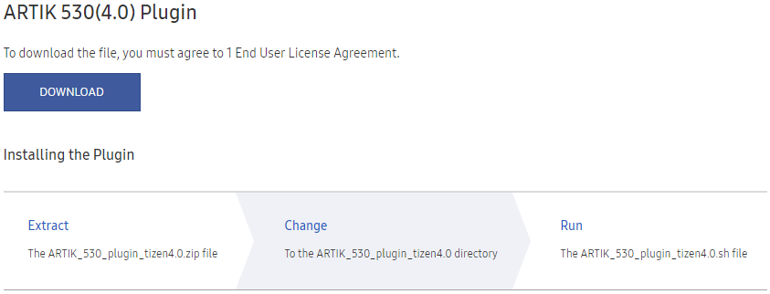
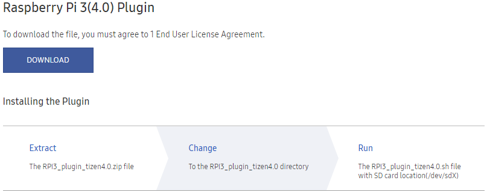

# Flashing Tizen Images

## Prerequisite and Overview

You must have the binary images in your computer. You can download the binary images from:

-   ARTIK 530 or ARTIK 530s
    -   Boot image:
        -   ARTIK 530: [tizen-4.0-unified_20180118.1_iot-boot-armv7l-artik530.tar.gz](http://download.tizen.org/releases/milestone/tizen/4.0-unified/tizen-4.0-unified_20180118.1/images/standard/iot-boot-armv7l-artik530/tizen-4.0-unified_20180118.1_iot-boot-armv7l-artik530.tar.gz)

        -   ARTIK 530s: None
    -   Platform image:
        -   Headleass (without display): [tizen-4.0-unified_20180118.1_iot-headless-2parts-armv7l-artik530_710.tar.gz](http://download.tizen.org/releases/milestone/tizen/4.0-unified/tizen-4.0-unified_20180118.1/images/standard/iot-headless-2parts-armv7l-artik530_710/tizen-4.0-unified_20180118.1_iot-headless-2parts-armv7l-artik530_710.tar.gz)
        -   Headed (with display): [iot-headed-3parts-armv7l-artik530_710/tizen-4.0-unified_20180118.1_iot-headed-3parts-armv7l-artik530_710.tar.gz](http://download.tizen.org/releases/milestone/tizen/4.0-unified/tizen-4.0-unified_20180118.1/images/standard/iot-headed-3parts-armv7l-artik530_710/tizen-4.0-unified_20180118.1_iot-headed-3parts-armv7l-artik530_710.tar.gz)
        -   Customized image: Create and download the customized image as explained in the [Customized Platform Guide](../customized-platform/overview.md).
-   Raspberry Pi 3:
    -   Boot image: [tizen-4.0-unified_20180118.1_iot-boot-arm64-rpi3.tar.gz](http://download.tizen.org/releases/milestone/tizen/4.0-unified/tizen-4.0-unified_20180118.1/images/standard/iot-boot-arm64-rpi3/tizen-4.0-unified_20180118.1_iot-boot-arm64-rpi3.tar.gz)
    -   Platform image:
        -   Headleass (without display): [tizen-4.0-unified_20180118.1_iot-headless-2parts-armv7l-rpi3.tar.gz](http://download.tizen.org/releases/milestone/tizen/4.0-unified/tizen-4.0-unified_20180118.1/images/standard/iot-headless-2parts-armv7l-rpi3/tizen-4.0-unified_20180118.1_iot-headless-2parts-armv7l-rpi3.tar.gz)
        -   Headed (with display): Not available
        -   Customized image: Create and download the customized image as explained in the [Customized Platform Guide](../customized-platform/overview.md).

> **Note**
>
> To make a device with a display, select **Headed** image, which consists of the UI framework. To make a device without a display, select **Headless** image. Currently, the ARTIK boards support Headed.


You can flash the Tizen images on your board in two ways:

-   [Using the IoT Setup Manager](#flashing-with-iot-setup-manager) (ARTIK 530 or Raspberry Pi 3, for Linux and Windows computer)
-   [Using the command-line tool](#flashing-through-command-line) (ARTIK 530, ARTIK 530s, or Raspberry Pi 3, for Linux computer only)


After you flash and set up the binary images on your board, you can optionally [set up Wi-Fi](#setting-up-wi-fi).

> **Note**
>
> `ARTIK 530s`: IoT Setup Manager does not support the ARTIK 530s board. You must use the command-line to flash the binaries to the ARTIK 530s board. For more information, see [Flashing through Command Line](#flashing-through-command-line).

## Flashing with IoT Setup Manager

IoT Setup Manager helps you to easily install Tizen on your IoT device using your computer. It helps to get your device running and connected to the local network. After your device is connected to the local network, you can start developing and testing the Tizen IoT applications.

### IoT Setup Manager Features

-   **Saved Profiles:** You can save and retrieve the configuration profiles for easy flashing.
-   **Three Steps Flashing:**
    1.  Select the profile.
    2.  Select your SD Card.
    3.  Click **Burn**.
-   **Automatic Network Connection:** You can enter the Wi-Fi (SSID and password) or the Ethernet (static information) details to allow the device to automatically connect to the local network upon startup.

### Prerequisites

#### Operating System

IoT Setup Manager supports the following operating systems:

-   Windows 7 and later (64 and 32 bit)
-   Ubuntu 14.04 LTS and later (64 and 32 bit)

#### Environment

IoT Setup Manager requires Java Runtime Environment (JRE) version 1.8 or later to be installed on your computer.

> **Note**
>
> You must only have the Oracle JRE installed on your computer.


Verify whether JRE is installed on your computer. To do so, open the shell terminal in Ubuntu or the command-line prompt in Windows and run the following commands:

```
$ java -version
java version "1.8.0_112"
Java(TM) SE Runtime Environment (build 1.8.0_112-b15)
Java HotSpot(TM) 64-Bit Server VM (build 25.112-b15, mixed mode)
```

If JRE is installed, the output is similar for both Ubuntu and Windows. If `Java(TM) SE Runtime Environment` does not appear in the output or if an error occurs, then this implies, JRE is not installed on your computer.

#### Ubuntu Tools

If you are using Ubuntu, the following packages must be installed in addition to the IoT Setup Manager:

-   rpm2cpio
-   cpio

If the packages are not installed, run the following command to install a package:

```
sudo apt-get install package-name
```

### Installing IoT Setup Manager

Ensure that you have installed [Tizen Studio](tizen-studio-install.md).

To install the IoT Setup Manager using the Package Manager available in Tizen Studio:

1.  Open Tizen Studio and go to **Tools > Package Manager**.
2.  Click **Extension SDK** and verify whether the IoT Setup Manager appears in the list of available packages.

    > **Note**
    >
    > You can perform the following to add the IoT Setup Manager manually, if it does not appear in the list of available packages:
    > 1.  Click on the configuration icon available on the top to open the `Configuration` window.
    > 2.  Click `Extension SDK`.
    > 3.  Click `+` to add a new SDK extension. The `Add Repository` window appears.
    > 4.  Type IoT Setup Manager in the `Name` field and <http://download.tizen.org/sdk/extensions/iot-setup-mgr> in the `Repository` field.

3.  Click **install** to install the IoT Setup Manager Extension.
4.  Start Tizen Studio. If the Tizen Studio is already running, close and restart it.

### Launch IoT Setup Manager

You can launch the IOT Setup Manager with or without using Tizen Studio:

#### Launch using Tizen Studio

From Tizen Studio, you can launch the IoT Setup Manager in the following two ways:

-   On the menu bar, go to **IoT > IoT Setup Manager**.
-   On the toolbar, click the IoT Setup Manager icon as shown in the following image:

    

#### Launch without using Tizen Studio

During installation, the Package Manager creates shortcuts for IoT Setup Manager, which are used to launch the IoT Setup Manager as a standalone application. To launch the IoT Setup Manager for:

-   Windows, go to **Start Menu > Programs > Tizen Studio > Tools > IoT Setup Manager**.
-   Ubuntu, go to **Dash (equivalent to Start Menu) > Applications > IoT Setup Manager**.





The IoT Setup Manager view contains the following fields:

-   **Select burning profile**

    You can select one of the available profiles from the **Select burning profile** drop-down list, to avoid creating or modifying profiles every time. Additionally, you can copy the flashing profile to the Manager directory. This enables the application to recognize the profile on the next start.

-   **Create**

    To create a new flashing profile.

-   **Edit**

    To modify the existing profile.

-   **Select Drive**

    Insert an SD card and wait until it appears in the drop-down list.

-   **Burn**

    Click **Burn** and wait until the flashing routine is finished. This may take few minutes and you may have to enter your supervisor password, which is required to access the SD card.

If you want to modify the exist profile, select **Edit**.



The IoT Setup Manager edit view contains the following fields:

-   **Profile name**

    Specify a profile name, for example, ARTIK530-headless.

-   **Target**

    Select the board and image type from the drop-down list.

    -   RPI3\_HEADLESS: SD-card-bootable headless image for Raspberry Pi 3 board
    -   ARTIK530\_HEADLESS: SD-card-bootable headless image for ARTIK 530 board
    -   ARTIK530\_HEADED: SD-card-bootable headed image for ARTIK 530 board
    -   ARTIK530\_HEADLESS\_INSTALLABLE: eMMC-bootable headless binary for ARTIK 530 board. When you start the board with SD card, the image is installed into eMMC.
    -   ARTIK530\_HEADED\_INSTALLABLE: eMMC-bootable headled binary for ARTIK 530 board. When you start the board with SD card, the image is installed into eMMC.
-   **Boot image**

    Browse for the Tizen Boot image available on your hard drive. You must select proper images depending on the board. For more information, see [Prerequisite and Overview](#prerequisite-and-overview).

-   **Platform image**

    Browse for the Tizen Platform image available on your hard drive. You must select proper images depending on the board. For more information, see [Prerequisite and Overview](#prerequisite-and-overview).

-   **RPM bundles** (optional)

    Browse for the folder that contains the Tizen RPMs on your hard drive. You do not have to enter the details in this field.

-   **Network configuration** (optional)

    Enter the Wi-Fi (SSID and password) or the Ethernet (static) details to allow the device to automatically connect to the local network after startup. If you do not want to set up the network, you can clear the **Wifi** and the **Ethernet** check box.

### Flashing an SD Card using IoT Setup Manager

To flash Tizen on your SD card using the IoT Setup Manager:

1.  Create a profile:
    1.  Click **Create** to create a profile. The **Edit Profile** window appears.
    2.  Provide the required information such as target, local paths to boot and platform image, and so on.
        -   Raspberry Pi 3 example:
            -   Profile name: Enter a profile name, for example, RPI3\_Headless
            -   Target: RPI3\_HEADLESS
            -   Boot image or platform image: The local paths of the boot and platform images, which you download from [Prerequisite and Overview](#prerequisite-and-overview).
            -   ROM bundles: Left as blank
            -   WiFi: Clear
            -   Ethernet:
                -   IP: 192.168.1.11
                -   Gateway: 192.168.1.2
                -   Subnet: 255.255.255.0
                -   Primary DNS Server: 127.0.0.1

                > **Note**
	            >
                > For Raspberry Pi 3, the Ethernet must be set as shown above in the Rasberry Pi 3 example. While the Rasberry Pi is booting, it must be connected to the host computer through an Eternet cable as described in [Hardware Configuration](hardware-configuration.md#artik). If the Ethernet is no set as mentioned the the above Rasberry Pi 3 example, the IP is not applied.

        -   ARTIK 530 example:
            -   Profile name: Enter a profile name, for example, ARTIK530\_Headless or ARTIK530\_Headed
            -   Target: ARTIK530\_HEADLESS for headless image or ARTIK530\_HEADED for headed image
            -   Boot image or platform image: The local paths to boot and platform images, which you download from [Prerequisite and Overview](#prerequisite-and-overview).
            -   ROM bundles: Left as blank
            -   WiFi: Clear
            -   Ethernet: Clear

    3.  Click **OK** to save.

2.  Select the SD card on which you want to burn Tizen:
    1.  Insert your SD Card into your computer.
    2.  Select the appropriate SD Card from the drop-down list (for example, `/dev/sdx` on Ubuntu and `F:` on Windows).

        > **Note**
        >
        > Currently, the USB SD card reader is only supported. The internal PC SD slot is not supported.
        > Also, if the **Select Drive** does not show anything, detach and insert the SD card again into the computer.


3.  Burn Tizen on your SD Card:
    -   Click **Burn** to burn Tizen to your SD Card. This takes about two minutes to complete.

You can now use the SD Card to boot your IoT device. For more information, see [Hardware Configuration](hardware-configuration.md)

### Driver Installation

After flashing your SD card, you need to install connectivity drivers. For more information, see [Installing Drivers](#installing-drivers).

### Tips and Guidelines

-   Profiles are an easy way to store image paths and network configuration information. After you save a profile, you can use it to flash your SD Card instead of specifying all information again.
-   While creating or editing a profile, ensure that the boot images, platform images, and the rpms (if selected) match the target device.
-   Ensure that there are no white spaces in the boot image, platform image, and the rpm folder paths.
-   Place RPMs in a separate directory, which does not contain any other files or directories and select the directory path for creating the profile.
-   ARTIK530\_HEADLESS\_INSTALLABLE and ARTIK530\_HEADED\_INSTALLABLE profiles are used for writing images from SD Card to eMMC. For more information on setting up the board, see [Setting up the Board and Driver](#installing-drivers).

## Flashing through Command Line

You can also flash the SD card through command-line in Linux computer.

### ARTIK 530 or ARTIK 530s

> **Note**
>
>  Most of the flashing steps mentioned in this section for ARTIK 530 and ARTIK 530s are the same. Only step 4 is different.

To flash eMMC (without SD card) for ARTIK 530 or ARTIK 530s:

1.  Complete the following prerequisites:
    -   Ensure that you have Ubuntu 14.04 or above installed on your host computer.
    -   Install `fastboot` and `lthor`. For more information, see <https://wiki.tizen.org/Booting_Tizen_From_eMMC_On_ARTIK530>.
    -   Verify whether the binary image files are in your computer. For more information, see [Prerequisite and Overview](#prerequisite-and-overview).

2.  Set up the board connections. For more information, see [Hardware Configuration](hardware-configuration.md#artik).
3.  Turn off and turn on the board. After the board is reset, the serial shell shows a number counting down next to the **Hit any key to stop autoboot** line. Before the count reaches 0, press **Enter** in the serial shell to stop the boot process and enter the bootloader mode.

    ```
    Board: ARTIK530 Raptor
    DRAM:  512 MiB
    HW Revision:    4
    MMC:   NEXELL DWMMC: 0, NEXELL DWMMC: 1
    In:    serial
    Out:   serial
    Err:   serial
    LCD#1:0x4, LCD#2:0x4, CAM#1:0x4, CAM#2:0x4
    ADD-ON-BOARD : 0xFFFF
    Net:
    Warning: ethernet@c0060000 (eth0) using random MAC address - xx:xx:xx:xx:xx
    eth0: ethernet@c0060000
    Hit any key to stop autoboot:  0 <Enter key>
    artik530#
    ```

4.  Flash the boot image:
    -   **ARTIK 530**
        1.  Download the `tar.gz` file from [flash_boot_v2.tar.gz](embedded-files/flash_boot_v2.tar.gz).
        2.  Unzip the `flash_boot_v2.tar.gz` file to get the `flash_boot.sh` file and the `bootimage` directory.

            > **Note**
            >
            > The file extension of the downloaded file is `.tar_.gz`. Modify it to `.tar.gz` before unzipping the file.

        3.  In the serial shell, enter `fastboot 0`:

            ```
            artik530# fastboot 0
            ```

        4.  In the Linux shell, run `flash_boot.sh`:

            ```
            $ ./flash_boot.sh
            ```

        5.  Reboot the board and enter the bootloader mode again.
        6.  In the serial shell, enter `thordown 0 mmc 0`:

            ```
            artik530# thordown 0 mmc 0
            ```

        7.  In the Linux shell, run `lthor` to flash the boot image (which you downloaded in step 1):

            ```
            $ lthor tizen-4.0-unified_YYYYMMDD.V_iot-boot-armv7l-artik530.tar.gz
            ```

    -   **ARTIK 530s**
        1.  Download the `tar.gz` file from [flash_boot_artik530s_v1.tar.gz](embedded-files/flash_boot_artik530s_v1.tar.gz).
        2.  Unzip the `flash_boot_artik530s_v1.tar.gz`

            > **Note**
            >
            > The file extension of the downloaded file is `.tar_.gz`. Modify it to `.tar.gz` before unzipping the file.

            ```
            $ tar xvf flash_boot_artik530s_v1.tar.gz
            ./artik530s/
            ./artik530s/os_3.0.0/
            ./artik530s/os_3.0.0/bl1-emmcboot.img
            ./artik530s/os_3.0.0/partmap_artik530s_tizen_emmc.txt
            ./artik530s/os_3.0.0/bl_mon.img
            ./artik530s/os_3.0.0/boot.img
            ./artik530s/os_3.0.0/bootloader.img
            ./artik530s/os_3.0.0/tizen_params.bin
            ./artik530s/os_3.0.0/README.A530S_os_3.0.0
            ./artik530s/os_3.0.0/loader-emmc.img
            ./artik530s/os_3.0.0/flash_boot_for_tizen.sh
            $
            ```

        3.  Move to `aritk530s/os_3.0.0/` and run `flash_boot_for_tizen.sh`

            ```
            $ cd artik530s/os_3.0.0/
            artik530s/os_3.0.0/$ ./flash_boot_for_tizen.sh
            ```

            > **Note**
            >
            >  For more information, see README.A530S\_os\_3.0.0.

5.  Flash the platform image:
    1.  Reboot the board and enter the bootloader mode again.
    2.  In the serial shell, enter `thordown 0 mmc 0`:

        ```
        artik530# thordown 0 mmc 0
        ```

    3.  In the Linux shell, run `lthor` to flash the platform image (which you downloaded in step 1):

        ```
        $ lthor tizen-4.0-unified_YYYYMMDD.V_iot-headless-2parts-armv7l-artik530_710.tar.gz
        ```

6.  Open the Smart Development Bridge (SDB) connection. For more information, see [Hardware Configuration](hardware-configuration.md).

    > **Note**
    >
    >  Repeat `sdb-mode.sh --on` in the serial shell whenever you power cycle the device, in order to reconnect the SDB tool.


7.  Install connectivity drivers, see [Installing Drivers](#installing-drivers).

For detailed information, see <https://wiki.tizen.org/Booting_Tizen_From_eMMC_On_ARTIK530>.

### Raspberry Pi 3

To flash the SD card for Raspberry Pi 3:

1.  Complete the following prerequisites:
    1.  Install the `pv` package in the Linux computer:

        ```
        $ sudo apt-get install pv
        ```

    2.  Ensure that you have an SD card of 4 GB or more.
    3.  Verify whether the binary image files are in your computer. See [Prerequisite and Overview](#prerequisite-and-overview).
    4.  Fusing-script for Raspberry Pi 3:

        ```
        $ wget https://git.tizen.org/cgit/platform/kernel/u-boot/plain/scripts/tizen/sd_fusing_rpi3.sh?h=tizen --output-document=sd_fusing_rpi3.sh
        $ chmod 755 sd_fusing_rpi3.sh
        ```

2.  Flash the SD card to ensure it is ready to be used for Tizen:
    1.  Insert an SD card to the Linux computer and verify its device node.

        > **Note**
        >
        > To verify the device node:
        >
        > 1.  Run the following command before inserting the SD card into the Linux computer:
        >
        >     ```
        >     $ ls -al /dev/sd*
        >     ```
        >
        >     For example:
        >
        >     ```
        >     $ ls -al /dev/sd*
        >     brw-rw---- 1 root disk 8, 0  9 18 09:08 /dev/sda
        >     brw-rw---- 1 root disk 8, 1  9 18 09:08 /dev/sda1
        >     brw-rw---- 1 root disk 8, 2  9 18 09:08 /dev/sda2
        >     brw-rw---- 1 root disk 8, 5  9 18 09:08 /dev/sda5
        >     ```
        >
        > 2.  Insert the SD card and type the same command again:
        >
        >     ```
        >     $ ls -al /dev/sd*
        >     ```
        >
        >     For example:
        >
        >     ```
        >     $ ls -al /dev/sd*
        >     brw-rw---- 1 root disk 8,  0  9 18 09:08 /dev/sda
        >     brw-rw---- 1 root disk 8,  1  9 18 09:08 /dev/sda1
        >     brw-rw---- 1 root disk 8,  2  9 18 09:08 /dev/sda2
        >     brw-rw---- 1 root disk 8,  5  9 18 09:08 /dev/sda5
        >     brw-rw---- 1 root disk 8, 16  9 22 14:59 /dev/sdb
        >     brw-rw---- 1 root disk 8, 17  9 22 14:59 /dev/sdb1
        >     brw-rw---- 1 root disk 8, 18  9 22 14:59 /dev/sdb2
        >     brw-rw---- 1 root disk 8, 19  9 22 14:59 /dev/sdb3
        >     brw-rw---- 1 root disk 8, 20  9 22 14:59 /dev/sdb4
        >     brw-rw---- 1 root disk 8, 21  9 22 14:59 /dev/sdb5
        >     brw-rw---- 1 root disk 8, 22  9 22 14:59 /dev/sdb6
        >     brw-rw---- 1 root disk 8, 23  9 22 14:59 /dev/sdb7
        >     ```
        >
        >     The new `sdX` node (where X is a letter) is the device node for the SD card.
        >
        >     In this example, the device node for the SD card is `sdb`.

    2.  Download and unzip the [flash-sdcard-rpi3.tar.gz](embedded-files/flash-sdcard-rpi3.tar.gz) script file. Ensure that this script and all other downloaded files are in the same directory.

        > **Note**
        >
        > The file extension of the downloaded file is `.tar_.gz`. Modify it to `.tar.gz` before unzipping the file.

    3.  Run the `flash-sdcard.sh` script with the device node and binary version:

        ```
        $ sudo ./flash-sdcard.sh <SD card device node>
        ```

        For example:

        ```
        $ sudo ./flash-sdcard.sh /dev/sdb
        ```

3.  Open the Smart Development Bridge (SDB) connection. For more information, see [Hardware Configuration](hardware-configuration.md).

    > **Note**
    >
    > Repeat `sdb connect 192.168.1.11` in the Linux shell(Linux) or the command window(Windows) whenever you power cycle the device, in order to reconnect the SDB tool.


4.  Install connectivity drivers, see [Installing Drivers](#installing-drivers).

## Installing Drivers

1.  Set up the ARTIK 530 or Raspberry Pi 3 board and connect Smart Development Bridge (SDB) as described in [Hardware Configuration.](hardware-configuration.md)
2.  Install the connectivity drivers for each board:
    -   **ARTIK 530**
        1.  Download the plugin zip file from the **ARTIK530(4.0) Plugin** section at <http://developer.samsung.com/tizendevice/firmware> and follow the instructions.

            

        2.  For the case of the Linux shell(Linux), run the `sh` script given in the instructions. For example:

            ```
            $ ./ARTIK_530_plugin_tizen4.0.sh
            ```

        3.  For the case of the Command window(Windows), run the `bat` script given in the instructions. For example:

            ```
            > ARTIK_530_plugin_tizen4.0.bat
            ```

    -   **Raspberry Pi 3**
        1.  Download the plugin zip file from the **Raspberry Pi 3(4.0) Plugin** section at <http://developer.samsung.com/tizendevice/firmware> and follow the instructions.

            

        2.  For the case of the Linux shell(Linux), run the `sh` script given in the instructions. For example:

            ```
            $ ./RPI3_plugin_tizen4.0.sh
            ```

        3.  For the case of the Command window(Windows), run the `bat` script given in the instructions. For example:

            ```
            > RPI3_plugin_tizen4.0.bat
            ```

## Setting up Wi-Fi

This section is not applicable if you want to connect your device to the SmartThings Cloud. In case of SmartThings devices, the device enables SoftAP mode during setup, therefore, you need not switch to Wi-Fi separately.

You can set up a Wi-Fi connection by running `wifi_manager_test` and entering the options `1 > 3 > 9 > b > c`. If you set up the connection once, it reconnects automatically the next time you power cycle the device.

```
# wifi_manager_test
Test Thread created...<Enter>
Event received from stdin
Network Connection API Test App
Options..
1   - Wi-Fi init and set callbacks
2   - Wi-Fi deinit(unset callbacks automatically)
3   - Activate Wi-Fi device
4   - Deactivate Wi-Fi device
5   - Is Wi-Fi activated?
6   - Get connection state
7   - Get MAC address
8   - Get Wi-Fi interface name
9   - Scan request
a   - Get Connected AP
b   - Get AP list
c   - Connect
d   - Disconnect
e   - Connect by wps pbc
f   - Forget an AP
g   - Set & connect EAP
h   - Set IP method type
i   - Set Proxy method type
j   - Get Ap info
k   - Connect Specific AP
l   - Load configuration
m   - Save configuration
n   - Remove configuration
o   - TDLS Discover
p   - TDLS Connect
q   - TDLS Connected peer
r   - TDLS Disconnect
s   - Connect Hidden AP
t   - Connect WPS PBC without SSID
u   - Connect WPS PIN without SSID
v   - Cancel WPS Request
w   - Set Auto Scan Enable-Disable
x   - Set Auto Scan Mode
y   - Get wifi scanning state
z   - Get Auto Scan Enable-Disable
A   - Get Auto Scan Mode
B   - Enable TDLS Channel Switch Request
C   - Disable TDLS Channel Switch Request
D   - Get Wi-Fi Module State
E   - BSSID Scan
F   - Add VSIE
G   - Get VSIE
H   - Remove VSIE
I   - Start Multi Scan
J   - Flush BSS
K   - Set auto connect mode
L   - Get auto connect mode
0   - Exit
ENTER  - Show options menu.......
Operation succeeded!
1
Event received from stdin
Wifi init succeeded
Operation succeeded!
3
Event received from stdin
Wi-Fi Activation Succeeded
Operation succeeded!
9
Event received from stdin
Interface name : wlan0
Operation succeeded!
b
Event received from stdin
AP name : crash_messaging, state : Disconnected
AP name : dnet1, state : Disconnected
... < list of APs > ...
Get AP list finished
Operation succeeded!
Background Scan Completed, error code : NONE
c
Event received from stdin
Input a part of AP name to connect : <AP name>
Passphrase required : TRUE
Input passphrase for dnet1 : <Password>
```
