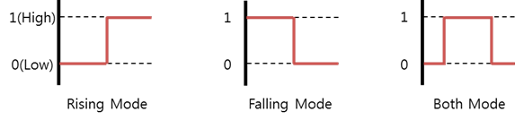

# GPIO

[GPIO](https://en.wikipedia.org/wiki/General-purpose_input/output) (General-Purpose Input/Output) is a programmable interface for reading the state of binary input peripherals, such as a switch, and controlling the state of binary output peripherals, such as a LED.

GPIO sets a direction for the data transfer. It can also detect an interrupt signaled by a level transition: either a falling edge (high to low) or a rising edge (low to high). To detect the interrupt signal you want, set the appropriate edge mode.

GPIO offers the following edge modes:

-   Rising mode detects data changes from low to high.
-   Falling mode detects data changes from high to low.

**Figure: GPIO edge modes**



## Opening and Closing a Handle

To open and close a handle:

1.  To open a GPIO handle, use the `peripheral_gpio_open()` function:

    ```
    int pin = 26; /* ARTIK 530 : GPIO8, Raspberry Pi 3 : GPIO26 */
    peripheral_gpio_h gpio_h;
    peripheral_gpio_open(pin, &gpio_h);
    ```

    The `pin` parameter required for this function must be set according to the following tables.

    **Table: ARTIK 530**

      Pin name  |Pin (parameter 1)  |Pin name  |Pin (parameter 1)
      ----------|-------------------|----------|-------------------
      GPIO0     |128                |GPIO1     |129
      GPIO2     |130                |GPIO3     |46
      GPIO4     |14                 |GPIO5     |41
      GPIO6     |25                 |GPIO7     |0
      GPIO8     |26                 |GPIO9     |27

    **Table: Raspberry Pi 3**

      Pin name  |Pin (parameter 1)  |Pin name  |Pin (parameter 1)
      ----------|-------------------|----------|-------------------
      GPIO4     |4                  |GPIO5     |5
      GPIO6     |6                  |GPIO12    |12
      GPIO13    |13                 |GPIO16    |16
      GPIO17    |17                 |GPIO18    |18
      GPIO19    |19                 |GPIO20    |20
      GPIO21    |21                 |GPIO22    |22
      GPIO23    |23                 |GPIO24    |24
      GPIO25    |25                 |GPIO26    |26
      GPIO27    |27                 |-         |-

    > **Note**
    >
    >  For more information on the pin names and locations, see [Supported Protocols](peripheral-io-api.md#protocol).

2.  To close a GPIO handle that is no longer used, use the `peripheral_gpio_close()` function:

    ```
    peripheral_gpio_close(gpio_h);
    ```

## Setting the Data Direction

To set the data transfer direction, use the `peripheral_gpio_set_direction()` function with 1 of the following direction types:

-   `PERIPHERAL_GPIO_DIRECTION_IN`: Input mode to receive data from a binary output peripheral.
-   `PERIPHERAL_GPIO_DIRECTION_OUT_INITIALLY_HIGH`: Output mode to send data to a binary output peripheral. This value initializes the output peripheral state as high.
-   `PERIPHERAL_GPIO_DIRECTION_OUT_INITIALLY_LOW`: Output mode to send data to a binary output peripheral. This value initializes the output peripheral state as low.

```
peripheral_gpio_set_direction(gpio_h, PERIPHERAL_GPIO_DIRECTION_OUT_INITIALLY_LOW);
```

> **Note**
>
> To set the data direction to `PERIPHERAL_GPIO_DIRECTION_OUT_INITIALLY_HIGH` or `PERIPHERAL_GPIO_DIRECTION_OUT_INITIALLY_LOW`, the edge mode must be set to `PERIPHERAL_GPIO_EDGE_NONE`.


## Setting the Edge Mode

To set the edge mode, use the `peripheral_gpio_set_edge_mode()` function with 1 of the following edge mode types:

-   `PERIPHERAL_GPIO_EDGE_NONE`: No edge mode.
-   `PERIPHERAL_GPIO_EDGE_RISING`: Interrupted at a rising edge (low to high).
-   `PERIPHERAL_GPIO_EDGE_FALLING`: Interrupted at a falling edge (high to low).
-   `PERIPHERAL_GPIO_EDGE_BOTH`: Interrupted at both rising and falling edges.

```
peripheral_gpio_set_edge_mode(gpio_h, PERIPHERAL_GPIO_EDGE_RISING);
```

> **Note**
>
> To set the edge mode to `PERIPHERAL_GPIO_EDGE_RISING`, `PERIPHERAL_GPIO_EDGE_FALLING`, or `PERIPHERAL_GPIO_EDGE_BOTH`, the data direction must be set to the `PERIPHERAL_GPIO_DIRECTION_IN`.


## Setting the Interrupted Callback

The interrupted callback is called when the GPIO state changes, based on the selected edge mode.

The interrupted callback is unset when the `peripheral_gpio_unset_interrupted_cb()` function is called or when the callback receives an error value other than `PERIPHERAL_ERROR_NONE`.

To implement the interrupted callback:

1.  Define the interrupted callback content.

    ```
    static void
    interrupted_cb(peripheral_gpio_h gpio_h, peripheral_error_e error, void *user_data)
    {
        /* Code you want to run when the interrupt occurs */
    }
    ```

2.  Set the callback with the `peripheral_gpio_set_interrupted_cb()` function:

    ```
    peripheral_gpio_set_interrupted_cb(gpio_h, interrupted_cb, NULL);
    ```

3.  When no longer needed, unset the interrupt callback with the `peripheral_gpio_unset_interrupted_cb()` function:

    ```
    peripheral_gpio_unset_interrupted_cb(gpio_h);
    ```

## Reading and Writing Binary Data

To read and write binary data:

-   To read binary data from a peripheral, use the `peripheral_gpio_read()` function:

    ```
    uint32_t value;
    peripheral_gpio_read(gpio_h, &value);
    ```

-   To write binary data to a peripheral, use the `peripheral_gpio_write()` function:

    ```
    uint32_t value = 1;
    peripheral_gpio_write(gpio_h, value);
    ```

> **Note**
>
> To write binary data, the data direction must be set to `PERIPHERAL_GPIO_DIRECTION_OUT_INITIALLY_HIGH` or `PERIPHERAL_GPIO_DIRECTION_OUT_INITIALLY_LOW`.
