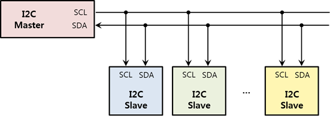

# I<sup>2</sup>C

[I<sup>2</sup>C](https://en.wikipedia.org/wiki/I%C2%B2C) (Inter-Integrated Circuit) is a programmable interface that allows you to communicate with I<sup>2</sup>C peripherals.

I<sup>2</sup>C is a synchronous serial interface that uses a clock signal to synchronize data transfers between master and slave device:

-   Master device generates the clock and initiates communication with slaves.
-   Slave device receives the clock and responds when addressed by the master.

**Figure: I<sup>2</sup>C interface diagram**



To allow the I<sup>2</sup>C master to connect to 128 I<sup>2</sup>C slave devices, an I<sup>2</sup>C slave device provides a 7-bit address. Since most slave addresses are determined by the manufacturer, refer to the specification to find the slave device address.

Using the I<sup>2</sup>C bus, the master controls signal lines called SCL (Shared CLock) and SDA (Shared DAta) to read or write data to or from the device. SCL is a clock line for communication synchronization, and SDA is a data line. The master outputs the clock for synchronization with the SCL, and the slave outputs or receives data through the SDA according to the clock output to the SCL.

If the SDA line is used alone, only half duplex communication is possible because data is sent only to 1 line.

## Opening and Closing a Handle

To open and close a handle:

1.  To open an I<sup>2</sup>C handle, use the `peripheral_i2c_open()` function:

    ```
    int bus = 1;
    int address = ...;   /* See the specification */
    peripheral_i2c_h i2c_h;
    peripheral_i2c_open(bus, address, &i2c_h);
    ```

    The `bus` parameter required for this function must be set according to the following table.

    **Table: ARTIK 530 / Raspberry Pi 3**

    Pin name  |           |Bus number (parameter 1)
    ----------|-----------|----------
    I2C1\_SDA | I2C1\_SCL | 1

    > **Note**
    >
    > For more information on the pin names and locations, see [Supported Protocols](peripheral-io-api.md#protocol).

    The `address` parameter must be set based on the peripheral specification.

2.  To close an I<sup>2</sup>C handle that is no longer used, use the `peripheral_i2c_close()` function:

    ```
    peripheral_i2c_close(i2c_h);
    ```

## Reading and Writing Data

To read and write data:

-   To write bytes to a slave device, use the `peripheral_i2c_write()` function:

    ```
    uint8_t data[2] = {0x06, 0x01};
    uint32_t length = 2;
    peripheral_i2c_write(i2c_h, data, length);
    ```

-   To read bytes from a slave device, use the `peripheral_i2c_read()` function:

    ```
    uint8_t data[2];
    uint32_t length = 2;
    peripheral_i2c_read(i2c_h, data, length);
    ```

## Reading and Writing Register Data

To read and write register data:

-   To write single byte data to a slave device register, use the `peripheral_i2c_write_register_byte()` function:

    ```
    uint8_t data = 0x06;
    uint8_t register_address = ...;  /* See the specification */
    peripheral_i2c_write_register_byte(i2c_h, register_address, data);
    ```

-   To read single byte data from a slave device register, use the `peripheral_i2c_read_register_byte()` function:

    ```
    uint8_t data ;
    uint8_t register_address = ...;  /* See the specification */
    peripheral_i2c_read_register_byte(i2c_h, register_address, &data);
    ```

-   To write word data to a slave device register, use the `peripheral_i2c_write_register_word()` function:

    ```
    uint16_t data = 0xffff;
    uint8_t register_address = ...;  /* See the specification */
    peripheral_i2c_write_register_word(i2c_h, register_address, data);
    ```

-   To read word data from a slave device register, use the `peripheral_i2c_read_register_word()` function:

    ```
    uint16_t data ;
    uint8_t register_address = ...;  /* See the specification */
    peripheral_i2c_read_register_word(i2c_h, register_address, &data);
    ```
