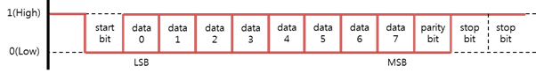

# UART

[UART](https://en.wikipedia.org/wiki/Universal_asynchronous_receiver-transmitter) (Universal Asynchronous Receiver-Transmitter) is a programmable interface that allows you to communicate 1:1 with a UART peripheral.

**Figure: UART interface diagram**


UART is an interface for exchanging data with peripherals. It is an asynchronous method that transmits data without a clock line, and consists of only 2 data lines: transmit (Tx) and receive (Rx). UART performs 1:1 communication.

**Figure: UART data frame**



The UART data frame consists of start (1 bit), data (5\~8 bit), parity (1 bit) and stop (1 bit):

-   Start bit

    Indicates the start of the communication before sending data and holds it for a bit time length.

-   Data

    Transmits 5 to 8 bits of data.

-   Parity bit

    Generates and transmits a parity value for error verification, and determines a receiving side error. The following options are available: `None`, `Even`, and `Odd` parity. Selecting `None` removes this bit.

-   Stop bit

    Indicates the termination of the communication and holds 1 or 2 bits.

-   Baud rate

    Asynchronous transmission/receiving speeds must be matched to the peripheral. For this purpose, the number of signals transmitted per second can be synchronized with a peripheral. It is called the Baud.

If a device supports a 5-wire UART port, hardware flow control can be used to increase the reliability of the data transmission. Software flow control can also be used to increase reliability.

## Opening and Closing a Handle

To open and close a handle:

1.  To open a UART handle, use the `peripheral_uart_open()` function:

    ```
    int port = 4; /* ARTIK 530 : UART0 */
    peripheral_uart_h uart_h;
    peripheral_uart_open(port, &uart_h);
    ```

    The `port` parameter required for this function must be set according to the following tables.

    **Table: ARTIK 530**

    | Pin name |  | Port (parameter 1) |
    | -------- | ---------| ---- |
    | UART0_RX | UART0_TX | 4    |

    **Table: Raspberry Pi 3**

    | Pin name | | Port (parameter 1) |
    | -------- | ---------| ---- |
    | UART0_RX | UART0_TX | 0    |


    > **Note**
    >
    > For more information on the pin names and locations, see [Supported Protocols](peripheral-io-api.md#protocol).

2.  To close a UART handle that is no longer used, use the `peripheral_uart_close()` function:

    ```
    peripheral_uart_close(uart_h);
    ```

## Setting the Baud Rate

To set the baud rate, use the `peripheral_uart_set_baud_rate()` function with a baud rate value:

-   `PERIPHERAL_UART_BAUD_RATE_0` \~ `PERIPHERAL_UART_BAUD_RATE_230400`

```
peripheral_uart_set_baud_rate(uart_h, PERIPHERAL_UART_BAUD_RATE_9600);
```

## Setting the Byte Size

To set the byte size, use the `peripheral_uart_set_byte_size()` function with 1 of the following byte size types:

-   `PERIPHERAL_UART_BYTE_SIZE_5BIT`: Byte size is 5 bits.
-   `PERIPHERAL_UART_BYTE_SIZE_6BIT`: Byte size is 6 bits.
-   `PERIPHERAL_UART_BYTE_SIZE_7BIT`: Byte size is 7 bits.
-   `PERIPHERAL_UART_BYTE_SIZE_8BIT`: Byte size is 8 bits.

```
peripheral_uart_set_byte_size(uart_h, PERIPHERAL_UART_BYTE_SIZE_7);
```

## Setting the Parity Bit

To set the parity bit, use the `peripheral_uart_set_parity()` function with 1 of the following parity types:

-   `PERIPHERAL_UART_PARITY_NONE`: No parity bit.
-   `PERIPHERAL_UART_PARITY_EVEN`: Parity bit is even.
-   `PERIPHERAL_UART_PARITY_ODD`: Parity bit is odd.

```
peripheral_uart_set_parity(uart_h, PERIPHERAL_UART_PARITY_EVEN);
```

## Setting the Stop Bits

To set the stop bits, use the `peripheral_uart_set_stop_bits()` function with 1 of the following stop bit types:

-   `PERIPHERAL_UART_STOP_BITS_1BIT`: 1 bit is used for stop bits.
-   `PERIPHERAL_UART_STOP_BITS_2BIT`: 2 bit is used for stop bits.

```
peripheral_uart_set_stop_bits(uart_h, PERIPHERAL_UART_STOP_BITS_2BIT);
```

## Setting the Flow Control

To set the hardware and software flow control, use the `peripheral_uart_set_flow_control()` function with 1 of the following flow control types:

-   `PERIPHERAL_UART_SOFTWARE_FLOW_CONTROL_NONE`: No software flow control.
-   `PERIPHERAL_UART_SOFTWARE_FLOW_CONTROL_XONXOFF`: Software flow control uses XONXOFF.
-   `PERIPHERAL_UART_HARDWARE_FLOW_CONTROL_NONE`: No hardware flow control.
-   `PERIPHERAL_UART_HARDWARE_FLOW_CONTROL_AUTO_RTSCTS`: Hardware flow control uses RTSCTS.

```
peripheral_uart_set_flow_control(uart_h, PERIPHERAL_UART_SOFTWARE_FLOW_CONTROL_XONXOFF, PERIPHERAL_UART_HARDWARE_FLOW_CONTROL_AUTO_RTSCTS);
```

## Reading and Writing Data

To read and write data:

-   To write data to a slave device, use the `peripheral_uart_write()` function:

    ```
    uint8_t data[2] = {0x06, 0x01};
    uint32_t length = 2;
    peripheral_uart_write(uart_h, data, length);
    ```

-   To read data from a slave device, use the `peripheral_uart_read()` function:

    ```
    uint8_t data[2];
    uint32_t length = 2;
    peripheral_uart_read(uart_h, data, length);
    ```
