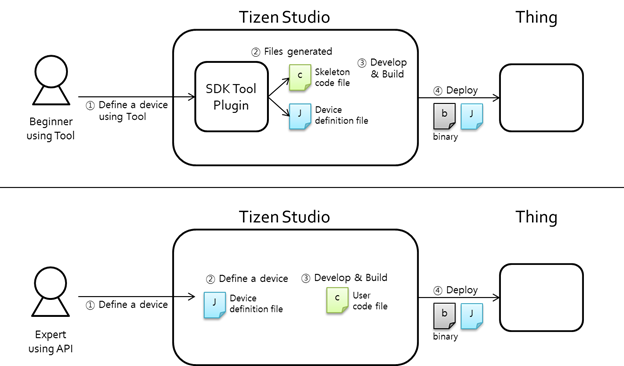

# Things SDK API

Developing "Things" which are market-ready (with cloud support) has been a challenge for most of the companies and individual developers. The SmartThings&trade;(ST) Things SDK API helps you to create new IoT devices easily.

Following are the two core components for creating a new device:

-   ST Things JSON Configuration files (`master.json` and `resource.json`)

    For more information on the configuration file details, see [Device Definition](things-api-device-5.0.md).

-   Application logic and user interaction

    For more information on using the ST Things SDK API, see [API Usage](things-api-guide-5.0.md).

**Figure: Creating a new device**

The ST Things SDK provides you an easy and configurable option to build and deploy your own devices quickly:

-   The ST Things SDK provides JSON-based things definition, which:
    -   Defines device and platform information.
    -   Defines resources that the thing is supporting.
    -   Defines an easy-setup configuration.
-   The ST Things SDK provides spec-agnostic APIs, which:
    -   Hide the interface and resource type details in a request data.
    -   Divide a collection resource request into single resource requests.
    -   Provide the "property_key" in case of the GET request.

The ST Things SDK API provides the following benefits for you:

-   Supports pin-based and UserConfirm(Certificate)-based OTM in EasySetup.
-   Provides a JSON-based device/resource definition method in two file, `master.json` and `resource.json`:
-   Resources that are defined in `resource.json` file are made internally.
-   Provides easy APIs to handle requests and responses:
    -   Supports request methods: GET and POST.
    -   You only need to make a representation (bundle of property values) for a response.
    -   You do not need to handle interfaces, as they are handled internally.
    -   The request to a collection resource is divided into individual requests to single resources.
-   Provides internally handled cloud setup (Sign-up or Sign-in or Sign-out or Resource publish to cloud).
-   Provides the following internally handled operations:
    -   To respond to an Access Point List (APList) request from a client.
    -   To start and stop softAP.
    -   To connect to a target WiFi AP (Enroller).
    -   To make the whole response data according to the interfaces (such as `oic.if.baseline`, `oic.if.b`, and `oic.if.ll`).
