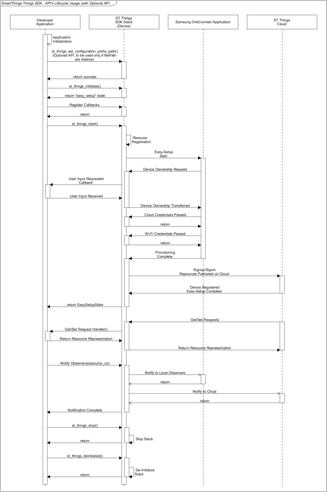

# API Usage

The following figure illustrates the SmartThings&trade; Things API life-cycle.

**Figure: SmartThings&trade; Things API life-cycle**



## Initializing Stack and Callbacks

Once the device configuration JSON file is ready, you can specify the read-only and read-write paths in the `st_things_set_configuration_prefix_path()` function (optional), and specify the file in the `st_things_initialize()` function:

```
bool easysetup_complete = false;
st_things_set_configuration_prefix_path("/ropath/XXX/res", "/rwpath/XXX/data"); /* Optional */
st_things_initialize("sample_device.json", &easysetup_complete);

/* User input can be handled graphically or using CLI */
/* You need to decide that */
if (!easysetup_complete) {
    int cmd = 0;
    printf("[%s]Start Easysetup ? (1:yes, other:no): ", TAG);
    scanf("%d", &cmd);
    if (1 != cmd) {
        st_things_deinitialize();

        return 0;
    }
}

/* Register Callbacks */
st_things_register_request_cb(handle_get_request, handle_set_request);
st_things_register_reset_cb(handle_reset_request, handle_reset_result);
st_things_register_user_confirm_cb(handle_ownership_transfer_request);
st_things_register_things_status_change_cb(handle_things_status_change);

st_things_start();
printf("ST Things Stack started\n");

handle_main_loop();

st_things_stop();
printf("ST Things Stack Stopped\n");
st_things_deinitialize();
printf("ST Things Stack deinitialized\n");
```

You must define the highlighted code in the above example. The `st_XXX()` functions come from the ST Things SDK API. For more information, see the [API Documentation](https://developer.tizen.org/dev-guide/things-sdk).

## Getting and Setting Request Handling Callbacks

Assume that the following resources and resource types are defined in the `sample_device.json` file:

**Example: Resources and resource types**

<table>
	<tbody>
		<tr>
			<td valign="top">
			<pre><code>
"resources": {
   "single": [
      {
         "uri": "/switch",
         "types": [
            "oic.r.switch.binary"
         ],
         "interfaces": [
            "oic.if.a",
            "oic.if.baseline"
         ],
         "policy": 3
      },
      {
         "uri": "/audio",
         "types": [
            "oic.r.audio"
         ],
         "interfaces": [
            "oic.if.a",
            "oic.if.baseline"
         ],
         "policy": 3
      }
   ]
}
</code></pre>
			</td>
			<td>
			<pre><code>
"resourceTypes": [
   {
      "type": "oic.r.switch.binary",
      "properties": [
         {
            "key": "value",
         "type": 0,
            "mandatory": true,
            "rw": 3
         }
      ]
   },
   {
      "type": "oic.r.audio",
      "properties": [
         {
            "key": "volume",
            "type": 1,
            "mandatory": true,
            "rw": 3
         },
         {
            "key": "mute",
            "type": 0,
            "mandatory": true,
            "rw": 3
         }
      ]
   }
]
</code></pre>
			</td>
		</tr>
	</tbody>
</table>

The 2 defined resources are:

-   Switch (URI = `"/switch"`)
-   Audio (URI = `"/audio"`)

The following example illustrates the get and set request handlers:

```
static const char* RES_SWITCH = "/switch";
static const char* RES_AUDIO = "/audio";

bool
handle_get_request(st_things_get_request_message_s* req_msg, st_things_representation_s* resp_rep)
{
    printf("[%s]Received a GET request on %s\n", TAG, req_msg->resource_uri);
    bool ret = false;
    if (0 == strcmp(req_msg->resource_uri, RES_SWITCH)) {
        ret = handle_get_request_on_switch(req_msg, resp_rep);
    } else if (0 == strcmp(req_msg->resource_uri, RES_AUDIO)) {
        ret = handle_get_request_on_audio(req_msg, resp_rep);
    } else {
        printf("[%s]Not supported uri.\n", TAG);
    }

    return ret;
}

bool
handle_set_request(st_things_set_request_message_s* req_msg, st_things_representation_s* resp_rep)
{
    printf("[%s]Received a SET request on %s\n", TAG, req_msg->resource_uri);
    bool ret = false;

    if (0 == strcmp(req_msg->resource_uri, RES_SWITCH)) {
        ret = handle_set_request_on_switch(req_msg, resp_rep);
    } else if (0 == strcmp(req_msg->resource_uri, RES_AUDIO)) {
        ret = handle_set_request_on_audio(req_msg, resp_rep);
    } else {
        printf("[%s]Not supported uri.\n", TAG);
    }

    return ret;
}
```

The key difference is the `req_msg->resource_uri` value passed in the callbacks to distinguish the 2 resources. Since the resource URI is unique in the device definition, each resource can be handled separately.

The following examples illustrate the get and set request handling callbacks for a single and multiple properties:

-   For a single property, you must extract the desired property from the request message and update the device property database locally. Once you have updated the device property, you must update the response representation about the updated property which is sent to the client:

    ```
    #define TAG "DEVELOPER_DEVICE"

    static const char* PROPERTY_VALUE = "value";
    bool g_switch_value = false;

    bool
    handle_get_request_on_switch(st_things_get_request_message_s* req_msg, st_things_representation_s* resp_rep)
    {
        printf("[%s]IN-handle_get_request_on_switch() called..\n", TAG);
        printf("[%s]current switch value: %d\n", TAG, g_switch_value);

        resp_rep->set_bool_value(resp_rep, PROPERTY_VALUE, g_switch_value);

        printf("[%s]OUT-handle_get_request_on_switch() called..\n", TAG);

        return true;
    }

    bool
    handle_set_request_on_switch(st_things_set_request_message_s* req_msg, st_things_representation_s* resp_rep)
    {
        printf("[%s]IN-handle_set_request_on_switch() called..\n", TAG);
        printf("[%s]current switch value: %d\n", TAG, g_switch_value);

        bool desired_value = false;
        req_msg->rep->get_bool_value(req_msg->rep, PROPERTY_VALUE, &desired_value);

        printf("[%s]desired switch value: %d\n", TAG, desired_value);
        g_switch_value = desired_value;
        printf("[%s]changed switch value: %d\n", TAG, g_switch_value);

        resp_rep->set_bool_value(resp_rep, PROPERTY_VALUE, g_switch_value);

        printf("[%s]OUT-handle_set_request_on_switch() called..\n", TAG);

        return true;
    }
    ```

-   For multiple properties, the process is the same, except that you need to handle multiple properties at the same time:

    ```
    #define TAG "DEVELOPER_DEVICE"
    static const char* PROPERTY_VOLUME = "volume";
    static const char* PROPERTY_MUTE = "mute";
    int64_t g_audio_volume = 0;
    bool g_audio_mute = false;

    bool
    handle_get_request_on_audio(st_things_get_request_message_s* req_msg, st_things_representation_s* resp_rep)
    {
        printf("[%s]IN-handle_get_request_on_audio() called..\n", TAG);
        printf("[%s]current audio volume: %"PRId64".\n", TAG, g_audio_volume);
        printf("[%s]current audio mute: %d.\n", TAG, g_audio_mute);

        resp_rep->set_int_value(resp_rep, PROPERTY_VOLUME, g_audio_volume);
        resp_rep->set_bool_value(resp_rep, PROPERTY_MUTE, g_audio_mute);
        printf("[%s]OUT-handle_get_request_on_audio() called..\n", TAG);

        return true;
    }

    bool
    handle_set_request_on_audio(st_things_set_request_message_s* req_msg, st_things_representation_s* resp_rep)
    {
        printf("[%s]IN-handle_set_request_on_audio() called..\n", TAG);
        printf("[%s]current audio volume: %"PRId64".\n", TAG, g_audio_volume);
        printf("[%s]current audio mute: %d\n", TAG, g_audio_mute);

        int64_t desired_volume = 0;
        bool desired_mute = false;
        req_msg->rep->get_int_value(req_msg->rep, PROPERTY_VOLUME, &desired_volume);
        req_msg->rep->get_bool_value(req_msg->rep, PROPERTY_MUTE, &desired_mute);

        printf("[%s]desired audio volume: %"PRId64".\n", TAG, desired_volume);
        printf("[%s]desired audio mute: %d.\n", TAG, desired_mute);

        g_audio_volume = desired_volume;
        g_audio_mute = desired_mute;

        printf("[%s]changed audio volume: %"PRId64".\n", TAG, g_audio_volume);
        printf("[%s]changed audio mute: %d.\n", TAG, g_audio_mute);

        resp_rep->set_int_value(resp_rep, PROPERTY_VOLUME, g_audio_volume);
        resp_rep->set_bool_value(resp_rep, PROPERTY_MUTE, g_audio_mute);

        printf("[%s]OUT-handle_set_request_on_audio() called..\n", TAG);

        return true;
    }
    ```

## Notifying Observers

The following example illustrates how you can notify observers:

```
#define TAG "DEVELOPER_DEVICE"
static const char* RES_SWITCH = "/switch";
static const char* RES_AUDIO = "/audio";
static const char* PROPERTY_VALUE = "value";
bool g_switch_value = false;

bool
notify_observers(const char *resource_uri)
{
    printf("[%s] Notify all observers for resource = %s\n", TAG, resource_uri);
    bool ret = false;
    if (0 == strcmp(resource_uri, RES_SWITCH)) {
        ret = st_things_notify_observers(resource_uri);
    } else if (0 == strcmp(resource_uri, RES_AUDIO)) {
        ret = st_things_notify_observers(resource_uri);
    } else {
        printf("[%s]Not supported uri.\n", TAG);
    }

    return ret;
}

bool
handle_set_request_on_switch(st_things_set_request_message_s* req_msg, st_things_representation_s* resp_rep)
{
    printf("[%s]IN-handle_set_request_on_switch() called.\n", TAG);
    printf("[%s]current switch value: %d\n", TAG, g_switch_value);
    bool is_value_changed = false;
    bool desired_value = false;
    req_msg->rep->get_bool_value(req_msg->rep, PROPERTY_VALUE, &desired_value);

    printf("[%s]desired switch value: %d\n", TAG, desired_value);
    if (g_switch_value = desired_value) {
        g_switch_value = desired_value;
        is_value_changed = true;
    }
    resp_rep->set_bool_value(resp_rep, PROPERTY_VALUE, g_switch_value);

    if (is_value_changed) {
        notify_observers(req_msg->resource_uri);
    }
    printf("[%s]OUT-handle_set_request_on_switch() called..\n", TAG);

    return true;
}
```

## IoTivity Information

The following table lists the resource types supported by IoTivity.

**Table: IoTivity resource types**

  Resource type name | Resource type value
  ------------------ | ---------------------
  Device             | `oic.wk.d`
  Platform           | `oic.wk.p`
  Discovery          | `oic.wk.res`
  Presence           | `oic.wk.ad`
  Collection         | `oic.wk.col`

The following table shows the IoTivity interfaces that specify how the device returns its response. These interfaces can be used by the IoTivity client (such as Samsung Connect) to retrieve information from the server (device).

**Table: IoTivity interfaces for responses**

  Name        | Interface         | Description
  ------------| ----------------- | ------------------------------------------------------------------------------------------------------------------------------------------------
  Baseline    | `oic.if.baseline` | Includes all information about the resource, including metadata and collection information. This is the default interface type.
  Linked List | `oic.if.ll`       | Includes only the collection information about the resource. This is the default interface type for `/oic/res`.
  Batch       | `oic.if.b`        | Allows for the aggregation of interaction with all resources. Each resource is interacted with separately, but their responses are aggregated.

The following table lists other interface types that are related to permissions. These interfaces are relevant for retrieve and update requests.

**Table: IoTivity interfaces for permissions**

  Name       | Interface   | Description
  ---------- | ----------- | ------------------------------------------------------------
  Read       | `oic.if.r`  | Allows values to be read.
  Read Write | `oic.if.rw` | Allows values to be read and written.
  Actuator   | `oic.if.a`  | Allows creating, updating, and retrieving actuator values.
  Sensor     | `oic.if.s`  | Allows sensor values to be read.
