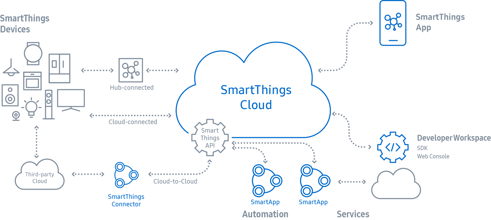

# IoT and Tizen IoT

The Internet of Things (IoT) is connected networks of various types  of things, such as sensors, actuators, electronic devices, home  appliances, and so on. These networks of end-devices, hubs, and servers  enable exchange of data and execution of operations among things for  specific purposes. Communications and executions through the connections  are designed to happen without human interventions. In the broad sense,  the IoT means a combination of software and platforms for automatic and  intelligent services, as well as the networks itself.

The IoT applications are extensive, for example, home automation with  smart consumer electronics and appliances, smart factories that consist  of connected manufacturing equipment, and transportation systems for  connected vehicles and traffic control, etc. Each application is  realized through the operations of physical device control, networking,  data analysis, and decision making. In general, the IoT end devices are  lightweight, low-cost, and power-efficient. While, the back-end systems  have the capability to analyze data from the end devices and to make  decisions based on pre-defined algorithms or trained intelligence. For  competitive IoT ecosystems, it is required to be scalable in attaching  new forms of devices to the networks; and to be sufficient controls  available from the networks. Further, from the end devices to the  services, all the components have to be tightly integrated throughout  the whole ecosystem.

To address IoT-specific requirements, Tizen IoT is derived from Tizen. Tizen IoT is the Tizen implementation for the [SmartThings ecosystem](https://smartthings.developer.samsung.com/develop/index.html).

Tizen IoT is composed of:

- [Lightweight OS](getting-started/tizen-image-download-flash.md) for IoT devices,
- [Peripheral I/O API](guides/peripheral-io-api.md) for the access and control of the devices, and
- [Things SDK API](guides/things-api.md) for the integration with the [SmartThings Cloud](https://smartthings.developer.samsung.com/develop/index.html).

Connected with the Cloud, the SmartThings App on your smart phone  provides easy and convenient ways for users to manage and configure the  devices and the services. For more information about Samsung's  SmartThings solution, see [SmartThings website.](https://smartthings.developer.samsung.com/)

**Figure: SmartThings Ecosystem**

[Source: https://smartthings.developer.samsung.com/](https://smartthings.developer.samsung.com/)
