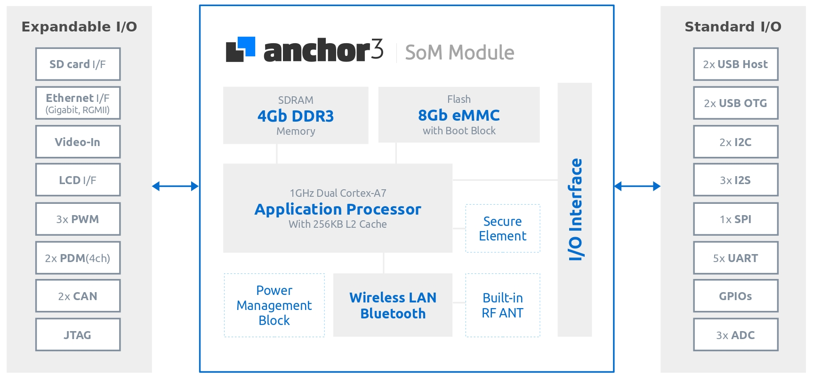
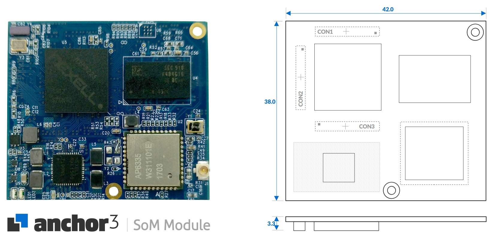
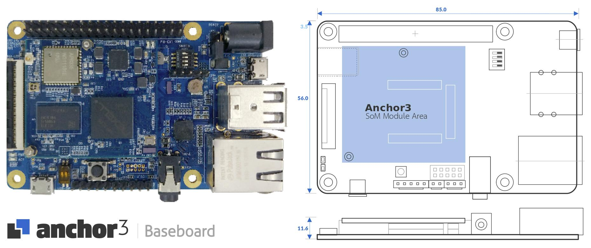

# Tizen IoT with Anchor SoM Module

> The Fastest Way to design your IoT Applications

## Anchor3

**Anchor3** is a embedded system that consist of a System-on-Module and a Base Board and is optimized for the major functionality of embedded equipment.

**Anchor3 System-on-Module** is a highly-integrated module that utilizes an dual-core ARM® Cortex-A7 processor packaged SDRAM, eMMC Flash memory, a hardware Secure Element and a wireless communication options such as 802.11a/b/g/n/ac, Bluetooth 4.1(Classic+BLE) and all into an compact footprint.
The hardware based Secure Element works with the ARM TrustZone and Trustware, Trusted Execution Environment (TEE) to provide enhanced end-to-end security.

**Anchor3 Baseboard** integrates all of the necessary elements required for popular functionality with peripheral I/O interface that has a gigabit Ethernet MAC, USB Host and USB OTG connector, LCD interface, Audio DAC with phone jack and expansion I/O interface as well.
The expansion I/O interface supports various general interface including standard I/O such as I2C, I2S, UART, SPI, PWM, ADC, ... etc., to apply external sensors or peripherals.
With the combination of Wi-Fi, Bluetooth, Anchor3 is the perfect choice for home automation and industrial equipment, and even IoT devices, while also supporting effective price/performance capability with expandable I/O options.
We provide Test Kit Package that can evaluate and test most of the functions with technical support.

**Figure** | Anchor3 System-on-Module Block Diagram

### Anchor3 System-on-Module Overview

The Anchor3 System-on-Module has 3 x 60 pin board-to-board connectors and integrates the AP, Memory, eMMC, Power Management IC (PMIC) and WiFi / Bluetooth on the module.

**Figure** | Anchor3 System-on-Module Picture and Dimension

### Anchor3 Baseboard Overview

The Anchor3 Baseboard has 3 x 60 pin board-to-board connectors that connect to the Anchor3 System-on-Module and provides the following interfaces such as audio, network, USB and a large number of signals on the various pin headers.

**Figure** | Anchor3 Baseboard Picture and Dimension

For more information about Anchor Series, please click the below.
- [Anchor3 Specifications](https://drive.google.com/open?id=13GqlZtnRxxGUqiYBCiqjyx1hd_yJ4tIr)
- [Github for Anchor3 Boot & Tizen Package and helpful example source codes](https://github.com/dignsys/)
- [Customer Service & Technical Supports](https://www.dignsys.com/)

If you have any questions, please send us by [email](hbahn@dignsys.com) 

## Anchor5

It will be launched and updated soon.
