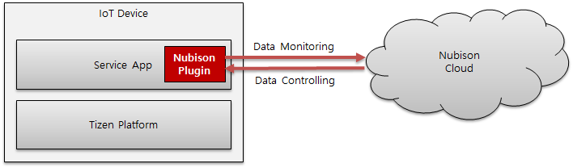

# Tizen IoT with Nubison Cloud

The Nubison IoT cloud is a cloud-based IoT platform that provides smart solutions and intelligent services by connecting various things easily, as well as collecting and analyzing IoT data in real time.

Real-time data monitoring between the Tizen service app and the Nubison cloud is empowered through the Nubison plugin.

The following diagram shows the interface between Tizen IoT device and Nubison cloud through Nubison plugin:

**Figure: Architecture**

The Nubison plugin can be installed on the Tizen IoT devices that are compatible with the following:

- Platform : Tizen 5.0 IoT Headed and Headless, and higher
- SDK : Tizen Studio 3.0 and higher

For more information on the Nubison IoT cloud service, see the following:

- [Github for Nubison Template](https://github.com/nubisoniot/NI)
- [Nubison Site for Developers](https://nubisoniot.com/)
- [Nubison: Your IoT Service Provider](https://blog.naver.com/nubison/221462430388)
- [How to use Nubison IoT](https://blog.naver.com/nubison/221462229766)

Get started by importing [Nubison's template](https://github.com/nubisoniot/NI) in Tizen Studio!
