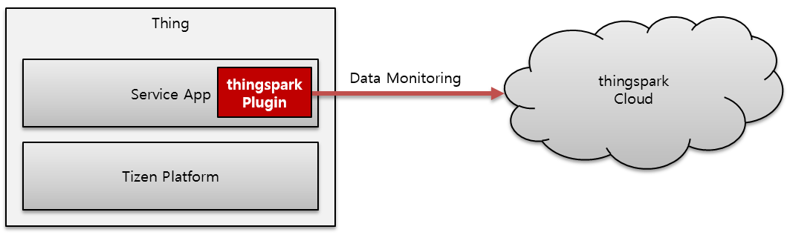

# Tizen IoT with ThingsPark Cloud

The ThingsPark service is a cloud-based IoT solution that can be connected with various things. 

Tizen developers can easily develop an application to send IoT data to the cloud in real time.

Real-time data monitoring between Tizen service app and ThingsPark cloud is empowered through ThingsPark plugin.

The following diagram shows the interface between Tizen IoT device and ThingsPark cloud :

**Figure: Architecture**

The ThingsPark plugin can be installed on Tizen IoT devices compatible with as follow:

* Platform : Tizen 5.0 IoT Headed & Headless and later
* SDK : Tizen Studio 3.3 and later

For more information about ThingsPark IoT cloud service, see the following references:

- [Github for ThingsPark Template](https://github.com/theksystem/tizen_to_thingspark_example)
- [ThingsPark : Open IoT Platform Service ](https://www.thingspark.co.kr)

**Start now by importing ThingsPark's template in the Tizen Studio!**
