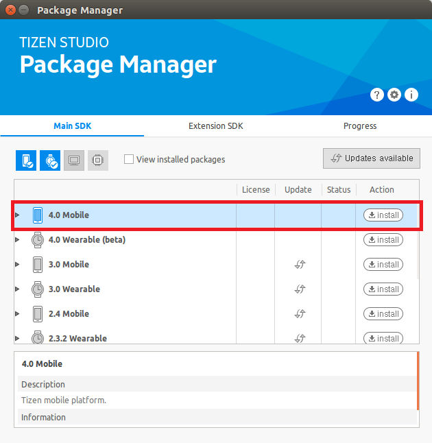
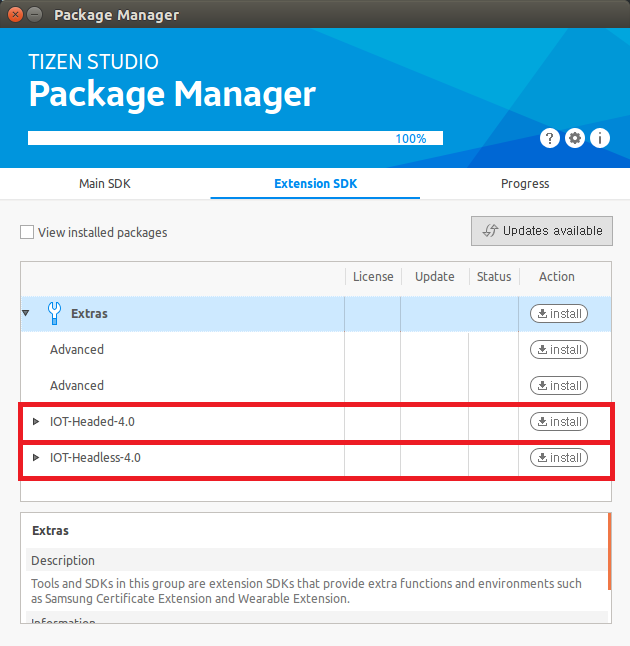

# Installing Tizen Studio

To install the Tizen Studio and the required profiles for IoT development:

1.  Download the correct version of Tizen Studio 2.0 (or later) for your operating system from [Tizen developer site](https://developer.tizen.org/development/tizen-studio/download) and install it.
2.  Open the Tizen Studio Package Manager, select the **Main SDK** tab, and install the **4.0 Mobile** profile:

    

3.  Select the **Extension SDK** tab and install the **IOT-Headed-4.0** and **IOT-Headless-4.0** profiles:

    
