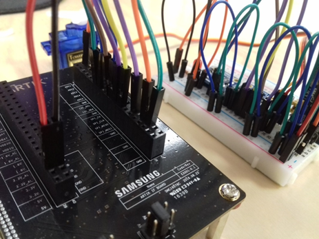
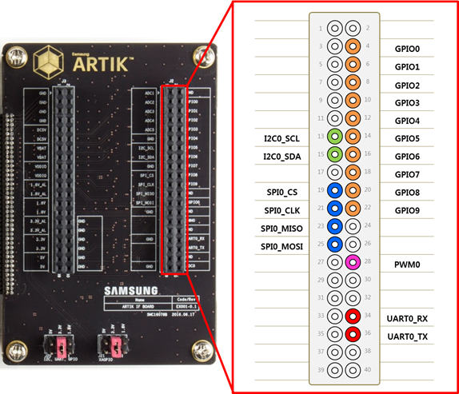
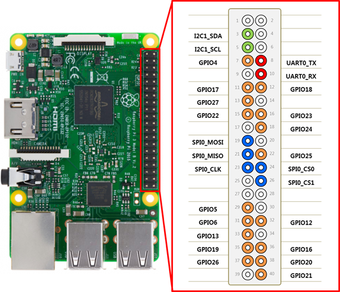
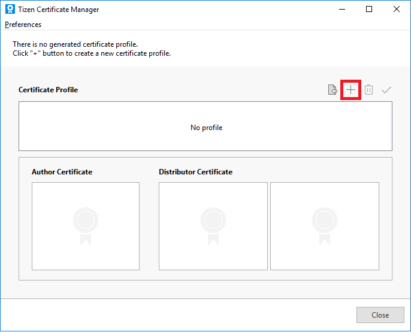
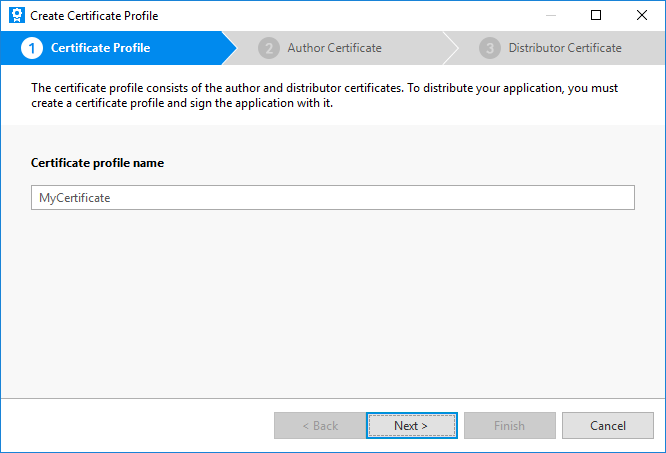
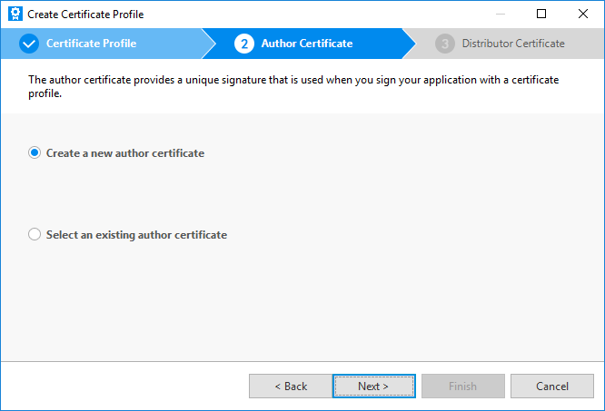
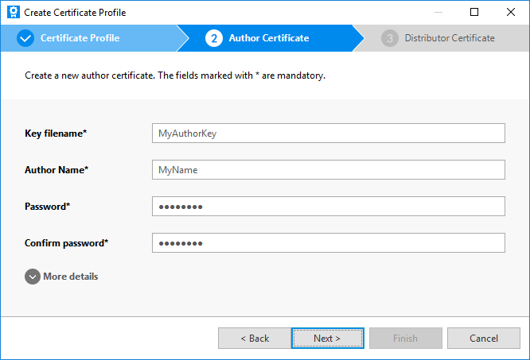
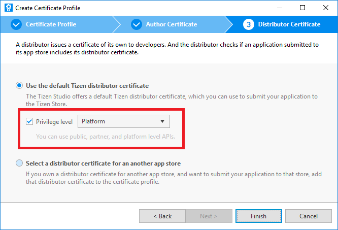
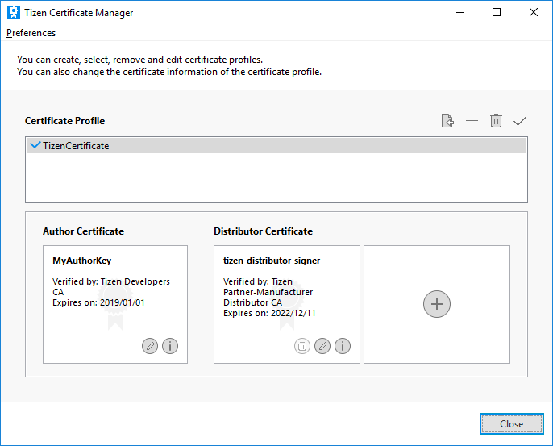

# Tizen Peripheral I/O Native API

Tizen IoT provides the Peripheral I/O APIs for IoT devices to control peripherals, such as sensors and actuators, using industry-standard protocols and interfaces:

-   [GPIO](peripheral-io-api-gpio.md) (General-Purpose Input/Output)
-   [PWM](peripheral-io-api-pwm.md) (Pulse-Width Modulation)
-   [SPI](peripheral-io-api-spi.md) (Serial Peripheral Interface)
-   [I<sup>2</sup>C](peripheral-io-api-i2c.md) (Inter-Integrated Circuit)
-   [UART](peripheral-io-api-uart.md) (Universal Asynchronous Receiver-Transmitter)

Since each peripheral supports different interfaces and protocols, you must check from the peripheral's specifications whether a specific protocol is supported. Peripheral I/O APIs are categorized based on the protocol.

**Figure: Peripherals connected to an IoT device**



<a name="protocol"></a>
## Supported Protocols

The following table lists the supported protocols for the Tizen IoT hardware targets.

**Table: Protocols supported by the Tizen IoT hardware targets**

  Protocol  |ARTIK 530  |Raspberry Pi 3
  ----------|-----------|----------------
  GPIO      |Yes        |Yes
  PWM       |Yes        |No
  SPI       |Yes        |Yes
  I<sup>2</sup>C     |Yes        |Yes
  UART      |Yes        |Yes

The following figures illustrate the pinout information for the Tizen IoT hardware targets.

**Figure: ARTIK 530 pinout**



**Figure: Raspberry Pi 3 pinout**



## Prerequisites

1.  To use the Peripheral I/O API, the application has to request permission by adding the following platform privilege to the `tizen-manifest.xml` file:

    ```
    <privileges>
       <privilege>http://tizen.org/privilege/peripheralio</privilege>
    </privileges>
    ```

    To obtain authorization to use platform-level privileges, the application must be signed with a platform-level distributor certificate. Create a certificate profile for signing the application:

    1.  To open the Certificate Manager, in the Tizen Studio menu, go to **Tools &gt; Certificate Manager**.

        

    2.  To add a new certificate profile for signing your application, click **+** in the Certificate Manager and enter a profile name.

        

    3.  Select **Create a new author certificate** and click **Next**.

        

    4.  Enter the key file name, author name, password, and password again. If you want to provide more information for the certificate, enter the details after unfolding the **More details** section.

        

    5.  Select **Use the default Tizen distributor certificate** and the **Platform** privilege level, and click **Finish**.

        The new platform-level certificate is created and shown in the Certificate Manager.

        

        

2.  To use the functions and data types of the Peripheral I/O API, include the `<peripheral_io.h>` header file in your application:

    ```
    #include <peripheral_io.h>
    ```
