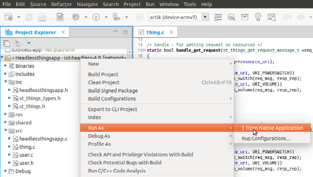

# Network Audio Sample Overview

The Network Audio sample application demonstrates how the user can manage things. The source code shows work with the st-things SDK in use cases for initialization, starting, ownership transfer, and resource handling.

## Prerequisites

-   To ensure proper application execution, the following privileges must be set:
    -   `http://tizen.org/privilege/network.get`
    -   `http://tizen.org/privilege/network.set`
    -   `http://tizen.org/privilege/internet`
    -   `http://tizen.org/privilege/alarm.set`
    -   `http://tizen.org/privilege/network.profile`
-   Tizen Studio 2.0 (or later) must be installed.
-   In the Package Manager, 4.0 Mobile in the **Main SDK** must be installed.
-   In the Package Manager, **Extras &gt; IOT-Headless-4.0** in the **Extension SDK** must be installed.
-   IoT Setup Wizard (Tizen Studio plugin) must be installed.
-   The device must be flashed through an SD card on the IoT Setup Wizard, and connectivity drivers must be installed.
-   You must prepare the certificate (`*.pem`) and private key (`*.der`).

For the above procedures related to the IoT Setup Wizard, see [IoT Setup Wizard](../getting-started/tizen-image-download-flash.md).

## Implementation

You can develop the sample application with the Tizen Studio custom iot-headless v4.0 template. However, the following example uses the sample app code from an imported project. You can download this sample application in the Tizen Studio.

The following content is in the `thing.c` file:

```
#include <stdio.h>
#include <string.h>
#include <stdbool.h>
#include <app_common.h>
#include "st_things.h"
#include "user.h"
#include "headlessthingsapp.h"

#define JSON_PATH "device_def.json"

static const char *URI_POWERSWITCH = "/capability/switch/main/0";
static const char *URI_VOLUME = "/capability/audioVolume/main/0";

/* Handle: for getting request on resources */
static bool
handle_get_request(st_things_get_request_message_s *req_msg, st_things_representation_s *resp_rep)
{
    DBG("resource_uri [%s]", req_msg->resource_uri);

    if (0 == strcmp(req_msg->resource_uri, URI_POWERSWITCH))
        return handle_get_request_on_switch(req_msg, resp_rep);
    if (0 == strcmp(req_msg->resource_uri, URI_VOLUME))
        return handle_get_request_on_volume(req_msg, resp_rep);

    ERR("not supported uri");

    return false;
}

/* Handle: for setting request on resources */
static bool
handle_set_request(st_things_set_request_message_s *req_msg, st_things_representation_s *resp_rep)
{
    DBG("resource_uri [%s]", req_msg->resource_uri);

    if (0 == strcmp(req_msg->resource_uri, URI_POWERSWITCH))
        return handle_set_request_on_switch(req_msg, resp_rep);
    if (0 == strcmp(req_msg->resource_uri, URI_VOLUME))
        return handle_set_request_on_volume(req_msg, resp_rep);

    ERR("not supported uri");

    return false;
}

/* Initialize */
void
init_thing()
{
    FN_CALL;
    static bool binitialized = false;
    if (binitialized) {
        DBG("Already initialized!!");

        return;
    }

    bool easysetup_complete = false;

    char app_json_path[128] = {0,};
    char *app_res_path = NULL;
    char *app_data_path = NULL;

    app_res_path = app_get_resource_path();
    if (!app_res_path) {
        ERR("app_res_path is NULL!!");

        return;
    }

    app_data_path = app_get_data_path();
    if (!app_data_path) {
        ERR("app_data_path is NULL!!");
        free(app_res_path);

        return;
    }

    snprintf(app_json_path, sizeof(app_json_path), "%s/%s", app_res_path, JSON_PATH);

    if (0 != st_things_set_configuration_prefix_path((const char *)app_res_path, (const char *)app_data_path)) {
        ERR("st_things_set_configuration_prefix_path() failed!!");
        free(app_res_path);
        free(app_data_path);

        return;
    }

    free(app_res_path);
    free(app_data_path);

    if (0 != st_things_initialize(app_json_path, &easysetup_complete)) {
        ERR("st_things_initialize() failed!!");

        return;
    }

    binitialized = true;
    init_user();

    DBG("easysetup_complete:[%d]", easysetup_complete);

    st_things_register_request_cb(handle_get_request, handle_set_request);
    st_things_register_reset_cb(handle_reset_request, handle_reset_result);
    st_things_register_user_confirm_cb(handle_ownership_transfer_request);
    st_things_register_things_status_change_cb(handle_things_status_change);

    st_things_start();

    FN_END;
}
```

The following content is in the `user.h` and `user.c` files:

```
#ifndef __USER_H__
#define  __USER_H__

#include <stdio.h>
#include <string.h>

#ifdef __cplusplus
extern "C" {
#endif

bool handle_get_request_on_switch(st_things_get_request_message_s* req_msg, st_things_representation_s* resp_rep);
bool handle_set_request_on_switch(st_things_set_request_message_s* req_msg, st_things_representation_s* resp_rep);
bool handle_get_request_on_volume(st_things_get_request_message_s* req_msg, st_things_representation_s* resp_rep);
bool handle_set_request_on_volume(st_things_set_request_message_s* req_msg, st_things_representation_s* resp_rep);

bool handle_reset_request();
void handle_reset_result(bool result);
bool handle_ownership_transfer_request();
void handle_things_status_change(st_things_status_e things_status);
bool init_user();

#ifdef __cplusplus
}
#endif

#endif /* __USER_H__ */

#include <stdio.h>
#include <string.h>
#include <stdbool.h>
#include <inttypes.h>
#include <app_common.h>
#include "st_things.h"
#include "user.h"
#include "player.h"
#include "headlessthingsapp.h"

#define VALUE_STR_LEN_MAX 32

static const char* KEY_SWITCH = "power";
static const char* VALUE_SWITCH_ON = "on";
static const char* VALUE_SWITCH_OFF = "off";
static char g_switch[VALUE_STR_LEN_MAX+1] = "off";

static const char* KEY_VOLUME = "volume";
static int64_t g_volume;

static const char* KEY_MUTE = "mute";
static bool g_mute;

static const char* KEY_VOLUME_COMMAND = "command";
static const char* VALUE_VOLUME_COMMAND_INC = "increase";
static const char* VALUE_VOLUME_COMMAND_DEC = "decrease";
static const char* VALUE_VOLUME_COMMAND_MAX = "max";
static const char* VALUE_VOLUME_COMMAND_MIN = "min";
static char g_volume_cmd[VALUE_STR_LEN_MAX+1] = "increase";

/******************************************************/

#define AUDIO_FILE_NAME "sample.mp3"

static player_h g_player;

static char audio_file[128];

/* Player: get mute */
static bool
user_player_is_muted(bool *muted)
{
    FN_CALL;

    int ret;
    ret = player_is_muted(g_player, muted);
    if (ret != PLAYER_ERROR_NONE) {
        ERR("player_is_muted is failed [%d]", ret);

        return false;
    }

    return true;
}

/* Player: set mute */
static bool
user_player_set_mute(bool muted)
{
    FN_CALL;

    int ret;
    ret = player_set_mute(g_player, muted);
    if (ret != PLAYER_ERROR_NONE) {
        ERR("player_set_mute is failed [%d]", ret);

        return false;
    }

    return true;
}

/* Player: set volume */
static bool
user_player_set_volume(float vol)
{
    FN_CALL;

    int ret;
    ret = player_set_volume(g_player, vol, vol);
    if (ret != PLAYER_ERROR_NONE) {
        ERR("player_set_volume is failed [%d]", ret);

        return false;
    }

    return true;
}

/* Player: get volume */
static bool
user_player_get_volume(float *vol)
{
    FN_CALL;

    int ret;
    float vol2;
    ret = player_get_volume(g_player, vol, &vol2);
    if (ret != PLAYER_ERROR_NONE) {
        ERR("player_get_volume is failed [%d]", ret);

        return false;
    }

    return true;
}

/* Player: start player */
static bool
user_player_start()
{
    FN_CALL;

    int ret;
    ret = player_set_uri(g_player, audio_file);
    if (ret != PLAYER_ERROR_NONE) {
        ERR("player_set_uri is failed [%d]", ret);

        return false;
    }
    ret = player_prepare(g_player);
    if (ret != PLAYER_ERROR_NONE) {
        ERR("player_prepare is failed [%d]", ret);

        return false;
    }
    ret = player_start(g_player);
    if (ret != PLAYER_ERROR_NONE) {
        ERR("player_start is failed [%d]", ret);

        return false;
    }

    return true;
}

/* Player: stop player */
static bool
user_player_stop()
{
    FN_CALL;

    int ret;
    ret = player_stop(g_player);
    if (ret != PLAYER_ERROR_NONE) {
        ERR("player_stop is failed [%d]", ret);

        return false;
    }
    ret = player_unprepare(g_player);
    if (ret != PLAYER_ERROR_NONE) {
        ERR("player_unprepare is failed [%d]", ret);

        return false;
    }

    return true;
}

/* Player: init player */
static bool
user_player_init()
{
    FN_CALL;

    int ret;
    ret = player_create(&g_player);
    if (ret != PLAYER_ERROR_NONE) {
        ERR("player_create is failed [%d]", ret);

        return false;
    }
    ret = player_set_looping(g_player, true);
    if (ret != PLAYER_ERROR_NONE) {
        ERR("player_set_looping is failed [%d]", ret);

        return false;
    }

    char *app_res_path = app_get_resource_path();
    snprintf(audio_file, sizeof(audio_file), "%s/%s", app_res_path, AUDIO_FILE_NAME);
    free(app_res_path);

    return true;
}

/* Initialize player */
bool
init_user()
{
    FN_CALL;

    int ret;

    ret = user_player_init();

    return ret;
}

/* Handle: for getting request on switch */
bool
handle_get_request_on_switch(st_things_get_request_message_s *req_msg, st_things_representation_s *resp_rep)
{
    DBG("current g_switch: [%s]", g_switch);
    resp_rep->set_str_value(resp_rep, KEY_SWITCH, g_switch);

    return true;
}

/* Handle: for setting request on switch */
bool
handle_set_request_on_switch(st_things_set_request_message_s *req_msg, st_things_representation_s *resp_rep)
{
    DBG("current g_switch: [%s]", g_switch);

    char *str_value = NULL;
    req_msg->rep->get_str_value(req_msg->rep, KEY_SWITCH, &str_value);
    DBG("requested switch: [%s]", str_value);

    /* Check validation */
    if ((0 != strncmp(str_value, VALUE_SWITCH_ON, strlen(VALUE_SWITCH_ON)))
        && (0 != strncmp(str_value, VALUE_SWITCH_OFF, strlen(VALUE_SWITCH_OFF)))) {
        ERR("Not supported value!!");
        free(str_value);

        return false;
    }

    if (0 != strncmp(str_value, g_switch, strlen(g_switch))) {
        strncpy(g_switch, str_value, VALUE_STR_LEN_MAX);
        if (0 == strncmp(g_switch, VALUE_SWITCH_ON, strlen(VALUE_SWITCH_ON)))
            user_player_start();
        else
            user_player_stop();
    }
    resp_rep->set_str_value(resp_rep, KEY_SWITCH, g_switch);

    st_things_notify_observers(req_msg->resource_uri);

    free(str_value);

    return true;
}

/* Handle: for getting request on volume */
bool
handle_get_request_on_volume(st_things_get_request_message_s *req_msg, st_things_representation_s *resp_rep)
{
    DBG("current g_volume: [%lld], g_mute:[%d]", g_volume, g_mute);

    if (req_msg->has_property_key(req_msg, KEY_VOLUME)) {
        DBG("key[%s] exists", KEY_VOLUME);
        float temp_vol = 0.0;
        user_player_get_volume(&temp_vol);
        g_volume = (int64_t) (temp_vol * 100);
        DBG("current g_volume: [%lld]", g_volume);
        resp_rep->set_int_value(resp_rep, KEY_VOLUME, g_volume);
    }

    if (req_msg->has_property_key(req_msg, KEY_MUTE)) {
        DBG("key[%s] exists", KEY_MUTE);
        user_player_is_muted(&g_mute);
        DBG("current g_mute: [%d]", g_mute);
        resp_rep->set_bool_value(resp_rep, KEY_MUTE, g_mute);
    }

    if (req_msg->has_property_key(req_msg, KEY_VOLUME_COMMAND))
        WARN("key[%s] exists..Ignore It!", KEY_VOLUME_COMMAND);

    return true;
}

/* Handle: for setting request on volume */
bool
handle_set_request_on_volume(st_things_set_request_message_s *req_msg, st_things_representation_s *resp_rep)
{
    DBG("current g_volume: [%lld], g_mute:[%d]", g_volume, g_mute);

    int64_t ivalue;
    if (req_msg->rep->get_int_value(req_msg->rep, KEY_VOLUME, &ivalue)) {
        DBG("requested volume: [%lld]", ivalue);
        g_volume = ivalue;
        float temp_vol = (float) (g_volume/100.);
        user_player_set_volume(temp_vol);
        resp_rep->set_int_value(resp_rep, KEY_VOLUME, g_volume);
    }

    bool bvalue;
    if (req_msg->rep->get_bool_value(req_msg->rep, KEY_MUTE, &bvalue)) {
        DBG("requested mute: [%d]", bvalue);
        g_mute = bvalue;
        user_player_set_mute(g_mute);
        resp_rep->set_bool_value(resp_rep, KEY_MUTE, g_mute);
    }

    char *str_value = NULL;
    if (req_msg->rep->get_str_value(req_msg->rep, KEY_VOLUME_COMMAND, &str_value)) {
        DBG("requested volume_cmd: [%s]", str_value);

        strncpy(g_volume_cmd, str_value, VALUE_STR_LEN_MAX);
        if (0 == strncmp(g_volume_cmd, VALUE_VOLUME_COMMAND_INC, strlen(VALUE_VOLUME_COMMAND_INC)))
            DBG("TODO");
        else if (0 == strncmp(g_volume_cmd, VALUE_VOLUME_COMMAND_DEC, strlen(VALUE_VOLUME_COMMAND_DEC)))
            DBG("TODO");
        else if (0 == strncmp(g_volume_cmd, VALUE_VOLUME_COMMAND_MAX, strlen(VALUE_VOLUME_COMMAND_MAX)))
            DBG("TODO");
        else if (0 == strncmp(g_volume_cmd, VALUE_VOLUME_COMMAND_MIN, strlen(VALUE_VOLUME_COMMAND_MIN)))
            DBG("TODO");
        else
            ERR("Not supported command");

        resp_rep->set_str_value(resp_rep, KEY_VOLUME_COMMAND, g_volume_cmd);
        free(str_value);
    }

    st_things_notify_observers(req_msg->resource_uri);

    return true;
}

/* Handle: reset request*/
bool
handle_reset_request()
{
    bool confirmed = true;
    DBG("confirmed : [%d]", confirmed);

    return confirmed;
}

/* Handle: reset result */
void
handle_reset_result(bool result)
{
    DBG("result : [%d]", result);
}

/* Handle: ownership transfer request */
bool
handle_ownership_transfer_request()
{
    bool confirmed = true;
    DBG("confirmed : [%d]", confirmed);

    return confirmed;
}

/* Handle: for things status change */
void
handle_things_status_change(st_things_status_e things_status)
{
    DBG("things_status : [%d]", things_status);
}
```

## Test

To test the sample:

1.  Connect your ARTIK 530 or Raspberry Pi 3 board through USB to a Linux computer, and switch on SDB.
2.  Right-click the project and select **Run As &gt; Tizen Native Project**.

    

3.  To check whether the sample launched, check whether Wi-Fi (Soft AP) is switched on by using the `ifconfig` command in the SDB shell.

Using your Samsung Connect App, search and add the device. Then you can see that your target board is connected to SmartThings Cloud and Samsung Connect App shows this device in its UI.
