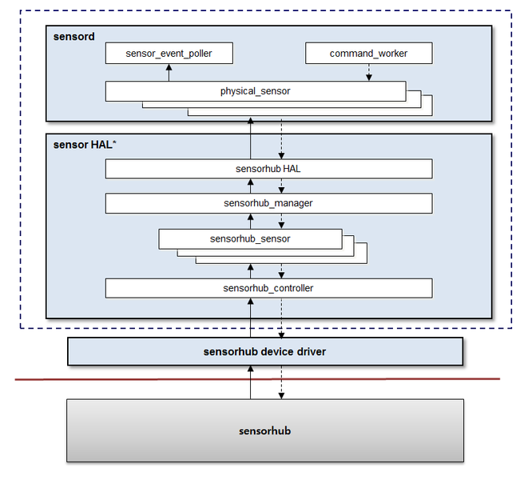

# System

You can implement various features relatesd to the System framework and the file system.

## Partition and File System

The following description is an example of the Tizen partition layout. Product vendors can modify the sequence or partition layout for their devices, as needed.

1. The `boot` partition includes the kernel image, boot-loader image, and modem image. It can also contain device driver modules.
1. The `rootfs` partition is mounted on the root directory. It contains the fundamental frameworks for Tizen and some general utilities for Linux.
1. The `system-data` partition is mounted on the `/opt` directory. It contains the platform database and platform configurations.
1. The `user` partition can be mounted on the `/opt/usr` directory separately. It contains user-installed applications.
1. External storages are mounted on `/opt/media`.
1. The partition image files (`rootfs.img`, `system-data.img`, and `user.img`) can be zipped for downloading, such as `<IMAGE_NAME>.tar.gz`.

The `/etc/fstab` directory must be modified or the `systemd` mount units must be added based on the partition layout. Consequently, the `fstab` file or system mount unit files for specific devices must be added to the `system-plugin` Git repository. The following example shows an `fstab` file:

```
/dev/root         /               ext4    defaults,noatime 0      1
LABEL=system-data /opt            ext4    defaults,noatime 0      2
LABEL=user        /opt/usr        ext4    defaults,noatime 0      3
```

### Supported File Systems

Tizen supports the Extended 4 (Ext 4) file system as the default file system.

To enable support for other file systems, such as JFS, XFS, BTRFS, and Reiserfs, the Tizen kernel must be modified and compiled. The following configuration options must be enabled in the kernel configuration file:

- `CONFIG_EXT4_FS=y`
- `CONFIG_EXT4_FS_XATTR=y`
- `CONFIG_EXT4_USE_FOR_EXT23=y`
- `CONFIG_EXT4_FS_SECURITY=y`

### File System Hierarchy

The Tizen directory hierarchy intends to follow the File System Hierarchy Standard (FHS) as much as possible, for compatibility with the Linux world. However, Tizen uses the `/opt` directory for Tizen-specific purposes: place all RW data in the `/opt` directory.

**Figure: File system hierarchy**


Directory macros for accessing the Tizen-specific directories are provided in the Tizen platform configuration metafile. The following table lists some example macros.

**Table: Example directory macros**
| Directory macro | Real path    |
| ---------------- | ------------ |
| `TZ_SYS_DATA`    | `/opt/data`  |
| `TZ_SYS_SHARE`   | `/opt/share` |
| `TZ_SYS_VAR`     | `/opt/var`   |

## System Framework

The System framework module abstracts low-level system functions and manages the Tizen system:

- `systemd` requirements for system and service management
    - Linux Kernel >= 3.4 , Linux Kernel >= 3.8 for Smack support
    - `CONFIG_CGROUPS`, `CONFIG_TIMERFD`, `CONFIG_SIGNALFD`, `CONFIG_EPOLL`, ...
- Basic resource requirements (such as CPU, memory) usage management
  - Linux Kernel >= 3.10 for `VMPRESSURE`, Linux Kernel >= 3.8 for `MEMCG SWAP`
  - `CONFIG_CGROUPS`, `CONFIG_CGROUP_SCHED`, `CONFIG_MEMCG`, `CONFIG_MEMCG_SWAP`, ...
- `deviced` requirements for device and power management
    - Device HAL layer porting
- dlog requirements  
Select a backend for the target environment and enable the appropriate kernel feature:
    - Additional KMSG patch for multiple Kmsg backend
    - Android&trade; logger driver for Android log backend
    - Userspace logger daemon

Using the Linux kernel 3.10 or above is recommended.

**Figure: System framework**


### systemd

`systemd` (ver.219) is a system and service manager for the Tizen system. It provides functionalities, such as parallelized service execution, socket and dbus activation for starting services and daemons, on-demand daemon start-up, service process management using Linux `cgroup`, automount point support, and service snapshot and restore.

The `systemd` core manages all units, such as service, socket, and mount. It stores all log data. When you add a new service daemon, you need to provide the proper system units and unit dependencies.

To use `systemd`, you must enable the `cgroup` and `autofs` options in the [Linux](https://wiki.tizen.org/Linux) kernel configuration. It also depends on dbus and some libraries.

### resourced

`resourced` is a daemon that manages system resources, such as memory and CPU.

To use most of the `resourced` functionalities, you must enable the following `cgroup` kernel features:

  - `CONFIG_CGROUPS`: Base feature
  - `CONFIG_CGROUP_SCHED`: Controls the CPU share of applications
  - `CONFIG_MEMCG`: Selects the victim in low-memory situations
  - `CONFIG_FREEZER`: Freezes background (and idle) applications
  - `CONFIG_MEMCG_SWAP`, `CONFIG_MEMCG_SWAP_ENABLED`, `CONFIG_ZRAM`, `CONFIG_ZSMALLOC`: Saves memory through compression

> **Note**
>
> To use the `resourced` freezer feature, you must install the freezer plugin by enabling `CONFIG_FREEZER`.

### deviced

`deviced` is a daemon that handles device events, such as the battery level and plug-and-play device status, and provides interfaces to manage devices, such as power, display, and external storages. If your BSP does not provide the Linux kernel-standard interface, these functionalities can require a HAL layer:

- Managing the LCD backlight state (on/off/dim)
- Managing the CPU sleep state and handling requests to lock the CPU from sleeping
- Monitoring external devices, such as USB cable, earjack, and charger
- Monitoring the battery level
- Managing external storages, such as SD card and USB storages
- Controlling the vibrator
- Setting the USB configuration for connecting to a host computer
- Powering off the LED, IR, and other features
- Using the device HAL to handle devices and get events

### dlog

Tizen provides 3 logging system backends:

- Multiple `kmsg` backend  
  Requires a kernel patch. For more information, see https://lwn.net/Articles/677047/.
- Android-logger backend  
  Utilizes the Android logger driver.
- User logger backend  
  No requirement (you do not have to enable anything from dlog)

### Porting the Smart Development Bridge (SDB)

SDB is a device management tool used for remote shell command, file transfer, controlling device log out, and USB debugging.

- To use SDB, you must install a kernel driver.  
    For example:  
    - [Gadget Driver for SLP based on Android](https://review.tizen.org/git/?p=profile/mobile/platform/kernel/linux-3.10-sc7730.git;a=blob;f=drivers/usb/gadget/slp.c;h=c0d935f5362cc5ae03807d3533fe84df88e8c354;hb=refs/heads/accepted/tizen_mobile)
    - [Gadget Driver for Samsung SDB (based on Android ADB)](https://review.tizen.org/git/?p=profile/mobile/platform/kernel/linux-3.10-sc7730.git;a=blob;f=drivers/usb/gadget/f_sdb.c;h=7f334ba01139d6bcbe7668bd84582e078d563638;hb=refs/heads/accepted/tizen_mobile)
- To recognize the target as a Tizen device, the SDB interface on the target device must have the following information in the USB interface descriptor:
    ```
    Class: 0xff
    SubClass: 0x20
    Protocol: 0x02
    ```
- When using multi-configuration, SDB must be located in the first configuration on the target multi-configuration system. The SDB client of the host PC (Linux PC) selects the first configuration.
- To recognize the USB cable connection, you must port the External Connector Class (`extcon`) to the kernel. If `extcon` cannot be ported, you can enable SDB using the following shell command:
    ```bash
    /usr/bin/direct_set_debug.sh --sdb-set
    ```

### Porting the Device HAL Interface

The device HAL is applied for the hardware-independent platform. The device HAL consists of libraries corresponding to hardware, such as display, external connector, battery, LED, and IR. The HAL is used by `deviced` (device daemon) to control hardware, and manages the events of device state changes. `deviced` opens the implemented libraries and uses the APIs to control the devices.

OEM developers must implement the API defined in the header files of the `libdevice-node` package and compile their libraries (`.so` file) for their devices.

The following code snippet shows the device HAL structure:

```cpp
#define MAKE_TAG_CONSTANT(A,B,C,D) (((A) << 24) | ((B) << 16) | ((C) << 8) | (D))
#define HARDWARE_INFO_TAG MAKE_TAG_CONSTANT('T','H','I','T')

struct hw_common;
struct hw_info {
    /* magic must be initialized to HARDWARE_INFO_TAG */
    uint32_t magic;
    /* HAL version */
    uint16_t hal_version;
    /* Device version */
    uint16_t device_version;
    /* Device ID */
    const char *id;
    /* Device name */
    const char *name;
    /* Author name */
    const char *author;
    /* Module's dynamic shared object */
    void *dso;
    /* Reserved for future use */
    uint32_t reserved[8];
    /* Open device */
    int (*open)(struct hw_info *info, const char *id, struct hw_common **common);
    /* Close device */
    int (*close)(struct hw_common *common);
};

struct hw_common {
    /* Indicate to this device information structure */
    struct hw_info *info;
};
```

#### Battery HAL

The battery HAL provides functions for getting the battery status. The HAL interface is defined in the `hw/battery.h` header file of the `libdevice-node` library, and the `pkg-config` `device-node` must be used to use the HAL interface.

The following code snippet shows the battery HAL interface:

```cpp
/*
   Device ID
*/
#define BATTERY_HARDWARE_DEVICE_ID "battery"

#define POWER_SOURCE_NONE "none"
#define POWER_SOURCE_AC "ac"
#define POWER_SOURCE_USB "usb"
#define POWER_SOURCE_WIRELESS "wireless"

/*
   Device version
*/
#define BATTERY_HARDWARE_DEVICE_VERSION MAKE_VERSION(0,1)

struct battery_info {
    char *name; /* "display" */
    char *status; /* "Charging", "Discharging", "Full", "Not charging" */
    char *health; /* "Good", "Cold", "Dead", "Overheat", "Over voltage" */
    char *power_source; /* "ac", "usb", "wireless" */
    int online; /* 0 ~ */
    int present; /* 0 or 1 */
    int capacity; /* 0 ~ 100 */
    int current_now; /* Current (uA). Positive value if power source is connected, negative value if power source is not connected */
    int current_average; /* Average current (uA). Positive value if power source is connected, negative value if power source is not connected */
};

typedef void (*BatteryUpdated)(struct battery_info *info, void *data);

struct battery_device {
    struct hw_common common;

    /* Register battery event */
    int (*register_changed_event)(BatteryUpdated updated_cb, void *data);
    void (*unregister_changed_event)(BatteryUpdated updated_cb);

    /* Get current states */
    int (*get_current_state)(BatteryUpdated updated_cb, void *data);
};
```

The following table lists the battery HAL functions.

**Table: Battery HAL functions**

| Function prototype                       | Description                              | Mandatory |
| ---------------------------------------- | ---------------------------------------- | ------------ |
| `int (*register_changed_event)(BatteryUpdated updated_cb, void *data);` | Adds a callback function which is called when battery status changes. | Yes |
| `void (*unregister_changed_event)(BatteryUpdated updated_cb);` | Removes the callback function added for the battery status event. | Yes |
| `int (*get_current_state)(BatteryUpdated updated_cb, void *data);` | Calls the function specified in the first parameter. The battery information is delivered to the function parameter. | Yes |

The following code snippet shows an example of the battery HAL:

```cpp
#define BATTERY_ROOT_PATH "/sys/class/power_supply"

static int
get_power_source(char **src) {
    int ret, val;
    ret = sys_get_int(BATTERY_ROOT_PATH"/"POWER_SOURCE_AC"/online", &val);
    if (ret >= 0 && val > 0) {
        *src = POWER_SOURCE_AC;

        return 0;
    }

    ret = sys_get_int(BATTERY_ROOT_PATH"/"POWER_SOURCE_USB"/online", &val);
    if (ret >= 0 && val > 0) {
        *src = POWER_SOURCE_USB;

        return 0;
    }

    ret = sys_get_int(BATTERY_ROOT_PATH"/"POWER_SOURCE_WIRELESS"/online", &val);
    if (ret >= 0 && val > 0) {
        *src = POWER_SOURCE_WIRELESS;

        return 0;
    }

    *src = POWER_SOURCE_NONE;

    return 0;
}

static int
battery_get_current_state(BatteryUpdated updated_cb, void *data) {
    int fd;
    struct battery_info info;
    char status[32];
    char health[32];
    char *power_source;

    if (!updated_cb)
        return -EINVAL;

    info.name = BATTERY_HARDWARE_DEVICE_ID;


    fd = open(BATTERY_ROOT_PATH"/battery/status", O_RDONLY);
    read(fd, status, sizeof(status));
    close(fd);
    info.status = status;

    fd = open(BATTERY_ROOT_PATH"/battery/health", O_RDONLY);
    read(fd, health, sizeof(health));
    close(fd);
    info.health = health;

    ....

    get_power_source(&power_source);
    info.power_source = power_source;

    updated_cb(&info, data);

    return 0;
}

static int
battery_open(struct hw_info *info, const char *id, struct hw_common **common) {
    struct battery_device *battery_dev;
    battery_dev = calloc(1, sizeof(struct battery_device));

    battery_dev->common.info = info;
    battery_dev->register_changed_event = battery_register_changed_event;
    battery_dev->unregister_changed_event = battery_unregister_changed_event;
    battery_dev->get_current_state = battery_get_current_state;

    *common = (struct hw_common *)battery_dev;

    return 0;
}

static int
battery_close(struct hw_common *common) {
    free(common);

    return 0;
}

HARDWARE_MODULE_STRUCTURE = {
    .magic = HARDWARE_INFO_TAG,
    .hal_version = HARDWARE_INFO_VERSION,
    .device_version = BATTERY_HARDWARE_DEVICE_VERSION,
    .id = BATTERY_HARDWARE_DEVICE_ID,
    .name = "battery",
    .open = battery_open,
    .close = battery_close,
};
```

#### Display HAL

The display HAL provides functions for controlling the display brightness. The HAL interface is defined in the `hw/display.h` header file of the `libdevice-node` library, and the `pkg-config` `device-node` must be used to use the HAL interface.

The following code snippet shows the display HAL interface:

```cpp
/*
   Device ID
*/
#define DISPLAY_HARDWARE_DEVICE_ID "display"

/*
   Device version
*/
#define DISPLAY_HARDWARE_DEVICE_VERSION MAKE_VERSION(0,2)

struct display_device {
    struct hw_common common;

    /* Control display brightness */
    int (*get_max_brightness)(int *brightness);
    int (*get_brightness)(int *brightness);
    int (*set_brightness)(int brightness);
};
```

The following table lists the display HAL functions.

**Table: Display HAL functions**

| Function prototype                       | Description                              | Mandatory |
| ---------------------------------------- | ---------------------------------------- | --------- |
| `int (*get_max_brightness)(int *brightness)` | Returns the maximum brightness value the display driver supports. | Yes |
| `int (*get_brightness)(int *brightness)` | Returns the current brightness value. | Yes |
| `int (*set_brightness)(int brightness)`  | Sets the brightness value.  | Yes |

The following code snippet shows an example of the display HAL:

```cpp
#ifndef BACKLIGHT_PATH
#define BACKLIGHT_PATH "/sys/class/backlight/panel"
#endif

static int
display_get_max_brightness(int *val) {
    static int max = -1;
    char buf[BUF_MAX];
    int fd;
    if (max < 0) {
        fd = open(BACKLIGHT_PATH"/max_brightness", O_RDONLY);
        read(fd, buf, sizeof(buf));
        close(fd);
        max = atoi(buf);
    }
    *val = max;

    return 0;
}

static int
display_get_brightness(int *brightness) {
    int fd;
    char buf[BUF_MAX];
    fd = open(BACKLIGHT_PATH"/brightness", O_RDONLY);
    read(fd, buf, sizeof(buf));
    close(fd);
    *brightness = atoi(buf);

    return 0;
}

static int
display_set_brightness(int brightness) {
    int max;
    char buf[BUF_MAX];
    display_get_max_brightness(&max);
    if (brightness > max)
        brightness = max;
    snprintf(buf, sizeof(buf), "%d", brightness);
    fd = open(BACKLIGHT_PATH"/brightness", O_WRONLY);
    write(fd, buf, strlen(buf));
    close(fd);

    return 0;
}

static int
display_open(struct hw_info *info,
        const char *id, struct hw_common **common) {
    struct display_device *display_dev;

    if (!info || !common)
        return -EINVAL;

    display_dev = calloc(1, sizeof(struct display_device));
    if (!display_dev)
        return -ENOMEM;

    display_dev->common.info = info;
    display_dev->get_max_brightness = display_get_max_brightness;
    display_dev->get_brightness = display_get_brightness;
    display_dev->set_brightness = display_set_brightness;

    *common = (struct hw_common *)display_dev;

    return 0;
}

static int
display_close(struct hw_common *common) {
    if (!common)
        return -EINVAL;

    free(common);

    return 0;
}

HARDWARE_MODULE_STRUCTURE = {
    .magic = HARDWARE_INFO_TAG,
    .hal_version = HARDWARE_INFO_VERSION,
    .device_version = DISPLAY_HARDWARE_DEVICE_VERSION,
    .id = DISPLAY_HARDWARE_DEVICE_ID,
    .name = "Display",
    .open = display_open,
    .close = display_close,
};
```

#### External Connector HAL

The external connector HAL provides functions for getting the external connector device status. The HAL interface is defined in the `hw/external_connection.h` header file of the `libdevice-node` library, and the `pkg-config` `device-node` needs to be used to use the HAL interface.

The following code snippet shows the interface of the external connector HAL:

```cpp
/*
   Device ID
*/
#define EXTERNAL_CONNECTION_HARDWARE_DEVICE_ID "external_connection"

#define EXTERNAL_CONNECTION_USB "USB"
#define EXTERNAL_CONNECTION_USB_HOST "USB-HOST"
#define EXTERNAL_CONNECTION_TA "TA"
#define EXTERNAL_CONNECTION_HDMI "HDMI"
#define EXTERNAL_CONNECTION_DOCK "Dock"
#define EXTERNAL_CONNECTION_MIC "Microphone"
#define EXTERNAL_CONNECTION_HEADPHONE "Headphone"

/*
   Device version
*/
#define EXTERNAL_CONNECTION_HARDWARE_DEVICE_VERSION MAKE_VERSION(0,1)

struct connection_info {
    char *name;
    char *state;
    int flags;
};

typedef void (*ConnectionUpdated)(struct connection_info *info, void *data);

struct external_connection_device {
    struct hw_common common;

    /* Register external_connection event */
    int (*register_changed_event)(ConnectionUpdated updated_cb, void *data);
    void (*unregister_changed_event)(ConnectionUpdated updated_cb);

    /* Get current states */
    int (*get_current_state)(ConnectionUpdated updated_cb, void *data);
};
```

The following table lists the external connector HAL functions.

**Table: External connector HAL functions**

| Function prototype                       | Description                              | Mandatory |
| ---------------------------------------- | ---------------------------------------- | --------- |
| `int (*register_changed_event)(ConnectionUpdated updated_cb, void *data);` | Adds a callback function which is called when the external connector status changes. | Yes |
| `void (*unregister_changed_event)(ConnectionUpdated updated_cb);` | Removes the callback function added for the external connector status event. | Yes |
| `int (*get_current_state)(ConnectionUpdated updated_cb, void *data);` | Calls the function specified in the first parameter. The external connector information is delivered to the function parameter. | Yes |

The following code snippet shows an example of the external connector HAL:

```cpp
#define SWITCH_ROOT_PATH "/sys/devices/virtual/switch"

static struct switch_device {
    char *type;
    char *name;
    int state;
} switch_devices[] = {
    {EXTERNAL_CONNECTION_USB, "usb_cable", 0},
    {EXTERNAL_CONNECTION_DOCK, "dock", 0},
    {EXTERNAL_CONNECTION_HEADPHONE, "earjack", 0},
};

static int
read_switch_state(char *path) {
    char node[128], val[8];
    FILE *fp;

    snprintf(node, sizeof(node), "%s/%s/state", SWITCH_ROOT_PATH, path);
    fp = fopen(node, "r");
    fgets(val, sizeof(val), fp));
    fclose(fp);

    return atoi(val);
}

static int
external_connection_get_current_state(ConnectionUpdated updated_cb, void *data) {
    int ret, i;
    struct connection_info info;
    char buf[8];

    for (i = 0; i < ARRAY_SIZE(switch_devices); i++) {
        ret = read_switch_state(switch_devices[i].name);
        info.name = switch_devices[i].type;
        snprintf(buf, sizeof(buf), "%d", ret);
        info.state = buf;
        updated_cb(&info, data);
    }

    return 0;
}

static int
read_switch_state(char *path) {
    char node[128], val[8];
    FILE *fp;

    snprintf(node, sizeof(node), "%s/%s/state", SWITCH_ROOT_PATH, path);
    fp = fopen(node, "r");
    fgets(val, sizeof(val), fp));
    fclose(fp);

    return atoi(val);
}

static int
external_connection_close(struct hw_common *common) {
    free(common);

    return 0;
}

HARDWARE_MODULE_STRUCTURE = {
    .magic = HARDWARE_INFO_TAG,
    .hal_version = HARDWARE_INFO_VERSION,
    .device_version = EXTERNAL_CONNECTION_HARDWARE_DEVICE_VERSION,
    .id = EXTERNAL_CONNECTION_HARDWARE_DEVICE_ID,
    .name = "external_connection",
    .open = external_connection_open,
    .close = external_connection_close,
};
```

#### LED HAL

The LED HAL provides functions for controlling LEDs. The HAL interface is defined in the `hw/led.h` header file of the `libdevice-node` library, and the `pkg-config` `device-node` must be used to use the HAL interface.

The following code snippet shows the interface of the LED HAL:

```cpp
/*
   Device ID
*/
#define LED_HARDWARE_DEVICE_ID  "led"

/*
   Device version
*/
#define LED_HARDWARE_DEVICE_VERSION MAKE_VERSION(1,0)

/*
   LED device ID
*/
#define LED_ID_CAMERA_BACK "camera_back"
#define LED_ID_CAMERA_FRONT "camera_front"
#define LED_ID_NOTIFICATION "notification"
#define LED_ID_TOUCH_KEY "touch_key"

enum led_type {
    LED_TYPE_MANUAL,
    LED_TYPE_BLINK,
};

struct led_state {
    /* LED type */
    enum led_type type;
    /*
       The first byte means opaque and the other 3 bytes are RGB values.
       You can use opaque byte as a led brightness value.
       If the first byte is 0x00, led is switched off.
       Anything else is worked as on. The max value is 0xFF.
    */
    unsigned int color;
    /* Turn on time in milliseconds */
    int duty_on;
    /* Turn off time in milliseconds */
    int duty_off;
};

struct led_device {
    struct hw_common common;

    int (*set_state)(struct led_state *state);
};
```

The following table lists the LED HAL functions.

**Table: LED HAL functions**

| Function prototype                       | Description                              | Mandatory |
| ---------------------------------------- | ---------------------------------------- | ----------- |
| `int (*set_state)(struct led_state *state);` | Sets the LED play style and plays LED lights. | Yes |

The following code snippet shows an example of the LED HAL:

```cpp
#ifndef CAMERA_BACK_PATH
#define CAMERA_BACK_PATH "/sys/class/leds/torch-sec1"
#endif

static int
camera_back_set_state(struct led_state *state) {
    static int max = -1;
    int brt;
    char buf[BUF_MAX];
    int fd;

    if (state->type == LED_TYPE_BLINK) {
        printf("camera back led does not support LED_TYPE_BLINK mode");

        return -ENOTSUP;
    }

    if (max < 0) {
        fd = open(CAMERA_BACK_PATH"/max_brightness", O_RDONLY);
        read(fd, buf, sizeof(buf));
        close(fd);
        max = atoi(buf);
    }

    brt = (state->color >> 24) & 0xFF;
    brt = brt / 255.f * max;

    snprintf(buf, sizeof(buf), "%d", brt);
    fd = open(CAMERA_BACK_PATH"/brightness", O_WRONLY);
    write(fd, buf, strlen(buf));
    close(fd);

    return 0;
}

struct led_device camera_back_dev = {
    .set_state = camera_back_set_state,
};

struct led_device_list {
    const char *id;
    struct led_device *operations;
    struct led_device *dev;
} led_list[] = {
    {LED_ID_CAMERA_BACK, &camera_back_dev, NULL},
    {LED_ID_CAMERA_FRONT, NULL, NULL},
    {LED_ID_NOTIFICATION, NULL, NULL},
    {LED_ID_TOUCH_KEY, NULL, NULL},
};

static int
led_open(struct hw_info *info, const char *id, struct hw_common **common) {
    int i, list_len, id_len;

    list_len = ARRAY_SIZE(led_list);
    id_len = strlen(id) + 1;
    for (i = 0; i < list_len; i++) {
        if (strncmp(id, led_list[i].id, id_len))
            continue;
        if (!led_list[i].operations)
            return -ENOTSUP;
        if (led_list[i].dev)
            goto out;
        break;
    }

    if (i >= list_len)
        return -EINVAL;
    led_list[i].dev = calloc(1, sizeof(struct led_device));

    led_list[i].dev->common.info = info;
    led_list[i].dev->set_state
        = led_list[i].operations->set_state;

out:
    *common = (struct hw_common *)led_list[i].dev;

    return 0;
}

static int
led_close(struct hw_common *common) {
    free(common);

    return 0;
}

HARDWARE_MODULE_STRUCTURE = {
    .magic = HARDWARE_INFO_TAG,
    .hal_version = HARDWARE_INFO_VERSION,
    .device_version = LED_HARDWARE_DEVICE_VERSION,
    .id = LED_HARDWARE_DEVICE_ID,
    .name = "Default LED",
    .open = led_open,
    .close = led_close,
};
```

#### IR HAL

The IR HAL provides functions for controlling IR transmission. The HAL interface is defined in the `hw/ir.h` header file of the `libdevice-node` library, and the `pkg-config` `device-node` must be used to use the HAL interface.

The following code snippet shows the interface of the IR HAL:

```cpp
/*
   Device ID
*/
#define IR_HARDWARE_DEVICE_ID "ir"

/*
   Device version
*/
#define IR_HARDWARE_DEVICE_VERSION MAKE_VERSION(0,1)

struct ir_device {
    struct hw_common common;

    /* Control the IR state */
    int (*is_available)(bool *available);
    int (*transmit)(int *frequency_pattern, int size);
};
```

The following table lists the IR HAL functions.

**Table: IR HAL functions**

| Function prototype                       | Description                              | Mandatory |
| ---------------------------------------- | ---------------------------------------- | --------- |
| `int (*is_available)(bool *available);`  | Returns whether the target device supports IR transmission. | Yes |
| `int (*transmit)(int *frequency_pattern, int size);` | Transmits IR with frequency pattern and its size. | Yes |

The following code snippet shows an example of the IR HAL:

```cpp
#define IRLED_CONTROL_PATH "/sys/class/ir/ir_send"

static int
ir_is_available(bool *available) {
    *available = true;

    return 0;
}

static int
ir_transmit(int *frequency_pattern, int size) {
    int i, ret;

    for (i = 0; i < size; i++) {
        snprintf(buf, sizeof(buf), "%d", frequency_pattern[i]);
        fd = open(IRLED_CONTROL_PATH, O_WRONLY);
        write(fd, buf, strlen(buf));
        close(fd);
    }

    return 0;
}

static int
ir_open(struct hw_info *info, const char *id, struct hw_common **common) {
    struct ir_device *ir_dev;

    ir_dev = calloc(1, sizeof(struct ir_device));

    ir_dev->common.info = info;
    ir_dev->is_available = ir_is_available;
    ir_dev->transmit = ir_transmit;

    *common = (struct hw_common *)ir_dev;

    return 0;
}

static int
ir_close(struct hw_common *common) {
    free(common);

    return 0;
}

HARDWARE_MODULE_STRUCTURE = {
    .magic = HARDWARE_INFO_TAG,
    .hal_version = HARDWARE_INFO_VERSION,
    .device_version = IR_HARDWARE_DEVICE_VERSION,
    .id = IR_HARDWARE_DEVICE_ID,
    .name = "ir",
    .open = ir_open,
    .close = ir_close,
};
```

#### Touchscreen HAL

The touchscreen HAL provides functions for switching the touchscreen on and off. The HAL interface is defined in the `hw/touchscreenf.h` header file of the `libdevice-node` library, and the `pkg-config` `device-node` must be used to use the HAL interface.

The following code snippet shows the interface of the touchscreen HAL:

```cpp
/*
   Device ID
*/
#define TOUCHSCREEN_HARDWARE_DEVICE_ID "touchscreen"

/*
   Device version
*/
#define TOUCHSCREEN_HARDWARE_DEVICE_VERSION MAKE_VERSION(0,1)

enum touchscreen_state {
    TOUCHSCREEN_OFF, /* Disable touchscreen */
    TOUCHSCREEN_ON, /* Enable touchscreen */
};

struct touchscreen_device {
    struct hw_common common;

    /* Control touchscreen state */
    int (*get_state)(enum touchscreen_state *state);
    int (*set_state)(enum touchscreen_state state);
};
```

The following table lists the touchscreen HAL functions.

**Table: Touchscreen HAL functions**

| Function prototype                       | Description                              | Mandatory |
| ---------------------------------------- | ---------------------------------------- | --------- |
| `int (*get_state)(enum touchscreen_state *state);` | Returns whether the touchscreen is enabled. | Yes |
| `int (*set_state)(enum touchscreen_state state);` | Enables and disables the touchscreen. | Yes |

The following code snippet shows an example of the touchscreen HAL:

```cpp
#define TURNON_TOUCHSCREEN 1
#define TURNOFF_TOUCHSCREEN 0
#define TOUCHSCREEN_PATH "/sys/class/input/touchscreen/enable"

static int
touchscreen_get_state(enum touchscreen_state *state) {
    int val;
    int fd;
    char buf[BUF_MAX];

    fd = open(TOUCHSCREEN_PATH, O_RDONLY);
    read(fd, buf, sizeof(buf));
    close(fd);
    val = atoi(buf);

    switch (val) {
    case TURNOFF_TOUCHSCREEN:
        *state = TOUCHSCREEN_OFF;
        break;
    case TURNON_TOUCHSCREEN:
        *state = TOUCHSCREEN_ON;
        break;
    default:
        return -EINVAL;
    }

    return 0;
}

static int
touchscreen_set_state(enum touchscreen_state state) {
    int val;
    char buf[BUF_MAX];

    switch (state) {
    case TOUCHSCREEN_OFF:
        val = TURNOFF_TOUCHSCREEN;
        break;
    case TOUCHSCREEN_ON:
        val = TURNON_TOUCHSCREEN;
        break;
    default:
        return -EINVAL;
    }

    snprintf(buf, sizeof(buf), "%d", val);
    fd = open(TOUCHSCREEN_PATH, O_WRONLY);
    write(fd, buf, strlen(buf));
    close(fd);

    return ret;
}

static int
touchscreen_open(struct hw_info *info, const char *id, struct hw_common **common) {
    struct touchscreen_device *touchscreen_dev;

    touchscreen_dev = calloc(1, sizeof(struct touchscreen_device));

    touchscreen_dev->common.info = info;
    touchscreen_dev->get_state = touchscreen_get_state;
    touchscreen_dev->set_state = touchscreen_set_state;

    *common = (struct hw_common *)touchscreen_dev;

    return 0;
}

static int
touchscreen_close(struct hw_common *common) {
    free(common);

    return 0;
}

HARDWARE_MODULE_STRUCTURE = {
    .magic = HARDWARE_INFO_TAG,
    .hal_version = HARDWARE_INFO_VERSION,
    .device_version = TOUCHSCREEN_HARDWARE_DEVICE_VERSION,
    .id = TOUCHSCREEN_HARDWARE_DEVICE_ID,
    .name = "touchscreen",
    .open = touchscreen_open,
    .close = touchscreen_close,
};
```

## Sensor Framework

Sensor devices are used widely in mobile devices to enhance the user experience. Most modern mobile operating systems have a framework which manages hardware and virtual sensors on the platform and provides convenient APIs to the application.

Sensors can be classified into hardware and virtual sensors. Tizen supports individual HALs for the following sensors:

- Hardware sensors
  - Accelerometer
  - Geomagnetic sensor
  - Gyroscope
  - Light sensor
  - Proximity sensor
  - Pressure sensor
  - Ultraviolet sensor
  - Temperature sensor
  - Humidity sensor
  - HRM (Heart Rate Monitor)
  - HRM LED green sensor
  - HRM LED IR sensor
  - HRM LED red sensor
  - Uncalibrated geomagnetic sensor
  - Uncalibrated gyroscope sensor
  - Human pedometer
  - Human sleep monitor
  - Human sleep detector
  - Human stress monitor
- Virtual sensors
  - Orientation sensor
  - Gravity sensor
  - Linear acceleration sensor
  - Rotation vector sensor
  - Gyroscope rotation vector sensor
  - Geomagnetic rotation vector sensor

The sensor framework provides a sensor server for managing sensor HALs and a medium through which client applications are connected to the sensor handler to exchange data.

**Figure: Sensor framework architecture**


The sensor HALs retrieve data from sensor hardware and enable client applications to use the data for specific requirements.

The Sensor framework consists of the following components:

- Sensor client library  
Any application that wants to access the sensor server and communicate with it must use the sensor API library. Using the Sensor API, the application can control sensors and receive sensor events from the sensor server. By using the sensor API, any application or middleware framework can have the sensor client library executing within its own process context.
- Sensor server  
The sensor server is a daemon which communicates uniquely to multiple sensors (through drivers) in the system and dispatches sensor data or events back to the application. The sensor server is responsible for initializing the sensors during boot, driver configuration, sensor data fetching and delivery, and managing all sensors and clients on the platform.
- Sensor HAL (Hardware Abstraction Layer)  
The sensor HAL, which is interfaced to the sensor server, is responsible for interacting with the sensor drivers. The HAL processes data from the sensor drivers and communicates it to the server. Hardware sensors must support the HAL. The sensor HAL is implemented as a shared library. The `sensor_loader` finds the `hal.so` library in the `/usr/lib/sensor/` directory, and loads it at boot time.

### Porting the HAL Interface

You can port individual sensors or a sensorhub.

#### Sensor

To port new hardware sensors, the HAL library-inherited `sensor_device` interface must be implemented. The HAL header files can be found at `git:sensord/src/hal`.

The Tizen HAL sensor types are also defined in the `sensor_hal_types.h` header file under the names `SENSOR_DEVICE_...`.

**Figure: Sensor HAL**


The following code snippet shows the interface of the sensor HAL in the `sensor_hal.h` header file:

```cpp
/*
   Create devices
*/
typedef void *sensor_device_t;
typedef int (*create_t)(sensor_device_t **devices);

/*
   Sensor device interface
   1 device must be abstracted from 1 device event node
*/
class sensor_device {
public:
    virtual ~sensor_device() {}

    uint32_t get_hal_version(void) {
        return SENSOR_HAL_VERSION(1, 0);
    }

    virtual int get_poll_fd(void) = 0;
    virtual int get_sensors(const sensor_info_t **sensors) = 0;

    virtual bool enable(uint32_t id) = 0;
    virtual bool disable(uint32_t id) = 0;

    virtual int read_fd(uint32_t **ids) = 0;
    virtual int get_data(uint32_t id, sensor_data_t **data, int *length) = 0;

    virtual bool set_interval(uint32_t id, unsigned long val) {
        return true;
    }
    virtual bool set_batch_latency(uint32_t id, unsigned long val) {
        return true;
    }
    virtual bool set_attribute_int(uint32_t id, int32_t attribute, int32_t value) {
        return true;
    }
    virtual bool set_attribute_str(uint32_t id, int32_t attribute, char *value, int value_len) {
        return true;
    }
    virtual bool flush(uint32_t id) {
        return true;
    }
};
```

The following table describes the functions of the `sensor_device` interface.

**Table: sensor_device interface functions**

| Prototype                                | Description                              | Return value      |
| ---------------------------------------- | ---------------------------------------- | ----------------- |
| `uint32_t get_hal_version(void)`         | Returns the HAL version.                 | Version           |
| `int get_poll_fd(void)`                  | Returns the file description to poll events. | `fd`              |
| `int get_sensors(const sensor_info_t **sensors)` | Returns the list of supported sensors. See the `sensor_info_t` in the `sensor_hal_types.h` header file. | Size              |
| `bool enable(uint32_t id)`               | Enables the sensor.                      | `true` on success |
| `bool disable(uint32_t id)`              | Disables the sensor.                     | `true` on success |
| `int read_fd(uint32_t **ids)`            | Returns the sensor device IDs. The sensor framework calls this function when an event is detected from the `poll-fd`. | Size              |
| `int get_data(uint32_t id, sensor_data_t **data, int *length)` | Updates the `sensor_data_t` object (data) with details about the sensor, such as accuracy, timestamp, and values. Note that the `sensor_data_t` object must be created using the `malloc()` function. | 0 on success      |
| `bool set_interval(uint32_t id, unsigned long val)` | Sets the interval.                       | `true` on success |
| `bool set_batch_latency(uint32_t id, unsigned long val)` | Sets the batch latency.                   | `true` on success |
| `bool set_attribute_int(uint32_t id, int32_t attribute, int32_t value)` | Sets the `int` value to the attribute.   | `true` on success |
| `bool set_attribute_str(uint32_t id, int32_t attribute, char *value, int value_len)` | Sets the `string` value to the attribute.      | `true` on success |
| `bool flush(uint32_t id)`                | Flushes the sensor events.               | `true` on success |
| `int (create_t *)(sensor_device_t **devices)` | Returns the `sensor_device` list. To create the sensor module in `sensord`, you must implement this interface. | Size              |

The following code snippet shows the interface of the sensor HAL types in the `sensor_hal_type.h` header file:

```cpp
/*
   Sensor Types
   These types are used to control the sensors

   - base unit
     acceleration values : meter per second^2 (m/s^2)
     magnetic values     : micro-Tesla (uT)
     orientation values  : degrees
     gyroscope values    : degree/s
     temperature values  : degrees centigrade
     proximity values    : distance
     light values        : lux
     pressure values     : hectopascal (hPa)
     humidity            : relative humidity (%)
*/
typedef enum {
    SENSOR_DEVICE_UNKNOWN = -2,
    SENSOR_DEVICE_ALL = -1,
    SENSOR_DEVICE_ACCELEROMETER,
    SENSOR_DEVICE_GRAVITY,
    SENSOR_DEVICE_LINEAR_
    SENSOR_DEVICE_GEOMAGNETIC,
    SENSOR_DEVICE_ROTATION_VECTOR,
    SENSOR_DEVICE_ORIENTATION,
    SENSOR_DEVICE_GYROSCOPE,
    SENSOR_DEVICE_LIGHT,
    SENSOR_DEVICE_PROXIMITY,
    SENSOR_DEVICE_PRESSURE,
    SENSOR_DEVICE_ULTRAVIOLET,
    SENSOR_DEVICE_TEMPERATURE,
    SENSOR_DEVICE_HUMIDITY,
    SENSOR_DEVICE_HRM,
    SENSOR_DEVICE_HRM_LED_GREEN,
    SENSOR_DEVICE_HRM_LED_IR,
    SENSOR_DEVICE_HRM_LED_RED,
    SENSOR_DEVICE_GYROSCOPE_UNCAL,
    SENSOR_DEVICE_GEOMAGNETIC_UNCAL,
    SENSOR_DEVICE_GYROSCOPE_RV,
    SENSOR_DEVICE_GEOMAGNETIC_RV,

    SENSOR_DEVICE_HUMAN_PEDOMETER = 0x300,
    SENSOR_DEVICE_HUMAN_SLEEP_MONITOR,
    SENSOR_DEVICE_HUMAN_SLEEP_DETECTOR,
    SENSOR_DEVICE_HUMAN_STRESS_MONITOR,

    SENSOR_DEVICE_EXERCISE_WALKING = 0x400,
    SENSOR_DEVICE_EXERCISE_RUNNING,
    SENSOR_DEVICE_EXERCISE_HIKING,
    SENSOR_DEVICE_EXERCISE_CYCLING,
    SENSOR_DEVICE_EXERCISE_ELLIPTICAL,
    SENSOR_DEVICE_EXERCISE_INDOOR_CYCLING,
    SENSOR_DEVICE_EXERCISE_ROWING,
    SENSOR_DEVICE_EXERCISE_STEPPER,

    SENSOR_DEVICE_FUSION = 0x900,
    SENSOR_DEVICE_AUTO_ROTATION,
    SENSOR_DEVICE_AUTO_BRIGHTNESS,

    SENSOR_DEVICE_GESTURE_MOVEMENT = 0x1200,
    SENSOR_DEVICE_GESTURE_WRIST_UP,
    SENSOR_DEVICE_GESTURE_WRIST_
    SENSOR_DEVICE_GESTURE_MOVEMENT_STATE,

    SENSOR_DEVICE_ACTIVITY_TRACKER = 0x1A00,
    SENSOR_DEVICE_ACTIVITY_LEVEL_MONITOR,
} sensor_device_type;
```

The following code snippet shows the interface of the sensor HAL information in the `sensor_hal_type.h` header file:

```cpp
/*
   A platform sensor handler is generated based on this handle
   This ID can be assigned by HAL developer, so it must be unique in 1 sensor_device.
*/
typedef struct sensor_info_t {
    uint32_t
    const char *name;
    sensor_device_type type;
    unsigned int event_type; /* for Internal API */
    const char *model_name;
    const char *vendor;
    float min_range;
    float max_range;
    float resolution;
    int min_interval;
    int max_batch_count;
    bool wakeup_supported;
} sensor_info_t;

enum sensor_accuracy_t {
    SENSOR_ACCURACY_UNDEFINED = -1,
    SENSOR_ACCURACY_BAD = 0,
    SENSOR_ACCURACY_NORMAL = 1,
    SENSOR_ACCURACY_GOOD = 2,
    SENSOR_ACCURACY_VERYGOOD = 3
};

#define SENSOR_DATA_VALUE_SIZE 16

/* sensor_data_t */
typedef struct sensor_data_t {
    int accuracy;
    unsigned long long timestamp;
    int value_count;
    float values[SENSOR_DATA_VALUE_SIZE];
} sensor_data_t;

#define SENSOR_PEDOMETER_DATA_DIFFS_SIZE	20

typedef struct {
    int accuracy;
    unsigned long long timestamp;
    int value_count; /* value_count == 8 */
    float values[SENSOR_DATA_VALUE_SIZE];
    /* values = {step count, walk step count, run step count,
	         moving distance, calorie burned, last speed,
	         last stepping frequency (steps per sec),
	         last step status (walking, running, ...)} */
    /* Additional data attributes (not in sensor_data_t)*/
    int diffs_count;
    struct differences {
        int timestamp;
        int steps;
        int walk_steps;
        int run_steps;
        int walk_up_steps;
        int walk_down_steps;
        int run_up_steps;
        int run_down_steps;
        float distance;
        float calories;
        float speed;
    } diffs[SENSOR_PEDOMETER_DATA_DIFFS_SIZE];
} sensor_pedometer_data_t;

#define CONVERT_TYPE_ATTR(type, index) ((type) << 8 | 0x80 | (index))

enum sensor_attribute {
    SENSOR_ATTR_ACTIVITY = CONVERT_TYPE_ATTR(SENSOR_DEVICE_ACTIVITY_TRACKER, 0x1),
};

enum sensor_activity {
    SENSOR_ACTIVITY_UNKNOWN = 1,
    SENSOR_ACTIVITY_STILL = 2,
    SENSOR_ACTIVITY_WALKING = 4,
    SENSOR_ACTIVITY_RUNNING = 8,
    SENSOR_ACTIVITY_IN_VEHICLE = 16,
    SENSOR_ACTIVITY_ON_BICYCLE = 32,
};
```

The following code snippet shows an example of the `sensor_device` implementation for the accelerometer (`sensor-hal-tm1/src/`):

```cpp
/* In create.cpp */
#include <sensor/sensor_hal.h>
#include <sensor_log.h>
#include <vector>

#include "accel/accel_device.h"

static std::vector<sensor_device_t> devs;

template<typename _sensor>
void
create_sensor(const char *name) {
    sensor_device *instance = NULL;
    try {
        instance = new _sensor;
    } catch (std::exception &e) {
        ERR("Failed to create %s sensor device, exception: %s", name, e.what());

        return;
    } catch (int err) {
        _ERRNO(err, _E, "Failed to create %s sensor device", name);

        return;
    }

    devs.push_back(instance);
}

extern "C" int create(sensor_device_t **devices) {
#ifdef ENABLE_ACCEL
    create_sensor<accel_device>("Accelerometer");
#endif

    *devices = &devs[0];

    return devs.size();
}
```

```cpp
/* In accel_device.h */
#ifndef _ACCEL_DEVICE_H_
#define _ACCEL_DEVICE_H_

#include <sensor/sensor_hal.h>
#include <string>
#include <vector>
#include <functional>

class accel_device : public sensor_device {
public:
    accel_device();
    virtual ~accel_device();

    int get_poll_fd(void);
    int get_sensors(const sensor_info_t **sensors);

    bool enable(uint32_t id);
    bool disable(uint32_t id);

    bool set_interval(uint32_t id, unsigned long val);

    int read_fd(uint32_t **ids);
    int get_data(uint32_t id, sensor_data_t **data, int *length);

private:
    int m_node_handle;
    int m_x;
    int m_y;
    int m_z;
    unsigned long m_polling_interval;
    unsigned long long m_fired_time;
    bool m_sensorhub_controlled;

    int m_method;
    std::string m_data_node;
    std::string m_enable_node;
    std::string m_interval_node;

    std::function<bool (void)> update_value;

    std::vector<uint32_t> event_ids;

    bool update_value_input_event(void);
    bool update_value_iio(void);

    void raw_to_base(sensor_data_t *data);
};
#endif /* _ACCEL_DEVICE_H_ */
```

```cpp
/* In accel_device.cpp */
#include <fcntl.h>
#include <unistd.h>
#include <sys/types.h>
#include <sys/stat.h>

#include <linux/input.h>
#include <sys/ioctl.h>
#include <poll.h>

#include <util.h>
#include <sensor_common.h>
#include <sensor_log.h>

#include "accel_device.h"

#define MODEL_NAME "K2HH"
#define VENDOR "ST Microelectronics"
#define RESOLUTION 16
#define RAW_DATA_UNIT 0.122
#define MIN_INTERVAL 1
#define MAX_BATCH_COUNT 0

#define SENSOR_NAME "SENSOR_ACCELEROMETER"
#define SENSOR_TYPE_ACCEL		"ACCEL"

#define INPUT_NAME	"accelerometer_sensor"
#define ACCEL_SENSORHUB_POLL_NODE_NAME "accel_poll_delay"

#define GRAVITY 9.80665
#define G_TO_MG 1000
#define RAW_DATA_TO_G_UNIT(X) (((float)(X))/((float)G_TO_MG))
#define RAW_DATA_TO_METRE_PER_SECOND_SQUARED_UNIT(X) (GRAVITY * (RAW_DATA_TO_G_UNIT(X)))

#define MIN_RANGE(RES) (-((1 << (RES))/2))
#define MAX_RANGE(RES) (((1 << (RES))/2)-1)

static sensor_info_t sensor_info = {
    id: 0x1,
    name: SENSOR_NAME,
    type: SENSOR_DEVICE_ACCELEROMETER,
    event_type: (SENSOR_DEVICE_ACCELEROMETER << SENSOR_EVENT_SHIFT) | RAW_DATA_EVENT,
    model_name: MODEL_NAME,
    vendor: VENDOR,
    min_range: MIN_RANGE(RESOLUTION) * RAW_DATA_TO_METRE_PER_SECOND_SQUARED_UNIT(RAW_DATA_UNIT),
    max_range: MAX_RANGE(RESOLUTION) * RAW_DATA_TO_METRE_PER_SECOND_SQUARED_UNIT(RAW_DATA_UNIT),
    resolution: RAW_DATA_TO_METRE_PER_SECOND_SQUARED_UNIT(RAW_DATA_UNIT),
    min_interval: MIN_INTERVAL,
    max_batch_count: MAX_BATCH_COUNT,
    wakeup_supported: false
};

accel_device::accel_device()
: m_node_handle(-1)
, m_x(-1)
, m_y(-1)
, m_z(-1)
, m_polling_interval(1000)
, m_fired_time(0)
, m_sensorhub_controlled(false) {
    const std::string sensorhub_interval_node_name = ACCEL_SENSORHUB_POLL_NODE_NAME;

    node_info_query query;
    node_info info;

    query.sensorhub_controlled = m_sensorhub_controlled = util::is_sensorhub_controlled(sensorhub_interval_node_name);
    query.sensor_type = SENSOR_TYPE_ACCEL;
    query.key = INPUT_NAME;
    query.iio_enable_node_name = "accel_enable";
    query.sensorhub_interval_node_name = sensorhub_interval_node_name;

    if (!util::get_node_info(query, info)) {
        _E("Failed to get node info");
        throw ENXIO;
    }

    util::show_node_info(info);

    m_method = info.method;
    m_data_node = info.data_node_path;
    m_enable_node = info.enable_node_path;
    m_interval_node = info.interval_node_path;

    m_node_handle = open(m_data_node.c_str(), O_RDONLY);

    if (m_node_handle < 0) {
        _ERRNO(errno, _E, "accel handle open fail for accel processor");
        throw ENXIO;
    }

    if (m_method == INPUT_EVENT_METHOD) {
        if (!util::set_monotonic_clock(m_node_handle))
            throw ENXIO;

        update_value = [=]() {
            return this->update_value_input_event();
        };
    } else {
        if (!info.buffer_length_node_path.empty())
            util::set_node_value(info.buffer_length_node_path, 480);

        if (!info.buffer_enable_node_path.empty())
            util::set_node_value(info.buffer_enable_node_path, 1);

        update_value = [=]() {
            return this->update_value_iio();
        };
    }

    _I("accel_device is created!");
}

accel_device::~accel_device() {
    close(m_node_handle);
    m_node_handle = -1;

    _I("accel_device is destroyed!");
}

int
accel_device::get_poll_fd(void) {
    return m_node_handle;
}

int
accel_device::get_sensors(const sensor_info_t **sensors) {
    *sensors = &sensor_info;

    return 1;
}

bool
accel_device::enable(uint32_t id) {
    util::set_enable_node(m_enable_node, m_sensorhub_controlled, true, SENSORHUB_ACCELEROMETER_ENABLE_BIT);
    set_interval(id, m_polling_interval);

    m_fired_time = 0;
    _I("Enable accelerometer sensor");

    return true;
}

bool
accel_device::disable(uint32_t id) {
    util::set_enable_node(m_enable_node, m_sensorhub_controlled, false, SENSORHUB_ACCELEROMETER_ENABLE_BIT);

    _I("Disable accelerometer sensor");

    return true;
}

bool
accel_device::set_interval(uint32_t id, unsigned long val) {
    unsigned long long polling_interval_ns;

    polling_interval_ns = ((unsigned long long)(val) * 1000llu * 1000llu);

    if (!util::set_node_value(m_interval_node, polling_interval_ns)) {
        _E("Failed to set polling resource: %s", m_interval_node.c_str());

        return false;
    }

    _I("Interval is changed from %dms to %dms", m_polling_interval, val);
    m_polling_interval = val;

    return true;
}

bool
accel_device::update_value_input_event(void) {
    int accel_raw[3] = {0,};
    bool x,y,z;
    int read_input_cnt = 0;
    const int INPUT_MAX_BEFORE_SYN = 10;
    unsigned long long fired_time = 0;
    bool syn = false;

    x = y = z = false;

    struct input_event accel_input;
    _D("accel event detection!");

    while ((syn == false) && (read_input_cnt < INPUT_MAX_BEFORE_SYN)) {
        int len = read(m_node_handle, &accel_input, sizeof(accel_input));
        if (len != sizeof(accel_input)) {
            _E("accel_file read fail, read_len = %d",len);

            return false;
        }

        ++read_input_cnt;

        if (accel_input.type == EV_REL) {
            switch (accel_input.code) {
            case REL_X:
                accel_raw[0] = (int)accel_input.value;
                x = true;
                break;
            case REL_Y:
                accel_raw[1] = (int)accel_input.value;
                y = true;
                break;
            case REL_Z:
                accel_raw[2] = (int)accel_input.value;
                z = true;
                break;
            default:
                _E("accel_input event[type = %d, code = %d] is unknown.", accel_input.type, accel_input.code);

                return false;
                break;
            }
        } else if (accel_input.type == EV_SYN) {
            syn = true;
            fired_time = util::get_timestamp(&accel_input.time);
        } else {
            _E("accel_input event[type = %d, code = %d] is unknown.", accel_input.type, accel_input.code);

            return false;
        }
    }

    if (syn == false) {
        _E("EV_SYN didn't come until %d inputs had come", read_input_cnt);

        return false;
    }

    if (x)
        m_x =  accel_raw[0];
    if (y)
        m_y =  accel_raw[1];
    if (z)
        m_z =  accel_raw[2];

    m_fired_time = fired_time;

    _D("m_x = %d, m_y = %d, m_z = %d, time = %lluus", m_x, m_y, m_z, m_fired_time);

    return true;
}

bool
accel_device::update_value_iio(void) {
    struct {
        int16_t x;
        int16_t y;
        int16_t z;
        int64_t timestamp;
    } __attribute__((packed)) data;

    struct pollfd pfd;

    pfd.fd = m_node_handle;
    pfd.events = POLLIN | POLLERR;
    pfd.revents = 0;

    int ret = poll(&pfd, 1, -1);

    if (ret == -1) {
        _ERRNO(errno, _E, "Failed to poll from m_node_handle:%d", m_node_handle);

        return false;
    } else if (!ret) {
        _E("poll timeout m_node_handle:%d", m_node_handle);

        return false;
    }

    if (pfd.revents & POLLERR) {
        _E("poll exception occurred! m_node_handle:%d", m_node_handle);

        return false;
    }

    if (!(pfd.revents & POLLIN)) {
        _E("poll nothing to read! m_node_handle:%d, pfd.revents = %d", m_node_handle, pfd.revents);

        return false;
    }

    int len = read(m_node_handle, &data, sizeof(data));

    if (len != sizeof(data)) {
        _E("Failed to read data, m_node_handle:%d read_len:%d", m_node_handle, len);

        return false;
    }

    m_x = data.x;
    m_y = data.y;
    m_z = data.z;
    m_fired_time = data.timestamp;

    _D("m_x = %d, m_y = %d, m_z = %d, time = %lluus", m_x, m_y, m_z, m_fired_time);

    return true;
}

int
accel_device::read_fd(uint32_t **ids) {
    if (!update_value()) {
        _D("Failed to update value");

        return false;
    }

    event_ids.clear();
    event_ids.push_back(sensor_info.id);

    *ids = &event_ids[0];

    return event_ids.size();
}

int
accel_device::get_data(uint32_t id, sensor_data_t **data, int *length) {
    sensor_data_t *sensor_data;

    /* [Important] In HAL, you MUST allocate memory for data.
     * HAL does not need to release this memory because it must be released only after sending this data to clients.
    */
    sensor_data = (sensor_data_t *)malloc(sizeof(sensor_data_t));
    retvm_if(!sensor_data, -ENOMEM, "Memory allocation failed");

    sensor_data->accuracy = SENSOR_ACCURACY_GOOD;
    sensor_data->timestamp = m_fired_time;
    sensor_data->value_count = 3;
    sensor_data->values[0] = m_x;
    sensor_data->values[1] = m_y;
    sensor_data->values[2] = m_z;

    raw_to_base(sensor_data);

    *data = sensor_data;
    *length = sizeof(sensor_data_t);

    return 0;
}

void
accel_device::raw_to_base(sensor_data_t *data) {
    data->values[0] = RAW_DATA_TO_METRE_PER_SECOND_SQUARED_UNIT(data->values[0] * RAW_DATA_UNIT);
    data->values[1] = RAW_DATA_TO_METRE_PER_SECOND_SQUARED_UNIT(data->values[1] * RAW_DATA_UNIT);
    data->values[2] = RAW_DATA_TO_METRE_PER_SECOND_SQUARED_UNIT(data->values[2] * RAW_DATA_UNIT);
}
```

#### Sensorhub

The sensorhub HAL supports multiple sensors logically from 1 physical device file. If many sensors are supported by a single device file, the sensorhub HAL can be configured so that it can operate each sensor as a logically-separate device.

The sensor HAL interface is provided to manufacturers and vendors through the `sensor_hal.h` and `sensor_hal_types.h` header files. It uses just 1 thread for polling sensor events from multiple device files.

**Figure: Sensorhub HAL**



The sensorhub HAL can be developed by using the `sensor_device` interface. An example of a sensorhub HAL can be found in the `sensor-hal-tm1/src/sensorhub` Git.

IDs can be assigned by the vendor or manufacturer for the sensorhub sensors by using the following `sensor_info_t` interface:

```cpp
typedef struct sensor_info_t {
    uint32_t id;
    const char *name;
    sensor_device_type type;
    unsigned int event_type; /* For Internal API */
    const char *model_name;
    const char *vendor;
    float min_range;
    float max_range;
    float resolution;
    int min_interval;
    int max_batch_count;
    bool wakeup_supported;
} sensor_info_t;
```

The following code snippet shows an example of a sensorhub HAL implementation:

```cpp
#include <algorithm>
#include <sensor_log.h>

#include "sensorhub.h"
#include "sensorhub_controller.h"
#include "sensorhub_manager.h"
#include "system_state.h"

sensorhub_device::sensorhub_device() {
    controller = &sensorhub_controller::get_instance();
    if (!controller) {
        ERR("Failed to allocated memory");
        throw;
    }

    manager = &sensorhub_manager::get_instance();
    if (!manager) {
        ERR("Failed to allocated memory");
        throw;
    }
    manager->set_controller(controller);
    system_state_handler::get_instance().set_controller(controller);

    INFO("sensorhub_device is created!");
}

sensorhub_device::~sensorhub_device() {
    INFO("sensorhub_device is destroyed!");
}

int
sensorhub_device::get_poll_fd(void) {
    return controller->get_poll_fd();
}

int
sensorhub_device::get_sensors(const sensor_info_t **sensors) {
    int size;
    size = manager->get_sensors(sensors);

    return size;
}

bool
sensorhub_device::enable(uint32_t id) {
    system_state_handler::get_instance().initialize();

    controller->enable();
    sensorhub_sensor *sensor = manager->get_sensor(id);

    if (!sensor) {
        ERR("Failed to enable sensor(0x%x)", id);

        return false;
    }

    return sensor->enable();
}

bool
sensorhub_device::disable(uint32_t id) {
    system_state_handler::get_instance().finalize();

    controller->disable();
    sensorhub_sensor *sensor = manager->get_sensor(id);

    if (!sensor) {
        ERR("Failed to disable sensor(0x%x)", id);

        return false;
    }

    return sensor->disable();
}

bool
sensorhub_device::set_interval(uint32_t id, unsigned long val) {
    sensorhub_sensor *sensor = manager->get_sensor(id);

    if (!sensor) {
        ERR("Failed to set interval to sensor(0x%x)", id);

        return false;
    }

    return sensor->set_interval(val);
}

bool
sensorhub_device::set_batch_latency(uint32_t id, unsigned long val) {
    sensorhub_sensor *sensor = manager->get_sensor(id);

    if (!sensor) {
        ERR("Failed to set batch latency to sensor(0x%x)", id);

        return false;
    }

    return sensor->set_batch_latency(val);
}

bool
sensorhub_device::set_attribute_int(uint32_t id, int32_t attribute, int32_t value) {
    int ret;

    sensorhub_sensor *sensor = manager->get_sensor(id);

    if (!sensor) {
        ERR("Failed to set attribute to sensor(0x%x)", id);

        return false;
    }

    ret = sensor->set_attribute_int(attribute, value);

    if ((ret < 0) && (ret != -EBUSY)) {
        ERR("Failed to send sensorhub data");

        return false;
    }

    if (ret == -EBUSY) {
        WARN("Command is sent during sensorhub firmware update");

        return false;
    }

    return true;
}

bool
sensorhub_device::set_attribute_str(uint32_t id, int32_t attribute, char *value, int value_len) {
    int ret;

    sensorhub_sensor *sensor = manager->get_sensor(id);

    if (!sensor) {
        ERR("Failed to set attribute to sensor(0x%x)", id);

        return false;
    }

    ret = sensor->set_attribute_str(attribute, value, value_len);

    if ((ret < 0) && (ret != -EBUSY)) {
        ERR("Failed to send sensorhub data");

        return false;
    }

    if (ret == -EBUSY) {
        WARN("Command is sent during sensorhub firmware update");

        return false;
    }

    return true;
}

int
sensorhub_device::read_fd(uint32_t **ids) {
    sensorhub_data_t data;

    /* Step 1 */
    if (!controller->read_fd(data))
        return 0;

    /* Step 2 */
    const char *hub_data = data.values;
    int data_len = data.value_count;

    /* Step 3 */
    event_ids.clear();

    while (data_len > 0) {
        DBG("Remaining data length: %d", data_len);
        int parsed = parse(hub_data, data_len);
        if (parsed < 0) {
            ERR("Parsing failed");
            break;
        }

        data_len -= parsed;
        hub_data += parsed;
    }

    /* Step 4 */
    int size = event_ids.size();

    if (event_ids.empty())
        return 0;

    *ids = &event_ids[0];

    return size;
}

int
sensorhub_device::get_data(uint32_t id, sensor_data_t **data, int *length) {
    int remains = 1;

    sensorhub_sensor *sensor = manager->get_sensor(id);
    if (!sensor) {
        ERR("Failed to get data from sensor(0x%x)", id);

        return -1;
    }

    remains = sensor->get_data(data, length);

    return remains;
}

bool
sensorhub_device::flush(uint32_t id) {
    return false;
}

int
sensorhub_device::parse(const char *hub_data, int data_len) {
    return parse_data(hub_data, data_len);
}

int
sensorhub_device::parse_data(const char *hub_data, int data_len) {
    const char *cursor = hub_data;
    int32_t libtype = 0;

    sensorhub_sensor *sensor = manager->get_sensor(libtype);
    if (!sensor) {
        ERR("Unknown Sensorhub lib type: %d", libtype);

        return -1;
    }

    event_ids.push_back(sensor->get_id());

    return sensor->parse(cursor, data_len);
}

int
sensorhub_device::parse_debug(const char *hub_data, int data_len) {
    return 0;
}
```

```cpp
#include <unistd.h>
#include <string.h>
#include <fcntl.h>
#include <sys/stat.h>
#include <dirent.h>
#include <linux/input.h>
#include <sys/ioctl.h>
#include <fstream>

#include <sensor_log.h>
#include <util.h>
#include "sensorhub_controller.h"

sensorhub_controller::sensorhub_controller()
: m_enabled(false)
, m_poll_node(-1)
, m_data_node(-1) {}

sensorhub_controller::~sensorhub_controller() {}

sensorhub_controller& sensorhub_controller::get_instance(void) {
    static sensorhub_controller instance;

    return instance;
}

int
sensorhub_controller::get_poll_fd(void) {
    /* Returns the sensorhub fd */

    return -1;
}

bool
sensorhub_controller::enable(void) {
    m_enabled = true;
    INFO("Enable Sensorhub");

    return true;
}

bool
sensorhub_controller::disable(void) {
    m_enabled = false;
    INFO("Disable Sensorhub");

    return true;
}

int
sensorhub_controller::open_input_node(const char* input_node) {
    /* Implements the specific sensorhub logic */

    return -1;
}

bool
sensorhub_controller::read_fd(sensorhub_data_t &data) {
    /* Implements the specific sensorhub logic */

    return false;
}

int
sensorhub_controller::read_sensorhub_data(void) {
    /* Implements the specific sensorhub logic */

    return -1;
}

int
sensorhub_controller::read_large_sensorhub_data(void) {
    /* Implements the specific sensorhub logic */

    return -1;
}

int
sensorhub_controller::send_sensorhub_data(const char *data, int data_len) {
    /* Implements the specific sensorhub logic */

    return -1;
}

int
sensorhub_controller::print_sensorhub_data(const char* name, const char *data, int length) {
    /* Implements the specific sensorhub logic */

    return 0;
}
```

### References

The reference kernel configuration for sensors varies depending on vendor types. However, there is a standard kernel subsystem for sensors: the Industrial I/O (IIO) subsystem. IIO is intended to provide support for devices that are, in some sense, analog to digital or digital to analog.
For more information, see [https://wiki.analog.com/software/linux/docs/iio/iio](https://wiki.analog.com/software/linux/docs/iio/iio).

The following table lists some example kernel configurations.

**Table: Example kernel configurations**

| Sensor component   | Kernel configuration    | Device nodes                             |
| ------------------ | ----------------------- | ---------------------------------------- |
| Accelerometer      | `CONFIG_INPUT_KR3DH`    | `/dev/input/event0/`, `/dev/input/event1/`, `/dev/input/event2/`, `/dev/input/event3/`, `/dev/input/event4/`, `/dev/input/event5/` |
| Proximity          | `CONFIG_INPUT_GP2A`     |                                          |
| Light sensor       | `CONFIG_INPUT_GP2A`     |                                          |
| Electronic compass | `CONFIG_SENSORS_AK8975` |                                          |

### Project Git Repositories

The following table lists the available project Git repositories.

**Table: Git repositories**

| Project               | Repository                               | Description                              |
| --------------------- | ---------------------------------------- | ---------------------------------------- |
| `capi-system-sensor`  | `platform/core/api/sensor`               | Tizen sensor C-API                       |
| `sensord`             | `platform/core/system/sensord`           | Sensor daemon and libraries for managing sensors and clients |
| `sensor-hal-tm1`      | `platform/adaptation/tm1/sensor-hal-tm1` | Sensor HAL for the TM1 device                |
| `sensor-hal-tm2`      | `platform/adaptation/tm2/sensor-hal-tm2` | Sensor HAL for the TM2 device                |
| `sensor-hal-tw1`      | `platform/adaptation/tw1/sensor-hal-tw1` | Sensor HAL for the TW1 device                |
| `sensor-hal-emulator` | `platform/adaptation/emulator/sensor-hal-emulator` | Sensor HAL for the emulator                  |

### Testing and Verifying Sensors

The `sensor-test package`, in the `sensord` Git repository, provides `sensorctl`, a command-line tool for testing sensors. After installing `sensor-test package`, you can test sensors using the following commands:

```bash
$ sensorctl test accelerometer
$ sensorctl test gyroscope
$ sensorctl test accelerometer 100 /* enable accelerometer with interval 100 ms */
$ sensorctl test accelerometer 100 1000 /* enable accelerometer with interval 100 ms and 1s batch latency */
$ sensorctl test accelerometer 100 1000 0 /* enable accelerometer with interval 100 ms, 1s batch latency and always on option */
$ sensorctl info accelerometer /* retrieve accelerometer sensor information */
```
