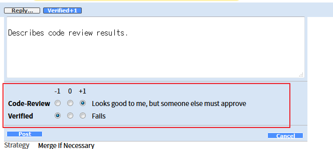

# Contributing to Tizen Studio

The Tizen Studio is an open-source project. You can contribute to the source code and help improve the Tizen Studio.

You can access the Tizen source code and code review at the following sites:

- [Source code repository](https://review.tizen.org/git/)
- [Gerrit Code Review](https://review.tizen.org/gerrit)

To contribute code to the Tizen Studio:

1. Clone the [source code repository](https://review.tizen.org/git/):  
    ```sh
    git clone ssh://<ID>@review.tizen.org:29418/<git project path>
    ```

2. Create a Git branch for your changes:  
    ```sh
    git checkout opensrc
    ```

3. Develop your contribution.  
  For more information on how to develop and package Tizen Studio extensions, see the following guides:
    - [Web/Native IDE Extension Development Guide](web-extension-guide.md)
    - [Emulator Extension Development Guide](emulator-extension-guide.md)
    - [Package File Description Guide](package-file-desc-guide.md)
    - [Metapackage File Description Guide](meta-package.md)

4. Build and test your contribution.  
    Create a patch with your code, including appropriate test cases, which are mandatory if you add functionality or fix a bug.  
    For more information on building the code locally for testing, see the [Local Build Guide](local-build.md).

5. Commit and push your changes:
    ```sh
    git add <file name>
    git commit -m <update massage>
    git log // To successfully push your code, you must include 'change-id' and 'Signed-off-by' lines.
    git push origin <branch name>
    ```

    The change is listed in [Gerrit Code Review](https://review.tizen.org/gerrit).

6. Request a code review.  
    In Gerrit, open your change line and add the extension maintainer as a reviewer.

    To identify the maintainer, in the extension source code `package` directory, open the `pkginfo.manifest` file.  
    
    Your code can be merged by the maintainer when it meets the following criteria:
    - It has been reviewed by 2 reviewers.
    - The **Code-Review** score is 2 points or more.
    
    
