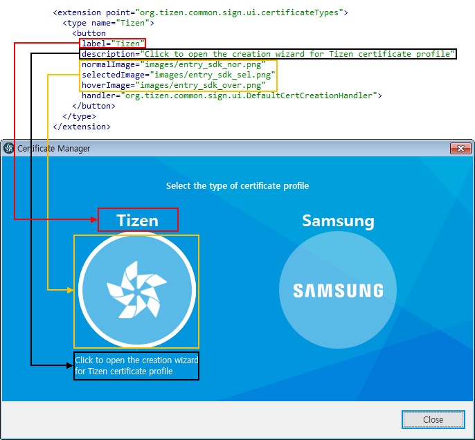

# Modifying Certificate Manager Texts

To modify the content of the certificate type selection window of the Certificate Manager:

1. Use the `org.tizen.common.sign.ui.certificateTypes` extension point:

   - Identifier: `org.tizen.common.sign.ui.certificateTypes`
   - Description: This extension point is used for registering the extension certificate type.
   - Configuration:
     ```xml
     <!ELEMENT extension (type)>
     <!ATTLIST extension
        id CDATA #IMPLIED
        name CDATA #IMPLIED
        point CDATA #REQUIRED>
     ```

     - `id`: Optional identifier of the extension instance
     - `name`: Optional name of the extension instance
     - `point`: Fully-qualified identifier of the target extension point

     ```xml
     <!ELEMENT type (button)>
     <!ATTLIST type
        name CDATA #REQUIRED>
     ```
     - `name`: Required name of the certificate type

     ```xml
     <!ELEMENT button>
     <!ATTLIST button
        label CDATA #IMPLIED
        description CDATA #IMPLIED
        normalImage CDATA #IMPLIED
        selectedImage CDATA #IMPLIED
        hoverImage CDATA #IMPLIED
        handler CDATA #IMPLIED>
     ```
     - `label`: Label to be displayed at the top of this creation button. This value must be the unique name of the certificate type.
     - `description`: Description displayed in the UI when the mouse cursor is on the creation button
     - `normalImage`: Plugin-relative path to the image to be displayed as the normal state for the creation button
     - `selectedImage`: Plugin-relative path to the image to be displayed as the selected state for the creation button
     - `hoverImage`: Plugin-relative path to the image to be displayed as the hover state for the creation button
     - `handler`: Fully-qualified name of a handler class that implements `org.tizen.common.sign.ui.ICertificateCreationHandler`. Call the `execute()` method of this handler when the button is clicked.

2. Implement the new plugin in the `plugin.xml` file:

   

3. Add `org.tizen.common.sign.ui` to the `Require-bundle` attribute in the `plugin.xml` file:

   ```text
   Require-Bundle: org.eclipse.ui,
   org.eclipse.core.runtime,
   org.eclipse.cdt.make.core;bundle-version="7.1.1",
   org.eclipse.cdt.managedbuilder.core;bundle-version="8.0.1",
   org.eclipse.cdt.make.ui;bundle-version="7.1.1",
   org.eclipse.cdt.core,
   org.tizen.common.sign.ui,
   .....
   ```

4. Implement the handler class:

   ```java
   public class TizenCertCreationHandler implements ICertificateCreationHandler {
       /*
        * Execute certificate creation
        *
        * @return the return code. Two standard return codes are predefined, OK and CANCEL.
        */
       @Override
       public int execute() {
           CertificateCreationWizard wizard = new CertificateCreationWizard();
           CertificateCreationWizardDialog dialog = new CertificateCreationWizardDialog(SWTUtil.getShell(), wizard);
           if (dialog.open() == Dialog.OK) {
               return OK;
           }
           return CANCEL;
       }
   }
   ```

5. To change the text of the certificate type selection window, change the attributes in the `plugin.xml` file:
   
