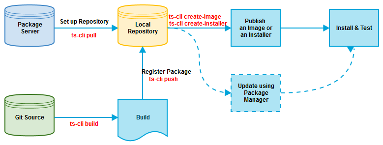

# Local Build Guide

To build the code locally for testing:

**Figure: Local build workflow**



1. Install TS-CLI.  
   For more information on installing TS-CLI and setting up a development environment, see [Build Environment](environment.md).

2. Create a local repository and pull packages into it:

   1. Create a local repository (file system). You can use local storage to upload and deploy packages.
   2. Import packages from the remote storage server to the local repository.

      > **Note**
      >
      > Your computer must be able to access the input URL (with `wget`).

      ```bash
      $ ts-cli pull --rr http://172.21.17.55/packages/tizen_studio --lr /repository/tizen_studio -o ubuntu-64

      ## --rr, --remote-repo    remote repository url
      ## --lr, --local-repo     local repository path
      ## -o, --os               os name
      ## -b, --base-snapshot    base snapshot name for package pull
      ```

3. Build the code with the `ts-cli build` command:

   ```bash
   $ ts-cli build -r /repository/tizen_studio -c -p

   ## -r, --repository      repository path. local directory path or http url.
       ex) ./repository/develop | http://download.tizen.org/sdk/tizenstudio/official
   ## -s, --source          source path           [default: "./"]
   ## -c, --clean           clean build
   ## -p, --push-package    push the package(s) to local repository
   ## -f, --force           skip version comparison and push or pull packages by force.
                            new packages will overwrite existing ones
   ```

4. Create a snapshot with the `ts-cli push` command:

   ```bash
   $ ts-cli push -P <package file path|list> --lr /repository/tizen_studio

   ## -P, --package         single package file path or package files with separator comma.
                            ex) -P test1.zip | -P test1.zip,test2.zip
   ## --lr, --local-repo    local repository path
   ## -f, --force           skip version comparison and push or pull packages by force.
                            new packages will overwrite existing ones.
   ```

   A `snapshots` folder is created in the specified location and a snapshot is created under it.


5. Create an installation image.  
   Currently, installation is only supported through the Package Manager. Therefore, to install the package, you must create an image.

   ```bash
   $ ts-cli create-image -r /repository/tizen_studio -u http://download.tizen.org/sdk/tizenstudio/official -O MyImage

   ## -r, --repository      local repository path in filesystem
   ## -u, --url             base repository URL
   ## -O, --output          image name
   ```


6. Install the package with the Package Manager.  
   For more information on the Package Manager, see [Configuring the Extension SDK Repository](https://developer.tizen.org/development/tizen-studio/download/configuring-package-manager#extension).
