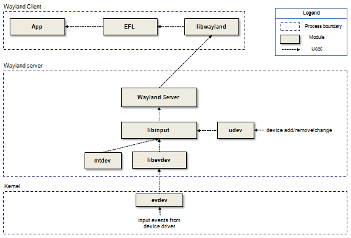
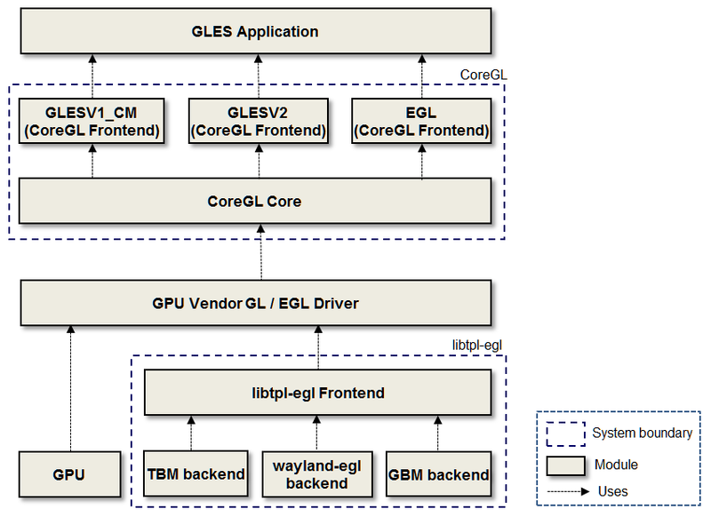
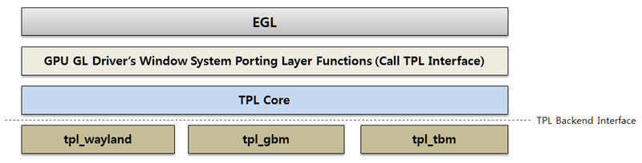

# Graphics and UI

The application composes the graphic user interface by creating a window with toolkit. The display server composites application's windows and show the result on screen. For this procedure, the graphics and UI middleware offers the next 3 modules for client and server.

- [Tizen Buffer Manager (TBM)](https://wiki.tizen.org/TBM)
- [Tizen Display Manager (TDM)](https://wiki.tizen.org/TDM)
- [TPL-EGL](https://wiki.tizen.org/3.0_Porting_Guide/Graphics_and_UI/OpenGL)


These modules allow the client and server to render with the GPU, share buffers with other processes, and organize hardware output devices for various chipset devices. They are HAL for graphics and UI. Their backend module needs to be implemented for the new hardware device.

- [Tizen Buffer Manager (TBM)](https://wiki.tizen.org/TBM) provides the abstraction interface for the graphic buffer manager in Tizen.
- [Tizen Display Manager (TDM)](https://wiki.tizen.org/TDM) provides the abstraction interface for the display server, such like a X server and a wayland server, to allow the direct access to graphics hardware in a safe and efficient manner as a display HAL.
- [TPL-EGL](https://wiki.tizen.org/3.0_Porting_Guide/Graphics_and_UI/OpenGL) is an abstraction layer for surface and buffer management on Tizen platform aimed to implement the EGL porting layer of OpenGLES driver over various display protocols.

For an application to handle input device's events, the [Input Manager](https://wiki.tizen.org/3.0_Porting_Guide/Graphics_and_UI/Input) is mainly comprised of `libinput` and a thin wrapper around it. It handles input events in wayland compositors and communicates with wayland clients.

## Buffer Management

The TBM has a frontend libary and a backend module. The TBM frontend library is hardware-independent and provides the generic buffer interface for users. On the other hand, the TBM backend module is hardware-dependent and provides the buffer interface depended on the target system. The chipset vendors have to provide their own backend modules in order for the TBM to work well in Tizen platform. This is because the vendors' way to manage the graphic buffers can be different among various chipset devices. TBM already has several backends for reference, such as `libtbm-dumb`, and `libtbm-shm`.


With TBM, the client and server can allocate buffers and share it between them. For example, a client allocates a graphic buffer, draws something on it with GL and sends it to the display server for displaying it on the screen without buffer copying. The TBM backend module is implemented as a shared library and the TBM frontend finds the `libtbm-default.so` file and loads it from the `/usr/lib/bufmgr` directory at runtime.

```
sh-3.2# ls -al
lrwxrwxrwx  1 root root    14 Jul 28  2016 libtbm_default.so -> libtbm_sprd.so
lrwxrwxrwx  1 root root    20 Jul 28  2016 libtbm_sprd.so -> libtbm_sprd.so.0.0.0
lrwxrwxrwx  1 root root    20 Jul 28  2016 libtbm_sprd.so.0 -> libtbm_sprd.so.0.0.0
-rwxr-xr-x  1 root root 26728 Jun 29  2016 libtbm_sprd.so.0.0.0

```

- Initialing the TBM backend module

The `TBMModuleData` is for the entry point symbol to initialize the TBM backend module. The TBM backend module must have to define the global data symbol with the name of `tbmModuleData`. The TBM frontend loads the `tbmModuleData` global data symbol and calls the `init()` function at the initial time.

> **Note**
> Do not change the name of the symbol in the TBM backend module.

```
/*
   @brief tbm module data
   Data type for the entry point of the backend module
*/
typedef struct {
    TBMModuleVersionInfo *vers;	/* TBM module information */
    ModuleInitProc init; /* init function of a backend module */
} TBMModuleData;

typedef int (*ModuleInitProc) (tbm_bufmgr, int);

```

At the initialization of the backend module, the backend module allocates the `tbm_bufmgr_backend` instance (`tbm_backend_alloc`), fills the information, and initializes the backend module to the TBM (`tbm_backend_init`).

```
tbm_bufmgr_backend tbm_backend_alloc(void);
void tbm_backend_free(tbm_bufmgr_backend backend);
int tbm_backend_init(tbm_bufmgr bufmgr, tbm_bufmgr_backend backend);

```

```
MODULEINITPPROTO (init_tbm_bufmgr_priv);

static TBMModuleVersionInfo DumbVersRec =
{
    "shm",
    "Samsung",
    TBM_ABI_VERSION,
};

TBMModuleData tbmModuleData = {&DumbVersRec, init_tbm_bufmgr_priv};

int
init_tbm_bufmgr_priv(tbm_bufmgr bufmgr, int fd)
{
    tbm_bufmgr_backend bufmgr_backend;

    bufmgr_shm = calloc(1, sizeof(struct _tbm_bufmgr_shm));

    bufmgr_backend = tbm_backend_alloc();

    bufmgr_backend->priv = (void *)bufmgr_shm;
    bufmgr_backend->bufmgr_deinit = tbm_shm_bufmgr_deinit,
    bufmgr_backend->bo_size = tbm_shm_bo_size,
    bufmgr_backend->bo_alloc = tbm_shm_bo_alloc,
    bufmgr_backend->bo_free = tbm_shm_bo_free,
    bufmgr_backend->bo_import = tbm_shm_bo_import,
    bufmgr_backend->bo_import_fd = NULL,
    bufmgr_backend->bo_export = tbm_shm_bo_export,
    bufmgr_backend->bo_export_fd = NULL,
    bufmgr_backend->bo_get_handle = tbm_shm_bo_get_handle,
    bufmgr_backend->bo_map = tbm_shm_bo_map,
    bufmgr_backend->bo_unmap = tbm_shm_bo_unmap,
    bufmgr_backend->bo_lock = NULL;
    bufmgr_backend->bo_unlock = NULL;
    bufmgr_backend->surface_get_plane_data = tbm_shm_surface_get_plane_data;
    bufmgr_backend->surface_supported_format = tbm_shm_surface_supported_format;


    if (!tbm_backend_init(bufmgr, bufmgr_backend))
    {
        tbm_backend_free(bufmgr_backend);
        free(bufmgr_shm);

        return 0;
    }

    return 1;
}

```

### Porting OAL Interface

TBM provides the header files to implement the TBM backend module.

| Header file                              | Description                              |
| ---------------------------------------- | ---------------------------------------- |
| [tbm_bufmgr_backend.h](https://review.tizen.org/gerrit/gitweb?p=platform/core/uifw/libtbm.git;a=blob;f=src/tbm_bufmgr_backend.h;h=839ec996de16493e40b90c72066448d770575bca;hb=refs/heads/tizen) | This file includes the information to implement the TBM backend module. |
| [tbm_drm_helper.h](https://review.tizen.org/gerrit/gitweb?p=platform/core/uifw/libtbm.git;a=blob;f=src/tbm_drm_helper.h;h=0c93a378d2ddf64f2bcb9ebf6a1d0b85563670a2;hb=refs/heads/tizen) | This file includes the helper function for the drm interface backend module. |
| [tbm_bufmgr.h](https://review.tizen.org/gerrit/gitweb?p=platform/core/uifw/libtbm.git;a=blob;f=src/tbm_bufmgr.h;h=50fcf08101c2cb0a4b8750f3eda30d375c981ea7;hb=refs/heads/tizen) | This is the user header file including the general information to use the TBM. |
| [tbm_surface.h](https://review.tizen.org/gerrit/gitweb?p=platform/core/uifw/libtbm.git;a=blob;f=src/tbm_surface.h;h=0686a4ed2d0e26c0386e9f1232f0aa2a6e7f5eb6;hb=refs/heads/tizen) | This is the user header file including the general information to use the `tbm_surface`. |

- TBM Backend interface

The following table lists the TBM Backend interface for initializing and deinitializing.

| Function                       | Description                              |           |
| ------------------------------ | ---------------------------------------- | --------- |
| `ModuleInitProc()`             | The `init` function of a backend module. | Mandatory |
| `bufmgr_deinit()`              | Deinitializes the buffer manager private. | Mandatory |
| `bufmgr_bind_native_display()` | If the backend needs to get the native display, use this backend function. | Optional  |

The following table lists the TBM backend interface functions for `tbm_bo`.

| Function          | Description                              |                                          |
| ----------------- | ---------------------------------------- | ---------------------------------------- |
| `bo_alloc()`      | Allocates the buffer object.If backend wants to reuse the `bo` private at frontend, return the same pointer of the `bo` private. | Mandatory                                |
| `bo_free()`       | Frees the buffer object.The frontend calls this function when it does not use the `bo` private. | Mandatory                                |
| `bo_import()`     | Imports the buffer object associated with the key.If the backend does not support a buffer sharing by the TBM key, the function pointer must be set to `NULL`. | Optional                                 |
| `bo_export()`     | Exports the buffer object.If the backend does not support a buffer sharing by TBM key, the function pointer must be set to `NULL`. | Optional                                 |
| `bo_import_fd()`  | Imports the buffer object associated with the prime `fd.`The `tbm_fd` must be frees by the user. If the backend does not support a buffer sharing by TBM `fd`, the function pointer must be set to `NULL`. | Mandatory(Must support buffer sharing by TBM `fd`.) |
| `bo_export_fd()`  | Imports the buffer object associated with the prime `fd.`The `tbm_fd` must be freed by the user. If the backend does not support a buffer sharing by TBM `fd`, the function pointer must be set to `NULL`. | Mandatory(Must support buffer sharing by TBM `fd`.) |
| `bo_get_flags()`  | Gets the TBM flags of memory type        | Mandatory                                |
| `bo_size()`       | Gets the size of a buffer object.        | Mandatory                                |
| `bo_get_handle()` | Gets the `tbm_bo_handle` according to the device type. | Mandatory                                |
| `bo_map()`        | Maps the buffer object according to the device type and the option. | Mandatory                                |
| `bo_unmap()`      | Unmaps the buffer object.                | Mandatory                                |
| `bo_lock()`       | Locks the buffer object with a device and an opt. | Optional                                 |
| `bo_unlock()`     | Unlocks the buffer object.               | Optional                                 |

The following table lists the TBM backend interface for `tbm_surface`.

| Function                     | Description                              |           |
| ---------------------------- | ---------------------------------------- | --------- |
| `surface_supported_format()` | Queries the formats list and the number to be supported by backend. | Mandatory |
| `surface_get_plane_data()`   | Gets the plane data, such as the size, ofeset, pitch, and buffer object index of the surface. | Mandatory |
| `surface_bo_alloc()`         | Allocates the buffer object for TBM surface with width, height, format, and buffer object index.If the backend does not want to allocate the buffer of the TBM surface with width, format and height, the function pointer must be set to `NULL`. The TBM frontend allocation buffer of the TBM surface with data is gained from the `surface_get_plane_data()`. | Optional  |

The following table lists the TBM buffer memory types.

| Buffer memory type   | Description                              |
| -------------------- | ---------------------------------------- |
| `TBM_BO_DEFAULT`     | Default memory: it depends on the backend |
| `TBM_BO_SCANOUT`     | Scanout memory                           |
| `TBM_BO_NONCACHABLE` | Non-cachable memory                      |
| `TBM_BO_WC`          | Write-combine memory                     |
| `TBM_BO_VENDOR`      | Vendor specific memory (depends on the backend) |

The following table lists the TBM buffer device types.

| Device type          | Description                              |
| -------------------- | ---------------------------------------- |
| `TBM_DEVICE_DEFAULT` | The device type to get the default handle |
| `TBM_DEVICE_CPU`     | The device type to get the virtual memory |
| `TBM_DEVICE_2D`      | The device type to get the 2D memory handle |
| `TBM_DEVICE_3D`      | The device type to get the 3D memory handle |
| `TBM_DEVICE_MM`      | The device type to get the multimedia handle |

The following table lists the TBM buffer access options.

| Access option       | Description                              |
| ------------------- | ---------------------------------------- |
| `TBM_OPTION_READ`   | The access option to read                |
| `TBM_OPTION_WRITE`  | The access option to write               |
| `TBM_OPTION_VENDOR` | The vendor specific option that depends on the backend |

- TBM DRM helper function

If target uses the `drm` interface, the client needs to get the authenticated `fd` from the display server and the display server must share the `drm` master `fd` with the TDM backend module. The TBM frontend provides the helper functions for `drm`authentication with the wayland protocol and sharing the master `fd` with TDM backend module.

| Function                                 | Description                              |
| ---------------------------------------- | ---------------------------------------- |
| `tbm_drm_helper_wl_auth_server_init()`   | If the TBM backend module need to use the authentication server, the backend module must call this function in the display server. |
| `tbm_drm_helper_wl_auth_server_deinit()` | Deinitailizes the `drm` authentication in display server. |
| `tbm_drm_helper_get_master_fd()`         | If the TDM backend module already has a `drm` master `fd`, the TBM backend module can get the master `fd` from this function. |
| `tbm_drm_helper_set_tbm_master_fd()`     | If the TBM backend module opens the `drm` master `fd`, this function has to be called for sharing the `drm` master `fd` with TDM. |
| `tbm_drm_helper_unset_tbm_master_fd()`   | If the TBM backend module is opened and does not use the `drm` master `fd`, this function has to be called. |
| `tbm_drm_helper_get_auth_info()`         | Client gets the authenticated `fd` and device info from the display server. |

### TBM Backends

| Backend         | Project ([http://review.tizen.org](http://review.tizen.org/)) | Description                              |
| --------------- | ---------------------------------------- | ---------------------------------------- |
| `libtbm-shm`    | [platform/adaptation/libtbm-shm](https://review.tizen.org/gerrit/gitweb?p=platform/adaptation/libtbm-shm.git;a=summary) | The backend for the target device whitch supports the SHM memory interface.The SHM backend module uses the XSI shared memory segment and does not have hardware dependencies. |
| `libtbm-dumb`   | [platform/adaptation/libtbm-dumb](https://review.tizen.org/gerrit/gitweb?p=platform/adaptation/libtbm-dumb.git;a=summary) | The backend for the target device which supports the DUMB memory interface.If the target kernel supports the `drm` interface, the target can use the `dumb` backend because the DUMB memory interface is the default `drm` memory interface. |
| `libtbm-sprd`   | [platform/adaptation/spreadtrum/libtbm-sprd](https://review.tizen.org/gerrit/gitweb?p=platform/adaptation/spreadtrum/libtbm-sprd.git;a=summary) | The backend for the target device which uses the Spreadtrum chipset only.The `sprd` backend module uses the `drm` gem memory interface but some `ioctl` only provided by the `sprd drm` kernel. |
| `libtbm-exynos` | [platform/adaptation/samsung_exynos/libtbm-exynos](https://review.tizen.org/gerrit/gitweb?p=platform/adaptation/samsung_exynos/libtbm-exynos.git;a=summary) | The backend for the target device which uses the exynos chipset only.The `exynos` backend module uses the `drm` gem memory interface but some `ioctl` only provided by `exynos drm` kernel. |
| `libtbm-vigs`   | [platform/adaptation/emulator/libtbm-vigs](https://review.tizen.org/gerrit/gitweb?p=platform/adaptation/emulator/libtbm-vigs.git;a=summary) | The backend for the target device which supports the VIGS interface.The `vigs` backend is used by the emulator target. |

### Reference

For more detailed information about the TBM and TBM backend, see [Tizen Buffer Manager (TBM)](https://wiki.tizen.org/TBM).

## Display Management

Read [Tizen Display Manager (TDM)](https://wiki.tizen.org/TDM) first to get the general information of TDM and TDM backend.
The display server composites and shows the client's buffers on screen. The display server sometimes needs to convert or scale an image to a different size or format. To make it possible for various chipset devices, the display server needs the display hardware resource information and control them. [Tizen Display Manager (TDM)](https://wiki.tizen.org/TDM) offers these functionalities for the display server with the unified interface for various chipset devices.

![Tdm-backend.png]](media/Tdm-backend.png)

With TDM, the display server can do the mode setting, the DPMS control and showing a buffer (framebuffer or video buffer) on the screen in the most efficient way. If the hardware supports the m2m converting and capture device, the display server can also convert an image and dump a screen including all hardware overlays with no compositing.

The vendor has to implement the TDM backend module. The TDM backend module has the responsibility to let the TDM frontend know the display hardware resource information. The display server gets this information and control hardware devices via the TDM frontend APIs. TDM already has several backends for reference, such as `libtdm-drm` and `libtdm-fbdev`.

The TDM backend is implemented as a shared library and the TDM frontend finds the `libtdm-default.so` file and loads it in the `/usr/lib/tdm` directory at runtime.

```
sh-3.2# ls -l /usr/lib/tdm
total 40
lrwxrwxrwx 1 root root    14 Jul 28  2016 libtdm-default.so -> libtdm-drm.so
-rwxr-xr-x 1 root root 37152 Jul 12  2016 libtdm-drm.so

```

The TDM backend module must define the global data symbol with the name `tdm_backend_module_data`. The TDM frontend reads this symbol at the initialization time. TDM calls the `init()` function of the `tdm_backend_module_data`. For more information, see [tdm_backend.h](https://review.tizen.org/gerrit/gitweb?p=platform/core/uifw/libtdm.git;a=tree;h=refs/heads/tizen;hb=refs/heads/tizen).

```
typedef struct _tdm_backend_module {
    const char *name; /* The module name of the backend module */
    const char *vendor; /* The vendor name of the backend module */
    unsigned long abi_version; /* The ABI version of the backend module */
    tdm_backend_data *(*init)(tdm_display *dpy, tdm_error *error);
    void (*deinit)(tdm_backend_data *bdata);
} tdm_backend_module;

```

```
#include <tdm_backend.h>

static tdm_drm_data *drm_data;

tdm_backend_data*
tdm_drm_init(tdm_display *dpy, tdm_error *error)
{
    drm_data = calloc(1, sizeof(tdm_drm_data));

    return (tdm_backend_data*)drm_data;
}

void
tdm_drm_deinit(tdm_backend_data *bdata)
{
    free(bdata);
}

tdm_backend_module tdm_backend_module_data =
{
    "drm",
    "Samsung",
    TDM_BACKEND_SET_ABI_VERSION(1,1),
    tdm_drm_init,
    tdm_drm_deinit
};

```

The TDM backend must register the `tdm_func_display()`, `tdm_func_output()`, and `tdm_func_layer()` functions with the `tdm_backend_register_func_display()`, `tdm_backend_register_func_output()`, and `tdm_backend_register_func_layer()` functions in the `tdm_backend_module_data` `init()` function.

```
#include <tdm_backend.h>

tdm_backend_data*
tdm_drm_init(tdm_display *dpy, tdm_error *error)
{
    memset(&drm_func_display, 0, sizeof(drm_func_display));
    drm_func_display.display_get_capability = drm_display_get_capability;
    drm_func_display.display_get_pp_capability = drm_display_get_pp_capability;
    drm_func_display.display_get_outputs = drm_display_get_outputs;
    drm_func_display.display_get_fd = drm_display_get_fd;
    drm_func_display.display_handle_events = drm_display_handle_events;
    drm_func_display.display_create_pp = drm_display_create_pp;
    ret = tdm_backend_register_func_display(dpy, &drm_func_display);
    if (ret != TDM_ERROR_NONE)
        goto failed;

    memset(&drm_func_output, 0, sizeof(drm_func_output));
    drm_func_output.output_get_capability = drm_output_get_capability;

    ret = tdm_backend_register_func_output(dpy, &drm_func_output);
    if (ret != TDM_ERROR_NONE)
        goto failed;

    memset(&drm_func_layer, 0, sizeof(drm_func_layer));
    drm_func_layer.layer_get_capability = drm_layer_get_capability;

    ret = tdm_backend_register_func_layer(dpy, &drm_func_layer);
    if (ret != TDM_ERROR_NONE)
        goto failed;

    return (tdm_backend_data*)drm_data;
}

```

After loading the TDM backend module, the TDM frontend calls the `display_get_capability()`, `display_get_outputs()`, `output_get_capability()`, `output_get_layers()`, and `layer_get_capability()` functions to get the hardware specific information. That is, the TDM backend module must implement these 5 functions.

In addition, if a target has a memory-to-memory converting hardware device and the capture hardware device, the TDM backend module can register the `tdm_func_pp()` and `tdm_func_capture()` functions with the `tdm_backend_register_func_pp()` and `tdm_backend_register_func_capture()` functions.

### Porting OAL Interface

TDM provides the header files to implement the TDM backend module.

| Header file                              | Description                              |
| ---------------------------------------- | ---------------------------------------- |
| [tdm_backend.h](https://review.tizen.org/gerrit/gitweb?p=platform/core/uifw/libtdm.git;a=tree;h=refs/heads/tizen;hb=refs/heads/tizen) | This file defines the TDM backend interface. |
| [tdm_log.h](https://review.tizen.org/gerrit/gitweb?p=platform/core/uifw/libtdm.git;a=tree;h=refs/heads/tizen;hb=refs/heads/tizen) | This file to print logs in frontend and backend modules. |
| [tdm_helper.h](https://review.tizen.org/gerrit/gitweb?p=platform/core/uifw/libtdm.git;a=tree;h=refs/heads/tizen;hb=refs/heads/tizen) | This file to help TDM backend/frontend user to implement. |

The display backend interface is mandatory. For more information, see [tdm_backend.h](https://review.tizen.org/gerrit/gitweb?p=platform/core/uifw/libtdm.git;a=tree;h=refs/heads/tizen;hb=refs/heads/tizen).

| Function                           | Description                              |           |
| ---------------------------------- | ---------------------------------------- | --------- |
| `display_get_capability()`         | Gets the display capabilities of the backend module.TDM calls this function not only at the initialization, but also at the update time when new output is connected. If the hardware has the restriction of the number of max usable layer count, the backend module can set the max count to `max_layer_count` of the `tdm_caps_display` structure. Otherwise, set -1. | Mandatory |
| `display_get_pp_capability()`      | Gets the `pp` capabilities of the backend module.TDM calls this function not only at the initialization, but also at the update time when new output is connected. The backend module does not need to implement this function if the hardware does not have the memory-to-memory converting device. Otherwise, the backend module must fill the `tdm_caps_pp` data. The `tdm_caps_pp` contains the hardware restriction information which a converting device can handle, such as format and size. | Optional  |
| `display_get_capture_capability()` | Gets the capture capabilities of the backend module.TDM calls this function not only at the initialization, but also at the update time when new output is connected. The backend module does not need to implement this function if the hardware does not have the capture device. Otherwise, the backend module must fill the `tdm_caps_capture` data. The `tdm_caps_capture` contains the hardware restriction information which a capture device can handle, such as format and size. | Optional  |
| `display_get_outputs()`            | Gets an output array of the backend module.TDM calls this function not only at the initialization, but also at the update time when new output is connected. The backend module must return the newly-allocated array which contains `tdm_output*` data. It is freed in the frontend. | Mandatory |
| `display_get_fd()`                 | Gets the file descriptor of the backend module.The backend module can return the epoll's `fd`. | Optional  |
| `display_handle_events()`          | Handles the events which happens on the `fd` of the backend module. | Optional  |
| `display_create_pp()`              | Creates a `pp` object of the backend module.The backend module does not need to implement this function if the hardware does not have the memory-to-memory converting device | Optional  |

The output backend interface is mandatory. For more information, see [tdm_backend.h](https://review.tizen.org/gerrit/gitweb?p=platform/core/uifw/libtdm.git;a=tree;h=refs/heads/tizen;hb=refs/heads/tizen).

| Function                      | Description                              |           |
| ----------------------------- | ---------------------------------------- | --------- |
| `output_get_capability()`     | Gets the capabilities of a output object.TDM calls this function not only at the initialization, but also at the update time when new output is connected. The `tdm_caps_output` contains connection status, modes, available properties, and size restriction information. | Mandatory |
| `output_get_layers()`         | Gets a layer array of a output object.TDM calls this function not only at the initialization, but also at the update time when new output is connected. The backend module must return the newly-allocated array which contains `tdm_layer*` data. It is freed in the frontend. | Mandatory |
| `output_set_property()`       | Sets the property with a given ID.       | Optional  |
| `output_get_property()`       | Gets the property with a given ID.       | Optional  |
| `output_wait_vblank()`        | Waits for `VBLANK`.If this function returns `TDM_ERROR_NONE`, the backend module must call a user `vblank` handler with the user data of this function after interval `vblanks`. | Mandatory |
| `output_set_vblank_handler()` | Sets the user `vblank` handler.          | Mandatory |
| `output_commit()`             | Commits the changes for an output object.When this function is called, the backend module must apply all changes of the given output object to screen as well as the layer changes of this output. If this function returns `TDM_ERROR_NONE`, the backend module must call a user commit handler with the user data of this function after all changes of the given output object are applied. | Mandatory |
| `output_set_commit_handler()` | Sets a user commit handler.              | Mandatory |
| `output_set_dpms()`           | Sets the DPMS of an output object.       | Optional  |
| `output_get_dpms()`           | Gets the DPMS of an output objectn       | Optional  |
| `output_set_mode()`           | Sets one of the available modes of an output object. | Mandatory |
| `output_create_capture()`     | Creates a capture object of an output objectThe backend module does not need to implement this function if the hardware does not have a capture device. | Optional  |
| `output_set_status_handler()` | Sets an output connection status handler.The backend module must call the output status handler when the output connection status has been changed to let the TDM frontend know the change. | Optional  |
| `output_set_dpms_handler()`   | Sets an output DPMS handler.The backend module must call the output DPMS handler when the output DPMS has been changed to let the TDM frontend know the change. | Optional  |

The layer backend interface is mandatory. For more information, see [tdm_backend.h](https://review.tizen.org/gerrit/gitweb?p=platform/core/uifw/libtdm.git;a=tree;h=refs/heads/tizen;hb=refs/heads/tizen).

| Function                   | Description                              |           |
| -------------------------- | ---------------------------------------- | --------- |
| `layer_get_capability()`   | Get the capabilities of a layer object.The backend module must implement this function. TDM calls this function not only at the initialization, but also at the update time when new output is connected. The `tdm_caps_layer` contains available formats/properties, and zpos information. | Mandatory |
| `layer_set_property()`     | Sets the property with a given ID.       | Optional  |
| `layer_get_property()`     | Gets the property with a given ID.       | Optional  |
| `layer_set_info()`         | Sets the geometry information to a layer object.The backend module applies the geometry information when the output object of a layer object is committed. | Mandatory |
| `layer_get_info()`         | Gets the geometry information to a layer object. | Mandatory |
| `layer_set_buffer()`       | Sets a TDM buffer to a layer object.The backend module shows a TDM buffer on the screen when the output object of a layer object is committed. | Mandatory |
| `layer_unset_buffer()`     | Unset a TDM buffer from a layer object.The backend module must remove the current showing buffer from screen. | Mandatory |
| `layer_set_video_pos()`    | Sets the `zpos` for a video layer object.The backend module does not need to implement this function if the backend module does not have video layers. The `zpos` of the video layer is changeable. | Optional  |
| `layer_create_capture()`   | Creates a capture object of a layer object.The backend module does not need to implement this function if the hardware does not have a capture device. | Optional  |
| `layer_get_buffer_flags()` | Gets the buffer flags which the layer can support. | Optional  |

The `pp` backend interface is optional. For more information, see [tdm_backend.h](https://review.tizen.org/gerrit/gitweb?p=platform/core/uifw/libtdm.git;a=tree;h=refs/heads/tizen;hb=refs/heads/tizen).

| Function                | Description                              |
| ----------------------- | ---------------------------------------- |
| `pp_destroy()`          | Destroys a `pp` object.                  |
| `pp_set_info()`         | Sets the geometry information to a `pp` object.The backend module applies the geometry information when committed. |
| `pp_attach()`           | Attaches a source buffer and a destination buffer to a `pp` object.The backend module converts the image of a source buffer to a destination buffer when committed. The size/crop/transform information is set using the `pp_set_info()` function of `tdm_func_pp`. When done, the backend module must return the source/destination buffer using the `tdm_pp_done_handler()` function. |
| `pp_commit()`           | Commits changes for a `pp` object.       |
| `pp_set_done_handler()` | Sets a user done handler to a `pp` object.The backend module must call the `tdm_pp_done_handler()` function when image conversion is done. |

The capture backend interface is optional. For more information, see [tdm_backend.h](https://review.tizen.org/gerrit/gitweb?p=platform/core/uifw/libtdm.git;a=tree;h=refs/heads/tizen;hb=refs/heads/tizen).

| Function                     | Description                              |
| ---------------------------- | ---------------------------------------- |
| `capture_destroy()`          | Destroys a capture object.               |
| `capture_set_info()`         | Sets the geometry information to a capture object.The backend module applies the geometry information when committed. |
| `capture_attach()`           | Attaches a TDM buffer to a capture object.When the `capture_commit()` function is called, the backend module starts to dump a output or a layer to a TDM buffer. The backend module starts to dump an output or a layer to a TDM buffer when committed. The size/crop/transform information is set using the `capture_set_info()` function of the `tdm_func_capture`. When done, the backend module must return the TDM buffer using the `tdm_capture_done_handler()` function. |
| `capture_commit()`           | Commits changes for a capture object.    |
| `capture_set_done_handler()` | Sets a user done handler to a capture object.The backend module must call the `tdm_capture_done_handler()` function when capture operation is done. |

### TDM backends

There are several backends which can be referred to implement the TDM backend.

| Backend         | Project ([http://review.tizen.org](http://review.tizen.org/)) | Description                              |
| --------------- | ---------------------------------------- | ---------------------------------------- |
| `libtdm-drm`    | [platform/adaptation/libtdm-drm](https://review.tizen.org/gerrit/gitweb?p=platform/adaptation/libtdm-drm.git;a=summary) | The backend for the target device which supports the DRM interface, such as the Tizen SDK emulatorNo PP & Capture capability |
| `libtdm-fbdev`  | [platform/adaptation/libtdm-fbdev](https://review.tizen.org/gerrit/gitweb?p=platform%2Fadaptation%2Flibtdm-fbdev.git;a=summary) | The backend for the target device which supports the FBDEV interfaceNo PP & Capture capability |
| `libtdm-exynos` | [platform/adaptation/samsung_exynos/libtdm-exynos](https://review.tizen.org/gerrit/gitweb?p=platform%2Fadaptation%2Fsamsung_exynos%2Flibtdm-exynos.git;a=summary) | The backend for the target device which uses the `exynos` chipsetUsing the DRM interfaceHas PP & Capture capabilityUsing the exynos-specific DRM interface to support PP |
| `libtdm-sprd`   | [platform/adaptation/spreadtrum/libtdm-sprd](https://review.tizen.org/gerrit/gitweb?p=platform%2Fadaptation%2Fspreadtrum%2Flibtdm-sprd.git;a=summary) | The backend for the target device which uses the Spreadtrum chipsetUsing the sptreadtrum-specific `ioctl`Using the DRM interface to support `vblank`Has PP capability, but no capture capability |

### How to test the porting result simply

Basically TDM offers the `tdm-test-server` tool for developers to test the porting result. `tdm-test-server` tool is included in `libtdm-tools` package. `libtdm-tools` package can be downloaded from which the platform binary's snapshot repository. Make sure that porting TBM is done before using below commands because TDM works base on TBM.

```
$ systemctl stop display-manager  (stop the display server)
$ export XDG_RUNTIME_DIR=/run
$ export TBM_DISPLAY_SERVER=1
$ tdm-test-server                 (show all options)
$ tdm-test-server -a              (test all layers)
$ tdm-test-server -a -v           (test all layers with vblank events)

```

Below is the result of `tdm-test-server -a`. The fullscreen buffer is set to the PRIMARY layer. And the small buffer is set to the OVERLAY layer.


### How to check TDM log messages

TDM uses dlog to print debug messages. Below command shows TDM runtime log messages.

```
$ dlogutil -v threadtime TDM

```

### References

For detailed information about the TDM and TDM backend, see [Tizen Display Manager (TDM)](https://wiki.tizen.org/TDM).

## Input Management

The input manager supports for a `libinput` based input device back-end. `libinput` is a common input library for wayland compositor. With `libinput`, the input stack is simpler without the Xorg input drivers. Input is not a HAL component from Tizen 3.0.



### libinput

The `libinput` library handles input devices for display servers and other applications that need to directly deal with input devices.

- Device detection
- Device handling
- Input device event processing
- Scaling touch coordinates
- Generating pointer events from touchpads
- Pointer acceleration

For more information, see the [libinput wiki](https://freedesktop.org/wiki/Software/libinput/).

### libevdev

The `libevdev` library handles evdev kernel devices. It abstracts the evdev ioctls through type-safe interfaces and provides functions to change the appearance of the device. For more information, see [https://en.wikipedia.org/wiki/Evdev](https://en.wikipedia.org/wiki/Evdev).

### mtdev

The `mtdev` stand-alone library transforms all variants of kernel MT events to the slotted type B protocol. For more information, see [http://www.linuxfromscratch.org/blfs/view/svn/general/mtdev.html](http://www.linuxfromscratch.org/blfs/view/svn/general/mtdev.html).

### libinput backends

`libinput: platform/upstream/libinput`

## OpenGL

This document describes the essential elements of Tizen's platform-level graphics architecture related to OpenGL ES and EGL, and how it is used by the application framework and the display server. The focus is on how graphical data buffers move through the system.

Tizen platform requires the OpenGL ES driver for the acceleration of the Wayland display server and `wayland-egl` client. This platform demands OpenGL ES and EGL driver which is implemented by the Tizen EGL Porting Layer.

### Tizen OpenGL ES and EGL Architecture

The following figure illustrates the Tizen OpenGL ES and EGL architecture.



- CoreGL

An injection layer of OpenGL ES that provides the following capabilities:

- Support for driver-independent optimization (FastPath)
- EGL/OpenGL ES debugging
- Performance logging
- Supported versions
  - EGL 1.4
  - OpenGL ES 1.1, 2.0, 3.0, 3.1

CoreGL loads the manufacturer's OpenGL ES driver from the `/usr/lib/driver` directory. CoreGL provides the `libEGL.so`, `libGLESv1_CM.so`, and `libGLESvs.so` driver files in the `/usr/lib` directory.

- GPU Vendor GL / EGL driver

The Tizen platform demands that the GPU vendor implements the GL and EGL driver using `libtpl-egl`. The GPU vendor GL / EGL driver must be installed in the following path:

| Library path      | File                                     |
| ----------------- | ---------------------------------------- |
| `/usr/lib/driver` | `libEGL.so``libGLESv1_CM.so``libGLESv2.so` |

### Tizen Porting Layer (TPL) for EGL

TPL-EGL is an abstraction layer for surface and buffer management on Tizen platform. It is used for implementation of the EGL platform functions.



The background for the Tizen EGL Porting Layer for EGL is in various window system protocols in Tizen. There was a need for separating common layer and backend.

Tizen uses the Tizen Porting Layer for EGL, as the TPL-EGL APIs prevents burdens of the EGL porting on various window system protocols. The GPU GL Driver’s Window System Porting Layer can be implemented by TPL-EGL APIs which are the corresponding window system APIs. The TBM, Wayland, and GBM backends are supported.

### Tizen Porting Layer for EGL Object Model

TPL-EGL provides interfaces based of object driven model. Every TPL-EGL object can be represented as a generic `tpl_object_t`, which is reference-counted and provides common functions. Currently, display and surface types of TPL-EGL objects are provided. Display, like normal display, represents a display system which is usually used for connection to the server. Surface corresponds to a native surface like `wl_surface`. A surface might be configured to use N-buffers, but is usually double-buffered or triple-buffered. Buffer is actually something to render on, usually a set of pixels or a block of memory. For these 2 objects, the Wayland, GBM, TBM backend are defined, and they are corresponding to their own window systems. This means that you do not need to care about the window systems.

#### TPL-EGL Core Object

- TPL-EGL Object

Base class for all TPL-EGL objects

- TPL-EGL Display

Encapsulates the native display object (`Display *, wl_display`) Like a normal display, represents a display system which is usually used for connection to the server, scope for other objects.

- TPL-EGL Surface

Encapsulates the native drawable object (`Window, Pixmap, wl_surface`) The surface corresponds to a native surface, such as `tbm_surface_queue` or `wl_surface`. A surface can be configured to use N-buffers, but they are usually double-buffered or triple-buffered.

#### TPL-EGL Objects and Corresponding EGL Objects

Both TPL-EGL and vendor GLES/EGL driver handles the `tbm_surface` as TPL surface's corresponding buffer. It is represented by the `TBM_Surface` part in the following figure.


The following figure illustrates the GLES drawing API flow.

![GLES API FLOW GRAY.png]](media/800px-GLES_API_FLOW_GRAY.png)

#### TPL-EGL Frontend API

##### TPL-EGL Object

This is the base class for all TPL-EGL objects. It provides common functionalities to all TPL-EGL objects.

| Function                     | Description                              |
| ---------------------------- | ---------------------------------------- |
| `tpl_object_reference()`     | Increases the reference count of a TPL-EGL object. All TPL-EGL objects are reference-counted. They have reference count 1 on creatation. When the reference count drops to 0, the object is freed. |
| `tpl_object_unreference()`   | Decreases the reference count and destroys the object if it becomes 0. |
| `tpl_object_get_reference()` | Gets the reference count of the given TPL-EGL object. |
| `tpl_object_get_type()`      | Gets the type of the object (display, surface, or buffer). |
| `tpl_object_set_user_data()` | Sets the user data to a TPL-EGL object. Users want to relate some data with a TPL-EGL object. This function provides registering a pointer to such data which can be retrieved later using the `tpl_object_get_user_data()`function. The key is the pointer value itself as a key. |
| `tpl_object_get_user_data()` | Gets the registered user data of a TPL-EGL object. |

##### TPL-EGL Display

Encapsulates the native display object (`Display *, wl_display`). Any other objects created from TPL-EGL Display inherit its backend type.

| Function                                 | Description                              |
| ---------------------------------------- | ---------------------------------------- |
| `tpl_display_create()`                   | Creates the TPL-EGL display object for the given native display. Creates a TPL-EGL display if there is no existing TPL-EGL display for the given native display. If given `NULL` for `native_dpy`, this function returns the default display. |
| `tpl_display_get()`                      | Gets the TPL-EGL display object for the given native display. If thereis an existing TPL-EGL display for the given native display, it returns the TPL-EGL display. |
| `tpl_display_get_native_handle()`        | Gets the native display handle which the given TPL-EGL display is created for. |
| `tpl_display_query_config()`             | Queries the supported pixel formats for the given TPL-EGL display. You might want to know what pixel formats are available on the given display. This function is used to query such available pixel formats. Give `TPL_DONT_CARE` to parameters for size values if any values are acceptable. |
| `tpl_display_filter_config()`            | Filters the configuration according to a given TPL-EGL display. This function modifies current config specific to the current given TPL-EGL display. |
| `tpl_display_get_native_window_info()`   | Queries information on the given native window. |
| `tpl_display_get_native_pixmap_info()`   | Queries information on the given native pixmap. |
| `tpl_display_get_buffer_from_native_pixmap()` | Gets the native buffer from the given native pixmap. |

##### TPL-EGL Surface

Encapsulates the native drawable object (`Window, Pixmap, wl_surface`). Its main features are retrieving the buffer for a frame and posting the surface to a screen.

| Function                                 | Description                              |
| ---------------------------------------- | ---------------------------------------- |
| `tpl_surface_create()`                   | Creates a TPL-EGL surface for the given native surface. |
| `tpl_surface_get_display()`              | Gets the TPL-EGL display where the given TPL-EGL surface was created from. |
| `tpl_surface_get_native_handle()`        | Gets the native surface handle of the given TPL-EGL surface. |
| `tpl_surface_get_type()`                 | Gets the type of the given TPL surface.  |
| `tpl_surface_get_size()`                 | Gets the current size of the given TPL-EGL surface. Size of a surface can change when a user resizes window or the server resizes it. TPL-EGL updates the size information every time when a buffer is queried using the `tpl_surface_dequeue_buffer()` function. Consider that there can still be mismatch between actual surface size and the cached one. |
| `tpl_surface_validate()`                 | Validates the current frame of the given TPL-EGL surface. Call this function before getting the actual final render target buffer. Calling the `tpl_surface_dequeue_buffer()` function after calling this function can give different output with previous one. Buffer returned after calling this function is guaranteed to be not changing. |
| `tpl_surface_dequeue_buffer()`           | Gets the buffer of the current frame for the given TPL-EGL surface. This function returns buffer of the current frame. Depending on backend, communication with the server can be required. Returned buffers are used for rendering the target to draw the current frame. Returned buffers are valid until the next `tpl_surface_dequeue_buffer()` function call. If the `tpl_surface_validate()` function returns `TPL_FALSE`, the previously returned buffers must no longer be used. This function is called again before drawing, and it returns a valid buffer. |
| `tpl_surface_enqueue_buffer()`           | Posts a given `tbm_surface`. This function request display server to post a frame. This is the function which can enqueue a buffer to the `tbm_surface_queue`. Make sure this function is called exactly once for a frame. Scheduling post calls on a separate thread is recommended. |
| `tpl_surface_enqueue_buffer_with_damage()` | Posts a given `tbm_surface` with region of damage. Damage information is used for reducing number of pixels composited in the compositor. Setting the `num_rects` to 0 or `rects` to `NULL` means entire area is damaged. This function request displays server to post a frame. This function is identical with the `tpl_surface_enqueue_buffer()` function except for delivering the damage information for updating. Make sure this function is called exactly once for a frame. Scheduling post calls on a separate thread is recommended. |
| `tpl_surface_set_post_interval()`        | The frame interval ensures that only a single frame is posted within the specified vsync intervals. When a frame ends, the frame interval is set to the surface's current interval. |
| `tpl_surface_get_post_interval()`        | Get frame interval of the given TPL-EGL surface. |

The following code snippet shows a simple example of the Tizen Porting Layer.

```
dpy = tpl_display_create(...);
sfc = tpl_surface_create(dpy, ...);

while (1)
{
    buf = tpl_surface_dequeue_buffer(sfc);

    /* Draw something */

    tpl_surface_enqueue_buffer(sfc, buf);
}

```

In the GPU vendor driver, the "Draw something" part is what the GPU frame builder does. TPL-EGL exposes the native platform buffer identifiers and managers so that the buffer can be used in other modules. Currently, `dma_buf/DRM` is supported for these of purposes. EGL porting layer calls TPL-EGL functions to do what it is requested, and gives the result to the GPU vendor driver. TPL-EGL does all the protocol dependent actions. Such protocol dependent part can be well-separated into TPL-EGL backends. Also, TPL-EGL backend can be configured at runtime. You can specify which type of backend to use when initializing a display object.

#### TPL-EGL and Wayland Server and Client

![Libtpl-egl-module diagram.png]](media/800px-Libtpl-egl-module_diagram.png)

Tizen uses the `wl_tbm` protocol instead of `wl_drm`. The `wl_tbm` protocol is born for sharing the buffer(`tbm_surface`) between the `wayland_client` and `wayland_server`. Although the `wayland_tbm_server_init` and `wayland_tbm_client_init` pair is a role for the `eglBindWaylandDisplayWL`, the EGL driver is required to implement the entrypoints for the `eglBindWaylandDisplayWL` and `eglUnbindWaylandDisplayWL` as dummy. For more information, see [https://cgit.freedesktop.org/mesa/mesa/tree/docs/specs/WL_bind_wayland_display.spec](https://cgit.freedesktop.org/mesa/mesa/tree/docs/specs/WL_bind_wayland_display.spec).

#### Buffer Flow Between the Wayland Server and GLES/EGL Driver

The following figure shows the buffer flow between wayland server and GLES/EGL Driver. And passed buffer's type is `tbm_surface`.

![Libtpl-egl buffer flow.png]](media/800px-Libtpl-egl_buffer_flow.png)

### Project Git Repository

| Project         | Repository                               | Description                              |
| --------------- | ---------------------------------------- | ---------------------------------------- |
| `libtpl-egl`    | `platform/core/uifw/libtpl-egl`          | Tizen Porting Layer for EGL              |
| `libtbm`        | `platform/core/uifw/libtbm`              | The library for the Tizen Buffer Manager |
| `coregl`        | `platform/core/uifw/coregl`              | An injection layer of OpenGL ES / EGL    |
| `wayland-tbm`   | `platform/core/uifw/wayland-tbm`         | Wayland tbm is a protocol for graphics memory management for Tizen |
| `emulator-yagl` | `platform/adaptation/emulator/emulator-yagl` | OpenGL ES / EGL driver for the emulator  |
| `tpl-novice`    | `platform/core/uifw/ws-testcase`         | Novice test framework for TPL            |

### libtpl-egl Reference Driver

The Emulator YAGL (OpenGLES / EGL driver for the emulator) is implemented by `libtpl-egl`.

The following commit explains how to port the driver with `libtpl-egl` from the traditional drm-based driver.

- Porting YAGL to the Tizen platform [https://review.tizen.org/gerrit/#/c/67921/](https://review.tizen.org/gerrit/#/c/67921/)

### Test and Verify the OpenGL ES Drive

The Khronos OpenGL ES CTS supports the `wayland-egl`. `libtpl-egl` has a test case for the `libtpl-egl`. The `ws-testcase`'s `tpl-novice` has sample code for the `libtpl-egl`.

