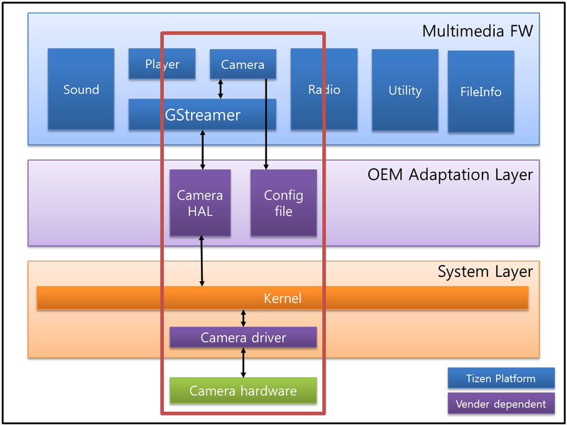
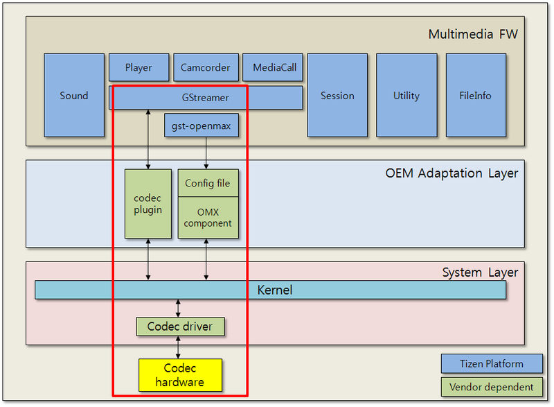
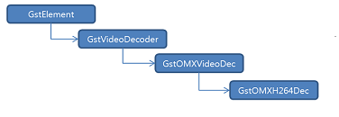
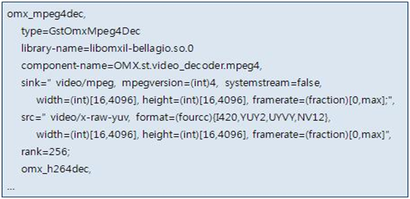
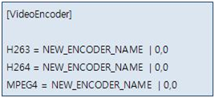

# Multimedia

## Camera

The Multimedia camcorder framework controls the GStreamer camera plugin to capture camera data from the device. The kernel interfaces to control the camera device can be different for different chipsets, so the camera HAL (Hardware Abstraction Layer) used by camera plugin is provided and it must be implemented specifically for each chipset. Each configuration file contains its own specific hardware dependent information. The Multimedia Camcorder framework reads and parses the information in these configuration files.



- Camera Source Plugin for GStreamer

Gets camera data (preview or captured image) and sets various camera commands through camera HAL interface

- Camera HAL

Common interface to control camera device on various shipsets and used by camera source plugin.

- Configuration Files

There are 3 config files for the Multimedia Camcorder framework. They are provided by `mmfw- sysconf-xxx`.

- `mmfw_camcorder.ini`


- `mmfw_camcorder_dev_video_pri.ini`


- `mmfw_camcorder_dev_video_sec.ini`


### Porting OAL Interface

#### GStreamer Camera Plugin

The default reference camera source plugin which uses the camera HAL interface is provided.

#### Camera HAL

The `mm-hal-interface` package provides the header file of the camera HAL.

- Repository path: `platform/core/multimedia/mm-hal-interface`
- File name: `tizen-camera.h`

##### Major Functions

The following table lists the functions related to initialization and deinitialization.

| Prototype                                | Description                          |
| ---------------------------------------- | ------------------------------------ |
| `int camera_init(void **camera_handle)`  | Initializes new camera HAL handle.   |
| `int camera_deinit(void *camera_handle)` | Deinitializes the camera HAL handle. |

The following table lists the functions related to open and close camera device.

| Prototype                                | Description               |
| ---------------------------------------- | ------------------------- |
| `int camera_open_device(void *camera_handle, int device_index)` | Opens the camera device.  |
| `int camera_close_device(void *camera_handle)` | Closes the camera device. |

The following table lists the functions related to getting device information.

| Prototype                                | Description                              |
| ---------------------------------------- | ---------------------------------------- |
| `int camera_get_device_list(void *camera_handle, camera_device_list_t *device_list)` | Gets the camera device list.             |
| `int camera_add_message_callback(void *camera_handle, camera_message_cb callback, void *user_data, uint32_t *cb_id)` | Registers a callback function to be called to send a message by the camera HAL. |
| `int camera_remove_message_callback(void *camera_handle, uint32_t cb_id)` | Unregisters a callback function.         |

The following table lists the functions related to preview and capture.

| Prototype                                | Description                              |
| ---------------------------------------- | ---------------------------------------- |
| `int camera_set_preview_stream_format(void *camera_handle, camera_format_t *format)` | Sets the format of the preview stream.`typedef struct camera_format {    camera_pixel_format_t stream_format;    camera_resolution_t stream_resolution;    uint32_t stream_fps;    camera_rotation_t stream_rotation;    camera_pixel_format_t capture_format;    camera_resolution_t capture_resolution;    uint32_t capture_quality;} camera_format_t;` |
| `int camera_get_preview_stream_format(void *camera_handle, camera_format_t *format)` | Gets the format of the preview stream.   |
| `int camera_start_preview(void *camera_handle, camera_preview_frame_cb callback, void *user_data)` | Starts the preview frames on the screen.`typedef int (*camera_preview_frame_cb)(camera_buffer_t *buffer, camera_metadata_t *meta, void *user_data);` |
| `int camera_stop_preview(void *camera_handle)` | Stops the preview frames.                |
| `int camera_release_preview_buffer(void *camera_handle, int buffer_index)` | Releases the preview buffer. The preview buffer must be released with this function after using it. |
| `int camera_start_auto_focus(void *camera_handle)` | Starts the camera auto focusing operation. |
| `int camera_stop_auto_focus(void *camera_handle)` | Stops the camera auto focusing operation. |
| `int camera_start_capture(void *camera_handle, camera_capture_cb callback, void *user_data)` | Starts capturing still images.`typedef int (*camera_capture_cb)(camera_buffer_t *main, camera_buffer_t *postview, camera_buffer_t *thumbnail, void *user_data);` |
| `int camera_stop_capture(void *camera_handle)` | Stops capturing still images.            |

The following table lists the functions related to video recording.

| Prototype                                | Description                              |
| ---------------------------------------- | ---------------------------------------- |
| `int camera_set_video_stream_format(void *camera_handle, camera_format_t *format)` | Sets the format of the video stream for recording. |
| `int camera_get_video_stream_format(void *camera_handle, camera_format_t *format)` | Gets the format of the video stream for recording. |
| `int camera_start_record(void *camera_handle, camera_video_frame_cb callback, void *user_data)` | Starts the video frame for recording.`typedef int (*camera_video_frame_cb)(camera_buffer_t *buffer, camera_metadata_t *meta, void *user_data);` |
| `int camera_stop_record(void *camera_handle)` | Stops the video frame.                   |
| `int camera_release_video_buffer(void *camera_handle, int buffer_index)` | Releases the video buffer. The video buffer must be released with this function after using it. |

The following table list the functions related to controlling the camera device.

| Prototype                                | Description                              |
| ---------------------------------------- | ---------------------------------------- |
| `int camera_set_command(void *camera_handle, int64_t command, void *value)` | Sets various commands and values to control the camera device.`#define CAMERA_COMMAND_BASE                     ((int64_t)1)#define CAMERA_COMMAND_WHITE_BALANCE            ((int64_t)(CAMERA_COMMAND_BASE << 1))#define CAMERA_COMMAND_ISO                      ((int64_t)(CAMERA_COMMAND_BASE << 2))#define CAMERA_COMMAND_CONTRAST                 ((int64_t)(CAMERA_COMMAND_BASE << 3))#define CAMERA_COMMAND_SATURATION               ((int64_t)(CAMERA_COMMAND_BASE << 4))#define CAMERA_COMMAND_HUE                      ((int64_t)(CAMERA_COMMAND_BASE << 5))#define CAMERA_COMMAND_SHARPNESS                ((int64_t)(CAMERA_COMMAND_BASE << 6))#define CAMERA_COMMAND_EFFECT                   ((int64_t)(CAMERA_COMMAND_BASE << 7))#define CAMERA_COMMAND_SCENE_MODE               ((int64_t)(CAMERA_COMMAND_BASE << 8))#define CAMERA_COMMAND_EXPOSURE_MODE            ((int64_t)(CAMERA_COMMAND_BASE << 9))#define CAMERA_COMMAND_EXPOSURE                 ((int64_t)(CAMERA_COMMAND_BASE << 10))#define CAMERA_COMMAND_ROTATION                 ((int64_t)(CAMERA_COMMAND_BASE << 11))#define CAMERA_COMMAND_FLIP                     ((int64_t)(CAMERA_COMMAND_BASE << 12))#define CAMERA_COMMAND_FOCUS_MODE               ((int64_t)(CAMERA_COMMAND_BASE << 13))#define CAMERA_COMMAND_FOCUS_RANGE              ((int64_t)(CAMERA_COMMAND_BASE << 14))#define CAMERA_COMMAND_SHOT_MODE                ((int64_t)(CAMERA_COMMAND_BASE << 15))#define CAMERA_COMMAND_ANTI_SHAKE               ((int64_t)(CAMERA_COMMAND_BASE << 16))#define CAMERA_COMMAND_FOCUS_AREA               ((int64_t)(CAMERA_COMMAND_BASE << 17))#define CAMERA_COMMAND_DIGITAL_ZOOM             ((int64_t)(CAMERA_COMMAND_BASE << 18))#define CAMERA_COMMAND_OPTICAL_ZOOM             ((int64_t)(CAMERA_COMMAND_BASE << 19))#define CAMERA_COMMAND_RECORDING_HINT           ((int64_t)(CAMERA_COMMAND_BASE << 20))#define CAMERA_COMMAND_WDR                      ((int64_t)(CAMERA_COMMAND_BASE << 21))#define CAMERA_COMMAND_SHUTTER_SPEED            ((int64_t)(CAMERA_COMMAND_BASE << 22))#define CAMERA_COMMAND_FLASH_MODE               ((int64_t)(CAMERA_COMMAND_BASE << 23))#define CAMERA_COMMAND_FACE_DETECTION           ((int64_t)(CAMERA_COMMAND_BASE << 24))` |
| `int camera_get_command(void *camera_handle, int64_t command, void *value)` | Gets the current value of the command.   |
| `int camera_set_batch_command(void *camera_handle, camera_batch_command_control_t *batch_command, int64_t *error_command)` | Sets a set of commands.`typedef struct camera_batch_command_control {    /* Flag for modified command */    int64_t command_set_flag;    /* Value list */    camera_white_balance_t white_balance;    int iso;    int contrast;    int saturation;    int hue;    int sharpness;    camera_effect_t effect;    camera_scene_mode_t scene_mode;    camera_exposure_mode_t exposure_mode;    int exposure;    camera_rotation_t rotation;    camera_flip_t flip;    camera_focus_mode_t focus_mode;    camera_focus_range_t focus_range;    camera_exposure_mode_t shot_mode;    int anti_shake;    camera_rectangle_t focus_area;    int digital_zoom;    int optical_zoom;    int recording_hint;    int wdr;    camera_flash_mode_t flash_mode;    camera_face_detection_t face_detection;} camera_batch_command_control_t;` |

### Configuration

Read the keyword and its value from the file. Recognize the categories by using the keyword list of the MSL camcorder, and save the member structure of MSL camcorder. Later, these values are used as attribute values or some other operation. The permission of this file is read-only to make sure the configuration files are read once before creating camcorder. Use a semicolon (“;”) to add comments in the config file.

The following table shows the description of the `mmfw_camcorder.ini` file.

| Category                                 | Entry                                    | Description                              |
| ---------------------------------------- | ---------------------------------------- | ---------------------------------------- |
| GeneralGeneral setting or information    | `SyncStateChange`                        | The API running type. It must be 1 (`TRUE`). |
| `ModelName`                              | Model name of target                     |                                          |
| Video inputSetting list related to video input | `UseConfCtrl`                            | Sets whether to use the configuration file. It must be 1 (`TRUE`). |
| `ConfCtrlFile0` or `1`                   | The name of the setting file to control the camera device. |                                          |
| `VideosrcElement`                        | The source plugin which obtains the camera input buffer from the device |                                          |
| `UseZeroCopyFormat`                      | Sets whether to use the zero copy format. |                                          |
| `DeviceCount`                            | The number of camera device              |                                          |
| `SupportMediaPacketPreviewCb`            | Sets whether the camera API supports media packet preview callback on the target. |                                          |
| Audio inputSetting list related to audio input | `AudiosrcElement`                        | Audio source plugin, which obtains audio for the camcorder or voice recorder |
| `AudiomodemsrcElement`                   | Audio source plugin which obtains audio for call recording |                                          |
| Video inputSetting list related to video output | `DisplayDevice`                          | Supported output device list and the default value |
| `Videosink`                              | Supported output surface list and the default value |                                          |
| `VideosinkElementOverlay`                | Plugin name for the Overlay output surface and the property setting list |                                          |
| `VideosinkElementEvas`                   | Plugin name for the Evas output surface and the property setting list |                                          |
| `VideosinkElementGL`                     | Plugin name for the GL output surface and the property setting list. |                                          |
| `VideosinkElementNULL`                   | Plugin name for the `NULL` surface and the property setting list. |                                          |
| Video encoder                            | Defines the video encoder list for video recording |                                          |
| Audio encoder                            | Defines the audio encoder list for AV recording or voice recording |                                          |
| CaptureSetting list related to image capture | `UseEncodebin`                           | Sets whether to use the `encodebin` to capture the image. It is recommended to keep this value as 0 (`FALSE`). |
| Record                                   | Setting value list for each recording mode. It is recommend to keep the values of the example config file. |                                          |
| Mux                                      | The mux plugin list related with the file container. |                                          |

The following table shows the description of the `mmfw_camcorder_dev_video_pri.ini` file for the primary camera (usually the rear main camera) and the `mmfw_camcorder_dev_video_sec.ini` file for the secondary camera (usually the front camera).

| Category                           | Entry                                    | Description                              |
| ---------------------------------- | ---------------------------------------- | ---------------------------------------- |
| CameraInformation about the camera | `InputIndex`                             | Camera number to select (primary or secondary) |
| `DeviceName`                       | Name of the camera module                |                                          |
| `PreviewResolution`                | A list of all supported preview resolutions the user can set, as well as the default values for this camera device. |                                          |
| `CaptureResolution`                | A list of all supported capture resolutions the user can set, as well as the default values for this camera device. |                                          |
| `VideoResolution`                  | A list of all supported video resolutions the user can set, as well as the default value for this camera device. |                                          |
| `FPS0 ~ 9`                         | A list of all supported FPS (Frame Per Second) by preview resolution settings the user can use, as well as the default values for this camera device. |                                          |
| `PictureFormat`                    | A list of all supported preview formats a user can set, as well as the default values for this camera device. |                                          |
| `RecommendDisplayRotation`         | Default display rotation value for displaying camera input. |                                          |
| `RecommendPreviewFormatCapture`    | Recommended preview format for capturing images. |                                          |
| `RecommendPreviewFormatRecord`     | Recommended preview format for recording. |                                          |
| `RecommendPreviewResolution`       | Recommended preview resolution by ratio of preview resolution. |                                          |
| `FacingDirection`                  | The facing direction of camera device.   |                                          |
| StrobeCamera flash settings        | `StrobeMode`                             | Supported strobe mode and default values. This is converted to a real value and used in the kernel internally. |
| EffectEffect settings              | Brightness                               | Supported range of brightness and default values. |
| Contrast                           | Supported range of contrast and default values. |                                          |
| Saturation                         | Supported range of saturation and default values. |                                          |
| Sharpness                          | Supported range of sharpness and default values. |                                          |
| Whitebalance                       | Supported white balance list and default values. This is converted to real value used in kernel internally. |                                          |
| ColorTone                          | Supported color tone list and default values. This is converted to a real value and used in the kernel internally. |                                          |
| WDR                                | Supported Wide Dynamic Range mode list and default values. This is converted to a real value and used in the kernel internally. |                                          |
| PhotographCamera shooting settings | `DigitalZoom`                            | Supported range of digital zoom level and default values. |
| `OpticalZoom`                      | Supported range of optical zoom level and default values. |                                          |
| `FocusMode`                        | Supported focus mode list and default value. This is converted to a real value and used in the kernel internally. |                                          |
| `AFType`                           | Supported AUTO focus mode list and default values. This is converted to a real value and used in the kernel internally. |                                          |
| `AEType`                           | Supported AUTO Exposure mode list and default value. This is converted to a real value and used in the kernel internally. |                                          |
| `ExposureValue`                    | Supported range of exposure value and default values. |                                          |
| ISO                                | Supported ISO list and default value. This is converted to a real value and used in the kernel internally. |                                          |
| `ProgramMode`                      | Supported program mode (scene mode) list and default value. This is converted to a real value and used in the kernel internally. |                                          |
| `AntiHandshake`                    | Supported anti-hand shake mode list and default value. This is converted to a real value and used in the kernel internally. |                                          |
| CaptureImage capture settings      | `OutputMode`                             | Supported capture format list and default values. |
| `JpegQuality`                      | Supported range of JPEG quality and default values. |                                          |
| `MultishotNumber`                  | Supported range of multi shot count and default values. |                                          |
| `SensorEncodedCapture`             | Whether the camera device supports encoded capture format(EX:JPEG) or not. |                                          |
| `SupportHDR`                       | Supported HDR mode list and default value. |                                          |
| `SupportZSL`                       | Whether the camera device supports zero shutter lag capture or not. |                                          |
| DetectDetect function settings     | `DetectMode`                             | Supported detect mode list and default values. |

### References

- Driver Configuration

Set the kernel `.config` values for the camera:

```
CONFIG_VIDEO_DEV = y
CONFIG_VIDEO_SAMSUNG = y
CONFIG_VIDEO_SAMSUNG_V4L2 = y
CONFIG_VIDEO_FIMC = y
CONFIG_VIDEO_FIMC_MMAP_OUTPUT_CACHE = y
CONFIG_VIDEO_FIMC_MIPI = y
CONFIG_VIDEO_FIMG2D = y
CONFIG_VIDEO_JPEG = y
CONFIG_VIDEO_MFC5X = y

```

- Kernel Node

```
For Camera: /dev/video1
Other CAMIF interfaces: /dev/video(0-3)

```

- GStreamer

For more information about GStreamer, see [http://gstreamer.freedesktop.org/documentation/](http://gstreamer.freedesktop.org/documentation/) and [http://gstreamer.freedesktop.org/data/doc/gstreamer/head/pwg/html/index.html](http://gstreamer.freedesktop.org/data/doc/gstreamer/head/pwg/html/index.html).

- V4L2

For more information about V4L2, see [http://v4l2spec.bytesex.org/spec-single/v4l2.html](http://v4l2spec.bytesex.org/spec-single/v4l2.html).

## Radio

The radio interface part of the multimedia framework supports APIs to implement the following FM radio features.

- Tune a frequency
- Get and set a frequency
- Scan all available frequencies
- Seek up and down
- Get the frequency signal


The interfaces to control the radio device are different to each other. Therefore, Tizen provides the Radio Hardware Abstraction Layer (HAL) to control various radio devices with a common interface. With the common interface, you can control the radio device on various chipsets used by the `libmm-radio`.

### Porting OAL Interface

The OAL interface for FM radio is the radio HAL interfaces.

#### Radio HAL

The `mm-hal-interface` package provides the radio HAL header file.

- Repository path: `platform/core/multimedia/mm-hal-interface`
- File name: `tizen-radio.h`

The OAL interface for FM radio is the [Linux](https://wiki.tizen.org/Linux) kernel V4L2 interface. The radio module directly uses the V4L2 `ioctls` to perform various radio hardware configurations.

The reference section explains the V4L2 interfaces used by the FM radio interface.

#### Major Functions

The following table lists the functions related to initialization and deinitialization.

| Prototype                                | Description                         |
| ---------------------------------------- | ----------------------------------- |
| `radio_error_t radio_init(void **radio_handle)` | Initializes new radio HAL handle.   |
| `radio_error_t radio_deinit(void *radio_handle)` | Deinitializes the radio HAL handle. |

The following table lists the functions related to preparing and unpreparing the radio device.

| Prototype                                | Description                 |
| ---------------------------------------- | --------------------------- |
| `radio_error_t radio_prepare_device(void *radio_handle)` | Prepare the radio device.   |
| `radio_error_t radio_unprepare_device(void *radio_handle)` | Unprepare the radio device. |

The following table lists the functions related to opening and closing the radio device.

| Prototype                                | Description              |
| ---------------------------------------- | ------------------------ |
| `radio_error_t radio_open_device(void *radio_handle)` | Opens the radio device.  |
| `radio_error_t radio_close_device(void *radio_handle)` | Closes the radio device. |

The following table lists the functions related to starting and stopping the radio device.

| Prototype                                | Description              |
| ---------------------------------------- | ------------------------ |
| `radio_error_t radio_start (void *radio_handle)` | Starts the radio device. |
| `radio_error_t radio_stop (void *radio_handle)` | Stops the radio device.  |

The following table lists the functions related to setting and getting the frequency.

| Prototype                                | Description               |
| ---------------------------------------- | ------------------------- |
| `radio_error_t radio_get_frequency(void *radio_handle, uint32_t *frequency)` | Gets the radio frequency. |
| `radio_error_t radio_set_frequency(void *radio_handle, uint32_t frequency)` | Sets the radio frequency. |

The following table lists the functions related to seeking for channels.

| Prototype                                | Description                              |
| ---------------------------------------- | ---------------------------------------- |
| `radio_error_t radio_seek(void *radio_handle, radio_seek_direction_type_t direction)` | Seeks (up or down) the effective frequency of the radio, asynchronously`typedef enum radio_seek_direction_type    RADIO_SEEK_DIRECTION_UP, /* Seek upward */    RADIO_SEEK_DIRECTION_DOWN /* Seek downward */} radio_seek_direction_type_t;` |

The following table lists the functions related to muting and unmuting the radio device.

| Prototype                                | Description        |
| ---------------------------------------- | ------------------ |
| `radio_error_t radio_mute(void *radio_handle)` | Mutes the radio.   |
| `radio_error_t radio_unmute(void *radio_handle)` | Unmutes the radio. |

The following table lists the functions related to setting and getting the volume.

| Prototype                                | Description                              |
| ---------------------------------------- | ---------------------------------------- |
| `radio_error_t radio_get_volume(void *radio_handle, float *volume)` | Gets the radio's current volume.         |
| `radio_error_t radio_set_volume(void *radio_handle, float volume)` | Sets the current radio's volume.         |
| `radio_error_t radio_set_media_volume(void *radio_handle, uint32_t level)` | Sets the current media volume level(system media volume). |

The following table lists the functions related to getting the signal strength.

| Prototype                                | Description                              |
| ---------------------------------------- | ---------------------------------------- |
| `radio_error_t radio_set_media_volume(void *radio_handle, uint32_t level);` | Gets the current signal strength of the radio. |

### References

- Kernel Node

```
For Radio: /dev/radio0

```

## Audio

The following figure illustrates the different audio layers.

[](./media/797px-Audio.png)

- PulseAudio
  - PulseAudio is a sound server accepting sound input from 1 or more sources and redirecting it to 1 or more sinks. PulseAudio has the following features:
    - Software mixing of multiple audio streams
    - Support for multiple audio sources and sinks
    - An extensible plugin architecture with support for loadable modules
    - Low-latency operation
    - Support external devices such as Bluetooth audio and USB audio devices.
  - Pulseaudio interacts with AudioHAL interfaces to support various type of devices.
- Audio HAL
  - Predefined interfaces for Audio Hardware Abstraction Layer (HAL)
  - Interface includes the following categories: volume, route, stream, pcm
- Configuration Files
  - Configurations for running Pulseaudio and Audio Systems which can be modified without code changes.
    - pulseaudio configurations (daemon.conf, client.conf, system.pa, etc.)
    - stream / device configuration (stream-map.json, device-map.json)

### Porting OAL Interface

The following table lists the audio HAL interfaces.

| Interface                                | Description                              |
| ---------------------------------------- | ---------------------------------------- |
| `audio_return_t audio_init(void **audio_handle)` | Initializes the audio HAL handle.        |
| `audio_return_t audio_deinit(void *audio_handle)` | De-initializes the audio HAL handle.     |
| `audio_return_t audio_get_volume_level_max(void *audio_handle, audio_volume_info_t *info, uint32_t *level)` | Gets the maximum volume level supported for a particular volume information. |
| `audio_return_t audio_get_volume_level(void *audio_handle, audio_volume_info_t *info, uint32_t *level)` | Gets the volume level specified for a particular volume information. |
| `audio_return_t audio_set_volume_level(void *audio_handle, audio_volume_info_t *info, uint32_t level)` | Sets the volume level specified for a particular volume information. |
| `audio_return_t audio_get_volume_value(void *audio_handle, audio_volume_info_t *info, uint32_t level, double *value)` | Gets the volume value specified for a particular volume information and level. |
| `audio_return_t audio_get_volume_mute(void *audio_handle, audio_volume_info_t *info, uint32_t *mute)` | Gets the volume mute specified for a particular volume information. |
| `audio_return_t audio_set_volume_mute(void *audio_handle, audio_volume_info_t *info, uint32_t mute)` | Sets the volume mute specified for a particular volume information. |
| `audio_return_t audio_update_route(void *audio_handle, audio_route_info_t *info)` | Updates the audio routing according to audio route information. |
| `audio_return_t audio_update_route_option(void *audio_handle, audio_route_option_t *option)` | Updates audio routing option according to audio route option. |
| `audio_return_t audio_notify_stream_connection_changed(void *audio_handle, audio_stream_info_t *info, uint32_t is_connected)` | Notifies when a stream is connected and disconnected. |
| `audio_return_t audio_pcm_open(void *audio_handle, void **pcm_handle, uint32_t direction, void *sample_spec, uint32_t period_size, uint32_t periods)` | Opens a PCM device.                      |
| `audio_return_t audio_pcm_start(void *audio_handle, void *pcm_handle)` | Starts a PCM device.                     |
| `audio_return_t audio_pcm_stop(void *audio_handle, void *pcm_handle)` | Stops a PCM device.                      |
| `audio_return_t audio_pcm_close(void *audio_handle, void *pcm_handle)` | Closes a PCM device.                     |
| `audio_return_t audio_pcm_avail(void *audio_handle, void *pcm_handle, uint32_t *avail)` | Gets available number of frames.         |
| `audio_return_t audio_pcm_write(void *audio_handle, void *pcm_handle, const void *buffer, uint32_t frames)` | Writes frames to a PCM device.           |
| `audio_return_t audio_pcm_read(void *audio_handle, void *pcm_handle, void *buffer, uint32_t frames)` | Reads frames from a PCM device.          |
| `audio_return_t audio_pcm_get_fd(void *audio_handle, void *pcm_handle, int *fd)` | Gets poll descriptor for a PCM handle.   |
| `audio_return_t audio_pcm_recover(void *audio_handle, void *pcm_handle, int revents)` | Recovers the PCM state.                  |
| `audio_return_t audio_pcm_get_params(void *audio_handle, void *pcm_handle, uint32_t direction, void **sample_spec, uint32_t *period_size, uint32_t *periods)` | Gets parameters of a PCM device.         |
| `audio_return_t audio_pcm_set_params(void *audio_handle, void *pcm_handle, uint32_t direction, void *sample_spec, uint32_t period_size, uint32_t periods)` | Sets hardware and software parameters of a PCM device. |

### Configuration

To support a variety of devices, PulseAudio and device configuration have to be modified by the vendor. The following table shows the PulseAudio configuration.

| Configurations           | Description                              |
| ------------------------ | ---------------------------------------- |
| `/etc/pulse/daemon.conf` | Configuration file for the PulseAudio daemon.In this file, the PulseAudio daemon properties such as priority, log-level, resampling method, and default sample rate can be modified.In Tizen, PulseAudio daemon must be running as only system mode not user mode. |
| `/etc/pulse/client.conf` | Configuration file for the PulseAudio clients.Not much needed for modification in general use case. |
| `/etc/pulse/system.pa`   | PulseAudio Sound Server startup script.This startup script is used only if PulseAudio is started in system mode.Initial module loading is triggered by this file, so if there are some vendor specific modules to be loaded, they must be added here. |
| `/etc/pulse/default.pa`  | PulseAudio Sound Server Startup Script.This startup script is used only if PulseAudio is started per user.Currently Tizen does not support this mode. |

- Stream/device configuration
  - Stream map: Latency, volume and streams can be configured in this file.
  - Device map: Device types and device files can be configured in this file.

The following table shows examples of the the device configuration.

| Configurations               | Example                                  |
| ---------------------------- | ---------------------------------------- |
| `/etc/pulse/stream-map.json` | `{    "latencies":[        {            "type":"low",            "fragsize-ms":25,            "minreq-ms":-1,            "tlength-ms":100,            "prebuf-ms":0,            "maxlength":-1,        },            {            "type":"high",            "fragsize-ms":75,            "minreq-ms":-1,            "tlength-ms":400,            "prebuf-ms":0,            "maxlength":-1,        },    ],    "volumes":[        {            "type":"media",            "is-hal-volume":1,        },        {            "type":"system",            "is-hal-volume":0,        },        {            "type":"notification",            "is-hal-volume":0,        },        {            "type":"ringtone",            "is-hal-volume":0,        },        {            "type":"call",            "is-hal-volume":1,        },        ],    "streams":[        {            "role":"media",            "priority":3,            "route-type":"auto",            "volume-types":{"in":"none","out":"media"},            "avail-in-devices":["audio-jack","builtin-mic"],            "avail-out-devices":["forwarding","audio-jack","bt","builtin-speaker"],            "avail-frameworks":["player","wav-player","tone-player","audio-io","recorder"],        },        {            "role":"system",            "priority":2,            "route-type":"auto",            "volume-types":{"in":"none","out":"system"},            "avail-in-devices":["none"],            "avail-out-devices":["forwarding","audio-jack","bt","builtin-speaker"],            "avail-frameworks":["player","wav-player","tone-player","audio-io"],        },        {            "role":"notification",            "priority":4,            "route-type":"auto-all",            "volume-types":{"in":"none","out":"notification"},            "avail-in-devices":["none"],            "avail-out-devices":["audio-jack","bt","builtin-speaker"],            "avail-frameworks":["player","wav-player","tone-player","audio-io"],        },        {            "role":"ringtone-call",            "priority":6,            "route-type":"auto-all",            "volume-types":{"in":"none","out":"ringtone"},            "avail-in-devices":["none"],            "avail-out-devices":["audio-jack","bt","builtin-speaker"],            "avail-frameworks":["player","wav-player","tone-player","audio-io"],        },        {            "role":"call-voice",            "priority":6,            "route-type":"manual",            "volume-types":{"in":"none","out":"call"},            "avail-in-devices":["builtin-mic","audio-jack","bt"],            "avail-out-devices":["builtin-receiver","builtin-speaker","audio-jack","bt"],            "avail-frameworks":["sound-manager"],        },	    ]}` |
| `/etc/pulse/device-map.json` | `{    "device-types":[        {            "device-type":"builtin-speaker",            "builtin":true,            "direction":["out"],            "avail-condition":["pulse"],            "playback-devices":{"normal":"alsa:sprdphone,0", "call-voice":"alsa:VIRTUALAUDIOW,0"}        },        {            "device-type":"builtin-mic",            "builtin":true,            "direction":["in"],            "avail-condition":["pulse"],            "capture-devices":{"normal":"alsa:sprdphone,0"}        },        {            "device-type":"audio-jack",            "builtin":false,            "direction":["both","out"],            "avail-condition":["pulse","dbus"],            "playback-devices":{"normal":"alsa:sprdphone,0", "call-voice":"alsa:VIRTUALAUDIOW,0"},            "capture-devices":{"normal":"alsa:sprdphone,0"}        },        {            "device-type":"bt",            "profile":"a2dp",            "builtin":false,            "direction":["out"],            "avail-condition":["pulse"]        },        {            "device-type":"bt",            "profile":"sco",            "builtin":false,            "direction":["both"],            "avail-condition":["pulse","dbus"],            "playback-devices":{"normal":"alsa:sprdphone,0", "call-voice":"alsa:VIRTUALAUDIOW,0"},            "capture-devices":{"normal":"alsa:sprdphone,0"}        },        {            "device-type":"usb-audio",            "builtin":false,            "direction":["both", "in", "out"],            "avail-condition":["pulse"]        }    ],        "device-files":        {            "playback-devices":[                {                    "device-string":"alsa:sprdphone,0",                    "role":                    {                        "normal":"rate=44100",                    }                },                {                    "device-string":"alsa:VIRTUALAUDIOW,0",                    "role":                    {                        "call-voice":"rate=16000 channels=1 tsched=0 alternate_rate=16000",                    }                }            ],            "capture-devices":[            {                "device-string":"alsa:sprdphone,0",                "role":{"normal":"rate=44100"}            }        ]    }}` |

### References

- Driver configuration for Samsung chipset


  The following list is an example of the kernel `.config` values to be set for audio in the Samsung chipset.

```
CONFIG_SOUND=y
CONFIG_SND=y
CONFIG_SND_TIMER=y
CONFIG_SND_HWDEP=y
CONFIG_SND_JACK=y
CONFIG_SND_SOC = y
CONFIG_SND_SOC_SAMSUNG = y
CONFIG_SND_SAMSUNG_I2S = y
CONFIG_SND_SOC_SLP_TRATS_MC1N2 = y
CONFIG_SND_SOC_I2C_AND_SPI = y
CONFIG_SND_SOC_MC1N2=y

```

- PulseAudio

  Version: 5.0

  Website: [http://www.freedesktop.org/wiki/Software/PulseAudio](http://www.freedesktop.org/wiki/Software/PulseAudio)


- ALSA

  Website: [http://www.alsa-project.org](http://www.alsa-project.org/)

## Player

The multimedia player framework controls the player plugins (demuxer, codecs, and renderer plugins) of the GStreamer to play media content. The kernel interfaces to control codecs can be different for different chipsets, so the corresponding codec plugins must be implemented specifically for each chipset.


### Porting OAL Interface


There is no specific OAL for the multimedia player framework. As part OAL interface, the player plugins consists of the `gst-omx` codec plugins and video/audio renderer plugins. For details of the `gst-omx` plugin details, see [Porting OAL Interface (Codecs)](https://wiki.tizen.org/Porting_Guide#Porting_OAL_Interface_9). For more information about Avsystem for audio, see [Audio](https://wiki.tizen.org/Porting_Guide/Multimedia#Audio)), and Wayland (UI-framework) for display, see [Video](https://wiki.tizen.org/Porting_Guide/Multimedia#Video).

### Configuration

- Configuration file
  - The multimedia player framework uses the `mmfw_player.ini` configuration file to set various parameters for selecting different codecs and display plugins.
  - The `mmfw_player.ini` configuration file is provided by the `mmfw-sysconf-xxx` package.
  - In the final stage of development, the permission for this file needs to be changed to read-only.
- Configuring the player
  - File name: `mmfw_player.ini`
  - 1 `player.ini` file is needed in each board (or model).
  - Codec plugins for this board are located in the `/usr/lib/gstreamer-1.0` directory. Changing the codec plugin does not mean modifying this `.ini` file because the player supports the auto plugin feature.
- As needed, the following setting values can be used:
  - Exclude keyword element
  - Audio filter

### References

- Display Driver Configuration for Samsung chipset


The following list is an example of the kernel `.config` values to be set for display in the Samsung chipset.

```
CONFIG_DRM =  y
CONFIG_FB = y
CONFIG_FB_S3C = y
CONFIG_FB_S3C_LCD_INIT = y
CONFIG_FIMD_EXT_SUPPORT = y
CONFIG_FIMD_LITE_SUPPORT = y

```

- Kernel Node


- Frame buffers: `/dev/fb(0-4)`
- `gst-omx` version : 1.2.0[http://gstreamer.freedesktop.org/src/gst-omx/](http://gstreamer.freedesktop.org/src/gst-omx/)[http://www.freedesktop.org/wiki/GstOpenMAX](http://www.freedesktop.org/wiki/GstOpenMAX)
- For all GStreamer documentation, see [http://gstreamer.freedesktop.org/documentation/](http://gstreamer.freedesktop.org/documentation/).
- For developing GStreamer plugins, see [http://gstreamer.freedesktop.org/data/doc/gstreamer/head/pwg/html/index.html](http://gstreamer.freedesktop.org/data/doc/gstreamer/head/pwg/html/index.html).
- For more information about OpenMAX IL components, see [http://www.khronos.org/openmax/il/](http://www.khronos.org/openmax/il/).

## Codec

The following figure illustrates the codecs and their relations. It shows 2 types of codec plugins, the Gstreamer and OpenMAX.



- Gstreamer codec plugin
  - The Gstreamer codec plugin can be linked and used easily to the Gstreamer pipeline, which is used in the multimedia framework.
- OpenMAX codec plugin
  - Some of the codec vendors provide OpenMAX IL components and not Gstreamer plugins. Tizen provides the `gst-omx` plugins to use the OpenMAX IL components. The Gstreamer pipeline used in the multimedia framework can control and transfer data to OpenMAX IL component using the `gst-omx` plugin.


- Description of each codec component


- Gstreamer codec plugin


  - In addition, to link a Gstreamer pipeline, the capability of the codec plugin can be negotiated with the linked element in the pipeline.
  - To get detailed information, such as the capability of an element, use the `#gst-inspect-1.0 (element name)` command.

- OpenMAX component codec plugin


  - To use the OpenMAX component in Gstreamer, the `gst-omx` (open source) package is provided. By using this package, Gstreamer can recognize and use an OpenMAX component as a Gstreamer element. `gst-omx` is a Gstreamer plugin that allows communication with OpenMAX IL components. The usage of the `gst-omx` plugin is the same as other Gstreamer plugins.
  - For more detailed information about this plugin, see [http://www.freedesktop.org/wiki/GstOpenMAX](http://www.freedesktop.org/wiki/GstOpenMAX). For more information about OpenMAX IL, see [http://www.khronos.org/openmax/](http://www.khronos.org/openmax/).
  - The `gst-omx` plugin refers to a `gstomx.conf` configuration file. This file is included in the `gst-omx` package, and installed to the `/etc/xdg/gst-omx.conf` directory in the target device.

### Porting OAL Interface

**OpenMAX component codec plugin**

An industry standard that provides an abstraction layer for computer graphics, video, and sound routines. The interface abstracts the hardware and software architecture in the system. The OpenMAX IL API allows the user to load, control, connect, and unload the individual components. This flexible core architecture allows the Integration Layer to easily implement almost any media use case and mesh with existing graph-based media frameworks. The key focus of the OpenMAX IL API is portability of media components OpenMAX IL interfaces between media framework, such as GStreamer and a set of multimedia components (such as an audio or video codecs). `gst-omx` is a GStreamer plug-in package that allows communication with OpenMAX IL components. The `gst-omx` structuring is classified into different object classes based on the functionality. The following is the object structuring of a video decoder plugin in `gst-omx`.



The `GstVideoDecoder` base class is for video decoders provide encoded data to derived `GstOMXVideoDec` and each input frame is provided in turn to the subclass's `handle_frame` callback. The `GstVideoDecoder` base class and derived subclass cooperate in the following way:

1. Configuration
   - `GstVideoDecoder` calls the `start()` function when the decoder element is activated.
   - `GstVideoDecoder` calls the `set_format()` function to inform the subclass of caps describing input video data
2. Data processing
   - Each input frame is provided in turn to the subclass's `handle_frames()` function.
   - The subclass calls the `gst_video_decoder_finish_frame()` or `gst_video_decoder_drop_frame()` function.
3. Shutdown phase
   - The `GstVideoDecoer` class calls the `stop()` function.

### Configuration

**OpenMAX component codec plugin**

The `gst-omx` plugin refers to a configuration file, such as `gstomx.conf`. This file is included in the `gst-omx` package, and installed in the `/etc/xdg/gstomx.conf` directory on the target device. The `gstomx.conf` file needs to change appropriately, according to vendors which provide OpenMAX component. The following figures lists the values of each item in the lists separated by commas. Each Gstreamer element is separated by a semicolon.

[](./media/Gst-openmax.conf.png)

The following figure shows an example.



Each value needs to be changed appropriately, according to vendors who provide the OpenMAX component. When you are finished with these settings, the result is a Gstreamer type codec plugin, and you can test the codec the same way.

- Using the codec plugin in the player
  - Because the player uses auto plugging, it does not need an additional setting.
    - If the decoder plugin has an acceptable capability, this plugin can be linked with a player pipeline in order of rank.
    - If the codec name is included in the excluded keyword in the `/usr/etc/mmfw_player.ini` file (`mmfw-sysconf` package), it is excluded in the player pipeline.
- Using the codec plugin in the camcorder
  - Because the camcorder clarified its audio, video, and image encoder in the `/usr/etc/mmfw_camcorder.ini` file (`mmfw-sysconf` package), you need to change this category value to set your own codec name.



### References

- `gst-omx` version: 1.2[http://gstreamer.freedesktop.org/src/gst-omx/](http://gstreamer.freedesktop.org/src/gst-omx/)[http://www.freedesktop.org/wiki/GstOpenMAX](http://www.freedesktop.org/wiki/GstOpenMAX)
- For all GStreamer documentation, see [http://gstreamer.freedesktop.org/documentation/](http://gstreamer.freedesktop.org/documentation/).
- For developing GStreamer plug-ins, see [http://gstreamer.freedesktop.org/data/doc/gstreamer/head/pwg/html/index.html](http://gstreamer.freedesktop.org/data/doc/gstreamer/head/pwg/html/index.html).
- For more information about OpenMAX IL components, see [http://www.khronos.org/openmax/il/](http://www.khronos.org/openmax/il/).
