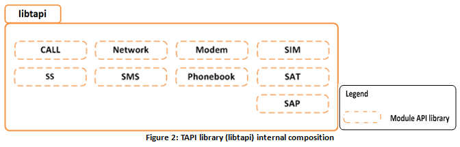
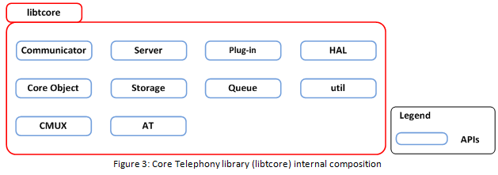
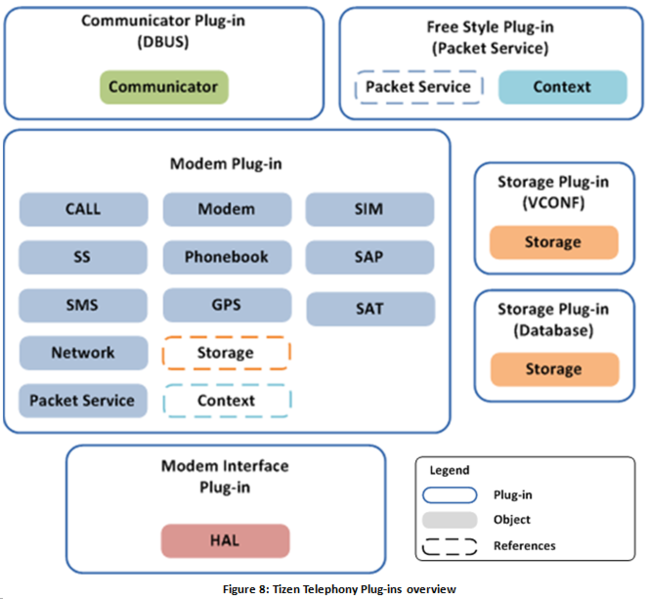
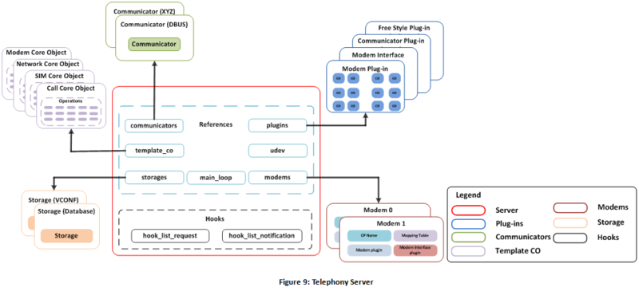

# Telephony

This document covers detailed Telephony architecture including the various components of Telephony and workflow through Telephony framework. The document also provides porting guidelines for vendors to ease the OAL interface development for their hardware.

- Tizen Telephony features


- Telecommunication functionalities, such as call, SS, SMS, SIM, network, and packet service
- Plug-in Architecture


- Definitions


- Core object
  - Bundle of functions and supportive database information designated to specific module, such as call, SS, SIM, network, which processes requests, responses, and notifications.
  - Core objects form the executable component of a Telephony module (call, SS, SIM, network)
- HAL
  - HAL, Hardware Abstraction Layer, abstracts the actual hardware used and ensures that similar functionality is provided by various hardware (modems) of the same modem vendor.
  - All hardware specific changes are controlled and processed by HALs.
  - The modem driver can be required depending on the modem chipset.
- Hooks
  - Hooks provide a mechanism to tap requests, responses, and notifications of other Telephony modules.
  - Hooking is a transparent mechanism and does not affect the normal processing of requests, responses, and notifications.

## Tizen Telephony Architecture

Tizen Telephony supports the plugin architecture, which provides flexibility to include various types of predefined plugins into the system with little change.


The 3 major components of Tizen Telephony are the libraries, plugins, and server.

## Telephony Libraries

- Telephony API (TAPI) library

The TAPI library (or simply TAPI) is a standardized interface provided to applications to interact with Tizen Telephony. It is provided as a `libtapi` package. The TAPI executes in the application’s context, and it provides sync and async APIs. The following figure shows the `libtapi` internal composition.



Applications can interface to Telephony features, such as call, SMS, and network, through the respective module APIs exposed in the `libtapi` library. Telephony also provides an additional library, `capi-telephony` for third party applications.

- Core Telephony library

The Core Telephony library (or `libtcore`) provides an API framework for Tizen Telephony to inter-work. It is provided as `libtcore` package. The following figure shows the internal composition overview of the `libtcore`.



With `libtcore`, you can:

- Create, destroy, and maintain various server components, such as server, communicator, HAL, plugin, and core object.
- Maintain storage, queue mechanism, and general utilities.
- Support CMUX (creation/destruction/processing).
- Parse AT.

## Telephony Plugins

There are 4 kinds of plugins:

- Communicator plugins
  - Interfaces TAPI and Telephony Server.
  - For example, DBUS communicator (`DBUS_TAPI`) is provided by default.


- Modem plugins
  - Core functional units providing the Telephony functionality.
  - Maintain and manage the Telephony states.
  - Maintain and manage the databases related to Telephony.


- Modem interface plugins
  - Interfaces the telephony server to the communication processor.
  - Hardware specific plugins which define hardware capabilities and usage
  - Modem interface plugin is also called HAL.


- Free Style plugins
  - Provide completely independent functionality irrespective of hardware (communication processor).
  - For example plugins, such as packetservice, storage, and indicator.


The following figure provides an overview of all the Telephony plugins together.



## Telephony Server

Tizen Telephony runs as a Telephony server daemon called `telephony-daemon`.

The Telephony server executes as a `g-main` loop from the `glib` library.



## Porting OAL Interface

OEM vendors can port available plugins within Telephony as needed. It is not mandatory that all the plugins to be ported to support a specific hardware.

This section provides guidance to OEM vendors to develop various Telephony plugins.

### Plugin Descriptors

Any telephony plugin is required to provide a descriptor structure described in the following example.

| Structure                                | Description                              |
| ---------------------------------------- | ---------------------------------------- |
| `struct tcore_plugin_define_desc {    gchar *name;    enum tcore_plugin_priority priority;    int version;    gboolean(*load)();    gboolean(*init)(TcorePlugin *);    void (*unload)(TcorePlugin *);};` | Structure referred by Telephony server to load, initialize, and unload the plugin.This structure defines:Name of the pluginInitializing priority of the pluginPlugin versionPlugin 'load' function referencePlugin 'init' function referencePlugin 'unload' function reference |

The descriptor structure of each plugin must be named as `plugin_define_desc`. The server obtains the address of this symbol in order to provide control to the plugin to execute its defined functionality.

The order of initialization among various Telephony plugins is defined based on the plugin’s priority.

OEMs need to specifically implement the modem and modem interface plugins to support their hardware.

### Call Service Operations

The implementation of the functions described in the following example is required to provide call services.

| Structure                                | Description                              |
| ---------------------------------------- | ---------------------------------------- |
| `struct tcore_call_operations {    TReturn (*dial)(CoreObject *o, UserRequest *ur);    TReturn (*answer)(CoreObject *o, UserRequest *ur);    TReturn (*end)(CoreObject *o, UserRequest *ur);    TReturn (*hold)(CoreObject *o, UserRequest *ur);    TReturn (*active)(CoreObject *o, UserRequest *ur);    TReturn (*swap)(CoreObject *o, UserRequest *ur);    TReturn (*join)(CoreObject *o, UserRequest *ur);    TReturn (*split)(CoreObject *o, UserRequest *ur);};` | The structure referred by the Telephony server to provide call services.This structure defines:Call 'dial' function referenceCall 'answer' function referenceCall 'end' function referenceCall 'hold' function referenceCall 'active' function referenceCall 'swap' function referenceCall 'join' function referenceCall 'split' function reference |

### SMS Service Operations

The implementation of the functions described in the following example is required to provide SMS services.

| Structure                                | Description                              |
| ---------------------------------------- | ---------------------------------------- |
| `struct tcore_sms_operations {    TReturn (*send_umts_msg)(CoreObject *o, UserRequest *ur);    TReturn (*send_cdma_msg)(CoreObject *o, UserRequest *ur);    TReturn (*read_msg)(CoreObject *o, UserRequest *ur);    TReturn (*save_msg)(CoreObject *o, UserRequest *ur);    TReturn (*delete_msg)(CoreObject *o, UserRequest *ur);    TReturn (*get_sca)(CoreObject *o, UserRequest *ur);    TReturn (*set_sca)(CoreObject *o, UserRequest *ur);    TReturn (*get_sms_params)(CoreObject *o, UserRequest *ur);    TReturn (*set_sms_params)(CoreObject *o, UserRequest *ur);};` | Structure referred by the Telephony server to provide SMS-related services.This structure defines:SMS 'send' function referenceSMS 'read' function referenceSMS 'save' function referenceSMS 'delete' function referenceSMS 'get sca' function referenceSMS 'set sca' function referenceSMS 'get sms params' function referenceSMS 'set sms params' function reference |

### Network Service Operations

The implemenation of the functions described in the following example is required to provide network services.

| Structure                                | Description                              |
| ---------------------------------------- | ---------------------------------------- |
| `struct tcore_network_operations {    TReturn (*search)(CoreObject *o, UserRequest *ur);    TReturn (*set_plmn_selection_mode)(CoreObject *o, UserRequest *ur);    TReturn (*get_plmn_selection_mode)(CoreObject *o, UserRequest *ur);    TReturn (*set_service_domain)(CoreObject *o, UserRequest *ur);    TReturn (*get_service_domain)(CoreObject *o, UserRequest *ur);    TReturn (*set_band)(CoreObject *o, UserRequest *ur);    TReturn (*get_band)(CoreObject *o, UserRequest *ur);};` | Structure referred by the Telephony server to provide network services.This structure defines:Network 'search' function referenceNetwork 'set plmn selection mode' function referenceNetwork 'get plmn selection mode' function referenceNetwork 'set service domain' function referenceNetwork 'get service domain' function referenceNetwork 'set band' function referenceNetwork 'get band' function reference |

### HAL operations

The implementation of the functions described in the following example is required to provide HAL operations.

| Structure                                | Description                              |
| ---------------------------------------- | ---------------------------------------- |
| `struct tcore_hal_operations {    TReturn (*power)(TcoreHal *hal, gboolean flag);    TReturn (*send)(TcoreHal *hal, unsigned int data_len, void *data);    TReturn (*setup_netif)(CoreObject *co,                           TcoreHalSetupNetifCallback func, void *user_data,                           unsigned int cid, gboolean enable);};` | Structure referred by Telephony server to provide HAL operations.This structure defines:HAL 'power' function referenceHAL 'send' function referenceHAL 'setup network interface' function reference |

Sample implementations of the modem and modem interface plugins is available in the [Appendix](https://wiki.tizen.org/Tizen_3.0_Porting_Guide#Appendix) section.

## Configuration

There are no specific configurations required for Telephony except for conforming to the installation paths of various Telephony plugins.

All Telephony plugins need to be installed in the following folders:

- Modem Plugins: `%{_libdir}/telephony/plugins/modems/`
- Other Plugins: `%{_libdir}/telephony/plugins/`

## References

Tizen source website [http://review.tizen.org/git/](http://review.tizen.org/git/)

Telephony packages

- Telephony daemon


- Telephony core library


- TAPI


- Telephony API for a third party application


- Communicator (`DBUS_TAPI`)


- Free Style plugin (indicator)


- Free Style plugin (packetservice)


- Free Style plugin (nitz)


- Free Style plugin (Database)


- Free Style plugin (VCONF)


- Modem plugin (device)


- Modem Interface plugin (device)


- Modem plugin (emulator)


- Modem Interface plugin (emulator)


## Appendix

#### Sample Implementation for the Modem Interface Plugin

```
/* HAL Operations */
static struct tcore_hal_operations hal_ops = {
    .power = hal_power,
    .send = hal_send,
    .setup_netif = hal_setup_netif,
};

static
gboolean on_load()
{
    dbg(" Load!!!");

    return TRUE;
}

static
gboolean on_init(TcorePlugin *plugin)
{
    TcoreHal *hal;
    PluginData *user_data;
    struct custom_data *data;

    dbg(" Init!!!");

    if (plugin == NULL) {
        err(" PLug-in is NULL");

        return FALSE;
    }

    /* User data for Modem Interface plugin */
    user_data = g_try_new0(PluginData, 1);
    if (user_data == NULL) {
        err(" Failed to allocate memory for Plugin data");

        return FALSE;
    }

    /* Register to eerver */
    user_data->modem = tcore_server_register_modem(tcore_plugin_ref_server(plugin), plugin);
    if (user_data->modem == NULL) {
        err(" Registration Failed");
        g_free(user_data);

        return FALSE;
    }
    dbg(" Registered from Server");


    data = g_try_new0(struct custom_data, 1);
    if (data == NULL) {
        err(" Failed to allocate memory for Custom data");

        /* Unregister from server */
        tcore_server_unregister_modem(tcore_plugin_ref_server(plugin), user_data->modem);

        /* Free plugin data */
        g_free(user_data);

        return FALSE;
    }

    /* Open DPRAM device */
    data->vdpram_fd = vdpram_open();
    if (data->vdpram_fd < 0) {
        /* Free custom data */
        g_free(data);

        /* Unregister from server */
        tcore_server_unregister_modem(tcore_plugin_ref_server(plugin), user_data->modem);

        /* Free plugin data */
        g_free(user_data);

        return FALSE;
    }
    /* Create and initialize HAL */
    hal = tcore_hal_new(plugin, "vmodem", &hal_ops, TCORE_HAL_MODE_AT);
    if (hal == NULL) {
        /* Close VDPRAM device */
        vdpram_close(data->vdpram_fd);

        /* Free custom data */
        g_free(data);

        /* Unregister from server */
        tcore_server_unregister_modem(tcore_plugin_ref_server(plugin), user_data->modem);

        /* Free Plugin data */
        g_free(user_data);

        return FALSE;
    }
    user_data->hal = hal;

    /* Link custom data to HAL user data */
    tcore_hal_link_user_data(hal, data);

    /* Set HAL as Modem Interface plugin's user data */
    tcore_plugin_link_user_data(plugin, user_data);

    /* Register to Watch list */
    data->watch_id_vdpram = __register_gio_watch(hal, data->vdpram_fd, on_recv_vdpram_message);
    dbg(" fd: [%d] Watch ID: [%d]", data->vdpram_fd, data->watch_id_vdpram);

    /* Power ON VDPRAM device */
    if (_modem_power(hal, TRUE) == TCORE_RETURN_SUCCESS) {
        dbg(" Power ON - [SUCCESS]");
    } else {
        err(" Power ON - [FAIL]");
        goto EXIT;
    }

    /* Check CP Power ON */
    g_timeout_add_full(G_PRIORITY_HIGH, SERVER_INIT_WAIT_TIMEOUT, __load_modem_plugin, hal, 0);

    dbg("[VMMODEM] Exit");

    return TRUE;

EXIT:
    /* Deregister from Watch list */
    __deregister_gio_watch(data->watch_id_vdpram);

    /* Free HAL */
    tcore_hal_free(hal);

    /* Close VDPRAM device */
    vdpram_close(data->vdpram_fd);

    /* Free custom data */
    g_free(data);

    /* Unregister from Server */
    tcore_server_unregister_modem(tcore_plugin_ref_server(plugin), user_data->modem);

    /* Free plugin data */
    g_free(user_data);

    return FALSE;
}

static void
on_unload(TcorePlugin *plugin)
{
    TcoreHal *hal;
    struct custom_data *data;
    PluginData *user_data;

    dbg(" Unload!!!");

    if (plugin == NULL)
        return;

    user_data = tcore_plugin_ref_user_data(plugin);
    if (user_data == NULL)
        return;

    hal = user_data->hal;

    data = tcore_hal_ref_user_data(hal);
    if (data == NULL)
        return;

    /* Deregister from Watch list */
    __deregister_gio_watch(data->watch_id_vdpram);
    dbg(" Deregistered Watch ID");

    /* Free HAL */
    tcore_hal_free(hal);
    dbg(" Freed HAL");

    /* Close VDPRAM device */
    vdpram_close(data->vdpram_fd);
    dbg(" Closed VDPRAM device");

    /* Free custom data */
    g_free(data);

    tcore_server_unregister_modem(tcore_plugin_ref_server(plugin), user_data->modem);
    dbg(" Unregistered from Server");

    dbg(" Unloaded MODEM");
    g_free(user_data);
}

/* VMODEM Descriptor Structure */
EXPORT_API struct tcore_plugin_define_desc plugin_define_desc = {
    .name = "VMODEM",
    .priority = TCORE_PLUGIN_PRIORITY_HIGH,
    .version = 1,
    .load = on_load,
    .init = on_init,
    .unload = on_unload
};

```

#### Sample Implementation for the Modem Plugin

```
static
gboolean on_load()
{
    dbg("LOAD!!!");

    return TRUE;
}

static
gboolean on_init(TcorePlugin *p)
{
    TcoreHal *h;

    dbg("INIT!!!");

    if (!p) {
        err("Plug-in is NULL");

        return FALSE;
    }

    h = tcore_server_find_hal(tcore_plugin_ref_server(p), "vmodem");
    if (!h) {
        err("HAL is NULL");

        return FALSE;
    }

    tcore_hal_add_send_hook(h, on_hal_send, p);
    tcore_hal_add_recv_callback(h, on_hal_recv, p);

    /* Initialize Modules */
    s_modem_init(p, h);
    s_network_init(p, h);
    s_sim_init(p, h);
    s_ps_init(p, h);
    s_call_init(p, h);
    s_ss_init(p, h);
    s_sms_init(p, h);
    tcore_hal_set_power(h, TRUE);

    /* Send "CPAS" command to invoke POWER UP NOTI */
    s_modem_send_poweron(p);

    dbg("Init - Successful");

    return TRUE;
}

static void
on_unload(TcorePlugin *p)
{
    TcoreHal *h;

    dbg("UNLOAD!!!");

    if (!p) {
        err("Plug-in is NULL");

        return;
    }

    h = tcore_server_find_hal(tcore_plugin_ref_server(p), "vmodem");
    if (h) {
        tcore_hal_remove_send_hook(h, on_hal_send);
        tcore_hal_remove_recv_callback(h, on_hal_recv);
    }

    /* Deinitialize the modules */
    s_modem_exit(p);
    s_network_exit(p);
    s_sim_exit(p);
    s_ps_exit(p);
    s_call_exit(p);
    s_ss_exit(p);
    s_sms_exit(p);
}

/* ATMODEM plug-in descriptor */
struct tcore_plugin_define_desc plugin_define_desc = {
    .name = "ATMODEM",
    .priority = TCORE_PLUGIN_PRIORITY_MID,
    .version = 1,
    .load = on_load,
    .init = on_init,
    .unload = on_unload
};

```

#### Workflow

1. Initialization sequence

   1. The server loads the modem interface plugin.
   2. The modem interface plugin registers to the server.
   3. The server enumerates the modem interface plugin.
   4. Create the physical HAL.
   5. The modem interface plugin queries the modem state.
   6. If the modem is online, the CMUX (internal) channels are established.
   7. The logical HAL is created for each CMUX channel and assigned for a core object type. These are updated to the mapping table.
   8. Change the physical HAL mode to `TRANSPARENT` (disables the queue).
   9. The modem interface plugin requests server to load the modem plugin (corresponding to its architecture).
   10. The server loads modem plugin.
   11. The modem plugin initializes the sub-modules and creates the core objects (based on the core object types defined in the mapping table by the modem interface plugin).
   12. The modem plugin notifies the server of the `PLUGIN_ADDED` event.
   13. The modem notifies the communicator of the `PLUGIN_ADDED` event.
   14. The communicator creates interfaces for the sub-modules present (based on the core objects created).

2. Request processing sequence

   1. The application request is sent to the communicator through TAPI.
   2. The communicator creates a user request based on the incoming request.
   3. The user request is dispatch to communicator.
   4. The communicator dispatches user request to server.
   5. The server finds the plugin based on the modem name.
   6. The server extracts the core object type based on the request command from plugin’s core objects list.
   7. The server dispatches the user request to the core object.
   8. The core object dispatches the user request to dispatch a function based on the request command.
   9. Pending request is formed, added to the queue, and sent to the logical HAL assigned for the core object.
   10. The logical HAL dispatches the request data to a CMUX channel dedicated to it.
   11. CMUX encodes the request data and dispatches it to the physical HAL.
   12. The physical HAL sends the request data to the modem.

3. Response processing sequence

   1. Response data sent by the modem is received by the physical HAL.
   2. The physical HAL dispatches the response data to CMUX.
   3. CMUX decodes the received response data and dispatches the corresponding logical HAL based on the CMUX channel.
   4. The logical HAL dispatches the decoded response data to the corresponding core object.
   5. The core object processes the received response data and extracts the user request from the pending queue and sends the response data corresponding to the user request.
   6. The user request extracts the communicator.
   7. The received response data is sent to the corresponding communicator.
   8. The communicator sends the response data to TAPI which communicates the response to application.

4. Indication processing sequence

   1. Notification data sent by the modem is received by the physical HAL.
   2. The physical HAL dispatches the notification data to CMUX.
   3. CMUX decodes the received notification data and dispatches the corresponding logical HAL based on the CMUX channel registered for the notification.
   4. The logical HAL dispatches the decoded notification data to the corresponding core object that registered for the notification.
   5. The core object processes the received notification data and dispatches to the server.
   6. The server dispatches the notification data to corresponding communicator.
   7. The communicator sends the notification data to TAPI, which communicates the same to the application.
