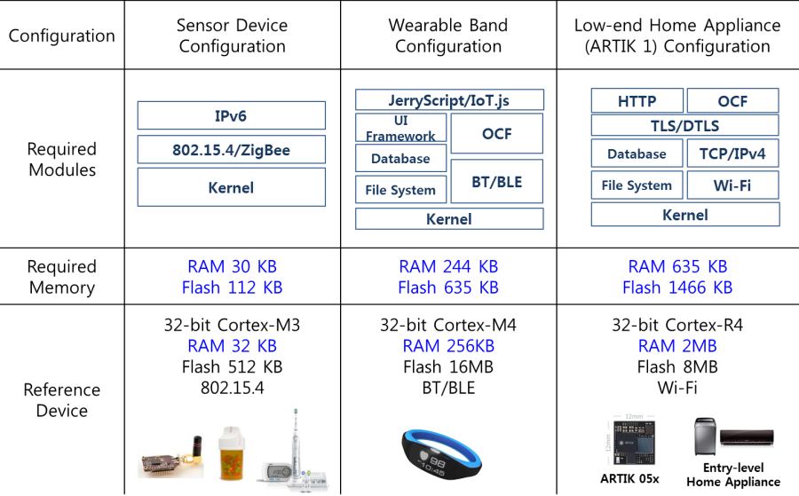

# Long-term Tizen RT Goals

The following sections describe various long-term development goals of Tizen RT.

## IoT JavaScript Framework

Tizen RT provides an application framework based on JavaScript. JavaScript is strong especially in IoT devices, since it has enormous developer community support and a fast development cycle. The application framework is built on top of an ultra-light JavaScript engine (JerryScript) and an asynchronous I/O event processing library (libtuv), which enable fast application development and prototyping for individual IoT developers. The IoT JavaScript Framework (IoT.js) is expected to support ARTIK in the first quarter of 2017 and continue to open source activities to increase the popularity of IoT.js.

**Figure: IoT JavaScript framework**

**Table: IoT.js features**

| IoT.js feature                  | Description     |
| ------------------------------- | --------------- |
| Ultra-light JavaScript engine   | Small enough to fit in IoT devices. Supports ES5. |
| Ultra-light JavaScript runtime  | Supports IoT application lifecycle and JavaScript APIs, and requires IoT Applications. Supports asynchronous I/O event processing. |
| Binding layer for IoT library (such as OCF library) | Provides a binding layer and enables native functionality with additional libraries. In the case of OCF, basic features based on TinyAra are initially supported. |

## Software Updates

For home appliance products, Tizen RT supports the proprietary software update mechanism developed by Samsung. As Tizen RT becomes an open source project, non-Samsung devices running Tizen RT require the software update service as well. To support non-Samsung devices, Tizen RT plans to support OMA lightweight M2M (LWM2M)-based FOTA in 2017. ARTIK Cloud already supports LWM2M.

## Fault Tolerance

IoT platforms face a challenge in the large-scale device management of deployed IoT devices. System reliability has become a key success factor for IoT platforms. If a critical bug in device drivers or other system components occurs, the whole system inevitably crashes in the case of a traditional monolithic kernel. A clear solution is needed to overcome this challenge; however, typical Tizen RT target devices have only an MPU (memory protection unit). Without an MMU (memory management unit), protecting the system from faults is much more difficult. To provide MPU-based fault isolation, Tizen RT pursues 4 approaches:

- Per-thread memory protection
- Microkernel architecture
- Self-healing
- Live update

Assuming the completion of all these features, Tizen RT can be safely protected from any kind of faults. For example, even though a network component encounters a critical error, this fault can be identified by memory protection and isolated by the microkernel architecture. The network component can be restarted by self-healing without any effect on the entire system. If that component is not self-healed eventually, it can be updated by live update through software updating.

### Memory Protection

Tizen RT supports not only flat build, but also memory-protected build. The former can help to reduce the memory usage at the expense of memory vulnerability. The latter can be achieved at the cost of about 20~30% increase of memory usage. Which mode is more suitable for low-end IoT devices depends on the trade-off analysis, considering software requirements and hardware limitations.

User/kernel space separation has already been achieved. The entire memory map is divided into user and kernel spaces. The kernel space is exclusively accessed by the kernel only. Any user tasks which illegally attempt to access this memory region raise an exception. In this mode, the kernel executes with privileged permissions while user threads execute with unprivileged, restricted permissions, as shown in the following figure. Per-thread memory protection is expected to be implemented in the first half of 2017.

**Figure: User and kernel separation**

The user thread is executed in the unprivileged mode with restricted permissions. When multiple threads are running, the scheduler preempts the currently-running task and brings the new ready-to-run thread for execution. The stack/data region of thread A is protected from being written by thread B even after thread A is preempted by thread B. This per-thread protection can be realized by the MPU which stores and restores the MPU context of every thread at every context switch.

### Microkernel Architecture

The microkernel aims at minimizing kernel functions by only including scheduling, task, memory, and IPC. Other kernel modules, such as device drivers, network stacks, and file system, must be isolated from the kernel as isolated components. This isolation means that each system component executes as a separate user space thread/task. The kernel can communicate with the isolated components in the user space through IPC, as shown in the following figure. The frequency of IPC usage inevitably becomes higher than that of a monolithic architecture. This is why the minimized overhead IPC design is a key success factor of the microkernel architecture. The microkernel architecture is to be designed in the first half of 2017 and the per-thread memory protection implementation is to be followed by microkernel implementation.

**Figure: Microkernel architecture**

### Self-healing

Recovering from failures makes a system sustainable. To this end, Tizen RT can detect faults regardless of where they happen, as shown in the following figure.

**Figure: Self-healing**

1. A dedicated service manager component monitors all system components through IPC and controls their execution.
2. When a crash event is detected, a notification is sent to the components (orange balloon) which have a dependency with the faulted component (pink crashed balloon).
3. The orange component immediately halts its dependent tasks and waits for messages from the service manager.
4. If the manager restarts the corrupted component and judges that the restarted component is operating normally, it informs the orange component that the corrupted component has been successfully restarted.
5. The orange component resumes the halted tasks and communicates normally with the restarted component through IPC.

The implementation of self-healing takes place after that of the microkernel architecture.

## Configurability

Build configuration allows you to select the Tizen RT features you need at compilation time. Tizen RT can be configured from a full-featured platform to a small, connectivity-oriented platform.

The following table illustrates 3 full-featured configuration examples. Typical hardware requirements for wearable band and low-end home appliance configurations include Cortex-M4/R4, more than 256 KB RAM, more than 1 MB flash memory, and Wi-Fi or NB-IoT/Cat-M connectivity. For a connectivity-oriented platform, such as a sensor device, the typical hardware requirements for the configuration include Cortex-M3, less than 256 KB RAM, less than 1 MB flash memory, and IEEE 802.15.4 or BLE connectivity. This build-time configuration is based on Kconfig, which is the same as in Linux. For GUI configuration, Tizen RT uses menuconfig, which is also the same as in Linux.

**Table: Example Tizen RT configurations**

## Support for Standard IoT Protocols

While keeping support for the latest IoTivity version, Tizen RT supports other standardized IoT protocols, such as Thread and IPSP over BLE in 2017. These protocols can promote IoTivity across heterogeneous connectivity devices.

## Support for Low-end Wearable Bands

The PoC of a lightweight UI framework was developed in 2016 and is evolving into a commercial-level verified framework. This helps IoT manufacturers make their own low-end wearable bands with small LCDs.
