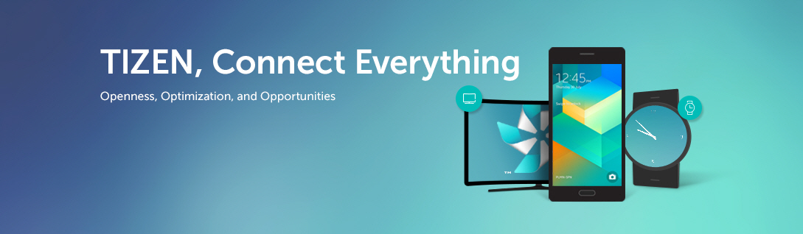

# Welcome to Tizen Studio
The Tizen Studio platform is based on a new version of Eclipse, so you can experience a stable, lightweight, and consistent user interface that is unique to the Tizen development environment. With the Tizen Studio, you can select and install only those platforms and profiles you need.

The [Tizen studio repository](https://review.tizen.org/gerrit/#) is where we do development and there are many ways you can participate in the project, for example:
- Submit bugs and feature requests and help us verify as they are checked in
- Tizen Studio extension development
- Contributed to Tizen studio

## Try to use Tizen Studio

- [About Tizen Studio](docs/Home.md)
- [Prerequisites](docs/environment.md#setting-up-tizen-studio-installation-environment)
- [Download](https://developer.tizen.org/development/tizen-studio/download)

## Developer Guide

- [Setting Environment](docs/environment.md)
- [Package File Description Guide](docs/package-file-desc-guide.md)
- Tizen studio Extension Development
    - [Web/Native IDE Extension Development Guide](docs/web-extension-guide.md)
    - [Emulator Extension Development Guide](docs/emulator-extension-guide.md)
- [Meta Package Description Guide](docs/meta-package.md)
- [Local Build Guild](docs/local-build.md)

## Contribute Guide

If you found a bug, have any questions or want to contribute. 
We would absolutely love to have people testing Tizen Studio and provide feedback about their experiences using it.

- [Tizen Governance](https://wiki.tizen.org/Tizen_Governance)
- [Contributing guidelines](docs/contribute-gerrit.md)

## Resources
- [Tizen Studio Download](https://developer.tizen.org/development/tizen-studio/download)
- [OpenSource Repository](https://review.tizen.org/gerrit/#/)
- [Tool Guide](https://developer.tizen.org/development/tizen-studio/native-tools) 
- [Training](https://developer.tizen.org/development/training/overview)
- [API Docs](https://developer.tizen.org/development/api-references/native-application)
- [Release Notes](https://developer.tizen.org/development/tizen-studio/download/release-notes)

