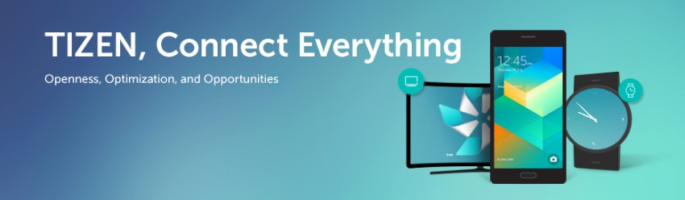

# Welcome to Tizen Studio
The Tizen Studio platform is based on a new version of Eclipse, so you can experience a stable, lightweight, and consistent user interface that is unique to the Tizen development environment. With Tizen Studio, you can select and install only those platforms and profiles you need.

The development of Tizen Studio takes place in the [Tizen Studio repository](https://review.tizen.org/gerrit/#) and there are many ways you can participate in the project by, for example:

- Submitting bugs and feature requests, and helping verify them
- Developing Tizen Studio extensions
- Contributing to Tizen Studio

## Try Tizen Studio

- [About Tizen Studio](https://developer.tizen.org/development/tizen-studio)
- [Prerequisites](https://developer.tizen.org/development/tizen-studio/download/installing-tizen-studio/prerequisites)
- [Download Tizen Studio](https://developer.tizen.org/development/tizen-studio/download)

## Developer Guides

- [Build Environment](environment.md)
- [Package File Description Guide](package-file-desc-guide.md)
- Tizen Studio Extension Development
    - [Web/Native IDE Extension Development Guide](web-extension-guide.md)
    - [Emulator Extension Development Guide](emulator-extension-guide.md)
- [Metapackage File Description Guide](meta-package.md)
- [Local Build Guide](local-build.md)

## Contributor Guide

If you have found a bug, have any questions, or want to contribute, feel free to test Tizen Studio and provide feedback about your experiences in using it:

- [Contributing to Tizen Studio](contribute-gerrit.md)

## Resources

- [Tizen Studio Download](https://developer.tizen.org/development/tizen-studio/download)
- [OpenSource Repository](https://review.tizen.org/gerrit/#/)
- [Tool Guide](https://developer.tizen.org/development/tizen-studio/native-tools)
- [Training](https://developer.tizen.org/development/training/overview)
- [API References](https://developer.tizen.org/development/api-references/native-application)
- [Release Notes](https://developer.tizen.org/development/tizen-studio/download/release-notes)

