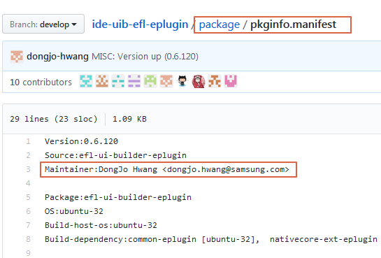

# Contributing to Tizen Studio
Tizen Studio is an open-source project. 
We'd love for you to contribute to our source code and to make Tizen Studio even better than it is today! 

## Download and Review Tizen code.

- [Source Code](https://review.tizen.org/git/)
- [Code Review](https://review.tizen.org/gerrit)

## **Code Contributions:**
This section will guide you through the contribution process.

### Step 1 : Code Clone
```
git clone ssh://<ID>@review.tizen.org:29418/<git project path>
```

### Step 2 : Branch
Make your changes in a new git branch:

```
git checkout opensrc 
```
### Step 3 : Develop

- If you want to develop Tizen Studio Extension, please refer to the guide document.
    - [Package File Description Guide](package-file-desc-guide.md)
    - [Web/Navie IDE Extension Development Guide](web-extension-guide.md)
    - [Emulator Extension Development Guide](emulator-extension-guide.md)
    - [Meta Package Description Guide](meta-package.md)

### Step 4 : Test / Build

Create your patch, including appropriate test cases.<br>
If you are adding functionality or fixing a bug, please add a test!<br>
Build your changes locally to ensure all the tests pass: 
- [Local Build Guilde](local-build.md)


### Step 5 : Commit & Push
```
git add <file name>
git commit -m <update massage>
git log // If 'change-id' and 'Signed-off-by' does not exist, it will not be pushed.
git push origin <branch name>
```


## Step 6: Request a code review
1. In the downloaded source code, there is the `package` directory, `pkginfo.manifest` file.
2. Check the `Maintainer` in the `pkginfo.manifest` file.

3. After uploading your code to gerrit, be sure to register the maintainer as a reviewer.

## Code merge criteria
- At least **2 reviewers** should review.
- The code review score must be at least **2 points**.
- If you pass the code merge criteria, the maintainer merge.


