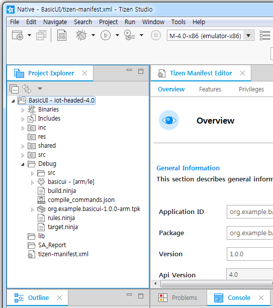

# About Configurable SDK
One of the main goals of the Tizen 4.0 platform is Configurablity.
It does not limit the platform type to a device or profile. Vendor or platform developers can customize the functionality they need.
Tizen Studio provides a feature to develop applications in a configurable tizen platform environment.

## New Feature in Tizen Platform 4.0

- Rather than providing a package according to the profile, the user selects a package suitable for the device type
- Choosing a package for a device type is called a recipe.
- To facilitate recipe, API and Feature-set package selection function is provided.
- It also provides a single build environment

## Tizen Custom Platform Image 제공
- Tizen Image Creator 시스템 제공
- 오픈된 시스템 (Requirement 수집, Bug Report 등 Process)
- Build Tool – 개인용 개발자 및 Team 단위 개발사를 위한,  다양한 ARM Device 지원
- 쉽고 정확한 가이드 문서 – 개발 환경 Setup, Component 별 Technical Article
- 원하는 Feature를  선택하여 자신만의 고유한 제품 개발을 할 수 있는 환경

# Tizen Studio for the Configurable SDK
Tizen Studio는 기존 Profile(Mobile, Wearable, TV)에서 제공하는 App에 Life Cycle에 대한 주요 기능을 Configurable SDK에도 동일하게 제공한다.
Configurable SDK는 Pakcage Manager를 통해 Extension SDK로 설치 및 관리 된다.  
- Create new project
- Config.xml, manifest.xml validation
- API code assist
- Build
- Packaging
- Run As
- Debug As

## Installing the Configuralbe SDK
Extension Configurable SDK를 설치하기 위해서는 다음과 같은 과정을 진행한다.
1. Package Manager에 IOT-Headed-4.0 설정 하기\
a. Package Manager를 실행 한다.\
b. Configuration > Extension SDK > (+) 클릭\
c. Extension Name과 Repository 주소 입력 OK 클릭\

2. IOT-Headed-4.0을 Install 하기\
a. Extension SDK 탭에 IOT-Headed-4.0을 Install 버튼을 클릭하여 설치\

## Create the Project
Extension SDK를 설치 하면 Tizen Studion를 통해 IOT-headed-4.0 Native 프로젝트를 생성 할 수 있으며, 다음과 같은 과정을 진행한다.
1. Tizen Studio을 실행 한다.
2. 프로젝트를 생성 하기 위해 File > New > Tizen Project를 선택 한다.

3. Profile & Version 선택 페이지에서 Custom Box를 선택하고 Iot-Headed v4.0을 리스트 선택 후 Next 버튼을 클릭한다.

4. Application Type에서 Native Box를 선택 한다.

5. Template 선택 페이지에서 Basic UI Template를 선택하고 Next 버튼을 클릭 한다.

6. 프로젝트 명을 입력하고 Finsh 버튼을 클릭하여 프로젝트 생성을 완료 한다.

7. 프로젝트 생성이 되면 다음과 같이 Iot-headed-4.0에 BasicUI 프로젝트가 Project Explorer에 생성 된다.

## Build and Packaging Your Application
Project Explorer에 생성 된 프로젝트에 대해 Build & Packaging을 기능을 제공 한다.
1. Project Explorer에 생성 된 프로젝트에 오른쪽 마우스 버튼을 클릭 하여 Build and signed package를 선택 한다.

2. BasicUI > Debug 하위 디렉토리에 org.example.basicui-1.0.0-arm.tpk 가 생성 된다.

