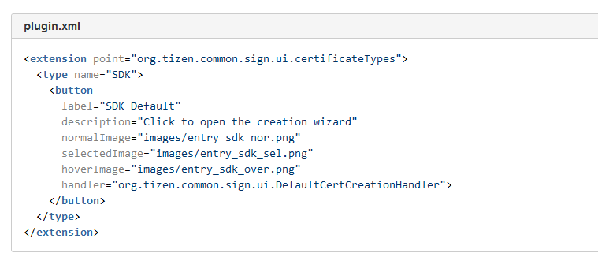
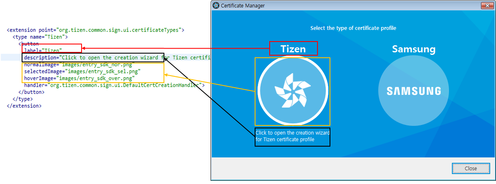

# Modifying the text in Certificate Manager

## Step 1

#### Identifier
- org.tizen.common.sign.ui.certificateTypes

## Step 2

#### Description
- This extension point is used for registering extension certificate type.

## Step 3

#### Configuration
```xml
<!ELEMENT extension (type)>

<!ATTLIST extension

   id - an optional identifier of the extension instance

   name - an optional name of the extension instance

   point - a fully qualified identifier of the target extension point>


<!ELEMENT type (button)>

<!ATTLIST type

   name - a required name of certificate type>


<!ELEMENT button> 

<!ATTLIST button

   label - The label to be displayed at the top of this creation button. This value should be unique name of the certificate type

   description - A description for display in the UI when mouse over on creation button

   normalImage - A plugin relative path to the image to be displayed as the normal state for creation button

   selectedImage - A plugin relative path to the image to be displayed as the selection state for creation button

   hoverImage - A plugin relative path to the image to be displayed as the hover state for creation button

   handler - a fully qualified name of the class that implements org.tizen.common.sign.ui.ICertificateCreationHandler. Call execute() method of this handler when button is clicked>
     
```



## Step 4

#### Add `Required bundle`
```text
Require-Bundle: org.eclipse.ui,
org.eclipse.core.runtime,
org.eclipse.cdt.make.core;bundle-version="7.1.1",
org.eclipse.cdt.managedbuilder.core;bundle-version="8.0.1",
org.eclipse.cdt.make.ui;bundle-version="7.1.1",
org.eclipse.cdt.core,
org.tizen.common.sign.ui, <- ADD
.....
```

## Step 5

#### Implement handler
```java
public class TizenCertCreationHandler implements ICertificateCreationHandler {
   /**
     * Execute certificate creation
     *
     * @return the return code. two standard return codes are predefined, OK and CANCEL.
     */
    @Override
    public int execute() {
        CertificateCreationWizard wizard = new CertificateCreationWizard();
        CertificateCreationWizardDialog dialog = new CertificateCreationWizardDialog(SWTUtil.getShell(), wizard);
        if (dialog.open() == Dialog.OK) {
            return OK;
        }
        return CANCEL;
    }
}
```


