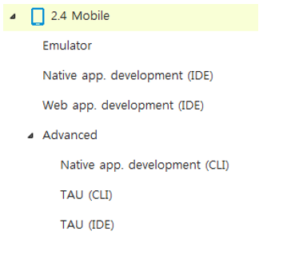

# What is metapackage

Metapackage is the package that makes up the installation tree of Pacakage Manager screen. <br>
That is, a metapackage is a package that supports grouping and installation of packages.
- Tizen Studio is based on metapackage to determine whether extensions are installed and to support integrating between tools.
- Attribute property value is defined as ***root*** or ***extra***.
- For example, `Tools, MOBILE-2.4`, `TV-2.4-samsung-public-Emulator`
- The `pkginfo.manifest` property distinguishes it from regular packages.

> Meta package dependency - tools


## Manage Meta package
- Meta-sdk-components
    - Meta packages targeted to packages used on all platforms
    - Manage from one git, [git project] : build / meta-sdk-components (tizen_sdk)
    - For example, TOOLS, WebIDE
- Mete-platform-components
    - Meta packages targeted to packages installed by platform
    - One git, managed by several branches: sdb / build / meta-platform-components (tizen_2.4, tizen_3.0, ...)
    - In the case of the platform meta package, the tool metapackage often has a dependency in the C-SelectedGroup.
    - For example, MOBILE-2.4, MOBILE-2.4-WebAppDevelopment

### Precautions for metapackage
- Can not dependent on both regular and meta packages for meta packages.
### How to verify metapackage
- Currently, there is no tool to check separately.
- It is recommended to check the git source.

## Write a mata package

- Write the following additional information for extension meta packages
- 

    - Tizen Studio is based on metapackage, supports extension installation and tool integration.
    - A metapackage is a package that supports grouping and installation of packages.
    - Attribute property value is defined as root or **extra**.
        - Attribute : root 
        - Label : Tree Screen contents
        - Description : Details of the meta description
        - For an extension, attribute : Extra attribute - Actual behavior is similar to root
    - Has the same package format as regular packages.    
    - Adding a Property Definition to the Meta Package Definition File (in pkginfo.manifest)
    - ※ Caution!! These properties apply only when specified in the Meta Package of the Extension Server. <br>
      (Specifying the contents of an extension in Meta in the Main Repository is not handled as an extension.)
    - Install-dependency
        - Target metapackage: display as a child on the tree screen, installed together when selected
        - Target regular package: Installed when the selected package is installed
        - Install-dependency should be either meta or all regular packages. Can not be written simultaneously

        - C-ExtName(required) : Extension name
        - C-Platform(required) : Platform Version name
             - (e.g) 2.4 / 3.0
        - C-Profile(required) : Profile name 
             - (e.g) Mobile / Wearable / TV
        - C-ExtProfile(required) : The profile name of the SubProfile (Product) (specify the name of the profile)
             - (e.g) tv-samsung
        - C-DevelopEnv
             - (e.g) WebAppDevelopment 
        - C-ExtPath(required) : Extension installation path
             - (e.g) platforms/tizen-2.4/tv-samsung-public
```text
- Extension support if any type of distribution is available as a repository.
- Deployed as a repository of all extensions (Repo Server, Image, Package)
```


[How to build extension package server and basic operation of Package Manager](https://developer.tizen.org/development/tizen-studio/download/configuring-package-manager#extension)
