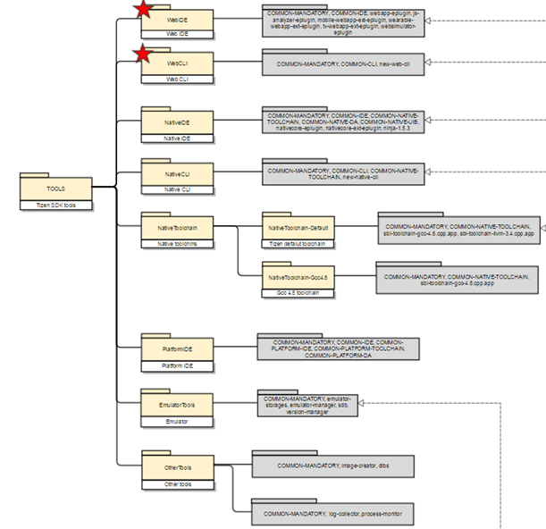

# Metapackage File Description Guide

A metapackage is a package that creates an installation tree in the Package Manager, or in other words, a package that supports the grouping and installation of multiple packages.

The Tizen Studio is based on metapackages to determine whether extensions are installed and to support integration between related tools, for example, `Tools, MOBILE-2.4`, `TV-2.4-samsung-public-Emulator`. Metapackages are distinguished from regular packages by the `pkginfo.manifest` property.

**Figure: Metapackage dependency tree**



## Managing Metapackages

There are 2 types of metapackages:

- Meta-sdk-components
  - Metapackages targeting packages used on all platforms
  - Managed in 1 Git repository: `build/meta-sdk-components` (`tizen_sdk`)
  - For example, `TOOLS` and `WebIDE`

- Meta-platform-components
  - Metapackages targeting platform-specific packages
  - Managed as several branches in 1 Git repository: `sdb/build/meta-platform-components` (`tizen_2.4`, `tizen_3.0`, ...)
  - In a platform metapackage, the tool metapackage often has a dependency in the `C-SelectedGroup`.
  - For example, `MOBILE-2.4` and `MOBILE-2.4-WebAppDevelopment`

> **Note**
>
> A metapackage cannot be dependent on both regular and meta packages.

Currently, there is no tool to verify a metapackage separately. Check the Git source to verify a metapackage.

## Writing Metapackages

Write the following additional information for extension meta packages:


  - Attribute property value is defined as root or `extra`.
      - Attribute: root
      - Label: Tree Screen contents
      - Description: Details of the meta description
      - For an extension, attribute: Extra attribute - Actual behavior is similar to root
  - Extension has the same package format as regular packages.
  - Add a property definition to the metapackage definition file (in `pkginfo.manifest`)
    > **Note**
    >
    > These properties apply only when specified in the metapackage of the Extension Server.
    > Specifying the contents of an extension in Meta in the Main Repository is not handled as an extension.
  - Install-dependency
      - Target metapackage: display as a child on the tree screen, installed together when selected
      - Target regular package: Installed when the selected package is installed
      - Install-dependency must be either meta or all regular packages. Cannot be written simultaneously.
      - `C-ExtName` (required): Extension name
      - `C-Platform` (required): Platform version name
           - For example, `2.4` or `3.0`
      - `C-Profile` (required): Profile name 
           - For example, `Mobile`, `Wearable`, or `TV`
      - `C-ExtProfile` (required): Profile name of the subprofile (product) (specify the name of the profile)
           - For example, `tv-samsung`
      - `C-DevelopEnv`
           - For example, `WebAppDevelopment`
      - `C-ExtPath` (required): Extension installation path
           - For example, `platforms/tizen-2.4/tv-samsung-public`
           ```text
           - Extension support if any type of distribution is available as a repository.
           - Deployed as a repository of all extensions (Repo Server, Image, Package)
           ```

For more information, see [Configuring the Extension SDK Repository](https://developer.tizen.org/development/tizen-studio/download/configuring-package-manager#extension).
