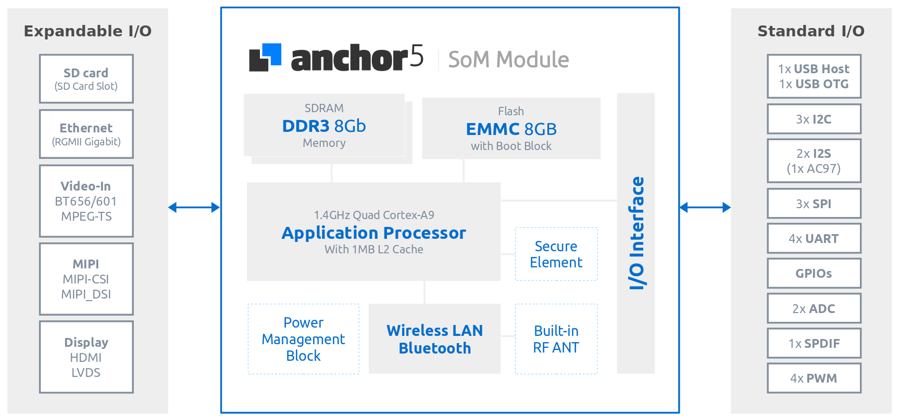
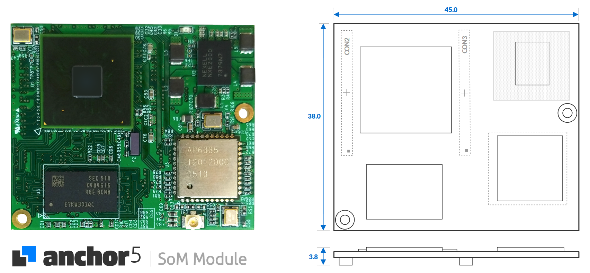
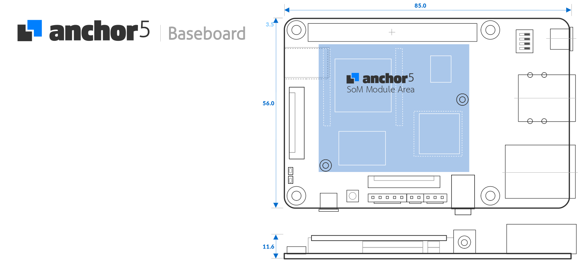
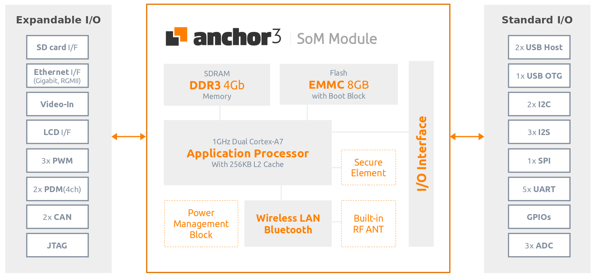
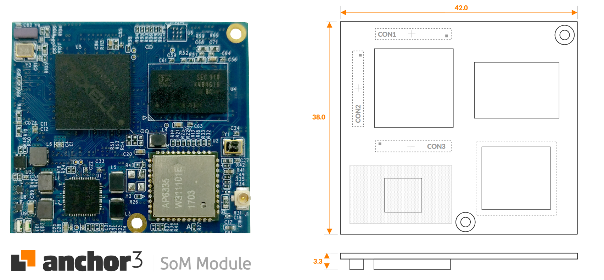
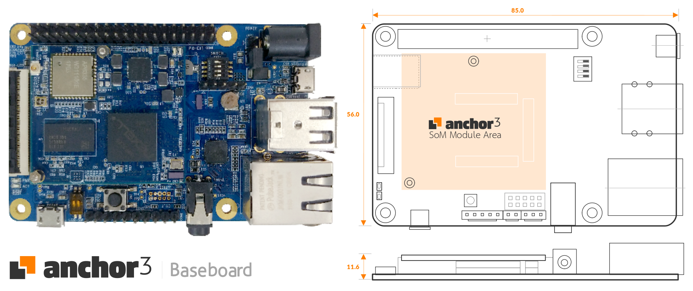

# Tizen IoT with Anchor SoM Module

> The Fastest Way to design your IoT Applications

## Anchor5

**Anchor5** is a system-on-module(SoM) built in a 32-bit RISC application processor that is based on an quad-core ARM® quad Cortex®-A9 cores architecture with max 1.4GHz speed, containing DRAM provided 6.4 GB/s memory bandwidth with flash memory, camera and display interfaces displayed Full HD, a full complement of digital I/O and analog inputs, and world class wireless connectivity with IEEE802.11a/b/g/n/ac and Bluetooth(Classic+BLE) inside a ultra compact package that is just 38x45mm.
The scalable processing power of the Anchor5 makes it ideally suited for video/image processing tasks and provides the best 3D graphics performance with wide range of APIs, such as OpenGL ES1.1, 2.0.
The native dual display supports Full HD resolution with Superior 3D performance of  LCD display and progressive Full HDTV throughout HDMI, simultaneously.
The hardware based Secure Element works with the ARM® TrustZone® and Trusted Execution Environment (TEE) to provide enhanced end-to-end security.

With excellent performance and most popular connectivity like WiFi and Bluetooth, Anchor5 is the perfect choice for home automation and industrial equipment, and even IoT devices, while providing effective price / performance capability.

**Figure** | Anchor5 System-on-Module Block Diagram

### Anchor5 System-on-Module Overview

The Anchor5 System-on-Module has 2 x 90 pin board-to-board connectors and integrates the Application Processor, Memory, eMMC, Power Management IC (PMIC) and WiFi / Bluetooth on the module.

**Figure** | Anchor5 System-on-Module Picture and Dimension

 
### Anchor5 Boardkit Overview
 
**Anchor5 Boardkit** consists of a System-on-Module and a Base Board and Anchor5 Baseboard is connected to the Anchor5 System-on-Module through 2 x 90 pin board-to-board connectors.
This Board Kit provides all of needed interfaces required for popular functionality with peripheral I/O interface that has a gigabit Ethernet MAC, USB Host and USB OTG connector, LCD interface, Audio DAC with phone jack and expansion I/O interface including I2C, I2S, UART, SPI, PWM, ADC, … etc.
You can evaluate, test and use most of the functions for your products with technical support.

**Figure** | Anchor5 Boardkit Picture and Dimension

For more information about **Anchor5**, please click the below.
- [**Anchor5 Specifications**](http://dignsys.com/wp-content/uploads/2019/10/Anchor5-1002.pdf)
- [**Github for Anchor5** Boot & Tizen Package and helpful example source codes](https://github.com/dignsys/)

## Anchor3

**Anchor3 System-on-Module** is a highly-integrated module that utilizes an dual-core ARM® Cortex-A7 processor packaged SDRAM, eMMC Flash memory, a hardware Secure Element and a wireless communication options such as 802.11a/b/g/n/ac, Bluetooth 4.1(Classic+BLE) and all into an compact footprint.
The hardware based Secure Element works with the ARM TrustZone and Trustware, Trusted Execution Environment (TEE) to provide enhanced end-to-end security.
With the combination of Wi-Fi, Bluetooth, Anchor3 is the perfect choice for home automation and industrial equipment, and even IoT devices, while also supporting effective price/performance capability with expandable I/O options.

**Figure** | Anchor3 System-on-Module Block Diagram

### Anchor3 System-on-Module Overview

The Anchor3 System-on-Module has 3 x 60 pin board-to-board connectors and integrates the AP, Memory, eMMC, Power Management IC (PMIC) and WiFi / Bluetooth on the module.

**Figure** | Anchor3 System-on-Module Picture and Dimension

### Anchor3 Boardkit Overview

**Anchor3 Boardkit** consist of a System-on-Module and a Base Board and Anchor3 Baseboard is connected to the Anchor3 System-on-Module through 3 x 60 pin board-to-board connectors.
**Anchor3** Baseboard integrates all of the necessary elements required and optimized for major functionality of embedded equipment with peripheral I/O interface that has a gigabit Ethernet MAC, USB Host and USB OTG connector, LCD interface, Audio DAC with phone jack and a large number of signals on expansion I/O pin headers as well.
The expansion I/O interface supports various general interface including standard I/O such as I2C, I2S, UART, SPI, PWM, ADC, ... etc., to apply external sensors or peripherals.
You can evaluate, test and use most of the functions for your products with technical support.

**Figure** | Anchor3 Boardkit Picture and Dimension

For more information about Anchor3, please click the below.
- [**Anchor3 Specifications**](http://dignsys.com/wp-content/uploads/2019/10/Anchor5-1002.pdf)
- [**Github for Anchor3** Boot & Tizen Package and helpful example source codes](https://github.com/dignsys/)

## Contact Information

For more information about Anchor Series, please visit the below.
- [Customer Service & Technical Supports For **Anchor Series**](http://dignsys.com/eng/embedded-iot/som-module/anchor5-som/)
- [**www.dignsys.com**](http://dignsys.com/)

or **If you have any questions, please send us by** [**email**](mailto:hbahn@dignsys.com)
