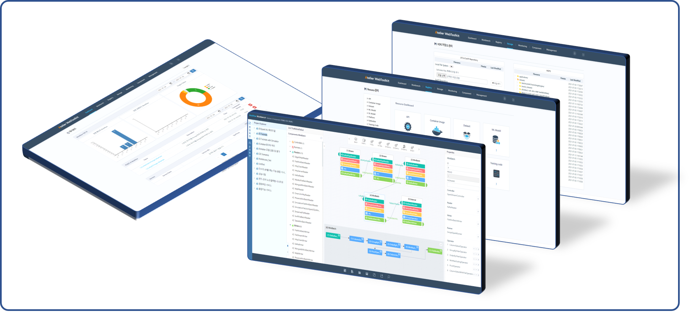
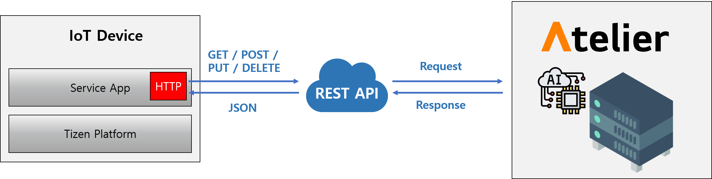

# Tizen IoT with Atelier

Atelier is a web-based AI framework and platform that provides common functions necessary for building various artificial intelligence services by convergence of IoT, big data, machine learning, and domain knowledge.
The common functions of Atelier includes:
- Multi-processor support.
- Big data processing.
- Multi-model simultaneous learning and inference.
- Distributed parallel learning and inference.
- Automatic machine learning.
- Loading and interworking function of learning model and domain knowledge.

Each function is designed to enable selection, combination, execution, serving, and recycling based on workflow.

**Figure: Architecture**

Tizen environment with Atelier is supported on:

- Platform : Tizen 6.0 IoT Headed and Headless, and higher
- SDK : Tizen Studio 4.0 and higher

---

For more information about Atelier, see the following:

- [Atelier Official Web Site](https://www.atelier.re.kr/)
- [Atelier GitLab for Developers](https://gitlab.com/shinc.re/atelier)
- [Tizen with Atelier Examples](https://gitlab.com/shinc.re/atelier/-/blob/main/Hackathon_2021/2021_Hackathon_Tizen_with_Atelier.md)
- [Tizen with Atelier Sample App Download](https://gitlab.com/shinc.re/atelier/-/blob/main/Hackathon_2021/AtelierSampleApp.zip)
- [Tizen App Setting](https://gitlab.com/shinc.re/atelier/-/blob/main/Hackathon_2021/manual_13.01.00.Tizen_Setting.md)
