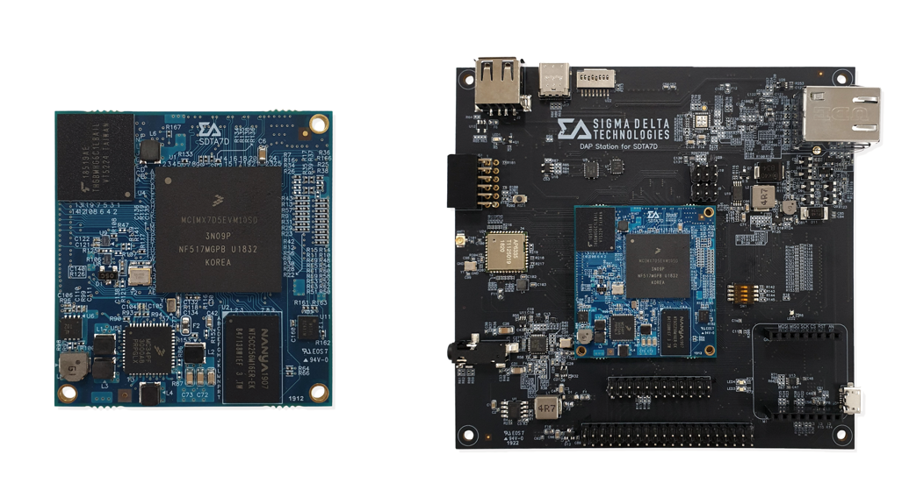

# Tizen-enabled SOM [SDT-A7X2-M4]

Tizen-enabled System-on-Module (SOM) [SDT-A7X2-M4] is a gateway SOM based on Arm® Cortex®-A7 dual core and Arm® Cortex®-M4 core.
Arm® Cortex®-A7 dual core is for high performance and Arm® Cortex®-M4 core is for real-time application performance.
SDT-A7X2-M4 also provides 512MB DDR3L-1600 DRAM and 8GB eMMC NAND Flash.

SDT-A7X2-M4 uses Secure Element (SE) to provide high security. The modules support Arm Mbed Linux OS and Samsung Tizen, and can be directly connected to Arm Pelion and Samsung SmartThings.

**SDT-A7X2-M4 Specifications**
- CPU
  - i.MX7
-Core
  - Arm&reg; Cortex&reg;-A7 Dual Core @ 1.0GHz
  - Arm&reg; Cortex&reg;-M4 Sub Core @ 200MHz
- Memory
  - 512MB DDR3L (1600Mbps)
  - 8GB eMMC (5.0) Flash memory
- OS
  - Supports Samsung Tizen 5.0 Linux
  - Android (to be updated)
  - Linux (TBU)
  - Arm Mbed Linux (TBU)
- Security
  - Secure Element (Samsung KONA I)
  - Arm TrustZone Advanced High Assurance Boot (A-HAB) (HABv4 with SHA-256, 2048-bit RSA key)
  - Cryptographic Acceleration and Assurance Module (CAAM)
  - 32KB secure RAM
  - TRNG (NIST certified)
  - Secure Non-Volatile Storage (SNVS) (including Secure RTC)
- PMIC
  - PF3000
  - Specifically designed PMIC for NXP i.MX7
  - 5.0V, 600mA boost regulator
  - Six adjustable linear regulators
  - Coin cell charger
  - OTP memory
- Serial Peripherals
  - UART, SPI, I2C, PWM, ADC, GPIO
  - Dual CAN
  - RMII/RGMII for 10/100/1000 Base-T Ethernet
  - USB Host, USB OTG
  - PCIe, SD I/O
  - MIPI CSI for Camera
  - MIPI DSI for Display
- Environmental
  - 45 x 42 x 4.5(mm) (W x L x H) dimensions
  - 0&deg;C ~ +85&deg;C operating temperature

Tizen IoT can be installed on SDTA7X2-M4 that is compatible with the following:
- Platform: Tizen 5.0 IoT Headless
- SDK: Tizen Studio 3.3 and higher

For more information on the SDT boards, see the following:
- [SDT-A7X2-M4_image](https://github.com/SigmaDeltaTechnologiesInc/sdta7d-images)
- [Pinout Diagram_DAP Station for SDT-A7X2-M4](https://docs.wixstatic.com/ugd/166c05_a20ebe502e08478d85c67f8dd34beb04.pdf)
- [Product Brief_SDT-A7X2-M4](https://docs.wixstatic.com/ugd/166c05_9b9635ed83d64bfeb7731fe0671fb511.pdf)

For more information on purchasing the kit, see https://www.sigma-delta.tech/sdt-a7x2-m4

For more information on Sigma Delta Technologies, see https://www.sigma-delta.tech/

Copyright © 2019 Sigma Delta Technologies Inc. All rights reserved.
No part of this publication may be reproduced, stored in a retrieval system, or transmitted in any form or by any means – electronic, mechanical, photocopying, recording or otherwise – without the permission of Sigma Delta Technologies.
Trademarks and trade names may be used in this document to refer to either the entities claiming the marks and names or their products. Sigma Delta Technologies disclaims any proprietary interest in the trademarks and trade names other than its own.
