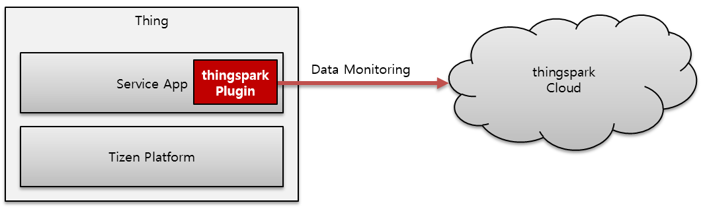

# Tizen IoT with thingspark Cloud

The thingspark service is a cloud-based IoT solution that can be connected with various things. 

Tizen developers can easily develop applications that can send IoT data to the cloud in real-time.

Real-time data monitoring between the Tizen service app and the thingspark cloud is empowered through the thingspark plugin.

The following diagram shows the interface between Tizen IoT device and thingspark cloud:

**Figure: Architecture**

The thingspark plugin can be installed on the Tizen IoT devices that are compatible with the following:

- Platform: Tizen 5.0 IoT Headed and Headless, and higher
- SDK: Tizen Studio 3.3 and higher

For more information on the thingspark IoT cloud service, see the following:

- [Github for thingspark Template](https://github.com/theksystem/tizen_to_thingspark_example)
- [thingspark: Open IoT Platform Service](https://www.thingspark.co.kr)

Get started by importing [thingspark's template](https://github.com/theksystem/tizen_to_thingspark_example) in Tizen Studio!
