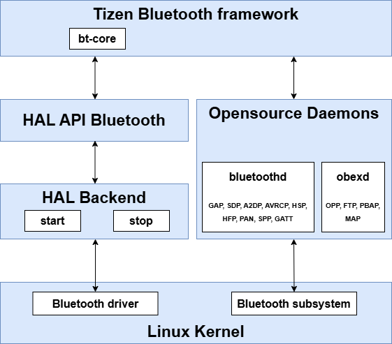

# Connectivity

You can implement various connectivity features, such as Bluetooth, WLAN, and NFC.

## Bluetooth

Bluetooth is a short range communication protocol used to communicate between 2 devices. Tizen uses open source Bluetooth components, such as BlueZ and ObexD. Bluez and ObexD run as a daemon and an interface library, Bluetooth Framework, is used for applications to access them over the D-Bus interface.

This section explains the Bluetooth architecture on the Tizen platform and how Tizen can be ported, along with the configuration parameters and their values.

**Figure: Tizen Bluetooth architecture**



The Bluetooth framework provides a dialogue for the user to control the BlueZ and ObexD daemons. Bluetooth provides a standard interface between the Bluetooth chip and AP, called the HCI (Host Controller Interface). HCI can be implemented on USB, UART, and SDIO, but for the mobile environment, UART is the most common. HCI activation can differ depending on the chip vendor. The vendor provides the HCI configuration and the initial scripts. For example, Broadcom and Spreadtrum provide firmware and a loading tool. Tizen supports Bluetooth version 5.0, and the GATT, FTP, OPP, MAP, PBAP, A2DP, AVRCP, HSP/HFP, RFCOMM, HID, HDP, and PAN profiles.

The Tizen Bluetooth framework is based on the open source BlueZ project. BlueZ provides the DBUS API and based on it, Tizen Bluetooth framework provides the C Language API. Using the Tizen Bluetooth framework is recommended.

The following components are necessary for Bluetooth:

- Application
  - User dialogue that controls the BlueZ and ObexD daemons
- ObexD
  - Open source component
  - Object exchange daemon
  - Supports OPP, FTP, PBAP, SYNC, and MAP profile stack
- BluetoothD
  - BluetoothD is the open source component, BlueZ 5.79 is supported
  - Bluetooth central daemon
  - Supports GAP, SDP, A2DP, AVRCP, HFP, HSP, and GATT profile stack
- Bluetooth subsystem
  - Provides the BT unix socket. Each protocol can be accessed by its socket.
  - Supports the L2CAP, RFCOMM, SCO, and HCI protocols
- Bluetooth driver
  - BT Chip driver
  - For UART, the interface is provided by the [Linux](https://wiki.tizen.org/Linux) kernel.
  - GPIO configuration, `rfkill` (radio frequency management), and power management can be handled by both the vendor and the porting engineer
- Bluetooth firmware loading module
  - Depending on the environment, it loads the Bluetooth firmware to the Bluetooth chip
  - Tizen and the chipset vendor need to implement this together
  - Package: `bluetooth-firmware-bcm`

### Porting the HAL Backend interface

The Bluetooth HAL Backend is responsible for the low-level control and initialization of specific Bluetooth chipsets. It acts as a bridge between the standard Tizen Bluetooth HAL API and the hardware, abstracting the vendor-specific procedures required to bring a Bluetooth adapter in and out of service. The following scripts are run during the Bluetooth stack start and end sequences. These scripts invoke the Bluetooth chip-specific (such as Broadcom and Spreadtrum) scripts, provided by the chipset vendor, to perform chip-specific configuration. These scripts are available in the `bluetooth-firmware-bcm` package. When this package is installed, it copies the following scripts in the `/hal/etc/bluetooth/` directory:

- `bt-stack-up.sh`
- `bt-stack-down.sh`
- `bt-reset-env.sh`

This HAL Backend is not used directly by application developers or the upper-level framework. Instead, it is invoked by the Tizen Bluetooth HAL API implementation to perform hardware-specific tasks.

The process is as follows:
- An application or system service uses the Tizen Bluetooth Framework.
- The Tizen Bluetooth Framework calls the standard C API functions provided by the Tizen Bluetooth HAL API.
- When the HAL API needs to perform a hardware-level operation, such as powering the adapter on or off, it delegates the task to the vendor-specific Bluetooth HAL Backend.
- The HAL Backend executes the necessary vendor-specific commands, scripts, and tools to manage the hardware and then returns the status to the HAL API.

### References

Open source component : BlueZ

For more information, see [http://www.bluez.org/](http://www.bluez.org/).

The reference kernel configuration for Bluetooth:

- The following kernel `.config` lines are enabled for Broadcom Bluetooth support:
  ```
  CONFIG_BT=y
  CONFIG_BT_L2CAP=y
  CONFIG_BT_RFCOMM=y
  CONFIG_BT_RFCOMM_TTY=y
  CONFIG_BT_BNEP=y
  CONFIG_BT_HIDP=y
  CONFIG_BT_HCIUART=y
  CONFIG_BT_HCIUART_H4=y
  CONFIG_BCM4330=y
  CONFIG_RFKILL=y
  CONFIG_RFKILL_INPUT=y
  CONFIG_RXTRA_FIRMWARE_BCM4330="BCM4330.hcd"
  ```
- The following kernel `.config` lines are enabled for Bluetooth AVRCP support:
  ```
  CONFIG_INPUT_MISC=y
  CONFIG_INPUT_UINPUT=y
  ```
- The following kernel `.config` lines are enabled for Bluetooth HID support:
  ```
  CONFIG_INPUT_GP2A=y
  CONFIG_INPUT_KR3DH=y
  ```
- The following kernel `.config` lines are enabled for Bluetooth Audio (SCO-over-PCM) support:
  ```
  CONFIG_BT_SCO=y
  CONFIG_INPUT_GP2A=y
  CONFIG_INPUT_KR3DH=y
  ```