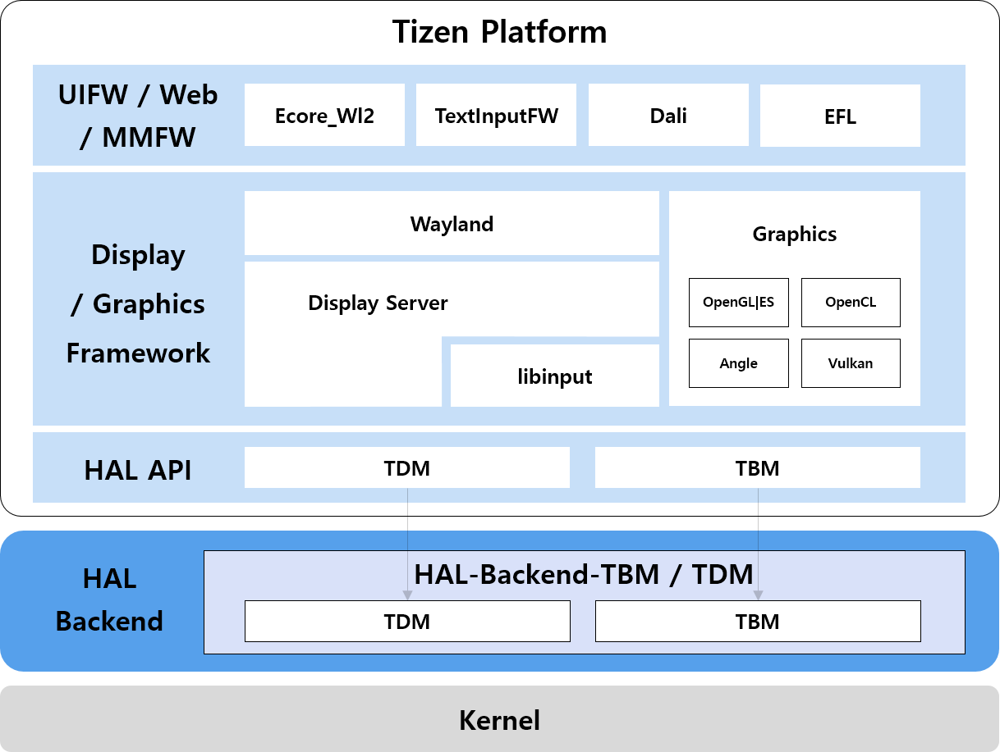

# Display & Graphics

## Overview
The Hardware Abstraction Layer (HAL) for Display and Graphics provides a guide for hardware porting to support display output and control on the Tizen platform, as well as GPU and graphics buffer utilization in Tizen UI applications. This layer is essential for enabling Tizen to function across diverse hardware configurations by abstracting hardware-specific details and providing standardized interfaces for Display and Graphics system operations.

The HAL facilitates the implementation of hardware-specific backend modules that enable efficient GPU utilization, graphics buffer management, and display control mechanisms required by Tizen UI applications.

## Key Subsystems of the Display and Graphics HAL
The Display and Graphics HAL is composed of two primary subsystems, each responsible for a distinct set of functionalities:

- **TBM (Tizen Buffer Manager)**
- **TDM (Tizen Display Manager)**

**Figure: Tizen Display & Graphics HAL hierarchy**

---

### TBM (Tizen Buffer Manager)
The HAL TBM Module provides the hardware abstraction layer for Tizen Buffer Manager (TBM). TBM is the system responsible for allocating, managing, and sharing graphics buffers, which are essential for rendering UI elements and displaying content.

**Key Responsibilities:**
 - **Buffer Allocation and Management:** Provides interfaces for creating and managing graphics memory buffers (e.g., for surfaces, windows, and textures).
 - **Hardware-Specific Backend:** The backend of the HAL TBM Module is inherently hardware-dependent. It implements the actual buffer operations (allocation, locking, unlocking, etc.) using the native capabilities of the target system's GPU and memory management unit.
 - **Inter-Process Buffer Sharing:** Enables efficient sharing of graphics buffers between different processes (e.g., between a client application and the display server). To facilitate this, the HAL TBM Module provides interface of file descriptor (fd) and a key for each buffer, allowing other processes to access the shared graphics memory directly without data duplication.
 - **Unified Interface:** Exposes a consistent API to the upper layers of the Display and Graphics system, regardless of the underlying hardware.

**Implementation Requirement:**
Chipset vendors are required to develop and provide their own backend implementations for the HAL TBM Module. This ensures that TBM can leverage the specific features and optimizations of the target hardware, leading to optimal performance and stability on the Tizen platform.

---

### TDM (Tizen Display Manager)

The HAL TDM Module provides the hardware abstraction layer for the Tizen Display Manager (TDM). The display server (e.g., Wayland compositor in Tizen) is responsible for compositing the final image from various client buffers and presenting it on the screen. The HAL TDM Module equips the display server with the necessary tools to control and manage the display hardware effectively.

**Key Responsibilities:**
 - **Display Hardware Resource Management:** Provides the display server with detailed information about available display hardware resources, such as display connectors (HDMI, eDP, DSI), display modes (resolutions, refresh rates), and hardware planes (overlays).
 - **Hardware Composition and Control:** Allows the display server to offload certain compositing tasks directly to the display hardware. For instance, it can instruct the hardware to scale, rotate, or convert the color format of a buffer before it is displayed, reducing the load on the CPU and GPU.
 - **Unified Interface for Diverse Hardware:** Offers a standardized set of APIs for the display server to interact with a wide range of display controllers and chipsets. This allows a single display server implementation to work seamlessly with different hardware.
 - **Mode Setting and Output Configuration:** Manages the configuration of display outputs, including setting the display mode, enabling/disabling outputs, and handling hot-plug events for external displays.

**Purpose:**
The HAL TDM Module is essential for enabling advanced display features and ensuring high-performance graphics rendering. By providing direct access to hardware capabilities, it allows the display server to efficiently manage multiple layers, perform hardware-accelerated post-processing, and adapt to various display panels and connectors.

---

## Porting OpenGLES/EGL to Tizen

Porting OpenGL ES (OpenGLES) and the Embedded-System Graphics Library (EGL) to Tizen requires integration with Tizen's specific graphics and buffer management infrastructure. This process primarily involves utilizing `libtpl-egl` and `libtbm` to ensure that graphics rendering is optimized and functions correctly within the Tizen environment.

### Understanding the Components

- **`libtbm` (Tizen Buffer Manager):** As described in the HAL TBM Module section, `libtbm` is the user-space library for managing graphics buffers. When porting EGL, `libtbm` serves as the front-end to the hardware-specific TBM backend module (the "hap tbm module"). The EGL implementation must use `libtbm` to allocate and manage the native pixel buffers (surfaces) that will be used for rendering. This ensures that the buffers are compatible with Tizen's display pipeline and can be efficiently shared with the display server (via the Wayland protocol, for example).

- **`libtpl-egl` (Tizen Porting Layer for EGL):** This library acts as a bridge or a wrapper between the standard EGL API and Tizen's underlying Display and Graphics system and hardware abstraction layer. `libtpl-egl` is responsible for adapting EGL calls to work with Tizen's specific components, such as the Wayland compositor and the TBM/TDM HAL modules. It handles the creation of EGL surfaces in a way that is native to Tizen, often by integrating with the Wayland display server for surface creation and buffer swapping.

    Furthermore, `libtpl-egl` utilizes `libtdm` (the user-space library for the Tizen Display Manager) to receive vertical synchronization (VSync) signals from the display hardware. This allows the rendering loop to be synchronized with the display's refresh rate, which is essential for smooth, tear-free visuals and optimal power management.

### Porting Process Overview

The general approach to porting OpenGLES/EGL involves the following steps:

1.  **Leverage `libtbm` for Buffer Management:**
    *   The EGL implementation must be configured to use `libtbm` as its native buffer manager. Instead of allocating generic graphics memory, all EGL surface allocations (e.g., `eglCreateWindowSurface`) should result in the creation of TBM buffers.
    *   The `libtbm` library will interface with the vendor-specific HAL TBM backend module. This backend is responsible for the actual allocation of memory from the GPU or a shared memory area, ensuring hardware compatibility and optimal performance.
    *   The EGL implementation must obtain a `tbm_surface_h` (a TBM surface handle) for the native window. This handle is crucial as it represents the buffer that the GPU will render into.

2.  **Integrate with `libtpl-egl` for EGL Surface Creation:**
    *   `libtpl-egl` provides the necessary functions to create EGL surfaces that are compatible with Tizen's Display and Graphics system. When an application creates an EGL surface, `libtpl-egl` works with the Wayland compositor to establish a native window (e.g., a `wl_surface`).
    *   It then uses this native window to create an EGLSurface, ensuring that the underlying buffers are TBM buffers managed by `libtbm`. This integration is vital for the display server to correctly composite and present the rendered content.

3.  **Utilize Existing HAL TBM and TDM Modules:**
    *   The porting effort relies heavily on the existing, vendor-implemented HAL TBM and TDM modules.
    *   The HAL TBM module, as the backend for `libtbm`, handles the low-level, hardware-specific buffer operations. The EGL port does not need to implement these details but must correctly call the `libtbm` APIs, which in turn utilize the HAL backend.
    *   The HAL TDM module is used by the display server to manage the display hardware. Crucially, `libtpl-egl` uses `libtdm` to interface with the HAL TDM module to receive VSync signals. This synchronizes the EGL swap buffers call (`eglSwapBuffers`) with the display's refresh cycle, preventing screen tearing and improving rendering efficiency.

    While the EGL port itself may not directly call TDM APIs, the buffers it manages via `libtbm` are ultimately processed and displayed by the display server using the HAL TDM module. This ensures that the final rendered frame is presented on the screen correctly.

### Summary

In essence, porting OpenGLES/EGL to Tizen is not about rewriting EGL from scratch but about adapting it to use Tizen's native graphics stack. By using `libtbm` for buffer management (which interfaces with the HAL TBM backend) and `libtpl-egl` for integrating with the Tizen's Display and Graphics system, the EGL implementation can leverage the hardware-accelerated capabilities of the target device.

A key aspect of this integration is `libtpl-egl`'s use of `libtdm` to receive VSync signals from the display hardware via the HAL TDM module. This synchronizes rendering with the display's refresh rate, preventing visual tearing and enhancing performance. This approach ensures that rendering is performant, buffers are shared efficiently between processes, and the final output is correctly managed and presented by the display server. The vendor's responsibility is to provide robust HAL TBM and TDM backend implementations, upon which `libtbm`, `libtpl-egl`, and the EGL port can build.
