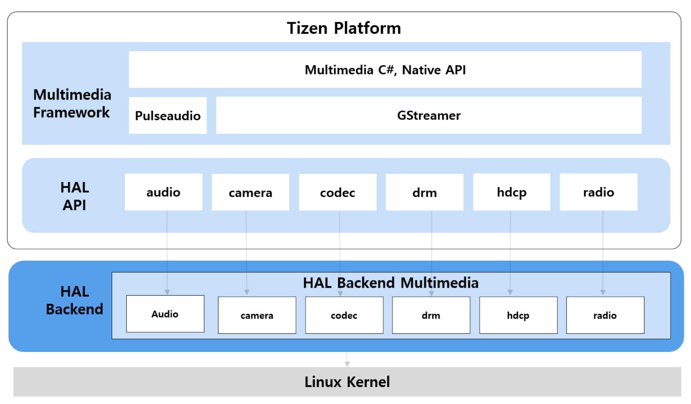

# Multimedia

This document provides a brief introduction to the Tizen HAL (Hardware Abstraction Layer) APIs for various multimedia components. These APIs serve as an interface between the higher-level software frameworks and the underlying hardware drivers, facilitating hardware interaction in an abstracted manner.

**Figure: Multimedia HAL hierarchy**

## Audio

**Purpose:**
The `hal-audio.h` file defines the Hardware Abstraction Layer (HAL) API for audio functionalities on the Tizen platform. It provides a standardized interface for controlling audio hardware, including operations like initialization, deinitialization, volume control, stream management, and PCM (Pulse Code Modulation) device handling.

**Key Functionalities:**
*   **Initialization & Deinitialization**
*   **Volume Control**
*   **Audio Routing**
*   **Stream Management**
*   **PCM Device Operations**
*   **Ducking**
*   **Message Callbacks**

This API is essential for any application or system service that needs to interact directly with audio hardware on Tizen devices.

---

## Camera

**Purpose:**
The `hal-camera.h` and `hal-camera-interface.h` files define the HAL API for camera functionalities on the Tizen platform. They provide an interface for applications to control camera hardware, including device management, preview, capture, recording, and various camera settings.

**Key Functionalities:**
*   **Capabilities**
*   **HAL Initialization**
*   **Message Callbacks**
*   **Preview Control**
*   **Auto Focus**
*   **Image Capture**
*   **Video Recording**
*   **Camera Commands**

This API is fundamental for camera applications, providing the necessary tools to leverage the full capabilities of the device's camera hardware.

---

## Codec

**Purpose:**
The `hal-codec.h` and `hal-codec-interface.h` files define the HAL API for multimedia codec functionalities on the Tizen platform. They provide an interface for encoding and decoding audio/video data, abstracting the underlying hardware or software codec implementations.

**Key Functionalities:**
*   **Capabilities**
*   **HAL Initialization**
*   **Configuration**
*   **Message Callbacks**
*   **Processing Control**
*   **Encoding & Decoding**
*   **Buffer Management**
*   **Codec Commands**

This API is crucial for multimedia playback, streaming, and recording applications, enabling them to perform efficient media encoding and decoding.

---

## DRM

**Purpose:**
The `hal-drm.h` file defines the HAL API for DRM(Digital Rights Management) on the Tizen platform. It provides an interface for handling protected content, including license acquisition, and decryption of media streams, interacting with a CDM(Content Decryption Module).

**Key Functionalities:**
*   **HAL Initialization & State Management**
*   **Message Callbacks**
*   **CDM Information**
*   **Session based license management**
*   **Provisioning & Service Certificates**
*   **Decryption**
*   **DRM Commands**

These APIs are essential for applications that need to play DRM content, ensuring secure handling of licenses.

---

## HDCP

**Purpose:**
The `hal-hdcp.h` file defines the HAL API for HDCP(High-bandwidth Digital Content Protection) on the Tizen platform. HDCP is a form of digital copy protection used to prevent copying of digital audio and video content as it travels across connections. This API provides an interface for managing HDCP sessions, including encryption, and decryption for protected content transmission.

**Key Functionalities:**
*   **HAL Initialization & State Management**
*   **HDCP Session Management**
*   **Receiver Operations**
*   **Transmitter Operations**
*   **Encryption & Decryption**
*   **HDCP Commands**

These APIs are essential for applications that need to prevent copying of digital audio and video content as it travels across connections.

---

## Radio

**Purpose:**
The `hal-radio.h` file defines the HAL API for FM radio functionalities on the Tizen platform. It provides an interface for controlling the FM radio hardware, allowing applications to tune into frequencies, control playback, and retrieve signal information.

**Key Functionalities:**
*   **HAL Initialization & Backend Management**
*   **Device Preparation**
*   **Device Control**
*   **Tuning & Seeking**
*   **Signal Information**

This API provides the necessary functions for developing FM radio applications on Tizen, enabling users to listen to FM radio broadcasts on their devices.
