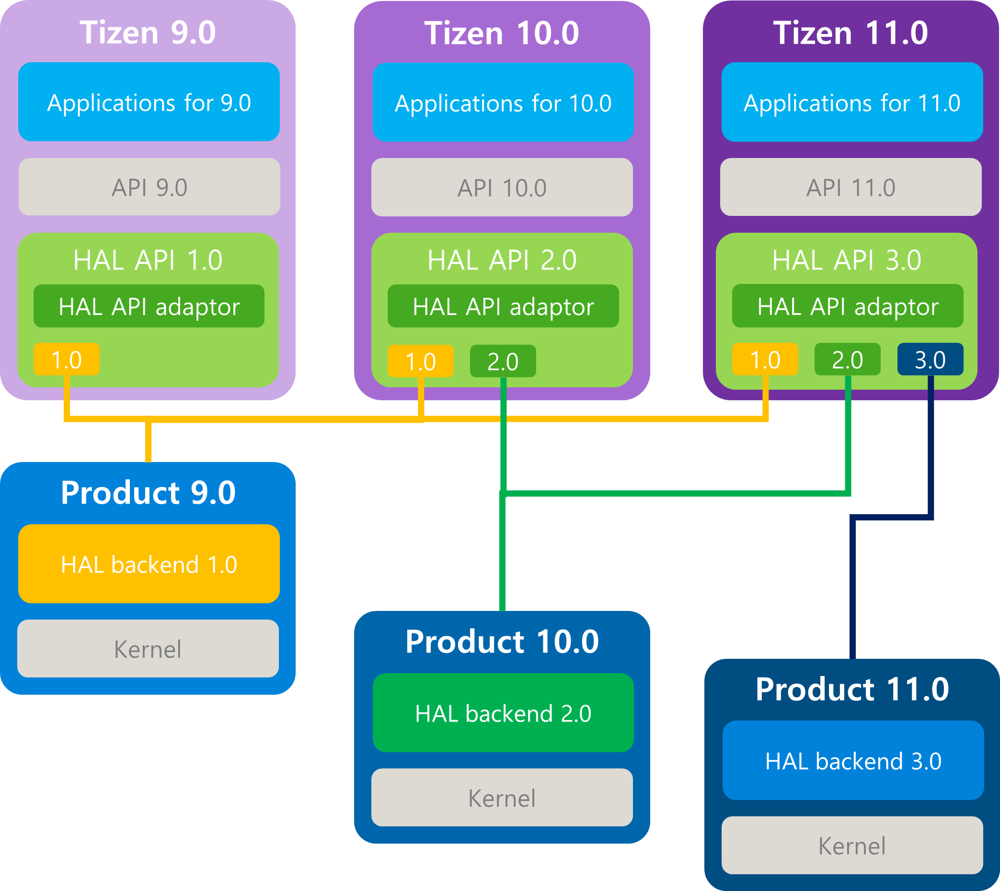

# Overview

## Overview
Tizen is an open-source software stack created for a wide array of devices with different form factors. The primary purposes of Tizen are to create an open software platform available for carriers, OEMs, and developers to make their innovative ideas a reality and to introduce a successful, real-world product that improves the mobile experience for users.

It is also important that is no central point of failure, where 1 industry player can restrict or control the innovations of any other. The result is a full, production-quality consumer product with source code open for customization and porting.

The intent of the porting guides is to provide information and instructions to boot Tizen on new hardware and create products based on the Tizen OS. The Tizen porting guides take you through the porting process by elaborating the Tizen architecture, the necessary tools, and the development environment setup, as well as creating a Tizen image and demonstrating the modifications needed across various functional areas.

## HAL Layer
Tizen defined the HAL layer so that Platform / HAL can support complete separation and facilitate Tizen porting for new devices.
The HAL layer is configured in the form of a HAL API package, and all Tizen Subsystems have implementations and interfaces defined in the HAL API common format.

The HAL API is defined and maintained by the platform developer and is located in the lowest layer of the platform to separate the platform/HAL.
HAL backend is included in the HAL area, and the HAL backend package is implemented so that Tizen can be operated on a new device using the HAL Interface defined in the HAL API.

Figure: Tizen HAL architecture

### HAL API and HAL backend
#### HAL API
- Define the HAL interface that needs to be implemented for each device required Tizen porting. HAL interface is defined by Tizen platform developer.
#### HAL backend
- Implement to operate on each device requires Tizen porting according to the HAL interface defined in the HAL API. HAL backend is implemented by device/vendor developer.

### Build check routine to guarantee HAL ABI between Platform and HAL
- In order to support HAL ABI between Platfrom and HAL, there are build principles. HAL backend has to be named with 'hal-backend-' prefix for package name
and has the only dependency of both BuildRequires: pkgconfig(hal-rootstrap) and BuildRequires: cmake. HAL rootstrap contains the header file and shared library of which support ABI between Platform and HAL. If HAL backend are using the packages exceptfor HAL rootstrap, package build wiie be failed by HAL rootstrap Checker which prevent the wrong build dependency of HAL backend.
#### HAL Rootstrap
- Include the allowed header files and shared libraries to guarantee HAL ABI between Platform and HAL. HAL backend has to depends on only hal-rootstrap package.
#### HAL Rootstrap Checker
- Check if the HAL backend is built with only the allowed range of package dependency. If there are violation of build dependency, the build will be failed in order to guarantee HAL ABI between Platform and HAL.

### Runtime check routine to guarantee HAL ABI between Platform and HAL
- Platfrom has supported the multi-version HAL interface and then HAL backend need to specify the used version of HAL interface. HALCC (HAL Compatibility Cheker) will compare between supported version of HAL interface and used version of HAL backend. If there is a version mismatch, HALCC doesn't confirm the communication between HAL API and HAL backend. So that HAL backend have to check the supported version of HAL interface when implementing HAL backend.

### The HAL layer consists of various subsystems, they are:
- System
- Windows System
- Multimedia
- Connectivity
- Location
- Security
- Machine Learning
