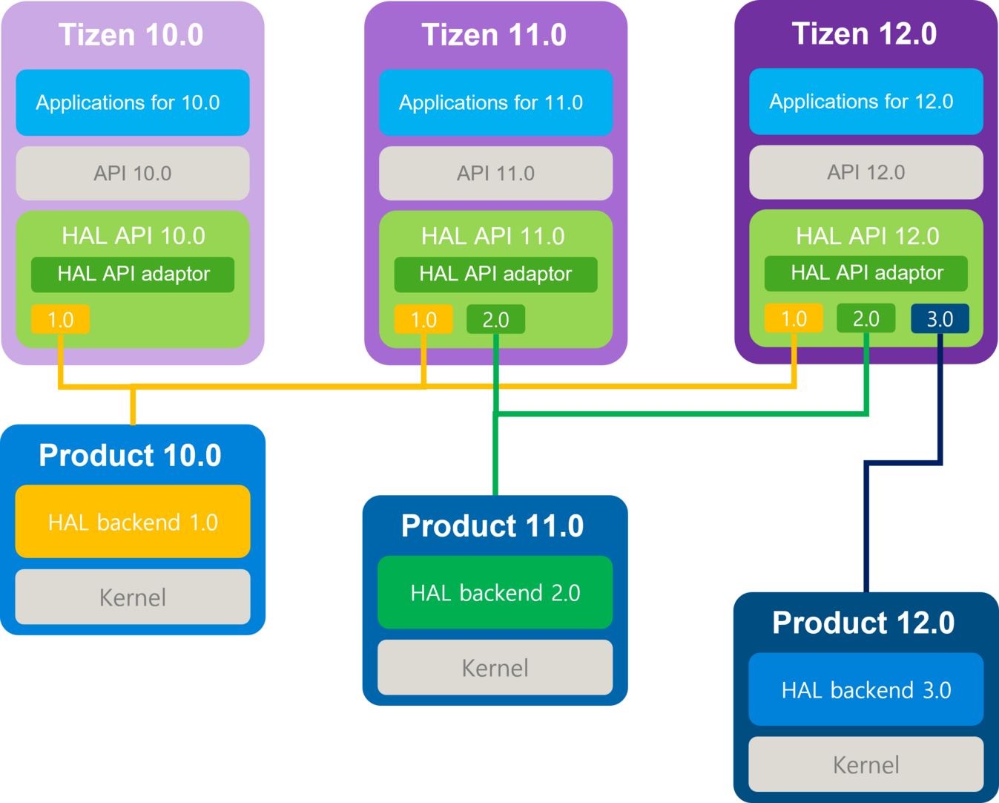

# Tizen HAL Overview

## Introduction

The Tizen HAL (Hardware Abstraction Layer) provides a standardized interface for hardware-specific functionalities, enabling seamless integration and compatibility across diverse devices running the Tizen operating system. HAL serves as a critical component that abstracts hardware-specific details, allowing the Tizen platform to be ported to new devices with minimal effort while maintaining consistent behavior across different hardware configurations.

### Purpose and Benefits

The primary purposes of the Tizen HAL include:

- **Hardware Abstraction**: Provides a clean separation between the platform software and hardware-specific implementations
- **Portability**: Facilitates easy porting of Tizen to new hardware platforms
- **Standardization**: Defines consistent interfaces that ensure compatibility across different device implementations
- **Modularity**: Enables independent development and maintenance of platform and hardware-specific components
- **ABI Guarantee**: Ensures Application Binary Interface compatibility between platform and HAL layers

## HAL Architecture

Tizen defined the HAL layer so that Platform and HAL can support complete separation and facilitate Tizen porting for new devices. The HAL layer is configured in the form of a HAL API package, and all Tizen Subsystems have implementations and interfaces defined in the HAL API common format.

The HAL API is defined and maintained by the platform developer and is located in the lowest layer of the platform to separate the platform/HAL. HAL backend is included in the HAL area, and the HAL backend package is implemented so that Tizen can be operated on a new device using the HAL Interface defined in the HAL API.

**Figure: Tizen HAL architecture**

## HAL Subsystems

The HAL layer consists of various subsystems, each responsible for specific hardware functionalities.

### System

The System subsystem provides comprehensive resource management for device hardware.

### Window System (Display & Graphics)

The Display and Graphics HAL provides hardware abstraction for display output and graphics operations.

### Multimedia

The Multimedia HAL provides interfaces for audio, video, and media-related operations.

### Connectivity

The Connectivity HAL enables various communication protocols.

### Location

The Location HAL serves as a standardized bridge between Tizen's location services and underlying hardware components.

### Security

The Security HAL provides comprehensive security features.

### Machine Learning

The Machine Learning HAL provides an interface for hardware-accelerated neural network inference.

## Related Documentation

For detailed information on each subsystem, refer to the following guides:

- [System](../guides/system.md) - Device, Sensor, and Power management
- [Display & Graphics](../guides/displaygraphics.md) - TBM, TDM, and EGL integration
- [Multimedia](../guides/multimedia.md) - Audio, Camera, Codec, DRM, HDCP, Radio
- [Connectivity](../guides/connectivity.md) - Bluetooth, WLAN, NFC
- [Location](../guides/location.md) - Position reporting and Geofencing
- [Security](../guides/security.md) - Auth, Certs, Keys
- [Machine Learning](../guides/ml.md) - Hardware-accelerated inference

For API documentation, see the [HAL API Reference](../api/1.0/).
